# 1 JVM内存结构（运行时数据区）

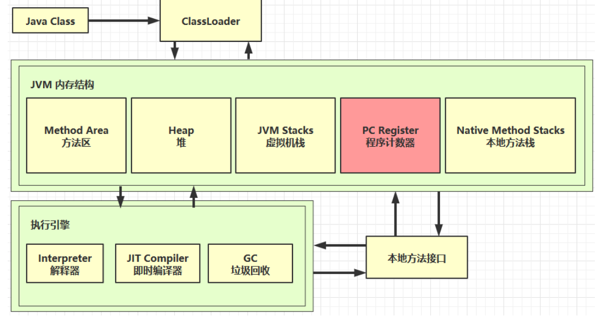

JVM内存结构包括：

1. 程序计数器
2. 虚拟机栈
3. 本地方法栈
4. 堆
5. 方法区

## 1.1 程序计数器

程序计数器：Program Counter Register

作用：记住下一条jvm指令的执行地址，当前线程所执行的字节码的行号指示器。

特点：

- 线程私有：在一个确定的时刻，一个处理器都只会执行一条线程中的指令，为了线程切换以后，每个线程能够恢复到正确的执行位置，每条线程需要一个独立的程序计数器。
- 不会存在内存溢出

## 1.2 虚拟机栈

虚拟机栈：Java Virtual Machine Stacks 

- 每个线程运行时所需要的内存，称为虚拟机栈
- 每个栈由多个栈帧组成，对应着每次方法调用时所占用的内存，**栈帧用于存储局部变量表、操作数栈、动态连接、方法出口**等信息。
- 每个线程只能有一个活动栈帧，对应着当前正在执行的那个方法，方法执行完毕或者抛出异常，对应着一个栈帧弹出虚拟机栈。


局部变量表：

- 局部变量表存放了编译器可知的各种java虚拟机基本数据类型、对象引用类型和return Address类型。
- 这些数据类型在局部变量表中的存储空间以局部变量槽（Slot）来表示，64位的long和double占用两个槽，其他数据类型占用一个槽。
- 槽的数量在编译期间完全确定。


特点：

- 线程私有的
- 生命周期与线程同步
- 存在内存溢出


问题辨析：

1. 垃圾回收会设计栈内存吗？**不会**
2. 栈内存越大越好？不是，因为物理内存一定，栈内存越大，同时可用的线程数量就越少。
3. 方法内的局部变量是否线程安全？
   - 如果方法内局部变量没有逃离方法的作用访问，它是线程安全的
   - 如果是局部变量引用了对象，并逃离方法的作用范围，需要考虑线程安全


## 1.3 本地方法栈

本地方法栈：Native Method Statcks

本地方法栈为虚拟机使用到的本地方法服务

线程私有。

也会存在占内存溢出问题。

## 1.4 Java堆

堆：heap，唯一目的就是存放对象实例，通过new关键字创建的对象存放在堆内存。从jdk 1.7开始已经默认开启逃逸分析，如果某些方法中的对象引用没有被返回或者未被外面使用（也就是未逃逸出去），那么对象可以直接在栈上分配内存。

特点：

- 所有线程共享
- 存放对象实例
- 是垃圾收集器管理的内存区域
- 当Java堆中没有内存可以分配，Java虚拟机会抛出OutOfMemoryError异常

## 1.5 方法区

方法区：Method Area

特点：

- 《Java虚拟机规范》中，方法区在逻辑上属于堆，但是实现上并不强制要求
- 线程共享
- 存储已经被虚拟机加载的类型信息、常量、静态变量、即时编译器编译后的代码缓存等数据

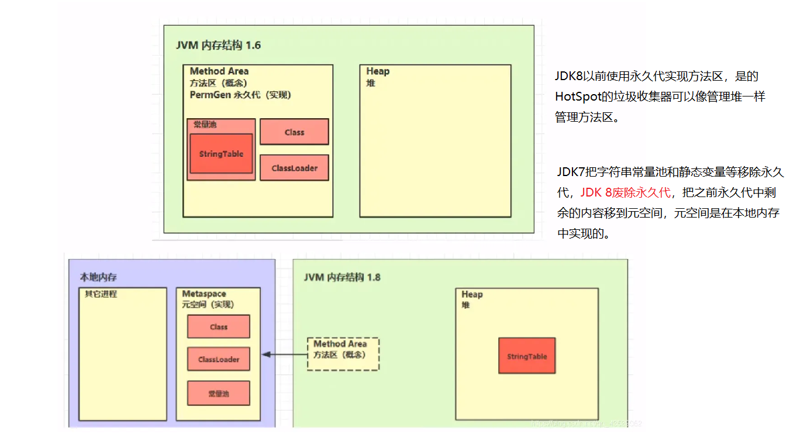


方法区中的几个特殊区域：

1. 运行时常量池

- Class ⽂件中除了有类的版本、字段、⽅法、接⼝等描述信息外，还有常量池表，虚拟机指令根据这张常量表找到要执行的类名、方法名、参数类型、字面量等信息

- 运行时常量池，常量池是 *.class 文件中的，当该类被加载，它的常量池信息就会放入运行时常量池，并把里面的符号地址变为真实地址


2. 字符串常量池（1.6之前在永久代，1.7之后在堆中）
   - 字符串常量池逻辑上属于运行时常量池
   - 常量池中的字符串仅是符号，第一次用到时才变为对象
   - 利用串池的机制，来避免重复创建字符串对象
   - 字符串变量拼接的原理是 StringBuilder（1.8） 
   - 字符串常量拼接的原理是编译期优化 (常量折叠)
   - 可以使用 intern 方法，主动将串池中还没有的字符串对象放入串池 
     - 1.8 将这个字符串对象尝试放入串池，如果有则并不会放入，如果没有则放入串池，会把串池中的对象返回 
     - 1.6 将这个字符串对象尝试放入串池，如果有则并不会放入，如果没有会把此对象复制一份，放入串池，会把串池中的对象返回


案例：

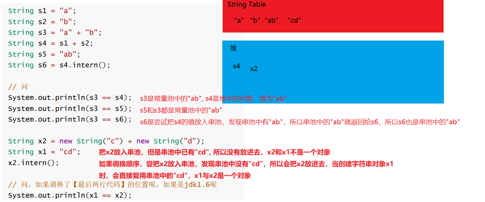

## 1.6 直接内存

直接内存：Direct Memory

直接内存不是虚拟机运行时数据区的一部分，也不是《java虚拟机规范》中定义的内存区域。

一种常见的使用情景是NIO（New Input/Output）操作时，直接内存用作数据缓冲区。

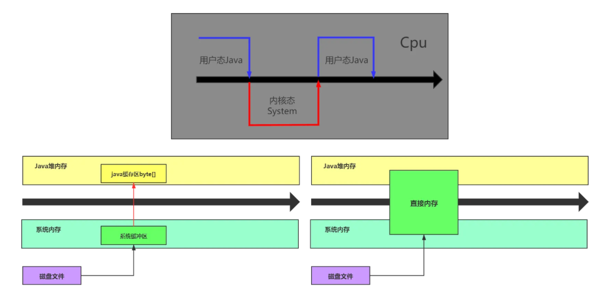

特点：

- 分配回收成本高，读写性能高
- 不收JVM内存回收管理


直接内存的分配和回收原理：

- 使用了 **Unsafe 对象**完成直接内存的分配回收，并且回收需要主动调用 freeMemory 方法 
- ByteBuffer的实现类内部，使用了Cleaner（虚引用）来监测 ByteBuffer对象，一旦ByteBuffer对象被垃圾回收，那么就会由 ReferenceHandler线程通过Cleaner的clean方法调用freeMemory 来释放直接内存

## 1.7 Java对象创建的过程

# 2 垃圾回收机制

## 2. 1 如何判断对象可回收

1. 引用计数法

   对象被引用后，计数加一，当这个对象不再被某个对象引用，计数减一，当引用次数为0，可以被垃圾回收。

2. 可达性分析算法

   - 确定根对象 GC root（一定不能被垃圾回收的对象）
   - 对堆内存中的对象进行扫描，如果某个对象被跟对象直接或间接引用，该对象就不能被回收，反之就可以被回收

   哪些对象可以作为GC Root

   1. System Class：系统类，虚拟机运行过程中的核心对象类
   2. Native Stack：java虚拟机调用操作系统方法时引用的java对象
   3. Tread：活动线程中使用的对象，线程栈帧中局部变量引用的对象
   4. Busy Monitor：正在加锁的对象

   

   过程：垃圾回收器沿着GC Root对象的引用链扫描，找不到的对象就可以回收


## 2.2 java虚拟机中的四种引用

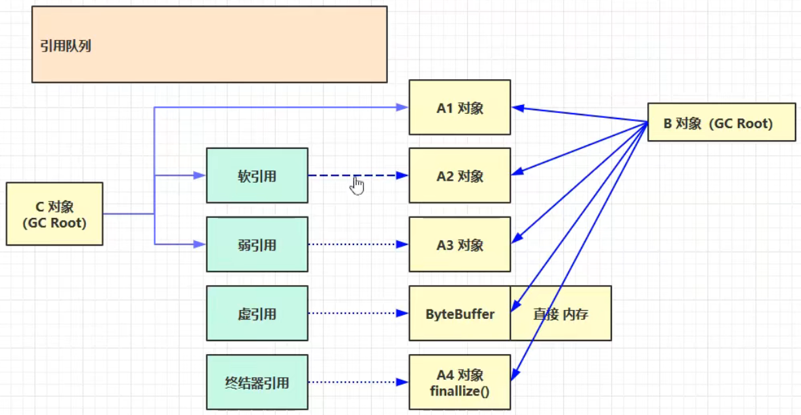

1. 强引用：被GC Root直接引用

   - 只有所有的GC Root对象都不通过【强引用】引用该对象时，该对象才能被垃圾回收。

2. 软引用：对象没有被直接的强引用所引用

   - 当没有【强引用】引用这个对象时，垃圾回收后发现**内存不够**，则【软引用】引用的对象会被回收

   ```java
   /**
    * 演示软引用, 配合引用队列
    */
   public class Demo2_4 {
       private static final int _4MB = 4 * 1024 * 1024;
   
       public static void main(String[] args) {
           List<SoftReference<byte[]>> list = new ArrayList<>();
           // 引用队列
           ReferenceQueue<byte[]> queue = new ReferenceQueue<>();
   
           for (int i = 0; i < 5; i++) {
               // 关联了引用队列， 当软引用所关联的 byte[]被回收时，软引用自己会加入到 queue 中去
               SoftReference<byte[]> ref = new SoftReference<>(new byte[_4MB], queue);
               System.out.println(ref.get());
               list.add(ref);
               System.out.println(list.size());
           }
   
           // 从队列中获取无用的 软引用对象，并移除
           Reference<? extends byte[]> poll = queue.poll();
           // queue中的软引用对象 所引用的对象已经被回收
           // 可以将他们移除list
           while( poll != null) {
               list.remove(poll);
               poll = queue.poll();
           }
   
           System.out.println("===========================");
           for (SoftReference<byte[]> reference : list) {
               System.out.println(reference.get());
           }
   
       }
   }
   ```

3. 弱引用：对象没有被直接的强引用所引用
   
   - 当没有强引用引用这个对象时，启动了垃圾回收时，【弱引用】引用的对象会被回收

```
- 软引用与弱引用本身也是对象，会占用内存，可以配合引用队列（ReferenceQueue），对他们自身进行回收
- 当他们引用的对象被垃圾回收之后，可以将软引用/弱引用入队列，方便进行回收
```

4. 虚引用：比如Cleaner，配合ByteBuffer使用
   - 【虚引用】引用的对象被回收时，虚引用对象进入引用队列，有Reference Handler 线程调用虚引用的unsafe.freeMemery()释放直接内存
5. 终结器引用：当对象没有被强引用时，【终结器引用】会加入引用队列，Finalize Hander 线程检查引用队列中是否存在【终结器引用】，如果有，就会根据【终结器引用】找到被引用的对象，调用其fanilize方法，下一次垃圾回收将这个对象占用的内存回收。

```
- 虚引用和终结器引用必须配合引用队列使用
- 软引用和弱引用不必须
```


## 2.3 垃圾回收算法

jvm会根据不同的情况下选择以下三种不同的垃圾回收算法。

### 2.3.1 标记清除（mark sweep）

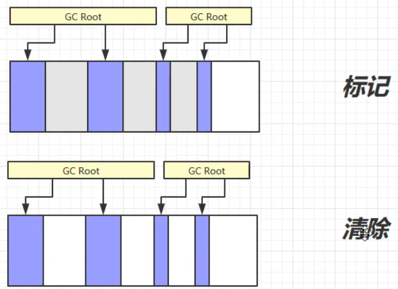

处理流程：先做一次标记，把垃圾对象的内存起始结束地址放到空闲地址列表，下次存放新对象时在空闲列表中寻找是否有足够的空间。

优点：速度快

缺点：

- 执行效率不稳定，当java堆中存在大量对象，且大部分可以被回收时，需要花费大量的时间标记清除；

- 空闲地址不连续，容易产生内存碎片，当需要分配连续的地址空间时，可能还是会内存不足触发另一次垃圾收集。

### 2.3.2 标记整理(Mark )

针对老年代对象的存亡特征提出的一种垃圾回收算法，老年代的垃圾一般较少，标记和移动的过程不会消耗太多时间。

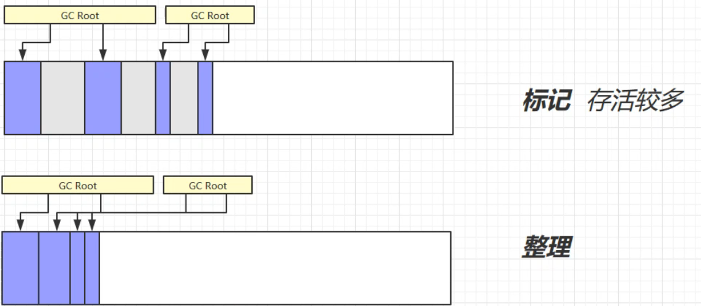

处理流程：先标记，在清理垃圾时，将存活的对象移动到内存的一端，清理掉边界外的内存，让空闲地址连续。

优点：不会产生内存碎片

缺点：因为要移动存活的对象，所以STW的时间延长。

- 如果不移动对象，STW会很短，但是不移动对象，在内存分配上就需要花费更多的时间。

选择何种垃圾回收算法，取决于对吞吐率的要求（Parallel Scavenge）更高还是对延迟的要求更高（CMS）。

### 2.3.3 复制(Copy)

将可用内存划分为相同的两个区域，每次只使用其中的一块，当这一块内存用完了，将存活的对象复制到另一块内存区域，然后将已使用过的内存空间一次性处理。

适用于大多数情况下都只有少数对象存活的区域，现在的商用JAVA虚拟机大多采用这种垃圾收集算法回收新生代，曾经有研究表明新生代中98%的对象熬不过第一轮收集。

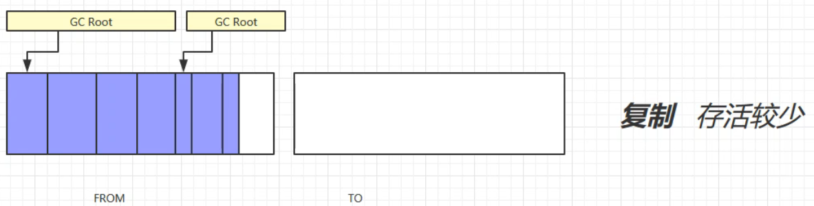

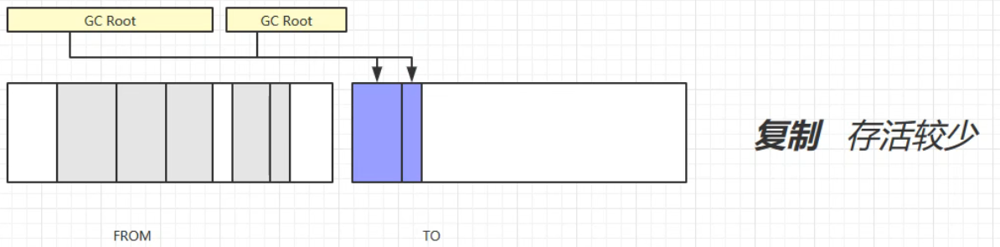

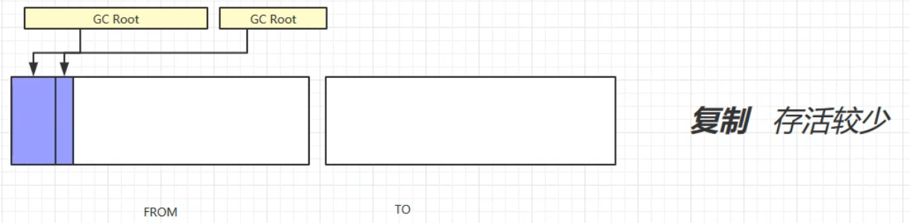

处理流程：

1. 将可用内存划分为相同的两个区域，From和To
2. 标记
3. 将存活的对象复制到To区域，并在复制过程中进行整理，不留下内存碎片
4. 将From区的垃圾进行回收，清空From区
5. 交换From区和To区，保持To区的空闲状态

优点：不会产生内存碎片

缺点：可用内存缩小为原来的一半，空间浪费多。


## 2.4 分代垃圾回收机制

新生代（朝生夕亡）：用完了就可以丢弃的对象，垃圾回收比较频繁。

- 采用”Appel式回收”，将新生代划分为较大的Eden区和较小的Servivor区，默认情况下：

- 伊甸园（Eden）80%，两个幸存区（Survivor）20%，每次新生代的可用内存有90%（80%伊甸园和10%幸存区），只有10%的空间被浪费。


老年代（难以消亡）：需要长时间使用的对象，垃圾回收很久发生一次。

不同的区域采用不同的垃圾回收机制，方便管理。


### 2.4.1 分代垃圾回收流程

1. 当我们新创建一个对象时，分配到伊甸园内存区。

2. 当伊甸园空间被占满时，会触发一次新生代垃圾回收（Minor GC），【minor gc】会引发【stop the word】，暂停其他用户线程，知道垃圾回收线程工作结束，才会恢复用户线程的运行，STW时间较短。

   1. 采用**复制算法**，将存活的对象放到幸存区To，垃圾被回收
   2. 幸存的对象年龄+1
   3. 幸存区From和幸存区To交换指向

3. 循环1，2，触发第二次垃圾回收，此时会检查伊甸园和幸存区From中的对象是否需要被回收

   1. 采用复制算法，将存活的对象放到幸存区To，垃圾被回收
   2. 幸存的对象年龄+1（伊甸园和幸存区From的对象都+1）
   3. 幸存区From和幸存区To交换指向

4. ……

5. 当某些对象经历了15次（某个阈值，存储寿命的长度为4bit，最大为15）垃圾回收依旧存活，会晋升到老年代

6. 当老年代的内存不足时

   1. 先触发minor GC；
   2. 如果还是内存不足；就会触发（老年代垃圾回收）【Full GC】，STW时间更长，采用的方式是【**标记清除**】或【**标记整理**】，对新生代和老年代的垃圾进行回收；
   3. 如果还是内存不足，就会报错

   

### 2.4.2 相关JVM参数

| 含义               | 参数                                                         |
| ------------------ | ------------------------------------------------------------ |
| 堆初始大小         | -Xms                                                         |
| 堆最大大小         | -Xmx 或 -XX:MaxHeapSize=size                                 |
| 新生代大小         | -Xmn 或 (-XX:NewSize=size + -XX:MaxNewSize=size )            |
| 幸存区比例（动态） | -XX:InitialSurvivorRatio=ratio 和 -XX:+UseAdaptiveSizePolicy |
| 幸存区比例         | -XX:SurvivorRatio=ratio 【初始值为8，这个比值是伊甸园占新生代的比例】 |
| 晋升阈值           | -XX:MaxTenuringThreshold=threshold                           |
| 晋升详情           | -XX:+PrintTenuringDistribution                               |
| GC详情             | -XX:+PrintGCDetails -verbose:gc                              |
| FullGC 前 MinorGC  | -XX:+ScavengeBeforeFullGC 【默认打开，在进行Full gc 之前做一次Minor gc】 |

测试 ：

```java
// 虚拟机设置
// -Xms20M -Xmx20M -Xmn10M -XX:+UseSerialGC -XX:+PrintGCDetails -verbose:gc -XX:-ScavengeBeforeFullGC
public static void main(String[] args) throws InterruptedException {
    new Thread(() -> {
        ArrayList<byte[]> list = new ArrayList<>();
        list.add(new byte[_7MB]);
        list.add(new byte[_512KB]);
        list.add(new byte[_512KB]);
    }).start();

    System.out.println("sleep....");
    Thread.sleep(1000L);
}
```

没有住方法中没有人和代码时，堆的使用情况：

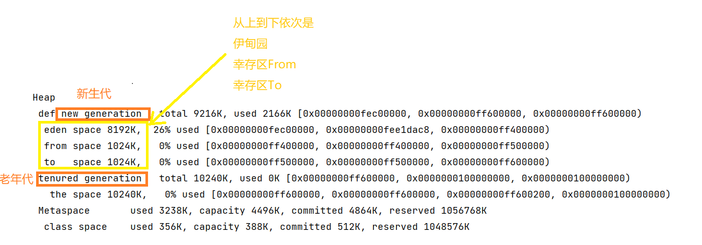

往堆中存放数据：

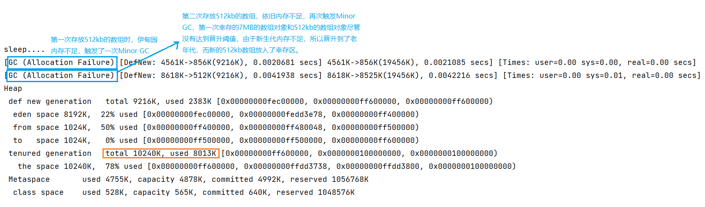


## 2.5 垃圾回收器

1. 串行
   - 单线程垃圾回收器
   - 堆内存较小
   - 适合个人电脑
2. 吞吐量优先
   - 多线程垃圾回收器
   - 堆内存较大，多核cpu（就比如有多个保洁工人，但是只有一个扫帚，轮流用扫帚显然效率不高，还不如一个工人）
   - **单位时间内垃圾回收造成的STW的时间最短为目的**（0.2 + 0.2 = 0.4）
   - 适合服务器

3. 响应时间优先
   - 多线程垃圾回收器
   - 堆内存较大，多核cpu
   - 让单次垃圾回收造成的STW时间尽可能短为目的（0.1 + 0.1 + 0.1 + 0.1 + 0.1 = 0.5）
   - 适合服务器

### 2.5.1 串行垃圾回收器

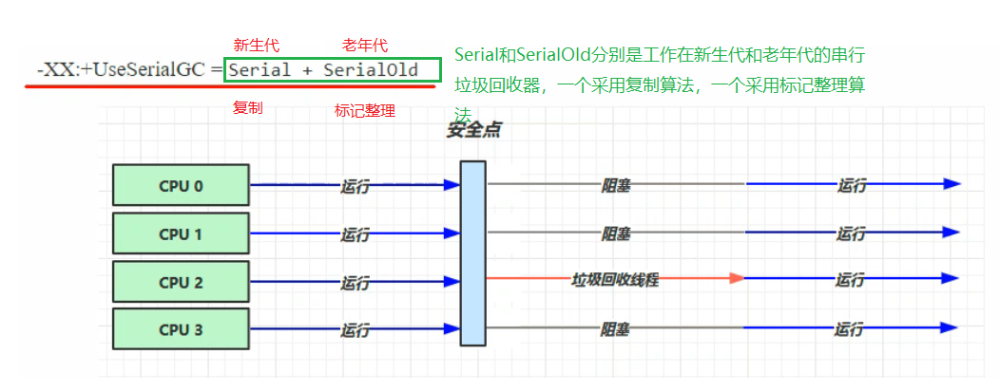

当堆内存不足时，会触发垃圾回收机制，此时其他的用户线程会在安全点停止运行，因为垃圾回收过程会涉及到对象位置的改变，【串行垃圾回收器】的垃圾回收线程完成垃圾回收之后，其他用户线程恢复运行。

### 2.5.2 吞吐量优先垃圾回收器

并行垃圾回收线程，发生垃圾回收时，多个垃圾回收现成并行。

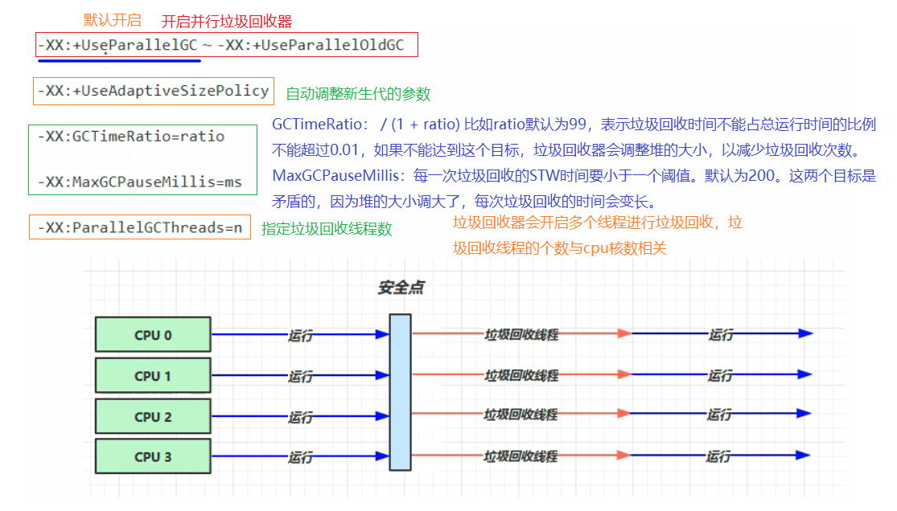

### 2.5.3 响应时间优先垃圾回收器（CMS垃圾回收）

并行垃圾回收线程，并发垃圾回收线程，可以与用户线程并发运行。

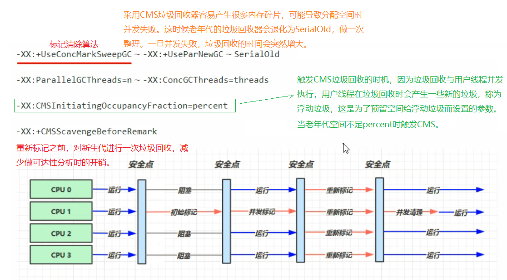

目前只有CMS存在只针对老年代的垃圾回收行为。

## 2.6 G1

定义：Garbage First，优先回收【垃圾占用内存最多】的老年代区域。

- 2004年论文发布
- 2009年JDK 6u14体验
- 2012 JDK 7u4 官方支持
- 2017 **JDK 9 默认的垃圾回收器**，废弃CMS垃圾回收器

适用场景：

- 同时注重吞吐量（Throughout）和低延迟（Low latency），默认的暂停目标是200ms
- 超大堆内存，会将堆划分为多个大小相等的Region
- 整体上是标记+整理算法，两个区域之间是复制算法。

相关JVM参数

- -XX: +UseG1GC
- -XX: G1HeapRegionSzie=size
- -XX: MaxGCPauseMillis=time

### 2.6.1 G1垃圾回收阶段

分为三个阶段：Young Collection、Young Collection + Concurrent Mark、Mixed Collection

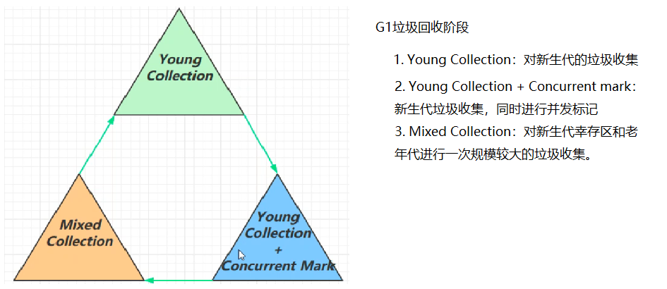

**1、Young Collection**

会STW


- 当伊甸园的内存逐渐被占满，会触发新生代垃圾回收，存活的对象迁移到幸存区；

- 发生多次新生代垃圾回收之后，某些幸存区的对象会晋升至老年代。


新生代回收的**跨代引用问题**


**2、Young Collection + CM**


- 在Young GC时会进行GC Root的初始标记
- 老年代占用堆内存达到一定的比例，会进行并发标记
  - -XX: InitiatingHeapOccupancyPercent=percent (默认54%)


**3、Mixed Collection**

对E、S、O进行全面的垃圾回收，收集整个新生代以及部分老年代的垃圾：

- 最终（重新）标记（Remark）（会STW）
- 拷贝存活（会STW）：将幸存的对象复制到新的幸存区或者老年代区域（整理内存，减少内存碎片）


### 2.6.2 Full GC 

什么情况下可以称为Full GC

- SerialGC
  - 新生代内存不足发生的垃圾收集 -minor gc
  - 老年代内存不足发生的垃圾收集 -full gc
- ParallelGC
  - 新生代内存不足发生的垃圾收集 -minor gc
  - 老年代内存不足发生的垃圾收集 -full gc
- CMS（并发）
  - 新生代内存不足发生的垃圾收集 -minor gc
  - 老年代内存不足
    - 并发失败会退化为SerialOld GC -Full GC
- G1（并发）
  - 新生代内存不足发生的垃圾收集 -minor gc
  - 老年代内存不足
    - 如果混合收集的速度高于用户线程产生垃圾的速度，这个阶段的垃圾回收不能称为FG
    - 如果混合收集的速度低于用户线程产生垃圾的速度，会退化为SerialOld GC -Full GC ？

### 2.6.3 重标记

- pre-write barrier + satb_mark_queue

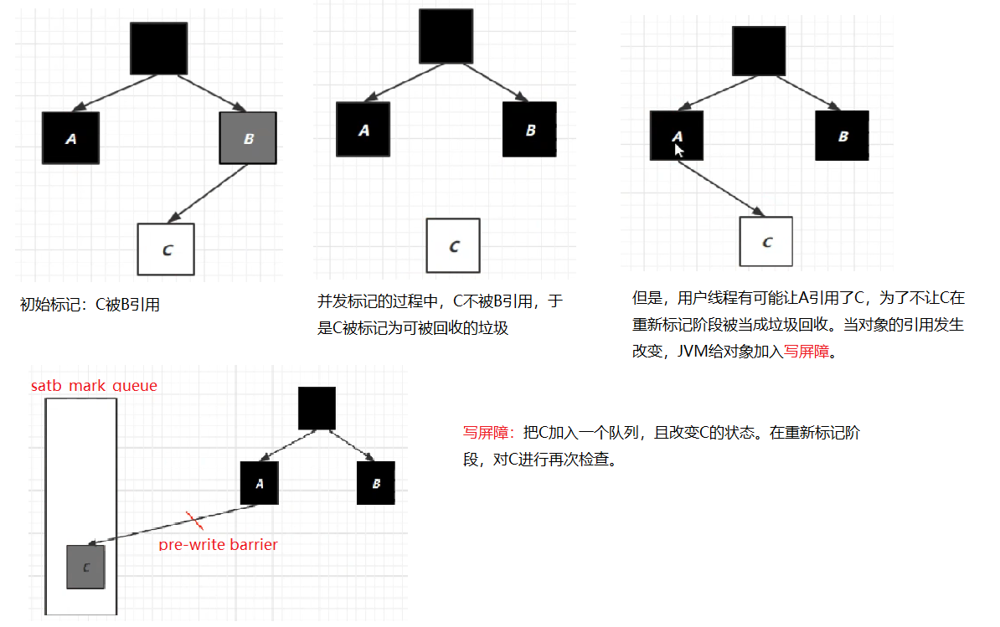

### 2.6.4 G1 优化（从JDK8-JDK9的优化）

1. **JDK 8u20 字符串去重 -XX:+UseStringDeduplication**

   - 优点：节省大量内存
   - 缺点：略微多占用cpu时间，新生代回收时间增加。

   ```java
   // JDK8底层使用char数组实现String
   String s1 = new String("hello"); // char['h','e', 'l', 'l', 'o']
   String s2 = new String("hello"); // char['h','e', 'l', 'l', 'o']
   ```

   如何实现字符串去重？

   - 将所有的新分配的字符串放入一个队列
   - 当新生代发生垃圾回收时，G1会检查队列中是否有字符串重复
   - 如果字符串对象的值一样，让他们引用同一个char数组
   - 注意：与String.intern()不一样
     - String.intern()关注字符串对象本身是否重复
     - 字符串去重关注的是char[]
     - 在JVM内部，使用了不同的字符串表


2. **JDK 8u40 并发标记类卸载 ** -XX:ClassUnloadingWithConcurrentMark

   JDK的类加载器不会被卸载，只有自定义的类加载器才会可能被卸载。

   在这次优化之后，所有对象经过并发标记之后，就能知道哪些类不再被使用，当一个类加载器的所有类都不再使用，则卸载它所加载的所有类。

   

3. **JDK 8u60 回收巨型对象**

   巨型对象：一个对象大于region的一半

   - G1不会对巨型对象进行拷贝
   - 回收时优先考虑巨型对象
   - G1会跟踪老年代所有的incoming引用，这样老年代incoming引用为0的巨型对象就可以在新生代垃圾回收时处理掉（因为希望越早回收越好，所以在新生代垃圾回收时就处理）。

   

4. **JDK 9 并发标记起始时间的调整**

   - 并发标记必须在堆空间占满前完成，否则退化为 FullGC
   - JDK 9 之前需要使用 -XX:InitiatingHeapOccupancyPercent
   - JDK 9 可以动态调整
     - -XX:InitiatingHeapOccupancyPercent 用来设置初始值
     - 进行数据采样并动态调整
     - 总会添加一个安全的空档空间

   

5. **JDK 9 更高效的回收**

​	建议阅读官方文档，JDK已经发展到

## 2.7垃圾回收调优

在控制台输入以下命令可以查看虚拟机运行参数：

```
-XX:+printFlagsFinal -version | findstr "GC"
```

### **调优领域**

- 内存
- 锁竞争
- cpu占用
- io

### **确定目标**

- 【低延迟】还是【高吞吐量】，选择合适的回收器
  - CMS（jdk9 不支持使用），G1， ZGC（响应时间优先）
  - ParallelGC（高吞吐量）

### **最快的GC是不发生GC**

- 查看FullGC前后的内存占用，考虑一下几个问题
  - 数据是不是太多
    - select * from table
  - 数据表示是否太臃肿
    - 对象图
    - 对象大小：比如包装类型比基本类型占用内存更大
  - 是否存在内存泄露
    - static Map map：长期存活
    - 考虑使用第三方缓存

***内存泄露：**程序中已动态分配的堆内存由于某种原因程序未释放或无法释放，造成系统内存的浪费，导致程序运行速度减慢甚至系统崩溃等严重后果。*

=======

在内存调优之前，先处理代码中可能存在的问题，即处理以上第三点中可能存在的问题。

=======

### **新生代调优**

1. 新生代特点

   - 所有的new操作的内存分配非常廉价
     - TLAB（Thread-Local Allocation Buffer）
   - 死亡对象的回收代价是零
   - 大部分对象用过即死
   - Minor GC的STW时间远低于Full GC

   

2. 新生代的大小应该如何设置

   因为新生代的这些特点，所以对新生代调优会更容易。Oracle建议新生代占用堆内存的25%-50%，不能太小，也不能太大。

   - 新生代太小，容易频繁触发新生代垃圾回收，降低吞吐率

   - 新生代太大，会直接触发Full GC，垃圾回收的时间会更长


​	新生代大小的设置的理想值：【并发量 * （请求-响应产生的对象个数）】

- **幸存区**：幸存区的大小只占新生代的一小部分，它需要足够容纳【当前活跃对象+需要晋升的对象】

- **晋升阈值**：晋升阈值设置得当，让长时间存活的对象尽快晋升

  ```
  -XX:MaxTenuringThreshold
  ```

### 老年代调优

以CMS为例，老年代调优的原则：

- CMS的老年代内存越大越好
- 先尝试不做调优，如果在程序运行中没有触发Full GC，那么说明老年代空间足够；即使发生了FullGC，也应该先尝试调优新生代
- 如果频繁发生FullGC，先观察超出了老年代内存多少触发的FullGC，然后将老年代内存预设调大1/4~1/3

### 案例

案例1：Full GC 与Minor GC频繁

- 原因：新生代内存太小，业务发生时大量的对象被创建，发生新生代内存不足触发Minor GC，又由于幸存区的空间也比较小，一些年龄较小的对象也被晋升到老年区，导致老年区也频繁发生垃圾回收。

- 解决方案：适当增大新生代内存大小，调整幸存区大小和晋升阈值。


案例2：请求高峰期发生Full GC，单次暂停时间特别长（CMS）

- 原因：初始标记和并发标记都是并行的，耗时较短；一般CMS的GC耗时 80%都在remark阶段，如果查看日志发现缺失是重新标记阶段耗时较长，考虑是因为重新标记阶段需要扫描整个堆内存，如果新生代有大量对象则会导致标记时间过长。
- 解决方案：-XX:MaxTenuringThreshold，在remark之前进行一次新生代垃圾收集，降低remark的开销。


案例3：老年代空间充裕情况下，发生Full GC（CMS jdk1.7），不是空间碎片和并发失败导致的Full GC

- 原因：永久代空间不足触发的Full GC
- 解决方案：调整永久代的初始值

## 2.8 内存泄露

Java堆内存的释放就是清理那些不可达的对象：

给一个对象赋值为 null 或者指向其他对象，就会让这个对象原来所指向的空间变得无法访问，也就再也无法被使用从而等待 GC 的回收。 内存泄露指的就是虽然这部分对象的内存已经不会再被使用，但是他们却不会被 jvm 回收。

- 通常，如果长生命周期的对象持有短生命周期的引用，就很可能会出现内存泄露
- 解决的原则：就是尽量减小对象的作用域

1. 作用域过大造成的内存泄露

```java
public class Simple {
    private Object object;
    public void method() {
        object = new Object();
        // ...
    }
}
```

分析：object是类的成员变量，作用范围是整个类，但是如果值在一个方法中使用了这个对象，就算方法结束了，在这个类的生命周期中，这个对象所占用的空间尽管不会再被使用，但不会被回收，就造成了内存泄露。

正确的做法是，确定这个对象不会再使用之后，将其赋值为null，使得之前指向的内存空间可以被回收。

2. 容器造成的内存泄露

   ```java
   Vector vec = new Vector();
   for (int i = 1; i < 100; i++)
   {
       Object obj = new Object();
       vec.add(obj);
       // 使用 obj 的相关业务逻辑
       obj = null;
   }
   // 使用 vec 的相关业务逻辑
   ……
   vec = null;
   ```

   每次使用元素后，将元素引用置为 null，保证了 object 空间的回收。 但是，事实上，容器本身随着不断的扩容，也占用着非常大的内存，这是常常被忽略的，如果不将容器本身赋值为 null，则容器本身会在作用域内一直存活。改进方法也很简单，在不再使用容器的时候立即赋值为 null 总是最正确的。

3. 单例模式下的内存泄露

   单例模式，很多时候我们可以把它的生命周期与整个程序的生命周期看做差不多的，所以是一个长生命周期的对象。如果这个对象持有其他对象的引用，也很容易发生内存泄露。

4. Set、Map 容器使用默认 equals 方法造成的内存泄露

   ```java
   public class CollectionMemory {
       public static void main(String s[]){
           Set<MyObject> objects = new LinkedHashSet<MyObject>();
           objects.add(new MyObject());
           objects.add(new MyObject());
           objects.add(new MyObject());
           System.out.println(objects.size());
           while(true){
               objects.add(new MyObject());
           }
       }
   }
    
   class MyObject{
       //设置默认数组长度为99999更快的发生OutOfMemoryError
       List<String> list = new ArrayList<>(99999);
   }
   ```

   容器Set只存放唯一的元素，是通过对象的equals()方法来比较的，但是Java中所有类都直接或间接继承至Object类，Object类的equals()方法比较的是对象的地址，上例中MyObject类没有重写equals方法，所以set会认为每次都是不一样的对象，就会一直添加元素直到内存溢出。

# 3 类加载和字节码技术

## 3.1 类文件结构

根据JVM规范，类文件结构如下：

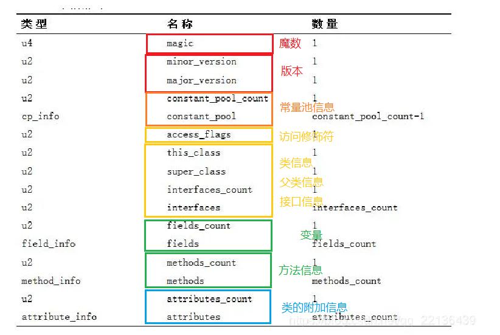

### 3.1.1 魔数

​			每个class文件的前4个字节称为魔数，0-3个字节，它的唯一作用是确定这个文件是否为虚拟机接受的【class】类型的文件

Class文件的魔数： CA FE BA BE（咖啡宝贝）

### 3.1.2 版本

4-7字节，表示类的版本，第5和6字节表示次版本号，第7和8字节表示主版本号。

比如：00 00 00 34 （52）表示java 8

次版本号从jdk1.2 到jdk12均未使用，固定为0；jdk 12 之后又重新启用，用来表示Class是否使用了为列入正式特性清单的功能（比如公测功能），次版本号标识为65536

### 3.1.3 常量池

8-9字节为常量池入口，表示常量池的长度，比如00 23（35），表示常量池有#1-#34项，第0项常量是空的，后面分别是这34项的内容。

常量池中每一项常量都是一个表，表结构的第一位是个u1类型的标志位，代表当前常量属于哪种常量类型。


### 3.1.4 javap

反编译java.class字节码文件的工具。

在idea中配置javap

## 3.2 字节码指令

### 3.2.1字节码指令练习

案例1：

```java
package cn.itcast.jvm.t3.bytecode;
/**
* 从字节码角度分析 a++ 相关题目
*/
public class Demo3_2 {
    public static void main(String[] args) {
        int a = 10;
        int b = a++ + ++a + a--;
        System.out.println(a); 
        System.out.println(b);
    }
}
```

答案：a=11, b=34

解析：

- 注意 iinc 指令是直接在局部变量 slot 上进行运算 
- a++ 和 ++a 的区别是先执行 iload 还是 先执行 iinc


案例2：

```java
public static void main(String[] args) {
    int i = 0;
    int x = 0;
    while(i <10){
        x = x++;
        i++;
    }
    System.out.println(x);
}
```

答案：x=0

解析：

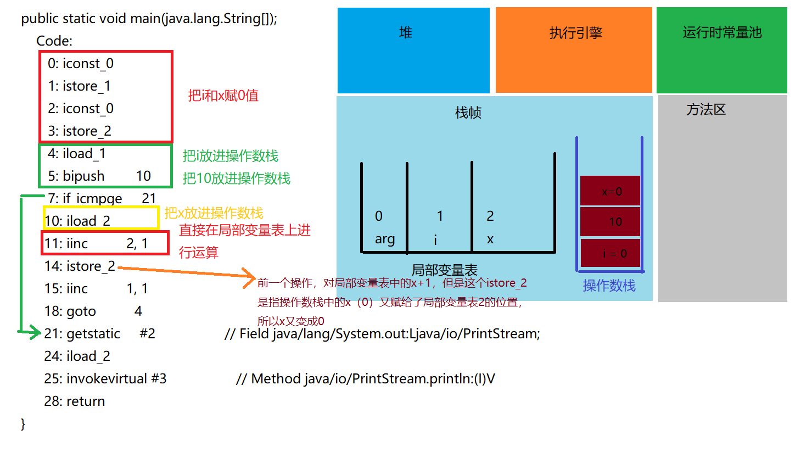

### 3.2.2 构造方法指令

#### `<cinit>()V`：针对类的构造方法

```java
public class Demo3_8_1 {
    static int i = 10;
    static {
    	i = 20;
    }
    static {
    	i = 30;
    }
}
```

`<cinit>()V` 方法会在【类加载的初始化阶段】被调用，编译器会按从上至下的顺序，收集所有 static 静态代码块和静态成员赋值的代码，合并为一个特殊的方法`<cinit>()V` ：

以上的代码对应的字节码是：

```java
0: bipush 10
2: putstatic #2 // Field i:I
5: bipush 20
7: putstatic #2 // Field i:I
10: bipush 30
12: putstatic #2 // Field i:I
15: return
```


#### `<init>()V`：针对成员变量的构造方法

```java
public class Demo3_8_2 {
    private String a = "s1";
    {
    	b = 20;
    }
    private int b = 10;
    {
    	a = "s2";
    }
    public Demo3_8_2(String a, int b) {
        this.a = a;
        this.b = b;
    }
    public static void main(String[] args) {
        Demo3_8_2 d = new Demo3_8_2("s3", 30);
        System.out.println(d.a);
        System.out.println(d.b);
    }
}

// a = "s3"
// b = 30
```

编译器会按从上至下的顺序，收集所有 {} 代码块和成员变量赋值的代码，形成新的构造方法`<init>()V`，原始构造方法内的代码会附加在新构造方法的最后

### 3.2.3 方法的调用

静态绑定的方法的调用指令：

- invokespecial：构造方法，私有方法和被final修饰的方法

- invokestatic：静态方法

动态绑定的方法的调用指令：

- invokevirtual：普通的方法

```java
public class Demo3_9 {
    public Demo3_9() { }
    private void test1() { }
    private final void test2() { }
    public void test3() { }
    public static void test4() { }
    
    public static void main(String[] args) {
        Demo3_9 d = new Demo3_9();
        d.test1();
        d.test2();
        d.test3();
        d.test4();
        Demo3_9.test4();
    }
}
```

字节码：

```java
0: new #2 // class cn/itcast/jvm/t3/bytecode/Demo3_9  
// 创建【对象】，给对象分配堆内存，执行成功会将【对象引用】压入操作数栈
3: dup  //是赋值操作数栈栈顶的内容，本例即为【对象引用】
4: invokespecial #3 // Method "<init>":()V
7: astore_1
8: aload_1
9: invokespecial #4 // Method test1:()V
12: aload_1
13: invokespecial #5 // Method test2:()V
16: aload_1
17: invokevirtual #6 // Method test3:()V
20: aload_1  // 用对象执行静态方法，但是静态方法不需要对象，所以又会把对象的引用弹出操作数栈
21: pop      // 用对象执行静态方法会执行两个无效的指令
22: invokestatic #7 // Method test4:()V
25: invokestatic #7 // Method test4:()V
28: return
```

### 3.2.4 多态的原理

当执行 invokevirtual 指令时，

1. 先通过栈帧中的对象引用找到对象
2. 分析对象头，找到对象的实际 Class  
3. Class 结构中有 vtable（虚方法表），它在类加载的链接阶段就已经根据方法的重写规则生成好了 
4. 查表得到方法的具体地址 
5. 执行方法的字节码

### 3.2.5 异常处理

#### try catch块

依赖一个Exception table，记录异常出现时程序进入哪一个catch分支。

##### finally块

在字节码中，finally块的字节码会在try块一级每一个catch分支中复制，而且会创建一个异常类（catch没有匹配到的异常）的分支，并在这个分之中也复制一份，并在这个分支中抛出异常，确保finally中的代码总会执行。

案例：

```java
public class Demo3_12_2 {
    public static void main(String[] args) {
        int result = test();
        System.out.println(result);
    }
    public static int test() {
        int i = 10;
        try {
            // finally会把异常吞掉
            // i = i / 0;
        	return 10;
        } finally {
        	return 20;
        }
    }
}
// 20
```

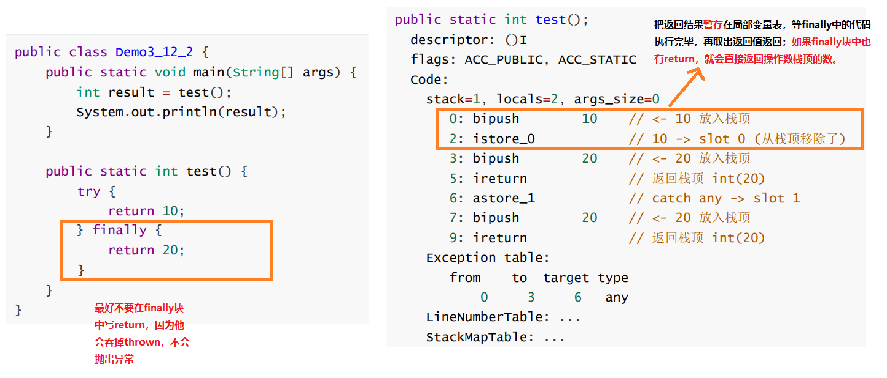

注意：跟上例中的 finally 相比，发现没有最后一个分支的finally的指令中没有athrow 了，这告诉我们：如果在 finally 中出现了 return，会 吞掉异常😱😱😱


## 3.3 编译器处理（语法糖）

​		所谓的【语法糖】，其实就是指 java 编译器把 *.java 源码编译为 *.class 字节码的过程中，自动生成和转换的一些代码，主要是为了减轻程序员的负担，算是 java 编译器给我们的一个额外福利（给糖吃）。

### 3.3.1 默认构造器

```java
public class Candy1 {
}

//等价于
public class Candy1 {
    // 这个无参构造是编译器帮助我们加上的
    public Candy1() {
        super(); // 即调用父类 Object 的无参构造方法，即调用 java/lang/Object."<init>":()V
    }
}
```

### 3.3.2 自动拆装箱

是在jdk1.5之后加入的优化。

```java
public class Candy2 {
    public static void main(String[] args) {
        Integer x = 1; // 装箱
        int y = x; // 拆箱
    }
}

// jdk5之前，上面的代码不能编译通过
// jdk5之后,编译器等价于以下源码
public class Candy2 {
    public static void main(String[] args) {
        Integer x = Integer.valueOf(1);
        int y = x.intValue();
    }
}
```

### 3.3.3 泛型集合取值

泛型也是在 JDK 5 开始加入的特性，但 java 在编译泛型代码后会执行【泛型擦除】的动作，即泛型信息在编译为字节码之后就丢失了，实际的类型都当做了 Object 类型来处理：

```java
public class Candy3 {
    public static void main(String[] args) {
        List<Integer> list = new ArrayList<>();
        list.add(10); 
        // 实际调用的是 List.add(Object e)
        Integer x = list.get(0); 
        // 实际调用的是 Object obj = List.get(int index);
        // Integer x = (Integer)List.get(int index);
    }
}

// 如果代码换成下面这个
public class Candy3 {
    public static void main(String[] args) {
        List<Integer> list = new ArrayList<>();
        list.add(10); 
        // 实际调用的是 List.add(Object e)
        int x = list.get(0); 
        // 实际调用的是 Object obj = List.get(int index);
        // int x = (Integer)List.get(int index).inValue();
        // 编译器会自动强制类型转换和自动拆箱
    }
}

```

### 3.3.4 可变参数

可变参数也是jdk1.5之后加入的特性

```java
public class Candy4 {
    public static void foo(String... args) { // public static void foo(String[] args)
        String[] array = args; // 直接赋值
        System.out.println(array);
    }
    public static void main(String[] args) {
        foo("hello", "world"); // foo(new String[]{"hello", "word"});
    }
}

```

如果调用了 foo() 则等价代码为 foo(new String[]{}) ，创建了一个空的数组，而不会传递 null 进去

### 3.3.5 for-each

仍是 JDK 5 开始引入的语法糖，数组的循环会转换为普通的for循环；集合的循环被编译器转换为对迭代器的调用。

foreach 循环写法，能够配合数组，以及所有实现了 Iterable 接口的集合类一起使用，其中 Iterable 用来获取集合的迭代器（ Iterator ）。

### 3.3.6 switch

从 JDK 7 开始，switch 可以作用于字符串和枚举类，这个功能其实也是语法糖。

swith语句在字节码中会执行两遍 switch，第一遍是根据字符串的 hashCode 和 equals 将字符串的转换为相应 byte 类型，第二遍才是利用 byte 值进行比较，做出对应分支的操作。

### 3.3.7枚举类

JDK 7新增了枚举类。

### 3.3.8try-with-resource

JDK 7 开始新增了对需要关闭的资源处理的特殊语法 `try-with-resources`：

```java
try(资源变量 = 创建资源对象){
    
} catch( ) {
    
}
```

其中资源对象需要实现AutoCloseable接口，例如 InputStream 、OutputStream 、Connection 、Statement 、ResultSet 等接口都实现了AutoCloseable，使用 try-with-resources 可以不用写 finally 语句块，编译器会帮助生成关闭资源代码。

例如：

```java
public class Candy9 {
    public static void main(String[] args) {
        try(InputStream is = new FileInputStream("d:\\1.txt")) {
        	System.out.println(is);
        } catch (IOException e) {
        	e.printStackTrace();
        }
    }
}
```

会被编译器转换为：

```java
public class Candy9 {
    public Candy9() {
    }
    public static void main(String[] args) {
        try {
            InputStream is = new FileInputStream("d:\\1.txt");
            Throwable t = null;
            try {
                System.out.println(is);
            } catch (Throwable e1) {
                // t 是我们代码出现的异常
                t = e1;
                throw e1;
            } finally {
                // 判断了资源不为空
                if (is != null) {
                    // 如果我们代码有异常
                    if (t != null) {
                        try {
                            is.close();
                        } catch (Throwable e2) {
                            // 如果close出现异常，作为被压制异常添加
                            // addSuppressed(Throwable e)方法
                            // 可以防止异常信息的丢失
                            t.addSuppressed(e2);
                        }
                    } else {
                        // 如果我们代码没有异常，close出现的异常就是最后 catch块中的e
                        is.close();
                    }
                }
            }
        } catch (IOException e) {
            e.printStackTrace();
        }
    }
}
```

### 3.3.9 方法重写时的桥接方法

我们都知道，方法重写时对返回值分两种情况：

- 父子类的返回值完全一致 
- 子类返回值可以是父类返回值的子类
  - 这种情况下编译器会生产一个桥接方法，此方法的返回值类型与父类一致，在这个方法中调用子类的方法。
  - 桥接方法仅对java 虚拟机可见

### 3.3.10 匿名内部类

```java
public class Candy11 {
    public static void main(String[] args) {
        Runnable runnable = new Runnable() {
            @Override
            public void run() {
            System.out.println("ok");
            }
        };
    }
}	
```

虚拟机内部会转换为：

```java
// 额外生成的类，这个类仅对java虚拟机可见
final class Candy11$1 implements Runnable {
    Candy11$1() {
    }
    public void run() {
    	System.out.println("ok");
    }
}
public class Candy11 {
    public static void main(String[] args) {
    	Runnable runnable = new Candy11$1();
    }
}
```

如果匿名内部类引用局部变量时，局部变量必须是 final 的：因为在创建 Candy11$1 对象时，将 x 的值赋值给了 Candy11$1 对象的 val$x 属性，所以 x 不应该再发生变化了，如果变化，那么 val$x 属性没有机会再跟着一起变化。

## 3.4 类加载阶段


#### 加载

1. 将类的字节码载入方法区中，内部采用 C++ 的 instanceKlass 描述 java 类，它的重要 field 有：

   - _java_mirror 即 java 的类镜像，例如对 String 来说，就是 String.class，作用是把 klass 暴露给 java 使用

   -  _super 即父类

   -  _fields 即成员变量

   -  _methods 即方法

   -  _constants 即常量池

   -  _class_loader 即类加载器

   -  _vtable 虚方法表

   -  _itable 接口方法表

2. 如果这个类还有父类没有加载，先加载父类

3. 加载和连接可能是交替运行的

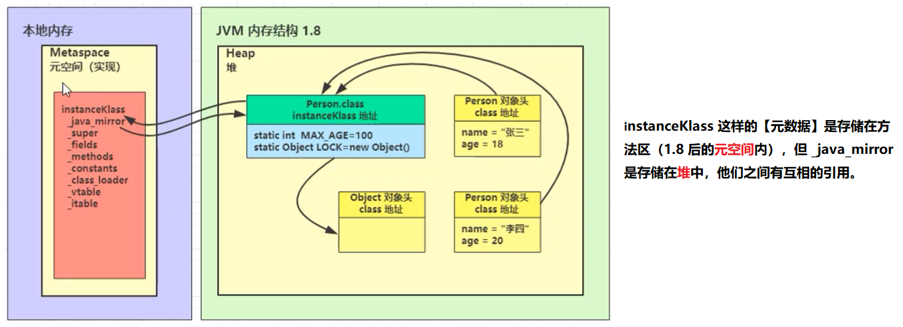

#### 链接

1. 验证：验证类是否符合 JVM规范，安全性检查，检查魔数是不是CAFEBABE
2. 准备：为静态（static）变量分配空间，设置默认值
   1. static 变量在 JDK 7 之前存储于 instanceKlass 末尾，从 JDK 7 开始，存储于 _java_mirror 末尾 
   2. static 变量分配空间和赋值是两个步骤，**分配空间**在【准备阶段】完成，**赋值**在【初始化阶段】完成 
   3. 如果 static 变量是 final 的基本类型，以及字符串常量，那么编译阶段值就确定了，所以赋值在准备阶段完成 
   4. 如果 static 变量是 final 的，但属于引用类型，那么赋值也会在初始化阶段完成

```java
public class Load8 {

    static int a;
    static int b = 10;
    static final int c = 20;
    static final String d = "hello";
    static final String f = new String("hello");
    static final Object e = new Object();
}
```

```java
  public cn.itcast.jvm.t3.load.Load8();
    Code:
       0: aload_0
       1: invokespecial #1                  // Method java/lang/Object."<init>":()V
       4: return

  static {};
    Code:
       0: bipush        10
       2: putstatic     #2                  // Field b:I
       5: new           #3                  // class java/lang/String
       8: dup
       9: ldc           #4                  // String hello
      11: invokespecial #5                  // Method java/lang/String."<init>":(Ljava/lang/String;)V
      14: putstatic     #6                  // Field f:Ljava/lang/String;
      17: new           #7                  // class java/lang/Object
      20: dup
      21: invokespecial #1                  // Method java/lang/Object."<init>":()V
      24: putstatic     #8                  // Field e:Ljava/lang/Object;
      27: return
}
```

3. 解析：将常量池中的符号引用解析为直接引用

#### 初始化

`<clinit>()V` 方法 初始化即调用 `<clinit>()V` ，虚拟机会保证这个类的『构造方法』的线程安全

什么情况下会触发初始化？

1. 会触发

   - main 方法所在的类，总会被首先初始化
   - 首次访问这个类的静态变量或静态方法时
   - 子类初始化，如果父类还没初始化，会引发父类先初始化
   - 子类访问父类的静态变量，只会触发父类的初始化 
   - Class.forName 
   - new 会导致初始化

2. 不会触发

   - 访问类的 static final 静态常量（基本类型和字符串）不会触发初始化 (准备阶段就已经确认值了)

   - 类对象.class 不会触发初始化 （加载阶段就已经确定）

   - 创建该类的数组不会触发初始化 （相当于访问类.class，类似第二条）

   - 类加载器的 loadClass 方法 Class.forName 的参数 2 为 false 时

     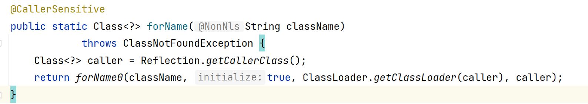

     

案例：

从字节码分析，使用 a，b，c 这三个常量是否会导致 E 初始化

```java
public class Load4 {
    public static void main(String[] args) {
        System.out.println(E.a);
        System.out.println(E.b);
        System.out.println(E.c);
        }
    }
    class E {
    public static final int a = 10;
    public static final String b = "hello";
    public static final Integer c = 20;
    }
}

// 访问a，b不会导致初始化，访问c会导致初始化
// 因为会触发自动装箱
```

典型应用：完成懒惰初始化单例模式

类加载阶段：

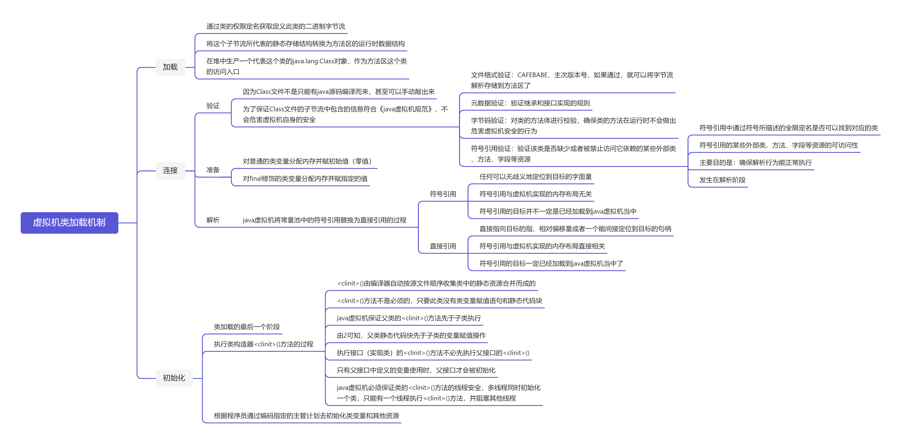

## 3.5 类加载器

类加载器之间存在一些层级关系，以JDK8为例：

| 名称                    | 加载哪的类               | 说明                                         |
| ----------------------- | ------------------------ | -------------------------------------------- |
| Bootstrap ClassLoader   | JAVA_HOME/jre/lib        | 无法直接访问，如果打印这个类加载器会输出null |
| Extension ClassLoader   | JAVA_HOME/jre/lib/ext    | 上级为Bootstrap                              |
| Application ClassLoader | classpath (类路径下的类) | 上级为Extension                              |
| 自定义类加载器          | 自定义                   | 上级为Application                            |

如果上级没有加载过某个类，下级的类加载器才会去加载这个类。

#### 3.5.1 启动类加载器（Bootstrap）

#### 3.5.2 扩展类加载器（Extension）

把我们自己的class打成jar包放入JAVA_HOME/jre/lib/ext目录下，那么它就会被Extension类加载器加载。

#### 3.5.3 双亲委派模式

所谓的双亲委派，就是指调用类加载器的 loadClass 方法时，查找类的规则

注意：这里的双亲，翻译为上级似乎更为合适，因为它们并没有继承关系

源码分析：

```java
protected Class<?> loadClass(String name, boolean resolve)
        throws ClassNotFoundException
    {
        synchronized (getClassLoadingLock(name)) {
            // 1. First, check if the class has already been loaded
            Class<?> c = findLoadedClass(name);
            if (c == null) { // if not, 找上级类加载器
                long t0 = System.nanoTime();
                try {
                    if (parent != null) {
                        // 2.如果有上级，就委派上级ClassLoader
                        c = parent.loadClass(name, false);
                    } else {
                        // 3.如果没有上级了（ExtClassLoader），则委派BootstrapClassLoader
                        c = findBootstrapClassOrNull(name);
                    }
                } catch (ClassNotFoundException e) {
                    // ClassNotFoundException thrown if class not found
                    // from the non-null parent class loader
                }

                if (c == null) {
                    // If still not found, then invoke findClass in order
                    // to find the class.
                    // 4. 每一层找不到，调用 findClass 方法（每个类加载器自己扩展）来加载
                    long t1 = System.nanoTime();
                    c = findClass(name);

                    // this is the defining class loader; record the stats
                    // 5.记录耗时
                    sun.misc.PerfCounter.getParentDelegationTime().addTime(t1 - t0);
                    sun.misc.PerfCounter.getFindClassTime().addElapsedTimeFrom(t1);
                    sun.misc.PerfCounter.getFindClasses().increment();
                }
            }
            if (resolve) {
                resolveClass(c);
            }
            return c;
        }
    }
```

例子：

```java
public class Load5_3 {
    public static void main(String[] args) throws ClassNotFoundException {
        System.out.println(Load5_3.class.getClassLoader());
        Class<?> aClass = Load5_3.class.getClassLoader().loadClass("cn.itcast.jvm.t3.load.H");
        System.out.println(aClass.getClassLoader());
    }
}
```

执行流程：

```
1. sun.misc.Launcher$AppClassLoader //1 处， 开始查看已加载的类，结果没有
2. sun.misc.Launcher$AppClassLoader // 2 处，委派上级
sun.misc.Launcher$ExtClassLoader.loadClass()
3. sun.misc.Launcher$ExtClassLoader // 1 处，查看已加载的类，结果没有
4. sun.misc.Launcher$ExtClassLoader // 3 处，没有上级了，则委派 BootstrapClassLoader
查找
5. BootstrapClassLoader 是在 JAVA_HOME/jre/lib 下找 H 这个类，显然没有
6. sun.misc.Launcher$ExtClassLoader // 4 处，调用自己的 findClass 方法，是在
JAVA_HOME/jre/lib/ext 下找 H 这个类，显然没有，回到 sun.misc.Launcher$AppClassLoader
的 // 2 处
7. 继续执行到 sun.misc.Launcher$AppClassLoader // 4 处，调用它自己的 findClass 方法，在
classpath 下查找，找到了
```


#### 3.5.4 线程上下文类加载器

#### 3.5.5 自定义类加载器

1. 什么时候需要自定义类加载器
   1. 想加载非 classpath 随意路径中的类文件 
   2. 都是通过接口来使用实现，希望解耦时，常用在框架设计 
   3. 这些类希望予以隔离，不同应用的同名类都可以加载，不冲突，常见于 tomcat 容器
2. 步骤
   1.  继承 ClassLoader 父类 
   2. 要遵从双亲委派机制，重写 findClass 方法
      - 注意不是重写 loadClass 方法，否则不会走双亲委派机制 
   3. 读取类文件的字节码 
   4. 调用父类的 defineClass 方法来加载类
   5.  使用者调用该类加载器的 loadClass 方法

```java
class MyClassLoader extends ClassLoader {

    @Override // name 就是类名称
    protected Class<?> findClass(String name) throws ClassNotFoundException {
        String path = "e:\\myclasspath\\" + name + ".class";

        try {
            ByteArrayOutputStream os = new ByteArrayOutputStream();
            Files.copy(Paths.get(path), os);

            // 得到字节数组
            byte[] bytes = os.toByteArray();

            // byte[] -> *.class
            return defineClass(name, bytes, 0, bytes.length);

        } catch (IOException e) {
            e.printStackTrace();
            throw new ClassNotFoundException("类文件未找到", e);
        }
    }
}

public class Load7 {
    public static void main(String[] args) throws Exception {
        MyClassLoader classLoader = new MyClassLoader();
        Class<?> c1 = classLoader.loadClass("MapImpl1");
        Class<?> c2 = classLoader.loadClass("MapImpl1");
        System.out.println(c1 == c2); // true

        MyClassLoader classLoader2 = new MyClassLoader();
        Class<?> c3 = classLoader2.loadClass("MapImpl1");
        System.out.println(c1 == c3); // false 两个类相同，要求他们包名类名相同，类加载器也相同

        c1.newInstance(); // 通过反射创建MapImpl1类的对象
    }
}
```


## 3.6 运行期优化

### 3.6.1 即时编译（JIT）

#### 分层编译

1. JVM 将执行状态分成了 5 个层次： 
   1. 0 层，解释执行（Interpreter） 1 层，使用 C1 即时编译器编译执行（不带 profiling） 
   2. 2 层，使用 C1 即时编译器编译执行（带基本的 profiling） 
   3. 3 层，使用 C1 即时编译器编译执行（带完全的 profiling） 
   4. 4 层，使用 C2 即时编译器编译执行

```
profiling 是指在运行过程中收集一些程序执行状态的数据，例如【方法的调用次数】，【循环的 回边次数】等
```

2. 即时编译器（JIT）与解释器的区别：
   1. 解释器是将字节码解释为机器码，下次即使遇到相同的字节码，仍会执行重复的解释 
   2. JIT 是将一些字节码(热点代码)编译为机器码，并存入 Code Cache，下次遇到相同的代码，直接执行，无需再编译 
   3. 解释器是将字节码解释为针对所有平台都通用的机器码 
   4. JIT 会根据平台类型，生成平台特定的机器码

3. 解释执行和编译执行：

对于占据大部分的不常用的代码，我们无需耗费时间将其编译成机器码，而是采取**解释执行**的方式运行；对于仅占据小部分的热点代码，我们则可以将其编译成机器码，以达到理想的运行速度。 执行效率上简单比较一下 Interpreter < C1 < C2，总的目标是发现热点代码（hotspot名称的由来），优化之。

即时编译中有一种优化手段是：**逃逸分析**

```java
// -XX:+PrintCompilation -XX:-DoEscapeAnalysis（关闭逃逸分析）
public static void main(String[] args) {
    for (int i = 0; i < 200; i++) {
        long start = System.nanoTime();
        for (int j = 0; j < 1000; j++) {
            new Object();   // 即时编译器会发现这个对象没有在方法外使用，所以最后并不会创建对象
        }
        long end = System.nanoTime();
        System.out.printf("%d\t%d\n",i,(end - start));
    }
}
```

#### 方法内联

如果发现 square 是热点方法，并且长度不太长时，会进行内联，所谓的内联就是把方法内代码拷贝、 粘贴到调用者的位置：

```java
private static int square(final int i) {
	return i * i;
}

System.out.println(square(9)); // --> System.out.println(9*9);
```

#### 字段优化

对静态变量或者成员变量等字段的优化

### 反射优化

```java
public class Reflect1 {

    public static void foo() {
        System.out.println("foo...");
    }

    public static void main(String[] args) throws NoSuchMethodException, InvocationTargetException, IllegalAccessException, IOException {
        Method foo = Reflect1.class.getMethod("foo");
        for (int i = 0; i <= 16; i++) {
            System.out.printf("%d\t", i);
            foo.invoke(null);
        }
        System.in.read();
    }
}
```

通过查看invoke的源码可知，最开始Java虚拟机会调用本地invoke()方法，本地方法的执行效率比较低；当连续反射调用次数超过inflationThreshold，就会ASM动态生产新的实现代替本地实现，深度较本地实现快20倍左右。新的实现方法内部，已经没有使用反射吊用了，而是用Reflect1直接调用。 

通过查看 ReflectionFactory 源码可知 

- sun.reflect.noInflation 可以用来禁用膨胀（直接生成GeneratedMethodAccessor1，但首次生成比较耗时，如果仅反射调用一次，不划算） 
- sun.reflect.inflationThreshold 可以修改膨胀阈值

# 4 内存模型（JMM）

## 4.1 java内存模型

【java 内存模型】是 Java Memory Model（JMM）的意思。

设计初衷：《java虚拟机规范》试图定义一种“java内存模型”屏蔽各种硬件和操作系统的内存访问诧异，以实现java程序在各种平台下都能达到一致的内存访问效果。

主要目的：定义程序中各种变量的访问规则，即关注在虚拟机中把变量值存储到 内存和从内存中取出变量值这样的底层细节。

Java内存模型规定了所有的变量都存储在主内存（Main Memory）中, 每条线程还有自己的工作内存（Working Memory）。

- 线程的工作内存中保 存了被该线程使用的变量的主内存副本
- 线程对变量的所有操作（读取、赋值等）都必须在工作内存中进行，而不能直接读写主内存中的数据
- 不同的线程之间也无法直接访问对方工作内存中的变量
- 线程间变量值的传递均需要通过主内存来完成

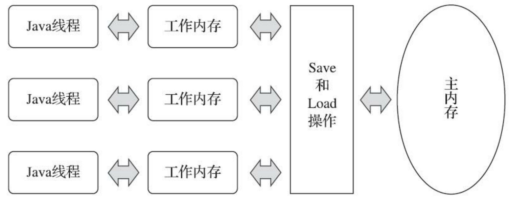

简单的说，JMM 定义了一套在多线程读写共享数据时（成员变量、数组）时，对数据的可见性、有序性、和原子性的规则和保障。

### 4.1.1 原子性

由Java内存模型来直接保证的**原子性变量操作**包括read、load、assign、use、store和write这六个， 我们大致可以认为，基本数据类型的访问、读写都是具备原子性的。（double和long有一个“非原子性协定”，但是几乎不会发生）

如果应用场景需要一个更大范围的原子性保证，可以使用——synchronized关键字，synchronized块之间的操作也具备原子性。对应的字节码指令是：monitorenter和monitorexit。

### 4.1.2 可见性

可见性：当一个线程修改了变量的值，新值对于其他线程是立即可见的。

```java
static boolean run = true;
public static void main(String[] args) throws InterruptedException {
    Thread t = new Thread(()->{
        while(run){
            // ....
        }
    });
    t.start();
    Thread.sleep(1000);
    run = false; // 线程t不会如预想的停下来
}
```

**关键字volatile**：

- 保证此变量对所有线程的可见性，避免线程从自己的工作缓存中查找变量的值，必须到主存中获取值
- 禁止指令重排序优化，保证变量赋值操作的顺序与程序代码中的执行顺序一致

**关键字synchronized**：对一个变量执行unlock操作之前，必须先把此变量同步回主内存中（执行store、write操作）

**关键字final**：被final修饰的字段在构造器中一旦被初始化完成，那么在其他线程中就能看见final字段的值。

### 4.1.3 有序性

Java语言提供了**volatile和synchronized两个关键字**来保证线程之间操作的有序性

- volatile关键字本身就包含了禁止指令重排序的语义
- synchronized则是由“一个变量在同一个时刻只允许一条线程对其进行lock操作”这条规则获得的，这个规则决定了持有同一个锁的两个同步块只能串行地进入。 

## 4.2 CAS与原子类

### 4.2.1 CAS

### 4.2.2 原子类

## 4. 3 synchronized优化

### 4.3.1 轻量级锁

### 4.3.2 锁膨胀

如果尝试加轻量级锁的过程中，CAS操作无法成功，这时一种情况是有其他线程为此对象加上了轻量级锁（有竞争），此时需要进行锁膨胀，将轻量级锁变为重量级锁。

### 4.3.3 重量锁

重量级锁竞争的时候，还可以使用自旋来优化，如果当前线程自旋成功（即这时候持锁线程已经退出了同步块，释放锁），此时当前线程就可以避免阻塞。

当然，自旋的次数不是无限制的。

在 Java 6 之后自旋锁是自适应的，比如对象刚刚的一次自旋操作成功过，那么认为这次自旋成功的可能性会高，就多自旋几次；反之，就少自旋甚至不自旋，总之，比较智能。

- 自旋会占用 CPU 时间，单核 CPU 自旋就是浪费，多核 CPU 自旋才能发挥优势。 
- 好比等红灯时汽车是不是熄火，不熄火相当于自旋（等待时间短了划算），熄火了相当于阻塞（等待时间长了划算）
-  Java 7 之后不能控制是否开启自旋功能（JVM内部控制）

### 4.3.4 偏向锁

