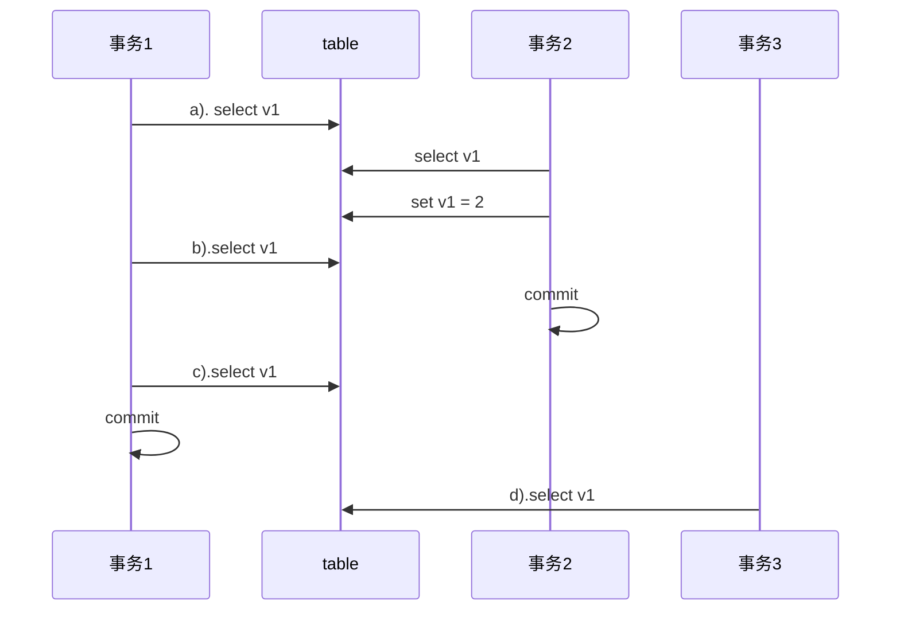
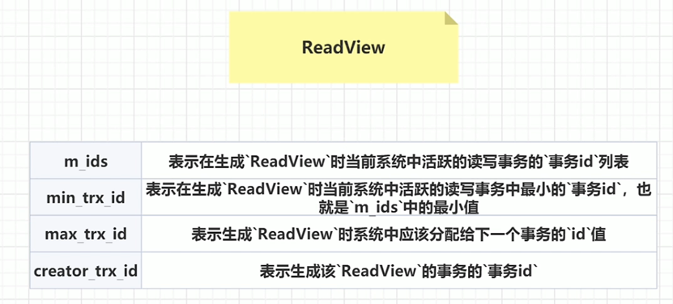
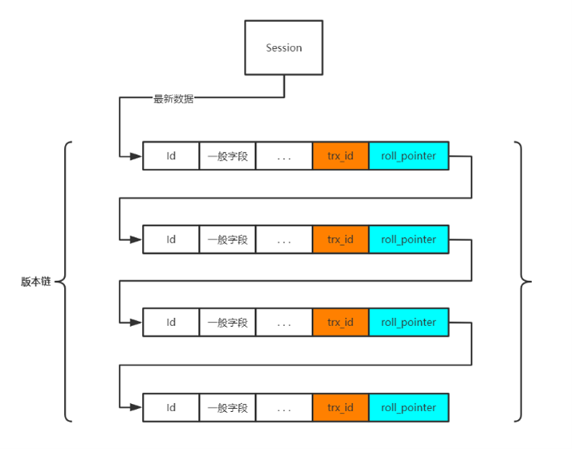

# MySQL 索引

## 1 什么是索引

索引是存储引擎用于快速找到记录的一种**数据结构**。

- 在表的某列或者某些列上建立索引，存储引擎先在索引上找到匹配值，然后根据匹配的索引记录找到对应的数据行。
- MySQL中，索引是在**存储引擎实现**的而非服务器层实现的，不同的存储引擎的索引的工作方式不一样，即使采用同一种类型的索引，底层的实现也可能不一样。

## 2 索引分类

根据建立索引的列可以分为四类：

1. 主键索引：设定主键之后数据库自动创建索引，主键索引索引列值不能为空
2. 单值索引（index）：一个索引只包含一个列，一个表可以有多个单列索引
3. 唯一索引（unique）：索引列的值必须唯一，但允许有空值
4. 复合索引：一个索引包含多个列

还有一类特殊的索引为：

5. 全文索引

>  InnoDB存储引擎支持前四种索引，并且在有主键的情况下，InnoDB默认在主键上创建聚簇索引，其他的索引为二级（辅助）索引。


## 3 索引的底层数据结构

MySQL支持的索引结构有B树索引、哈希索引等。

> hash索引不支持范围查找，不能用索引排序


InnoDB采用B+树构建索引。存储规则如下：


- 先按照索引列的值按顺序存储，并指针将每个结点链起来，并以页为单位划分结点，在InnoDB中，每个页的大小为16Kb；
- 叶子节点的页 上层是 分支节点页，分支节点中不存储数据，只存储指向 下级页的起始结点的指针；
- 最上层为根节点，在InnoDB中根节点是常驻内存的。


**为什么使用B+树而不是B树？为什么不使用二叉查找树\平衡二叉树**

```markdown
二叉查找树有时候会变成一个单链，查找速度慢。

平衡二叉树每个节点只有两个子节点
 - 当数据量变大的时候，树的深度变深，查找速度变慢；
 - 范围查找的时候有回旋查找的问题

B树的每个节点可以有多个子节点，当数据量很多的时候，树的深度也可以控制在3-4层，但是B树的每个节点都存储数据，所以还是存在回旋查找的问题，而且每个节点的内存消耗也比较大。

B+树相比于B树最大的区别是，只有叶子节点存储数据。
因为B+树只在叶子节点中存储数据，所以分支结点占用的空间很小，也就是说相同高度的B+树能够存储更多的数据。
举个例子：
主键一般为int类型，占用4字节，或者bigint占8字节，结点指针一般是4-8字节，假设为8字节，那么一个分支页的下级有（16 * 1024）/ （8 + 8） =  1k个子页，那么3层b+树，可以存储的数据量是 10 亿左右，所以就算是很大的数据表，如果使用主键查询，最多也只需要2次I/O。
这里忽略了表中其他数据占用的空间，但是对于B+树，只有最后一层需要加上非索引数据的空间，但对于B树，所有节点都要考虑非索引数据的空间，能存储的数据必然更少。
```


**B-Tree索引的限制——最左前缀原则**

比如建表的时候，索引设置为 `key (last_name, first_name, dob)`

1. 如果不是按照索引的最左列开始查找，则无法使用索引；

   ```
   即无法使用索引优化条件查查询 first_name=Bill的行。
   ```

2. 不能跳过索引的列；

   ```
   如果查询last_name=Smith and dob='1972-02-26'的行，MySQL只能使用索引的第一列
   ```

3. 如果查询中有某个列的模糊查询（Like），则模糊查询右边的所有列都无法使用索引优化查找。


## 4 聚簇索引与非聚簇索引

”聚簇“ 表示**数据行和相邻的键值紧凑地存储在一起**。

聚簇索引并不是一种索引类型，而是一种**数据存储方式**，当表存在聚簇索引时，他的数据行实际上存放在索引的叶子页（叶子页存放的不再是数据行指针，而是数据行本身）。

注意：

- 一个表只能有<font color='red'>一个</font>聚簇索引，因为数据行不能存放在两个不同的地方
- 并不是所有的存储引擎都支持聚簇索引
- InnoDB支持聚簇索引


### **InnoDB的聚簇索引**

InnoDB选择**主键聚集数据**，但是

- 如果表没有定义主键，InnoDB会选择<font color = 'red'>唯一的非空索引</font>代替主键
- 如果不存在这样的索引，InnoDB会隐式地定义一个主键来作为聚簇索引
- 如果设置了主键为聚簇索引又希望再单独设置聚簇索引，必须先删除主键，然后添加我们想要的聚簇索引，最后恢复设置主键。

`InnoDB`的聚簇索引实际上是在<font color='red'>同一个结构中保存了B-Tree索引和数据行</font>。叶子页包含了行的全部数据，但是节点页只包含索引列。


> 在InnoDB中，**聚簇索引就是”表“**。每个叶子节点都包含了主键值、事务ID、用于事务和MVCC的回滚指针，以及所以剩余的列的值，如果主键是前缀索引，也会包含完整的主键列和剩余的其他了列。


#### 在InnoDB中按照主键顺序插入行

最好在主键或者顺序写入的列上（AUTO_INCREMENT）建立聚簇索引，新增数据的时候，可以把新纪录存储在上一条记录的后面，当页满的时候，写入新的页。

但如果在随机的列上建立（主键）聚簇索引，假设在UUID上建立聚簇索引，数据在插入时就变得完全随机，新行的主键值不一定比上一条记录小，所以需要做额外的工作找到新行的插入位置，可能造成频繁的页分裂。

所以，使用InnoDB应该<font color = 'red'>尽可能地按主键顺序</font>插入数据，并且尽可能的使用单调增加的聚簇键的值来插入新行。


#### 聚簇索引的优点（适合I/O密集型）

- 可以把相关的数据保存到一起，一次I/O可以查询大量数据
- 数据访问更快，聚簇索引将数据和索引保存在同一个B-Tree
- 使用覆盖索引扫描的查询可以直接使用页节点的主键值


#### 聚簇索引的缺点

- 如果数据存储在内存中，聚簇索引没有必要
- 插入速度严重依赖于插入顺序
- 更新聚簇索引列的代价很高
- 基于聚簇索引的表在插入新数据时，或者主键更新需要移动行的时候，可能导致<font color='blue'>”页分裂“</font>
- 行稀疏的时候，聚簇索引可能导致全表扫描变慢
- 二级索引（非聚簇索引）更大，一般存储主键作为 “行指针”
- 二级索引访问<font color='blue'>需要两次索引查找</font>，因为二级索引叶子页中存储的是行主键值而不是行的物理地址，所以需要先找到主键值，再去聚簇索引查找对应的行。


***

#### 深入理解聚簇索引和非聚簇索引

从InnoDB和MyISAM的数据分布对比，理解聚簇索引和非聚簇索引，以及对应的主键索引和二级索引区别。

```mysql
CREATE TABLE layout_test(
	col1 int NOT NULL,
    col2 int NOT NULL,
    PRIMARY KEY(col1),
    KEY(col2)
);
```

**MyISAM**

对于MyISAM，在主键上建立索引和在非主键上创建索引在结构上没有什么区别，他们的叶子页存储的都是指向数据表行的指针。


**InnoDB**

InnoDB的<font color = 'red'>二级（辅助）索引和聚簇索引在叶子页节点的结构上不一样</font>，InnoDB的二级索引叶子节点中存储的不是”行指针“，而是用主键值作为指向行的”指针“，这也使二级索引占用更多空间；而聚簇索引的叶子节点包含了行的全部信息。


图5-8可以看到，以col2建立索引的叶子节点，包含了索引列和主键值。

> 为什么二级索引不存储”行指针“？
>
> 二级索引存储【主键】作为【行指针】可以减轻的二级索引的维护工作，这样基于聚簇索引的表更新时发生行移动或者”页分裂“时无需更新二级索引的叶子节点中的指针。


## 5 为什么会有最左前缀原则


这个就要从在B+树上创建多列索引的规则说起，假设表T1有字段a,b,c,d,e，其中a是主键，除e为varchar其余为int类型，并创建了一个联合索引idx_t1_bcd(b,c,d)，然后b、c、d三列作为联合索引。

创建联合索引的时候，所有索引列都出现在索引树上，并依次比较三列的大小。对于联合索引，存储引擎会首先根据第一个索引列排序，也就是先按b的值排序，如，1 1 5 12 13....他是单调递增的；如果第一列相等则再根据第二列排序；如果第二列相等则再根据第三列排序……

> 上图演示了一个两列的联合索引，可以看到最左边的列在索引中是有序的，但是右边的列是无序的，只有当左边的索引列值相等时，才是有序的。


### 最左前缀匹配原则

之所以会有最左前缀匹配原则和联合索引的索引构建方式及存储结构是有关系的。


首先我们创建的idx_t1_bcd(b,c,d)索引，相当于创建了(b)、（b、c）（b、c、d）三个索引，看完下面你就知道为什么相当于创建了三个索引。


联合索引是首先使用多列索引的**第一列构建**的索引树，用上面idx_t1_bcd(b,c,d)的例子就是优先使用b列构建，当b列值相等时再以c列排序，若c列的值也相等则以d列排序。

由于联合索引是上述那样的索引构建方式及存储结构，所以联合索引只能从多列索引的第一列开始查找。所以如果你的查找条件不包含b列如（c,d）、(c）、(d)是无法应用缓存的，因为没有b作为参照，他们就是无序的，只能做全表扫描；以及跨列也是无法完全用到索引如(b,d)，只会用到b列索引。因为要根据b找到c的范围，根据c才能找到d的范围，如果缺少前面的条件，后面的索引就无法使用。

```
就比如我们在电话簿查 刘星 的电话，要先根据【刘】才能快速找到刘星，如果只知道名字是【星】，就只能全表扫描了。
```


### 索引失效

1.  不遵循最左前缀原则
2.  范围查找的右边的索引字段失效
3.  模糊查询（like "%xx", like "%xx%"）的右边的索引字段失效


# MySQL 事务

## 1. MySQL中的事务

### 事务

事务：逻辑上的一组操作，要么都执行，要么都不执行。

数据库事务：一个或者多个数据库操作构成一个逻辑上的整体，这些数据库操作，要么全部执行成功，要么全部不执行，也就是说，不管事务是否执行，数据库总能保持一致性状态。


## 2. 并发事务带来哪些问题

#### 写的问题

如果同一时刻，允许多个事务对同一数据进行修改，可能导致：

- 第一类丢失修改：一个事务的回滚，导致另一个事务已提交的数据丢失
- 第二类丢失修改：一个事务的提交，导致另一个事务已提交的数据被覆盖

#### 读的问题

如果同一时刻，允许多个事务对同一数据、同一数据表进行读或写操作，可能导致：

- 脏读：一个事务读取了另一个事务未提交的数据
- 不可重复读：一个事务结束之前，对同一数据多次读取的值不一致
- 幻读：一个事务在结束之前，对数据表某一范围 行的统计值 多次统计的结果不一致


## 3. ACID

#### 事务的ACID特性

- 原子性（atomicity）—— undo log（回滚）
- 一致性（consistency）
- 隔离性（isolation）—— 写-写操作 锁机制，写-读操作 MVCC
- 持久性（durability）—— redo log

一致性是执行事务的最终目的。


## 4. MySQL如何保证ACID

- 通过预写式日志（Write-Ahead Logging）保证原子性和持久性，undo log保证原子性，redo log保证持久性

  > undolog记录事务执行前的数据，回滚的时候恢复状态；redolog是一种物理日志，记录数据页提交过的更新事务，crush之后可以恢复以前提交过的事务

- 通过锁机制保证隔离性

- 保证了原子性、持久性、隔离性，从而保证数据库的一致性

> Write-Ahead Logging
>
> ```
> 例如：数据库中A=1,B=2,需要update A=3,B=4
> 
> 1.事务开始
> 
> 2.记录A=1到undo log
> 
> 3.修改A=3
> 
> 4.记录A=3到redo log
> 
> 5.记录B=2到undo log
> 
> 6.修改B=4
> 
> 7.记录B=4到redo log
> 
> 8.将redo log顺序写入磁盘
> 
> 9.事务提交
> ```
>
> 如果整个事务执行的过程系统崩溃或者断电了，在系统重启的时候，恢复机制会将redo log中已提交的事务重做，保证事务的持久性；而undo log中未提交的事务进行回滚，保证事务的原子性。


## 5. 事务的隔离级别

例子, 假设一开始v1的值为1：




为了防止并发问题的发生，SQL标准定义了四个隔离级别：

- **READ-UNCOMMITED（读未提交**）

  - 一个事务还没提交时，它做的变更就能被别的事务看到。
  - a) 1   b) 2   c) 2   d) 2

- **READ-COMMITED（读已提交）**

  - 一个事务提交之后，它做的变更才会被其他事务看到
  - 可以解决脏读
  - a) 1   b) 1   c) 2   d) 2

- **REPEATABLE-READ（可重复读）**

  - 一个事务执行过程中看到的数据，总是跟这个事务在启动时看到的数据是一致的。
  - 可以解决脏读、不可重复读
  - a) 1   b)1   c) 1   d) 2

- **SERIALIZABLE（串行化）**

  - 可以解决脏读、不可重复读、幻读
  - a) 1   b) 1   c) 1   d) 2 ；与 REPEATABLE-READ 的不同之处在于，事务2执行更新操作时会加锁，此时事务1会阻塞直到事务2提交

  ------

> 注意：
>
> - 从上到下隔离级别的程度递增，安全性递增，效率递减
> - <font color='red'>MySQL默认隔离级别是REPEATABLE-READ，使用事务型存储引擎时可以达到SERIALIZABLE同等的效果</font>


## 6. 事务型存储引擎

MySQL服务层不管理事务，事务是由下层的存储引擎实现的，MySQL是一个支持多引擎的系统，但不是所有的引擎都支持事务。

MySQL提供了两个事务型存储引擎：InnoDB和NDB Cluster（MySQL集群模式下的存储引擎）

> 实际上MySQL很少会使用集群模式，一般只会做到读写分离


## 7. 多版本并发控制

当前读：锁
快照读：MVCC  
快照读的含义：相当于开始事务时抓取了数据库的快照，里面的数据都是已经提交的数据，抓取快照时活跃的事务 以及 抓取事务后开启的事务 对数据库的更改 对当前事务来说是透明的。  
MVCC：通过保存数据在某个时间点的快照来实现的。  
   1. 不管执行多长时间，每个事务看到的数据都是一致的，看到的都是事务开启时【快照】的数据；  
   2. 不同事务开始的时间不同，每个事务对同一张表，同一时刻看到的数据可能不一致。 

### 7.1 Readview


Readview是一个快照，readview中的四个变量：  
1. 活跃事务（活跃事务就是没提交的事务）集合 —— `m_ids`；  
2. 当前事务id —— `creator_trx_id`；  
3. 集合中的最小值 —— `min_trx_id`；  
4. 集合中最大值的下个值 —— `max_trx_id`。  


MySQL中的表的每一行数据，从事务的视角去看，其实不止一行数据，而是一个行数据链，被称为数据的版本链，每一行数据，都要额外维护 trx_id（事务id） 和 roll_pointer（回滚指针），每一次更新都会新生产一个版本，旧版本保存在 undo_log当中，用作事务回滚。  


这一行数据的哪个版本对事务可见，要根据创建事务时的readview决定，规则如下：  
1. `trx_id == creator_trx_id` : 表示是这条记录是这个事务自己创建的;  
2. `trx_id < min_trx_id` : 表示是这条记录是已提交的数据;  
3. `trx_id > max_trx_id` : 表示这个数据是被 创建这个readview 之后 开启的事务创建的，所以当前ReadView中无法读取这行数据;  
4. `min_trx_id <= trx_id <= max_trx_id` : 如果是ids集合中的，说明创建ReadView的时候，这行数据还没有被提交（活跃的事务），不能读取；如果不是ids集合中的，说明创建ReadView的时候，这行数据以及被提交，可以读取。  


**执行查询语句时：**
1. 会先到版本链中查询,并且获取到最新版本的`trx_id`；  
2. 然后根据 事务隔离级别 和 快照读的规则，判定最新的数据是否对当前ReadView可见，如果可见，直接读取；  
3. 如果不可见，顺着版本链依次往下，要么找到可见的版本，要么返回null.  

MySQL大多数事务型存储引擎实现的都不是简单的行级锁，他们一般都同时实现了**多版本并发控制（MVCC）**，**MVCC只有在REPEATABLE READ和READ COMMITED两个隔离级别下工作。**  

### 7.2 MVCC如何实现读已提交 
在**读已提交**的隔离级别下，每次执行select语句就生产一个新的ReadView，**即使是同一个事务中**的不同查询也会有不同的ReadView。根据快照读的规则，每次执行查询语句都只能读取到执行这个查询之前的已提交的数据，实现了读已提交。  
但是这会导致不可重复读。假设事务A对同一行数据执行两次查询。第一次查询语句的时候，事务B正在对数据进行更新，但是未提交，所以此次只能读取之前已提交的数据；第二次查询语句的时候，事务B已经提交，这次可以读取 事务B 修改的数据。两次查询的结果不一样！  

### 7.3 MVCC如何实现可重复读
在**可重复读的隔离级别下**，每开启一个新事务，才会生成一个ReadView，事务提交之前，ReadView保持不变。因为ReadView保持不变，所以也可以防止幻读。  
 


## 8. InnoDB隔离级别的实现原理

### 8.1 InnoDB的锁

#### 锁的范围

1. 表级锁：开销小，加锁快，发生锁冲突的几率高，并发度低，不会出现死锁
2. 行级锁：开销大，加锁满，发生锁冲突的几率小，并发度高，会出现死锁

> 索引失效会导致行锁升级为表锁。

#### 锁的类型

1. 共享锁（Share Lock， 简称S锁）：行级锁，读取一行
2. 排他锁（Exclusive Lock，简称X锁 ）：行级锁，更新一行

> **1. 「多个事务可以同时读取记录，即共享锁之间不互斥，但共享锁会阻塞排他锁。排他锁之间互斥」**
>
> 2. select .. lock in share mode，对读取的记录加S锁
> 3. select ... for update ，对读取的记录加X锁

3. 意向共享锁（IS）：表级锁，准备加共享锁

4. 意向排他所（IX）：表级锁，准备加排他锁

   > 意向锁是表级锁，意向锁之间互相兼容

5. 间隙锁（Next-Key Lock，简称N-K锁）：行级锁，使用范围条件时，对范围条件内不存在的记录加锁。（比如查询id>105的数据，表中的数据id最大为110，间隙锁就是对id>110的行加锁，防止插入多的数据）

> 如何防止表中最后一条有效数据之后添加数据？
>
> 会有一个虚拟的末尾行，对这个行加间隙锁，就能防止末尾添加数据行

#### 单个记录锁和间隙锁

1. Record Lock：对单个记录加锁（行锁）
2. Gap Lock：间隙锁，锁住前面的间隙，不允许插入记录
3. Next-key Lock：间隙锁，同时锁住数据和数据前面的间隙


### 8.2 执行SQL时加的是什么锁

SQL执行加什么样的锁受很多条件的制约，比如事务的隔离级别，执行时使用的索引（如，聚集索引，非聚集索引等）。

> InnoDB的行锁是针对索引字段加的锁，表级锁是针对非索引字段加的锁，当我们执行UPDATE、DELETE语句时，如果WHERE条件中的字段没有命中索引，就会导致扫描全表对表中的所有记录加锁。

#### Record Lock

```mysql
-- READ UNCOMMITTED/READ COMMITTED/REPEATABLE READ 利用主键进行等值查询
-- 对id=8的记录加S型Record Lock
select * from girl where id = 8 lock in share mode;

-- READ UNCOMMITTED/READ COMMITTED/REPEATABLE READ 利用主键进行等值查询
-- 对id=8的记录加X型Record Lock
select * from girl where id = 8 for update;
```

#### Gap Lock

如果一个事务对 id=8 的记录加间隙锁，意味着在这个事务提交提前，不允许 id=8 的记录前面的间隙插入新记录。假设一开始不存在 id=7 的记录，一个事务准备插入 id=7 的记录，为了防止其他事务执行相同的查询语句时，<font color='blue'>一开始查不到，后来又查到 id=7 的记录</font>，所以给id=8 的记录加 <font color='red'>间隙锁</font>。

```mysql
-- REPEATABLE READ 利用主键进行等值查询
-- 但是主键值并不存在
-- 对id=8的聚集索引记录加Gap Lock
SELECT * FROM girl WHERE id = 7 LOCK IN SHARE MODE;
```

#### Next-key Lock

**同时锁住数据和数据前面的间隙，即数据和数据前面的间隙都不允许插入记录**，所以你可以这样理解Next-key Lock=Record Lock+Gap Lock，如果一个事务需要对id > 8的记录进行插入或删除操作，为了防止其他事务<font color='blue'>查询这部分记录时出现数值上的不一致</font>，InnoDB会做如下处理：

```mysql
-- REPEATABLE READ 利用主键进行范围查询
-- 对id=8的聚集索引记录加S型Record Lock
-- 对id>8的所有聚集索引记录加S型Next-key Lock，包括Supremum伪记录（页的最后一条记录）
SELECT * FROM girl WHERE id >= 8 LOCK IN SHARE MODE;
```


### 8.3 InnoDB与MVCC

InnoDB的【读已提交】和【可重复读】是通过MVCC来实现的，本质就是MySQL通过undoLog存储了多个版本的历史数据，根据规则读取某一历史版本的数据，这样就可以在无锁的情况下实现读写并行。

对于InnoDB来说，通过在每行记录后面保存两个隐藏的列来实现MVCC。

- 行版本号：一个保存行的创建时间（创建这行的事务的 版本号trx_id）
- 删除标识：一个保存行的删除时间（当前的系统版本号roll_pointer）

每开启一个事务，系统的版本号+1，事务开始时刻的系统版本号是事务的版本号。

```
查询：
	a.只查询版本早于当前事务版本的数据行；
	b.行的删除版本要么为定义，要么大与当前事务版本号
插入
	a.当前系统版本号设置为行版本号
删除
	a.为删除的每一行保存当前系统版本号作为删除标识
更新
	a.当前系统版本号设置为行版本号
	b.保存当前系统版本号作为删除标识
```

保存这两个额外的版本号，使大多数读操作都可以不加锁。
