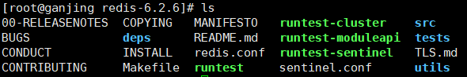

# Nosql

## 1 为什么要用Nosql

解决性能问题，redis是一种典型的Nosql数据库。

- Web1.0时代：网络的访问量小，单体应用，一台服务器一个数据库
- Web2.0时代：网络的访问量急剧增加，服务器压力，IO压力
  - 服务器压力 ----> 多台服务器，负载均衡，那session问题如何解决？
    - 存储到客户端cookie ---> 安全性低
    - session复制 ---> 数据冗余
    - 缓存数据库，将session信息存储到Nosql数据库，存储在内存中，读取速度快
  - IO压力
    - 读写分离：主从同步原则，主数据库负责数据库CRUD操作，从数据库负责读操作
    - 垂直切分：根据业务分类将数据表存储到不同的数据库中
    - 水平切分：按照数据行切分表，同一张表的数据会存储到不同的数据库
    - Nosql存储频繁读的数据，减少IO操作

- 大数据时代
  - 有些数据类型，不适合存储在关系型数据库


总结：1. 解决服务器和内存压力；2.解决IO压力


## 2 什么是NoSQL

​		NoSQL(NoSQL = **Not Only SQL** )，意即“不仅仅是SQL”，泛指**非关系型的数据库**。 NoSQL 不依赖业务逻辑方式存储，而以简单的key-value模式存储。因此大大的增加了数据库的扩展能力。

特点：

- 数据之间没有关系，方便扩展
- 大数据量高性能

应用场景：

- 高并发读写
- 海量数据读写
- 不支持事务

# Redis

## 1 什么是redis

**Re**mote **Di**ctionary **S**erver ：远程字典服务。

特点：

1.  Redis是一个开源的key-value存储系统。
2.  和Memcached类似，它支持存储的value类型相对更多，包括string(字符串)、list(链表)、set(集合)、zset(sorted set --有序集合)和hash（哈希类型）。
3.  这些数据类型都支持push/pop、add/remove及取交集并集和差集及更丰富的操作，而且这些操作都是**原子性**的。
4.  在此基础上，Redis支持各种不同方式的排序。
5.  与memcached一样，为了保证效率，数据都是缓存在内存中。
6.  区别的是Redis会周期性的把更新的数据写入磁盘或者把修改操作写入追加的记录文件。
7.  并且在此基础上实现了**master-slave(主从)同步**。

## 2 应用场景

1. 配合关系型数据库做高速缓存

   1. 高频次，热门访问的数据，降低数据库IO
   2. 分布式架构，做session共享

2. 多样的数据结构存储持久化数据（rdb，aof）

   


## 3 安装与运行服务

1. 下载安装包，直接下载当前稳定版本

2. 将安装包移动到opt目录下

   ```sh
   mv redis-6.2.6.tar.gz /opt
   ```

3. 解压安装包

   

4. 基本的环境安装

   ```sh
   # 第一步
   yum install gcc-c++
   # 查看是否安装完成
   gcc -v
   ```

   

5. make

   ```sh
   # 第二步
   make
   make # 需要再make一次
   make install
   ```

6. 检查，安装完成以后，redis相关文件在/usr/local/bin 目录下

   

7. 将配置文件拷贝到 新建的目录gconfig下

   

8. redis默认不是后台启动的，修改配置文件 daemonize no 改成yes。

   

9. 启动，6.2版本输入命令不会有提示，但也是启动成功，可以使用客户端访问验证。

   

   

10. 查看redis进程是否开启 ps -ef|grep redis

    

11. 关闭redis服务

    ```sh
    shutdown
    exit
    ```


注意：最好给redis设置密码

1. 将配置文件中的requirepass的注释取消，并添加密码

2. 注释掉bind 127.0.0.1

3. 重启redis，登陆客户端时需要输入密码

   ```sh
   redis-cli -p 6379 -a your_password
   ```


# Redis相关知识介绍

## **单线程+多路IO操作**

Redis 作为一个内存服务器，它需要处理很多来自外部的网络请求，它使用 **I/O 多路复用机制同时监听多个文件描述符的可读和可写状态**，一旦收到网络请求就会在内存中快速处理，由于绝大多数的操作都是纯内存的，所以处理的速度会非常地快。

**为什么使用单线程？**

1. 使用单线程模型能带来更好的可维护性，方便开发和调试；
2. 使用单线程模型也能并发的处理客户端的请求；
3. **Redis 服务中运行的绝大多数操作的性能瓶颈都不是 CPU；**
   - 多线程技术能够帮助我们充分利用 CPU 的计算资源来并发的执行不同的任务
   - redis服务的瓶颈在于网络传输带来的延迟和等待客户端的数据传输，也就是网络 I/O


**为什么redis4之后加入了一些可以使用多线程处理的操作？**

- 对于 Redis 中的一些超大键值对，几十 MB 或者几百 MB 的数据并不能在几毫秒的时间内处理完，Redis 可能会需要在释放内存空间上消耗较多的时间，这些操作就会阻塞待处理的任务；

- 对于一些大键值对的删除操作，通过多线程非阻塞地释放内存空间也能减少对 Redis 主线程阻塞的时间，提高执行的效率。


## **持久化**

## 配置文件

**bind=127.0.0.1**

--默认情况bind=127.0.0.1只能接受本机的访问请求

--不写的情况下，无限制接受任何ip地址的访问

**protected-mode yes**

如果开启了protected-mode，那么在没有设定bind ip，且没有设密码的情况下，Redis只允许接受本机的响应

开启protected-mode，设置了密码的情况下，Redis也可以接受远程访问

**daemonize**

是否为后台进程，设置为yes

守护进程，后台启动

**requirepass** 

默认被注释，没有密码，取消注释可以设置永久密码


# 常用五大数据类型

redis存储的是key，value格式的数据，其中key是字符串，value有5中不同的数据类型，分别是：字符串类型（string），哈希类型（map），列表类型（LinkedList格式），集合类 型（set）及有序集合类型(sorted set)。

## key

1. keys * 查看所有键
2. exits 判断某个键是否存在
3. type 查看键的数据类型
4. del 删除键
5. unlink 删除键（异步删除）
6. expire 设置键的过期时间
7. ttl 查看某个键还有多久过期
8. select命令切换数据库
9. dbsize查看当前数据库的key的数量
10. flushdb清空当前库
11. flushall通杀全部库


## 字符串String

String类型是Redis最基本的数据类型，一个Redis中字符串value最多可以是512M，String类型是二进制安全的。意味着Redis的string可以包含任何数据。比如jpg图片或者序列化的对象。

底层数据结构**是简单动态字符串(Simple Dynamic String,缩写SDS)**。是可以修改的字符串，内部结构实现上类似于Java的ArrayList，采用预分配冗余空间的方式来减少内存的频繁分配.

1. `set  <key> <value>` 添加键值对
2. `get  <key>` 查询对应键值，getrange key strat end (左闭右闭)
3. `append <key> <value> `将给定的 value 追加到原值的末尾
4. `strlen <key>` 获得值的长度
5. `setnx <key> <value>` 只有在 key 不存在时  设置 key 的值
6. setex key timeout value :设置key的同时指定过期时间
7. incr key：使key的值增加1
8. decr key ：使key的值减少1
9. `incrby / decrby key 步长` 将 key 中储存的数字值增减。自定义步长。

```xml
redis的incr decr操作是原子性的
​redis是单线程，所谓原子操作就是指不会被线程调度打断的操作，在执行incr操作时，会一直执行直到结束，中间不会被其他线程打断。

java中的i++就不是原子操作。取到i的值和对i进行+1的过程中可以被其他线程打断。
```

9. mset key1 value1 key2 value2 …… 同时设置多个键值对
10. mget key1 key2 …… 多次取多个值
11. msetnx key1 value1 key2 value2 …… 同时设置多个键值对，但是只有当这些键都不存在时，才会执行，否则同时设置失败。**（原子性操作）**


## 列表List

redis列表是简单的字符串列表，按照插入顺序排序，底层实现是双向链表，对两端的操作性能很高，通过索引下标的操作中间的节点性能会较差。

Redis将链表和ziplist结合起来组成了quicklist。也就是将多个ziplist使用双向指针串起来使用。这样既满足了快速的插入删除性能，又不会出现太大的空间冗余。list的数据结构是 quickList，快速链表。当链表中匀速较少时，链表中的元素会在连续内存中存储，称为ziplist，当数据量较多时，多个ziplist组合起来，形成quickList。


常用命令：

1. lpush/rpush
2. lpop/rpop 健在值在，值亡键亡
3. rpoplpush key1 key2
4. lrange key start end
5. llen key


## 集合Set

set与list的区别是，无序，去重。

Set数据结构是dict字典，字典是用哈希表实现的。

Java中HashSet的内部实现使用的是HashMap，只不过所有的value都指向同一个对象。Redis的set结构也是一样，它的内部也使用hash结构，所有的value都指向同一个内部值。

应用场景：需要存放的数据不能重复以及需要获取多个数据源交集和并集的场景。比如好友列表，共同关注等。


常用命令

单个集合的操作：

1. sadd key value1 value2 ……
2. smembers key：查看集合元素
3. scard key：返回集合中的元素个数
4. sismember key value：判断集合中是否包含某个值
5. srem key value1 value2 ……：删除元素
6. spop key：从集合中随机弹出一个值
7. srandmember key n：从集合中随机弹出n个值

多个集合之间的操作

8. `smove <source><destination>value` 把集合中一个值从一个集合移动到另一个集合
9. `sinter <key1><key2>` 返回两个集合的交集元素。
10. `sunion <key1><key2>` 返回两个集合的并集元素。
11. `sdiff <key1><key2>` 返回两个集合的**差集**元素(key1中的，不包含key2中的)


## 哈希Hash

redis hash是一个键值对集合，是一个string类型的field和value的映射表，hash适合存储对象。

```
key        value
		filed   value
		id       20
user    name     刘星
		age      15
```

应用场景：存储我们自定义的对象。

常用命令

1. `hset <key><field><value>`给`<key>`集合中的 `<field>`键赋值`<value>`

2. `hget <key1><field>`从`<key1>`集合`<field>`取出 value 

3. `hmset <key1><field1><value1><field2><value2>...` 批量设置hash的值

4. `hexists<key1><field>`查看哈希表 key 中，给定域 field 是否存在。 

5. `hkeys <key>`列出该hash集合的所有field

6. `hvals <key>`列出该hash集合的所有value

7. `hincrby <key><field><increment>`为哈希表 key 中的域 field 的值加上增量 1  -1

8. `hsetnx <key><field><value>`将哈希表 key 中的域 field 的值设置为 value ，当且仅当域 field 不存在 


## 有序集合Zset

Redis有序集合zset与普通集合set非常相似，是一个没有重复元素的字符串集合。

不同之处是有序集合的每个成员都关联了一个**评分（score）**,这个评分（score）被用来按照**从最低分到最高分**的方式排序集合中的成员。集合的成员是唯一的，但是评分可以是重复了 。

因为元素是有序的, 所以你也可以很快的根据评分（score）或者次序（position）来获取一个范围的元素。**访问有序集合的中间元素也是非常快的**，因此你能够使用有序集合作为一个没有重复成员的智能列表。 


zset底层使用了两个数据结构

（1）**hash**，hash的作用就是关联元素value和权重score，保障元素value的唯一性，可以通过元素value找到相应的score值。

（2）**跳跃表**，跳跃表的目的在于给元素value排序，根据score的范围获取元素列表。

应用场景：各种排行榜。


常用操作：

1. `zadd <key><score1><value1><score2><value2>…` 将一个或多个 member 元素及其 score 值加入到有序集 key 当中。

2. `zrange <key><start><stop> [WITHSCORES]`  返回有序集 key 中，下标在`<start><stop>`之间的元素，带WITHSCORES，可以让分数一起和值返回到结果集。

3. `zrangebyscore key min max [withscores] [limit offset count]`，返回有序集 key 中，所有 score 值介于 min 和 max 之间(包括等于 min 或 max )的成员。有序集成员按 score 值递增(从小到大)次序排列。 

4. `zrevrangebyscore key max min [withscores] [limit offset count]` ，同上，改为从大到小排列。
5. `zincrby <key><increment><value>`   为元素的score加上增量
6. `zrem <key><value>` 删除该集合下，指定值的元素
7. `zcount <key><min><max>`统计该集合，分数区间内的元素个数 
8. `zrank <key><value>` 返回该值在集合中的排名，从0开始。


# Redis的发布和订阅

## 什么是发布和订阅

Redis 发布订阅 (pub/sub) 是一种**消息通信模式**：发送者 (pub) 发送消息，订阅者 (sub) 接收消息。

Redis 客户端可以订阅任意数量的频道。

## 命令

发布：publish channel1 hello


订阅：subscribe channel1


订阅这个频道的客户端可以接收到这个频道发布的信息。


# Redis新数据类型

## Bitmaps

（1）  Bitmaps本身不是一种数据类型， 实际上它就是字符串（key-value）， 但是它可以对字符串的位进行操作。

（2）  Bitmaps单独提供了一套命令， 所以在Redis中使用Bitmaps和使用字符串的方法不太相同。 可以把Bitmaps想象成一个以位为单位的数组， 数组的每个单元只能存储0和1， 数组的下标在Bitmaps中叫做**偏移量**。

合理地使用操作位能够有效地提高内存使用率和开发效率。


当网站的用户量较多，而且访问量也很大的时候，使用bitmaps统计活跃用户会比使用set集合节省更多的内存空间。

假设网站有用户量1000000，而活跃用户有500000

| 数据类型 | 每个用户id所占内存 | 需要存储的用户量 | 所占总内存      |
| -------- | ------------------ | ---------------- | --------------- |
| set      | 64位               | 500000           | 64*500000=4MB   |
| bitmaps  | 1位                | 1000000          | 1*1000000=125KB |


常用命令：

1. setbit key offset value

   

   此时 users:20220315  = 00010010 00000010 01000000

2. getbit key offset

   

3. bitcount key start end

   统计某个bitmaps中1的个数，可以指定统计那几位中的1的个数

   users:20220315  = 00010010 00000010 01000000

   

4. bitop and (or/not/xor) destkey key1 key2 ……

4. 

   对多个bitmaps的联合操作，and表示交集，or表示并集。not表示非，xor表示异或

   users:20220315  = 00010010 00000010 01000000

   users:20220316  = 10010010 00000100 10000000

   统计15号和16号都访问了网站的用户数量：2个

   


## HyperLogLog

基数问题：统计集合中不重复元素个数的问题。

解决基数问题

1. 使用mysql的distinct count
2. 使用redis的hash，set，bitmaps等方式存储
3. 使用HyperLogLog，前两种方式在数据访问量很大时会消耗大量内存，二HyperLogLog只统计基数，不记录输入元素本身，所以占用内存很小，但是也不能返回输入的各个元素。


常用命令：

1. pfadd key value：基数发生变化，则返回1，否则返回0

2. pfcount key ……：计算一个或多个HLL的基数总和

   

   基数：java，c++，php，python

3. pfmerge key key1 key2 ……：多个HLL合并为一个，比如统计一年四个季度的独立访客数量（UV）


##  Geospatial

该数据类型可以对地理位置数据进行操作。

redis基于该类型，提供了经纬度设置，查询，范围查询，距离查询，经纬度Hash等常见操作。

常用命令：

1.  `geoadd<key>< longitude><latitude><member> [longitude latitude member...]`  添加地理位置（经度，纬度，名称）
2.  `geopos <key><member> [member...]` 获得指定地区的坐标值
3.  `geodist<key><member1><member2> [m|km|ft|mi ]` 获取两个位置之间的直线距离
4.  `geodist<key><member1><member2> [m|km|ft|mi ]` 获取两个位置之间的直线距离


# Jedis

## 第一个测试类

1. maven依赖

```xml
<dependency>
    <groupId>redis.clients</groupId>
    <artifactId>jedis</artifactId>
    <version>3.2.0</version>
</dependency>
```

2. 测试

```java
// ip地址为服务器地址
Jedis jedis = new Jedis("8.130.17.253", 6379);
// 如果设置了密码，需要输入密码
jedis.auth("pass524");
// 测试
String ping = jedis.ping();
System.out.println(ping);
jedis.close();

======================================
控制台输出：PONG
```


## Jedis操作redis--案例：手机验证码


# Redis整合Spring

SpringBoot操作数据：都在spring-data中

在SpringBoot 2.X之后，原来是用的jedis替换成了letture

jedis：采用直连，如果多个线程操作，是不安全的，如果要避免不安全，使用jedis连接池，更想BIO模式

letture：采用netty，实例可以在多个线程中共享，不存在线程不安全的情况，可以减少线程数据，更想NIO模式

## 使用letture

导入依赖：

```xml
<dependency>
    <groupId>org.springframework.boot</groupId>
    <artifactId>spring-boot-starter-data-redis</artifactId>
</dependency>
```

配置连接：

```properties
spring.redis.host=localhost
spring.redis.port=6379
```

测试：

```java
@Resource
private RedisTemplate redisTemplate;

@GetMapping("/myredis")
public String myRedis() {
    // 操作不同的数据类型，使用对应的opsForXXX
    // 常用的操作，直接使用redisTemplate操作，比如事务
    redisTemplate.setKeySerializer(new StringRedisSerializer());
    redisTemplate.setValueSerializer(new StringRedisSerializer());

    redisTemplate.opsForValue().set("name", "ganjing");
    String name = (String) redisTemplate.opsForValue().get("name");
    return name;
}
```


## 重写RedisConfig

在SpringBoot中所有的配置类都在autoconfigure这个包下，从springFactories中找到redis的自动配置类，自动配置类中绑定了一个properties配置文件，其中定义了配置项。

```java
@Configuration(proxyBeanMethods = false)
@ConditionalOnClass({RedisOperations.class})
@EnableConfigurationProperties({RedisProperties.class})
@Import({LettuceConnectionConfiguration.class, JedisConnectionConfiguration.class})
public class RedisAutoConfiguration {
    public RedisAutoConfiguration() {}

    @Bean
    @ConditionalOnMissingBean(name = {"redisTemplate"})
    @ConditionalOnSingleCandidate(RedisConnectionFactory.class)
    public RedisTemplate<Object, Object> redisTemplate(RedisConnectionFactory redisConnectionFactory) {
        RedisTemplate<Object, Object> template = new RedisTemplate();
        template.setConnectionFactory(redisConnectionFactory);
        return template;
    }
}
```

 @ConditionalOnMissingBean(name = {"redisTemplate"})表示我们可以重写这个配置类，配置我们自己的redisTemplate

```java
@Configuration
public class RedisConfigure {

    @Bean
    public RedisTemplate<String, Object> redisTemplate(RedisConnectionFactory redisConnectionFactory) {
        // 为了方便，一般直接使用<String,Object>
        RedisTemplate<String, Object> template = new RedisTemplate();
        template.setConnectionFactory(redisConnectionFactory);
        // 序列化配置
        Jackson2JsonRedisSerializer jackson2JsonRedisSerializer = new Jackson2JsonRedisSerializer(Object.class);
        ObjectMapper om = new ObjectMapper();
        om.setVisibility(PropertyAccessor.ALL, JsonAutoDetect.Visibility.ANY);
        om.activateDefaultTyping(LaissezFaireSubTypeValidator.instance,
                ObjectMapper.DefaultTyping.NON_FINAL, JsonTypeInfo.As.WRAPPER_ARRAY);
        jackson2JsonRedisSerializer.setObjectMapper(om);
        StringRedisSerializer stringRedisSerializer = new StringRedisSerializer();
		
        //设置序列化
        template.setKeySerializer(stringRedisSerializer);
        template.setHashKeySerializer(stringRedisSerializer);
        template.setValueSerializer(jackson2JsonRedisSerializer);
        template.setHashValueSerializer(jackson2JsonRedisSerializer);

        template.afterPropertiesSet();
        return template;
    }
}
```

一般情况下还会使用一个RedisUtils工具类，对springboot中的redisTemplate的操作重新封装，方便调用。

Spring整合redis使用事务，采用编程式事务，对部分redis操作添加事务：

```java
// 编程式事务
    @Test
    public void testTX(){
        Object obj = redisTemplate.execute(new SessionCallback() {
            @Override
            public Object execute(RedisOperations operations) throws DataAccessException {
                String redisKey = "test:tx";
                operations.multi();
                operations.opsForList().leftPush(redisKey, "abc");
                operations.opsForList().leftPush(redisKey, "efg");
                return operations.exec();
            }
        });
        System.out.println(obj);
    }
```


# 事务和锁机制

Redis单条命令保证原子性，Redis不支持回滚，因为事务不保证原子性。

Redis事务的主要作用就是**串联多个命令**防止别的命令插队。

Redis事务是一个单独的隔离操作：事务中的所有命令都会序列化、按顺序地执行。事务在执行的过程中，事务中的所有命令都作为一个隔离操作顺序执行，不会被其他客户端发送来的命令请求所打断（防止其他命令插队）。

## 事务相关的命令

1. multi：从输入Multi命令开始，输入的命令都会依次进入命令队列中，但不会执行

   

2. exec：将队列中的命令依次执行

3. discard：放弃组队，退出事务模式，队列中的命令解散并且不会执行

## 事务中的错误处理

1. 组队过程的错误（代码有问题，命令有错）

   

   组队过程中发生错误，事务被discard，队列中的所有命令都不会执行（显示student1，student2并没有添加到redis中）。

   

2. 执行过程中的错误（运行时异常），如果队列中的某个命令会在执行时发生错误，则有异常的命令不会被执行，但不影响其他命令的执行执行

   

   

## 事务冲突的问题

redis是单线程，redis中的事务不同于mysql中的事务，不支持事务中的原子性，redis中的事务特点：

1. 单独的隔离操作 

   事务中的所有命令都会序列化、按顺序地执行。事务在执行的过程中，不会被其他客户端发送来的命令请求所打断。 

2. 没有隔离级别的概念 

   队列中的命令没有提交之前都不会实际被执行，因为事务提交前任何指令都不会被实际执行。

3. 不保证原子性 

   事务中如果有一条命令执行失败，其后的命令仍然会被执行，没有回滚。

4. 不支持回滚，不支持回滚的原因如下：

   （1）大多数事务失败是因为**语法错误或者类型错误**，这两种错误，在开发阶段都是可以预见的。

   （2）Redis 为了**性能方面**就忽略了事务回滚。

### 悲观锁

**悲观锁(Pessimistic Lock)**, 顾名思义，就是很悲观，每次去拿数据的时候都认为别人会修改，所以每次在拿数据的时候都会上锁，这样别人想拿这个数据就会block直到它拿到锁。**传统的关系型数据库里边就用到了很多这种锁机制**，比如**行锁**，**表锁**等，**读锁**，**写锁**等，都是在做操作之前先上锁。

### 乐观锁

任何时候都不会上锁，更新数据的时候判断在此期间数据是否被人修改过（version）。

**redis通过事务+watch实现了乐观锁。**

为了解决多客户端操作redis的时候的事务冲突问题，redis提供了**watch功能**。在事务开启前，对某个key注册watch，在事务提交后，首先会检查被watch的key中是否有被客户端修改，如果任意一个key发生了修改，事务将被“discard”，watch是一次性的，事务执行成功或者被取消，都会导致watch key被“unwatch"，下次开启事务之前需要重新watch。

是否需要手动unwatch？

```
如果执行过EXEC或DISCARD，无需再执行UNWATCH。

因为EXEC命令会执行事务，因此WATCH命令的效果已经产生了；而DISCARD命令在取消事务的同时也会取消所有对key的监视，因此这两个命令执行之后，就没有必要执行UNWATCH了。
```

## Jedis使用事务


## redis压力测试工具（秒杀案例）

redis-benchmark -h 

ab -n 2000 -c 200 -k -p ~/postfile -T application/x-www-form-urlencoded http://218.194.49.209:8080/Seckill/doseckill

ab -n 2000 -c 200 -k -p ~/postfile -T application/x-www-form-urlencoded http://218.194.49.209:8080/Seckill/doseckill


# Redis持久化

redis是一个内存数据库，当redis服务器重启，电脑重启后redis中的数据会丢失， 为了避免这种现象，可以将redis内存中的数据持久化保存到硬盘的文件中。

redis提供了两种持久化方式：

1. **RDB（快照 snapshotting）**：默认方式，不需要进行配置，在一定的间隔时间中，检测key的变化情况，然后持久化redis数据，并不保证所有的数据都会被持久化。
2. **AOF（append-only file）**：日志记录的方式，记录每一条命令的操作，可以每一次命令操作后 持久化数据。（类似于MySQL的更新方式，对性能有一定的影响）
   1.  编辑redis.windows.conf文件 appendonly no ---> appendonly yes 
   2.  在命令行中重新启动redis服务器，并指定配置文件名称

## RDB（Redis DataBase）

RDB其实就是把数据以快照的形式保存在磁盘上。什么是快照呢，可以理解成把当前时刻的数据拍成一张照片保存下来。RDB持久化是指在**指定的时间间隔内将内存中的数据集快照写入磁盘**。也是默认的持久化方式，这种方式是就是将内存中数据以快照的方式写入到二进制文件中,默认的文件名为**dump.rdb**，最好将这个文件做好备份。

RDB持久化方式——save命令与besave命令（手动触发）

save命令：同步，在主线程中保存快照；阻塞当前Redis服务器，直到RDB过程完成为止，对于内存比较大的实例会造成长时间阻塞，线上环境不建议使用；

bgsave命令：异步，Redis进程执行fork操作创建子进程，RDB持久化过程由子进程负责，完成后自动结束。堵塞只发生在fork阶段，一般时间很短；BGSAVE命令是针对SAVE堵塞问题做的优化。因此**Redis内部所有的设计RDB的操作都采用BGSAVE的方式，而save命令已经废弃。**

bgsave流程：


1. 配置文件(snapshot部分)

   ```properties
   #   In the example below the behaviour will be to save:
   #   after 900 sec (15 min) if at least 1 key changed
   save 900 1
   save 300 10
   save 60 10000
   
   # 当启用了RDB且最后一次后台保存数据失败，Redis是否停止接收数据。
   # 提醒用户意识到RDB失效了，数据没有被持久化
   stop-writes-on-bgsave-error yes
   
   rdbcompression yes
   
   rdbchecksum yes
   
   # The filename where to dump the DB
   dbfilename dump.rdb
   
   # The working directory.
   dir ./
   ```

2. 触发机制

   1. save的规则满足的情况下，自动执行BGSAVE
   2. 执行flushdb命令，会自动执行BGSAVE，但是生成的rdb文件是空的
   3. 执行shutdown退出redis，会自动执行BGSAVE

3. 恢复数据

   只需要将dump.rdb文件放在redis启动目录，reids启动的时候会自动恢复rdb文件中的数据。

4. 优缺点

   1. 优点

      1. RDB文件紧凑，全量备份，非常适合用于进行备份和灾难恢复。
      2. 生成RDB文件的时候，redis主进程会fork()一个子进程来处理所有保存工作，主进程不需要进行任何磁盘IO操作。
      3. RDB 在恢复大数据集时的速度比 AOF 的恢复速度要快。

   2. 缺点

      RDB快照是一次全量备份，存储的是内存数据的二进制序列化形式，存储上非常紧凑。当进行快照持久化时，会开启一个子进程专门负责快照持久化，子进程会拥有父进程的内存数据，父进程修改内存子进程不会反应出来，**所以在快照持久化期间修改的数据不会被保存，可能丢失数据。**

      最后一次持久化之后的数据会丢失。

## AOF（Append Only File）

开启 AOF 持久化后每执行⼀条会更改 Redis 中的数据的命令，Redis 就会将该命令写⼊硬盘中 的 AOF ⽂件。通俗的理解就是日志记录。

1. 配置文件（APPEND ONLY MODE部分）

   ```properties
   #是否开启AOF备份，默认不开启，如果要使用AOF，一般只将这个改为yes即可
   appendonly no
   
   # The name of the append only file (default: "appendonly.aof")
   appendfilename "appendonly.aof"
   
   #三种持久化模式
   # appendfsync always
   appendfsync everysec
   # appendfsync no
   
   # 重写规则 AOF 
   # 重写可以产⽣⼀个新的 AOF ⽂件，这个新的 AOF ⽂件和原有的 AOF ⽂件所保存的数据库状态⼀样，但体积更⼩。
   no-appendfsync-on-rewrite no
   # 如果aof文件大于64mb，会fork一个新的进程重写aof文件
   auto-aof-rewrite-percentage 100
   auto-aof-rewrite-min-size 64mb
   ```

如果aof备份文件被破坏，redis客户端将无法启动，可以使用redis-check-aof修复aof文件。

2. 优缺点
   1. 优点
      1. 为了兼顾数据和写入性能，用户可以考虑 appendfsync everysec 选项 ，让 Redis 每秒同步⼀次 AOF 文件，Redis 性能几乎没受到任何影响。
      2. 该机制可以带来更高的数据安全性，最多丢失一秒数据。
      3. 由于该机制对日志文件的写入操作采用的是append模式，因此在写入过程中即使出现宕机现象，也不会破坏日志文件中已经存在的内容。
   2. 缺点
      1.  对于相同数量的数据集而言，AOF文件通常要大于RDB文件。RDB 在恢复大数据集时的速度比 AOF 的恢复速度要快。
      2.  根据同步策略的不同，AOF在运行效率上往往会慢于RDB。总之，每秒同步策略的效率是比较高的，同步禁用策略的效率和RDB一样高效。


# Redis主从复制

## 为什么需要主从复制

通过持久化功能，Redis保证了即使在服务器重启的情况下也不会丢失（或少量丢失）数据，但是由于数据是存储在一台服务器上的，如果这台服务器出现故障，比如硬盘坏了，也会导致数据丢失。

为了**避免单点故障**，就要求当一台服务器上的数据更新后，自动将更新的数据同步到其他服务器上，这样即使有一台服务器出现故障其他服务器依然可以继续提供服务。

## 什么是主从复制

主从复制是指将一台Redis服务器的数据，复制到其他Redis服务器。前者称为主节点（Master），后者称为从节点（Slave），**数据的复制是单向的，只能从主节点到从节点**，Master以写为主，Slave以读为主。**默认情况下，每台redis服务器都是一个主节点**。一个主节点可以有多个从节点，但一个从节点只能有一个主节点。

常用的是一主三从模式

## 作用

1. 数据冗余，实现数据的热备份
2. 故障恢复，避免单点故障带来的服务不可用
3. 读写分离，负载均衡。主节点负载读写，从节点负责读，在写少读多的情况下，多个从节点分担读服务可以减缓服务器压力，提高服务器并发量
4. 高可用（集群）基础，是哨兵机制和集群实现的基础，主从复制是Redis搞可用的基础


## 复制原理

**Redis主从复制可以根据是否是全量分为全量同步和增量同步。**

**全量同步**

Redis全量复制一般发生在Slave初始化阶段，这时Slave需要将Master上的所有数据都复制一份。具体步骤如下： 

1. 从服务器连接主服务器，发送SYNC命令； 
2. 主服务器接收到SYNC命名后，开始执行BGSAVE命令生成RDB文件并使用缓冲区记录此后执行的所有写命令； 
3. 主服务器BGSAVE执行完后，向所有从服务器发送快照文件，并在发送期间继续记录被执行的写命令； 
4. 从服务器收到快照文件后丢弃所有旧数据，载入收到的快照； 
5. 主服务器快照发送完毕后开始向从服务器发送缓冲区中的写命令； 
6. 从服务器完成对快照的载入，开始接收命令请求，并执行来自主服务器缓冲区的写命令；

**增量同步**

Redis增量复制是指Slave初始化后开始正常工作时主服务器发生的写操作同步到从服务器的过程。 

增量复制的过程主要是**主服务器每执行一个写命令就会向从服务器发送相同的写命令**，从服务器接收并执行收到的写命令。

**Redis主从同步策略**

主从刚刚连接的时候，进行全量同步；全同步结束后，进行增量同步。当然，如果有需要，slave 在任何时候都可以发起全量同步。redis 策略是，无论如何，首先会尝试进行增量同步，如不成功，要求从机进行全量同步。

更多可以看这个博客：https://www.cnblogs.com/daofaziran/p/10978628.html


## 环境配置

只配置从库，不配置主库，因为每一台redis服务器默认情况下都是主节点。

查看基本信息：info replication

**配置从库**：

1. 复制三个配置文件，修改其中的某些内容

   1. 端口

   2. pid名字
   3. log文件
   4. dump文件名

2. 启动三个redis服务器

   

**搭建一主二从**：

默认情况下，每台redis服务器都是主节点，只需要配置从节点

没有配置之前，三台服务器的信息都是：


**命令的方式配置（暂时的主从关系）**

```sh
slaveof host port

# 从机自己当主机
slaveof on one
```

注意：由于我在6379服务器上设置了密码，并且想把它设置为主节点，所以还需要在从节点的配置文件中设置**masterauth**，值为主节点的密码。

主从都需要配置密码？

配置完主从关系后，再查看replication

slave:


master:


通过命令配置的主从关系，只能保证主机断开之后主从关系保持不变，但是，一旦从机断开连接，它与主机的主从关系将不复存在，重新启动从机之后，恢复默认状态，也就是主机。

- 主机断开连接，从节点依旧连接到主机，只是没有写操作了，当主机重新上线后，从节点依旧可以直接获取主机写的信息。
- 从机断开连接，主从关系消失，该从机上线后恢复默认主机状态。
  - 但是此时它还可以配置为之前主机的从机，一旦重新配置为从机，又会**获取到主机的全部数据**


**在配置文件中配置主从关系(永久配置主从关系)**

```properties
#配置主机地址、端口
replicaof <masterip> <masterport>
#配置主机密码
matserauth <master-pass>
```

**测试**：

主机可以写操作，从节点只能读操作，主机写的内容，从节点可以访问到。

从节点不能写：

```sh
127.0.0.1:6380> set liuxing 15
(error) READONLY You can't write against a read only replica.
```


# 哨兵模式（Redis Sentinel）


## 为什么需要哨兵模式？

在主从复制模式下，**如果主服务器宕机，整个集群就是失去了写能力**，此时需要手动切换主从关系，选择一台从服务器作为住服务器，切换过程中服务不可用，哨兵模式就可以实现自动切换主从关系。


## 什么是哨兵模式

哨兵模式下，哨兵可以件事主机是否故障，如果故障就根据投票数**自动将从库切换为主库**。

哨兵是一个独立的进程：

- Sentinel(哨兵)进程是用于**监控redis集群中Master主服务器工作的状态**
- 在Master主服务器发生故障的时候，可以实现Master和Slave服务器的切换，保证系统的高可用（HA）

为了放置监控出现问题，可以使用多个哨兵进行监控，形成多哨兵模式。


## 哨兵进程的作用

- **监控**（Monitoring）：哨兵(sentinel) 会不断地检查你的Master和Slave是否运作正常。
- **提醒**（Notification）：当被监控的某个Redis节点出现问题时, 哨兵(sentinel) 可以通过 API 向管理员或者其他应用程序发送通知。
- 自动故障迁移（Automatic failover）：当**一个Master不能正常工作**时，哨兵(sentinel) 会开始**一次自动故障迁移操作**。
  - 它会将失效Master的其中一个Slave升级为新的Master, 并让失效Master的其他Slave改为复制新的Master；
  - 当客户端试图连接失效的Master时，集群也会向客户端返回新Master的地址，使得集群可以使用现在的Master替换失效Master。
  - Master和Slave服务器切换后，Master的redis.conf、Slave的redis.conf和sentinel.conf的配置文件的内容都会发生相应的改变，即，Master主服务器的redis.conf配置文件中会多一行slaveof的配置，sentinel.conf的监控目标会随之调换。

## 测试

1. 创建哨兵的配置文件sentinel.conf

   ```properties
   # quorum：哨兵判断主节点是否发生故障的票数。
   # 如果设置为2，表示2个哨兵节点认为主节点发生了故障，一般设置为：哨兵节点数/2+1。
   sentinel monitor mymaster <host> <port> <quorum>
   
   ##如果redis主节点设置了密码，则需要进行这个配置。
   sentinel auth-pass <master-name> <password>
   ```

2. 启动哨兵进程

   ```sh
   redis-sentinel gconfig/sentinel.conf
   ```

   

3. 测试主机宕机

   哨兵通过投票，进行故障转移，选择一个从机成为新的主机，之前的主机回来以后，会是从机的角色。

   

此时之前的主机6381已经成为了6381的从机。


## 哨兵模式的优缺点

**优点：**


# 集群模式

## **什么是redis集群？**

Redis 集群提供了一种运行 Redis 的方式，其中数据在多个 Redis 节点间自动分区。Redis 集群还在分区期间提供一定程度的可用性，即在实际情况下能够在某些节点发生故障或无法通信时继续运行。但是，如果发生较大故障（例如，大多数主站不可用时），集群会停止运行。


## **为什么要集群？**

1. 容量不够，redis如何进行扩容？

2. 并发写操作， redis如何分摊？

   

## **集群有哪些配置方式？**

以前采用代理主节点的模式配置集群模式，现在采用**无中心化集群配置**。

Redis 集群实现了对Redis的**水平扩容**，即启动N个redis节点，将整个数据库分布存储在这N个节点中，每个节点存储总数据的1/N。

Redis 集群通过**分区**（partition）来提供一定程度的可用性（availability）： 即使集群中有一部分节点失效或者无法进行通讯， 集群也可以继续处理命令请求。

最简单的redis集群是”三主三从“模式，三个主节点可以互相通信，共同分担写操作。


## **分配原则**

- 一个集群至少要有三个主节点。

- 尽量保证每个主数据库运行在不同的ip地址，主从服务器运行在不同的ip地址。


## **什么是slots？**

- 一个Redis集群包含16384个插槽（hash slots），数据库中的每个键都属于这16384个插槽的其中一个。

- 集群中的每个节点负责管理一部分插槽。

- 集群采用公式CRC16(key)%16384来计算键key属于那个槽，CRC(key)用来计算key的CRC16校验和。 


在redis-cli每次录入、查询键值，redis都会计算出该key应该送往的插槽，如果不是该客户端对应服务器的插槽，redis会报错，并告知应前往的redis实例地址和端口。

redis-cli客户端提供了 –c 参数实现自动重定向。

**如 redis-cli -c –p 6379 登入后，再录入、查询键值对可以自动重定向。**


## 测试

在gconfig文件夹下复制6个配置文件，进行下面的配置

```properties
include /usr/local/bin/gconfig/redis.conf
port 6379
pidfile "/var/run/redis_6379.pid"
dbfilename "dump6379.rdb"
dir ""
logfile "/home/bigdata/redis_cluster/redis_err_6379.log"
cluster-enabled yes
cluster-config-file nodes-6379.conf
cluster-node-timeout 15000
```

启动服务，可以看到有六个redis进程，生成了6个nodes-xxxx.config文件。


集群合体，在/opt/redis-6.2.1/src文件下执行

```sh
redis-cli --cluster create --cluster-replicas 1 127.0.0.1:6379 127.0.0.1:6380 127.0.0.1:6381 127.0.0.1:6389 127.0.0.1:6390 127.0.0.1:6391 -a password
# --replicas 1 采用最简单的方式配置集群，一台主机，一台从机，正好三组。
# 192.168.11.101:6379 主机号：端口号
```

如果有错误：

```sh
[ERR] Node 127.0.0.1:6381 is not empty. Either the node already knows other nodes (check with CLUSTER NODES) or contains some key in database 0.
```

则将6381重启，然后flushdb处理

```
Failed to send CLUSTER MEET command.
```

因为哨兵线程没有关闭，关闭即可。

集群合体成功：


以集群模式登陆客户端，查看集群信息


测试：


关闭：

1. 保留原有集群：直接关闭各个redis客户端以及服务器即可

   

2. 不保留原有集群：关闭redis，删除nodes-xxx.conf以及dump数据文件


## **redis集群的优点与不足**

优点：

- 实现扩容

- 分摊压力

- 无中心配置相对简单

缺点：

- 多键操作是不被支持的 

- 多键的Redis事务是不被支持的。lua脚本不被支持

- 由于集群方案出现较晚，很多公司已经采用了其他的集群方案，而代理或者客户端分片的方案想要迁移至redis cluster，需要整体迁移而不是逐步过渡，复杂度较大。

、op

# 缓存穿透与雪崩（服务高可用问题）

## 缓存穿透

缓存穿透是指查询一个根本不存在的数据，缓存层和持久层都不会命中。在日常工作中出于容错的考虑，如果从持久层查不到数据则不写入缓存层，缓存穿透将导致不存在的数据每次请求都要到持久层去查询，失去了缓存保护后端持久的意义。


当这样的漏洞被黑客抓住，攻击我们的持久层，会造成后端服务器宕机。

**解决方案：**

1. **缓存空对象**

   当第一次查询到一个不存在的数据后，就给这个查询的key赋予空值，把他存到缓存中，下次（在一定时间内）有用户再次访问这个数据时，给他返回空值。

   这样的方式容易造成资源浪费。

2. 设置可以访问的名单

3. **布隆过滤器：**把所有可能存在的请求的值都存放在布隆过滤器中，当用户请求过来，先判断用户发来的请求的值是否存在于布隆过滤器中。不存在的话，直接返回请求参数错误信息给客户端，存在的话才会走下面的流程。

   存在误判的情况：布隆过滤器说某个元素存在，小概率会误判；布隆过滤器说某个元素不在，那么这个元素⼀定不在。

   为什么会出现误判：因为布隆过滤器是一种键值映射，通过哈希函数计算元素的哈希值，在数组中记录。但是**不同的字符串可能计算出相同的哈希值**，所以小概率会出现误判。

4. 进行实时监控

   

## 缓存击穿

缓存击穿，是指一个key非常热点，在不停的扛着大并发，大并发集中对这一个点进行访问，当这个key在失效的瞬间，持续的大并发就穿破缓存，直接请求数据库，就像在一个屏障上凿开了一个洞，也有可能是一个冷门的key，突然受到大量的关注，也会引起缓存击穿。

比如微博热搜

**解决方案：**

- 预先设置热门数据，在redis高峰访问之前，将热门数据提前存入redis，并增长过期时间

- 加互斥锁。在key过期的时候加锁，只允许一个查询请求（线程）查询数据库，查到数据后存放到缓存，之后的请求可以查询缓存。

- 永不过期

  不设置过期时间，所以不会出现上述问题，这是“物理”上的不过期。为每个value设置逻辑过期时间，当发现该值逻辑过期时，使用单独的线程重建缓存。

## 缓存雪崩

由于缓存层承载着大量请求，有效地保护了持久层，但是如果缓存层由于某些原因不可用（宕机）或者大量缓存由于超时时间相同**在同一时间段失效**（**大批key失效**/热点数据失效），大量请求段时间内直接到达数据库，数据库压力过大导致系统雪崩。

比如：双十二零点，很快就会迎来一波抢购，这波商品时间比较集中的放入了缓存，假设缓存一个小时。那么到了凌晨一点钟的时候，这批商品的缓存就都过期了。而对这批商品的访问查询，都落到了数据库上，对于数据库而言，就会产生周期性的压力波峰。

**解决方案**

1. redis高可用：使用Redis 哨兵模式或者Redis 集群部署方式，即便**个别Redis 节点下线，整个缓存层依然可以使用**。除此之外，还可以在多个机房部署 Redis，这样即便是机房死机，依然可以实现缓存层的高可用。
2. 限流降级：对存储层增加限流措施，当请求超出限制时，对其提供降级服务。
3. 数据预热：缓存预热就是系统上线后，将相关的缓存数据直接加载到缓存系统。这样避免，用户请求的时候，再去加载相关的数据（提前模拟高并发）。
4. 设置不同的过期时间：防止数据同时失效。
4. 构建多级缓存：增加本地缓存，在存储层前面多加一级屏障，降低请求直达存储层的几率

# 分布式锁

随着业务发展的需要，原单体部署的系统被演变成分布式集群系统，由于分布式系统多线程，多进程并且分布在不同的机器上，这使原单机部署情况下的并发控制锁策略失效，单纯的Java API不提供分布式锁的能力。分布式锁就是一种跨JVM的共享资源的**互斥**机制。

分布式锁的主流实现方式：

1. 基于数据库实现
2. 基于缓存（Redis）
3. 基于Zookeeper

## 基于redis的分布式锁

### setnx

Redis实现分布式锁的原则

1. 安全属性：独享。同一时刻，只能有一个客户端持有锁
2. 活性A：无死锁。即便持有锁的客户端崩溃或者网络被分裂，锁仍然可以被获取
3. 活性B：容错。只要大部分Redis节点活着，客户端就可以获取和释放锁


持有锁的客户端释放锁之前，其他客户端不可以对key值进行修改。

1. 加锁

   `setnx`是redis中的一种加锁的方式，当我们使用了`setnx lock 10`之后，不能再对lock的值进行修改。

2. 如何释放？

   - 手动释放：del key


   - 自动释放：expire time设置过期时间（不是原子操作，如果加锁之后出现异常，锁可能无法释放）

     ```bash
     > setnx lock 10  先加锁
     > expire lock 10  再释放锁
     ```

   - 上锁的同时设置过期时间

     ```bash
     > set lock 10 nx ex 12
     ```


## 代码测试

```java
@GetMapping("/redisTest")
public void testLock(){
    Boolean lock = redisTemplate.opsForValue().setIfAbsent("lock", "111", 3, TimeUnit.SECONDS);
    // 如果抢到锁，就操作
    // 操作完要删除锁
    if(lock){
        String value = redisTemplate.opsForValue().get("num").toString();
        if(value == null){
            return;
        }
        int num = Integer.parseInt(value);
        redisTemplate.opsForValue().set("num", ++num);
        redisTemplate.delete("lock");
    }else{
        // 没有抢到锁，就每隔100ms重试一次
        try{
            Thread.sleep(100);
            testLock();
        } catch (InterruptedException e) {
            e.printStackTrace();
        }
    }
}
```

ab压力测试工具模拟并发

```bash
ab -n1000 -c200 http://127.0.0.1:8080/redisTest1
```

### 问题1：误删问题

当一个线程1在操作还没有完成时，锁就已经释放，这时线程2拿到锁，线程1此时完成了操作，把线程2加的锁删掉，发生误删。

解决办法：使用uuid唯一表示自己获取的锁

```java
String uuid = UUID.randomUUID().toString();
Boolean lock = redisTemplate.opsForValue().setIfAbsent("lock", uuid, 3, TimeUnit.SECONDS);

if(uuid.equals(redisTemplate.opsForValue().get("lock").toString())){
                redisTemplate.delete("lock");
            }
```

### 问题2：操作删除原子性问题

如果判断uuid符合条件的情况下，进程A但还没有来得及删除锁时，锁自动到期，此时有别的线程拿到锁，进程A还是会误删其他线程加的锁，所以需要**把判断uuid与删除操作合并为原子操作**。

解决办法：LUA脚本

```java
@GetMapping("testLockLua")
public void testLockLua() {
    //1 声明一个uuid ,将做为一个value 放入我们的key所对应的值中
    String uuid = UUID.randomUUID().toString();
    //2 定义一个锁：lua 脚本可以使用同一把锁，来实现删除！
    String skuId = "25"; // 访问skuId 为25号的商品 100008348542
    String locKey = "lock:" + skuId; // 锁住的是每个商品的数据

    // 3 获取锁
    Boolean lock = redisTemplate.opsForValue().setIfAbsent(locKey, uuid, 3, TimeUnit.SECONDS);

    // 第一种： lock 与过期时间中间不写任何的代码。
    // redisTemplate.expire("lock",10, TimeUnit.SECONDS);//设置过期时间
    // 如果true
    if (lock) {
        // 执行的业务逻辑开始
        // 获取缓存中的num 数据
        Object value = redisTemplate.opsForValue().get("num");
        // 如果是空直接返回
        if (StringUtils.isEmpty(value)) {
            return;
        }
        // 不是空 如果说在这出现了异常！ 那么delete 就删除失败！ 也就是说锁永远存在！
        int num = Integer.parseInt(value + "");
        // 使num 每次+1 放入缓存
        redisTemplate.opsForValue().set("num", String.valueOf(++num));
        /*使用lua脚本来锁*/
        // 定义lua 脚本
        String script = "if redis.call('get', KEYS[1]) == ARGV[1] then return redis.call('del', KEYS[1]) else return 0 end";
        // 使用redis执行lua执行
        DefaultRedisScript<Long> redisScript = new DefaultRedisScript<>();
        redisScript.setScriptText(script);
        // 设置一下返回值类型 为Long
        // 因为删除判断的时候，返回的0,给其封装为数据类型。如果不封装那么默认返回String 类型，
        // 那么返回字符串与0 会有发生错误。
        redisScript.setResultType(Long.class);
        // 第一个要是script 脚本 ，第二个需要判断的key，第三个就是key所对应的值。
        redisTemplate.execute(redisScript, Arrays.asList(locKey), uuid);
    } else {
        // 其他线程等待
        try {
            // 睡眠
            Thread.sleep(1000);
            // 睡醒了之后，调用方法。
            testLockLua();
        } catch (InterruptedException e) {
            e.printStackTrace();
        }
    }
}
```

为了确保分布式锁可用，我们至少要确保锁的实现同时**满足以下四个条件**：

\- 互斥性。在任意时刻，只有一个客户端能持有锁。

\- 不会发生死锁。即使有一个客户端在持有锁的期间崩溃而没有主动解锁，也能保证后续其他客户端能加锁。

\- 解铃还须系铃人。加锁和解锁必须是同一个客户端，客户端自己不能把别人加的锁给解了。

\- 加锁和解锁必须具有原子性。

# 缓存一致性

只要用缓存，就可能会涉及到缓存与数据库双存储双写，你只要是双写，就一定会有数据一致性的问题。但如果我们的系统对“缓存+数据库”的一致性不是严格要求，也就是会所可以容忍段时间内的数据不一致，那么其实可以忽略这个问题，以避免让系统变得复杂。

如果一定要保证缓存与数据库的读写一致性，可以采用串行化处理。

比如**旁路缓存模式（Cache Aside Pattern）**：

- 读的时候，先读缓存，缓存没有的话，就读数据库，然后取出数据后放入缓存；
- 同时返回响应。更新的时候，先更新数据库，然后再删除缓存。

删除缓存，而不是更新缓存，就是一个 lazy 计算的思想，不要每次都重新做复杂的计算，不管它会不会用到，而是让它到需要被使用的时候再重新计算，尤其被修改的key是一个冷数据的情况下，这样可以避免很多的开销。

