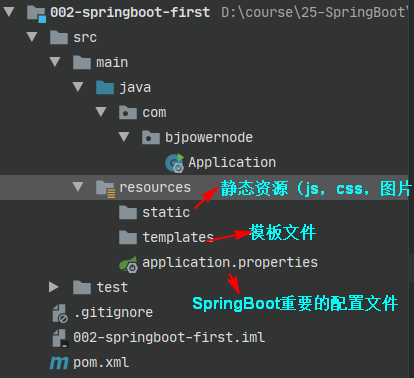

# 第一章  JavaConfig

1. 为什么要使用 Spring Boot

   因为Spring， SpringMVC 需要使用的大量的配置文件 （xml文件）

   还需要配置各种对象，把使用的对象放入到spring容器中才能使用对象

   需要了解其他框架配置规则。

2. SpringBoot 就相当于不需要配置文件的Spring+SpringMVC。 常用的框架和第三方库都已经配置好了，拿来就可以使用了。

3. SpringBoot开发效率高，使用方便多了


## 1.1 JavaConfig

JavaConfig: 使用java类作为xml配置文件的替代， 是配置spring容器的纯java的方式。 在这个java类这可以创建java对象，把对象放入spring容器中（注入到容器）。

使用两个注解：

1）@Configuration ： 放在一个类的上面，表示这个类是作为配置文件使用的。

2）@Bean：声明对象，把对象注入到容器中。

```java
例子：
package com.bjpowernode.config;

import com.bjpowernode.vo.Student;
import org.springframework.context.annotation.Bean;
import org.springframework.context.annotation.Configuration;

/**
 * Configuration:表示当前类是作为配置文件使用的。 就是用来配置容器的
 *       位置：在类的上面
 *
 *  SpringConfig这个类就相当于beans.xml
 */
@Configuration
public class SpringConfig {
    /**
     * 创建方法，方法的返回值是对象。 在方法的上面加入@Bean
     * 方法的返回值对象就注入到容器中。
     *
     * @Bean: 把对象注入到spring容器中。 作用相当于<bean>
     *
     *     位置：方法的上面
     *     说明：@Bean,如果不指定对象的名称，默认是方法名是 id
     *
     */
    @Bean
    public Student createStudent(){
        Student s1  = new Student();
        s1.setName("张三");
        s1.setAge(26);
        s1.setSex("男");
        return s1;
    }
    /***
     * 如果指定对象在容器中的名称（指定<bean>的id属性）
     * @Bean的name属性，指定对象的名称（id）
     */
    @Bean(name = "lisiStudent")
    public Student makeStudent(){
        Student s2  = new Student();
        s2.setName("李四");
        s2.setAge(22);
        s2.setSex("男");
        return s2;
    }
}

```

使用：

```java
//没有 xml 配置文件，使用 java 类代替 xml 配置文件 的作用 
ApplicationContext ctx = new  AnnotationConfigApplicationContext(SpringConfig.class);
```

## 1.2 @ImporResource

@ImportResource 作用导入其他的  **xml配置文件**， 等于 在xml 

```xml
<import resources="其他配置文件"/>
```

导入将项目中已存的xml配置文件，可以导入多个xml文件。

例如：

```java
@Configuration
@ImportResource(value ={ "classpath:applicationContext.xml","classpath:beans.xml"})
public class SpringConfig {
}
```


## 1.3 @PropertyResource

@PropertyResource: 读取properties属性配置文件。使用属性配置文件可以实现外部化配置 ，

在程序代码之外提供数据。常用于数据库配置信息。

步骤：

1. 在resources目录下，创建properties文件， 使用k=v的格式提供数据
2. 在PropertyResource 指定properties文件的位置
3. 使用@Value（value="${key}"）：用于对象的属性赋值

```java
@Configuration
@ImportResource(value ={ "classpath:applicationContext.xml","classpath:beans.xml"})
// 指定属性配置文件所在的位置
@PropertySource(value = "classpath:config.properties")
// 组件扫描器，要指定有@Component注解的类所在的包名
@ComponentScan(basePackages = "com.bjpowernode.vo")
public class SpringConfig {
}
```

```java
@Component("tiger") //注解注入
public class Tiger {
    
    @Value("${tiger.name}") 
    private String name; 
    
    @Value("${tiger.age}") 
    private Integer age;
}
```


# 第二 章 Spring Boot

## 2.1 介绍

SpringBoot是Spring中的一个成员， 可以简化Spring，SpringMVC的使用。 他的核心还是IOC容器。

特点（来自官网）：

- Create stand-alone Spring applications

  创建spring应用

  

- Embed Tomcat, Jetty or Undertow directly (no need to deploy WAR files)

  **内嵌**的tomcat， jetty ， Undertow **服务器**

  

- Provide opinionated 'starter' dependencies to simplify your build configuration

  提供了starter**起步依赖**，简化应用的配置。   

  比如使用MyBatis框架 ，需要在Spring项目中，配置MyBatis的对象 SqlSessionFactory ，Dao的代理对象。

  在SpringBoot项目中，在pom.xml里面, 加入一个 mybatis-spring-boot-starter依赖即可

  

- Automatically configure Spring and 3rd party libraries whenever possible

  尽可能配置spring和第三方库。叫做**自动配置**（就是把spring中的第三方库中的核心对象都创建好，放到容器中， 开发人员可以直接使用）

  

- Provide production-ready features such as metrics, health checks, and externalized configuration

  提供了健康检查（检查项目是否正常运行）， 统计，外部化配置（peoperties）

  

- Absolutely no code generation and no requirement for XML configuration

  不用生成代码、不用使用xml做配置

## 2.2 创建Spring Boot项目

### 2.2.1 第一种方式， 使用Spring提供的初始化器， 就是向导创建SpringBoot应用


使用的地址： https://start.spring.io，spring的官方国外地址，容易出现连接失败/超时问题。


SpringBoot项目的结构：




### 2.2.2  使用国内的地址


使用的地址：https://start.springboot.io 国内镜像，相对稳定。

SpringBoot项目的结构：


### 2.2.3 使用 maven 向导创建项目

步骤：

1. 创建普通的maven项目

2. 在pom中增加springboot父模块

   ```xml
   <parent>
       <groupId>org.springframework.boot</groupId>
       <artifactId>spring-boot-starter-parent</artifactId>
       <version>2.6.4</version>
       <relativePath/> <!-- lookup parent from repository -->
     </parent>
   ```

3. 增加springboot依赖

   ```xml
   <dependencies>    
       <dependency>
           <groupId>org.springframework.boot</groupId>
           <artifactId>spring-boot-starter-web</artifactId>
       </dependency>
       <dependency>
           <groupId>org.springframework.boot</groupId>
           <artifactId>spring-boot-starter-test</artifactId>
           <scope>test</scope>
       </dependency>
   </dependencies>
   ```

4. 在resources中新建static和templates文件夹，新建application.properties


## 2.3  注解@SpringBootApplication的使用

```java
@SpringBootApplication
复合注解：由
@SpringBootConfiguration
@EnableAutoConfiguration
@ComponentScan
联合组成 
```

1. @SpringBootConfiguration

   ```java
   @Configuration
   public @interface SpringBootConfiguration {
       @AliasFor(
           annotation = Configuration.class
       )
       boolean proxyBeanMethods() default true;
   }
   ```

​		说明：使用了@SpringBootConfiguration注解标注的类，可以作为配置文件使用的。
​					所以Application类是一个配置类，可以使用Bean声明对象，注入到容器


2. @EnableAutoConfiguration

​		启用自动配置， 把java对象配置好，注入到spring容器中。例如可以把mybatis的对象创建好，放入到容器中。


3. @ComponentScan

```java
@ComponentScan 扫描器，找到注解，根据注解的功能创建对象，给属性赋值等等。
默认扫描的包： @ComponentScan所在的类所在的包及其子包。
所以Application类放置在主包下面更方便
```


## 2.4 SpringBoot的配置文件

配置文件名称： application

扩展名有： properties( k=v) ;  yml ( k: v)

可以使用application.properties 或者 application.yml


例1：application.properties设置 端口和上下文

```xml
#设置端口号
server.port=8082
#设置访问应用上下文路径， contextpath
server.servlet.context-path=/myboot
```


例2： application.yml，值与前面的冒号必须有一个空格（推荐使用）

```yaml
server:
  port: 8083
  servlet:
    context-path: /myboot2
```


## 2.5 多环境配置

有开发环境， 测试环境， 上线的环境。每个环境有不同的配置信息， 例如端口， 上下文件， 数据库url，用户名，密码等等


使用多环境配置文件，可以方便的切换不同的配置。

使用方式： 创建多个配置文件， 名称规则： application-环境名称.properties(yml)

例如：

创建开发环境的配置文件： application-dev.properties(  application-dev.yml )

创建测试者使用的配置： application-test.properties


如何确定项目此时使用哪一套环境配置？

- 在主配置文件application.yml中指定激活。

  ```properties
  spring.profiles.active=dev
  ```


## 2.6 @ConfigurationProperties

SpringBoot 的核心配置文件中，除了使用内置的配置项之外，还可以自定义配置，然后采用注解去读取配置的属性值。

1. @Value("${key}") ， key 来自 application.properties(yml)，要是用键的全名。从配置文件中获取数据。

2. @ConfigurationProperties: 把配置文件的数据映射为java对象，用于自定义配置项比较多的情况。

​        属性：prefix 配置文件中的某些key的开头的内容。

3. 为了确保在编译期间注释处理器运行时配置文件中我们附加元数据可用，应该添加以下依赖：

   ```xml
   <dependency>
       <groupId>org.springframework.boot</groupId>
       <artifactId>spring-boot-configuration-processor</artifactId>
       <optional>true</optional>
   </dependency>
   ```

   例子：


   ```java
@Component
@ConfigurationProperties(prefix = "school")
public class SchoolInfo {

    private String name;
    private String website;
    private String address;

    public String getName() {
        return name;
    }

    public void setName(String name) {
        this.name = name;
    }

    public String getWebsite() {
        return website;
    }

    public void setWebsite(String website) {
        this.website = website;
    }

    public String getAddress() {
        return address;
    }

    public void setAddress(String address) {
        this.address = address;
    }

    @Override
    public String toString() {
        return "SchoolInfo{" +
                "name='" + name + '\'' +
                ", website='" + website + '\'' +
                ", address='" + address + '\'' +
                '}';
    }
}
   ```

   application.properties

   ```properties
#配置端口号
server.port=8082
#context-path
server.servlet.context-path=/myboot

#自定义key=value
school.name=动力节点
school.website=www.bjpowernode.com
school.address=北京的大兴区

site=www.bjpowernode.com
   ```

​		

## 2.7  使用jsp

SpringBoot不推荐使用jsp ，而是使用模板技术代替jsp


使用jsp需要配置：

1） 加入一个处理jsp的依赖。 负责编译jsp文件

```xml
<dependency>
    <groupId>org.apache.tomcat.embed</groupId>
    <artifactId>tomcat-embed-jasper</artifactId>
</dependency>
```


2) 如果需要使用servlet， jsp，jstl的功能

```xml
<dependency>
	<groupId>javax.servlet</groupId>
	<artifactId>jstl</artifactId>
</dependency>

<dependency>
	<groupId>javax.servlet</groupId>
	<artifactId>javax.servlet-api</artifactId>
</dependency>

<dependency>
<groupId>javax.servlet.jsp</groupId>
	<artifactId>javax.servlet.jsp-api</artifactId>
	<version>2.3.1</version>
</dependency>

```


3) 创建一个存放jsp的目录，一般叫做webapp

​    index.jsp


4) 需要在pom.xml指定jsp文件编译后的存放目录。

  	META-INF/resources


5）创建Controller， 访问jsp


6）在application.propertis文件中配置视图解析器

spring.mvc.view.prefix = / (/表示src/main/webapp)


## 2.8 使用容器

你想通过代码，从容器中获取对象。SpringApplication.run(Application.class, args)的返回值就是容器对象。

通过SpringApplication.run(Application.class, args); 返回值获取容器。

```java
// 方法原型
public static ConfigurableApplicationContext run(Class<?> primarySource, String... args) {
        return run(new Class[]{primarySource}, args);
}

// ConfigurableApplicationContext : 接口，是ApplicationContext的子接口
public interface ConfigurableApplicationContext extends ApplicationContext
```


## 2.9 ComnandLineRunner 接口, ApplcationRunner接口

在某些开发场景下，需要在容器启动后执行一些内容，比如读取配置文件，数据库连接之类的。

如何实现呢？

- SpringBoot中提供了两个接口，ComnandLineRunner 接口 和 ApplcationRunner接口，这两个接口都有一个run方法，在主类中实现其中一个中的run()方法即可。
- 在容器对象创建好后， 自动执行run（）方法。

可以完成自定义的在容器对象创建好的一些操作。

```java
@FunctionalInterface
public interface CommandLineRunner {
    void run(String... args) throws Exception;
}

@FunctionalInterface
public interface ApplicationRunner {
    void run(ApplicationArguments args) throws Exception;
}

```

# 第三章 Web组件

讲三个内容： 拦截器， Servlet ，Filter

## 3.1 拦截器

拦截器是SpringMVC中一种对象，能拦截器对Controller的请求。

拦截器框架中有系统的拦截器， 还可以自定义拦截器。  实现对请求预先处理。


SpringMVC中实现自定义拦截器：

1. 创建类实现SpringMVC框架的HandlerInterceptor接口

   ```java
   public interface HandlerInterceptor {
        default boolean preHandle(HttpServletRequest request, HttpServletResponse response, Object handler) throws Exception {
            return true;
        }
   
        default void postHandle(HttpServletRequest request, HttpServletResponse response, Object handler, @Nullable ModelAndView modelAndView) throws Exception {
        }
   
        default void afterCompletion(HttpServletRequest request, HttpServletResponse response, Object handler, @Nullable Exception ex) throws Exception {
        }
   }
   ```


2. 需在SpringMVC的配置文件中，注册拦截器

   ```xml
   <mvc:interceptors>
   	<mvc:interceptor>
       	<mvc:path="url" />
           <bean class="拦截器类全限定名称"/>
       </mvc:interceptor>
   </mvc:interceptors>
   ```

   

SpringBoot中注册拦截器：

```java
@Configuration
public class MyAppConfig implements WebMvcConfigurer {

    //添加拦截器对象， 注入到容器中
    @Override
    public void addInterceptors(InterceptorRegistry registry) {

        //创建拦截器对象
        HandlerInterceptor interceptor = new LoginInterceptor();

        //指定拦截的请求uri地址
        String path []= {"/user/**"};
        //指定不拦截的地址，不会经过拦截器验证
        String excludePath  [] = {"/user/login"};
        registry.addInterceptor(interceptor)
                .addPathPatterns(path)
                .excludePathPatterns(excludePath);

    }
}
```

WebMvcConfigurer：许多与SpringMVC有关的功能，之前在SpringMVC配置文件中实现的功能现在都用这个接口中的方法实现。


## 3.2  Servlet

在SpringBoot框架中使用Servlet对象。

使用步骤：

1. 创建Servlet类。 创建类继承HttpServlet
2. 注册Servlet ，让框架能找到Servlet。用ServletRegistrationBean注册Servlet


 例子：

1. 创建自定义Servlet

```java
//创建Servlet类
public class MyServlet extends HttpServlet {
    @Override
    protected void doGet(HttpServletRequest req, HttpServletResponse resp) throws ServletException, IOException {
        doPost(req,resp);
    }

    @Override
    protected void doPost(HttpServletRequest req, HttpServletResponse resp) throws ServletException, IOException {
       //使用HttpServletResponse输出数据，应答结果
        resp.setContentType("text/html;charset=utf-8");
        PrintWriter out  = resp.getWriter();
        out.println("===执行的是Servlet==");
        out.flush();
        out.close();

    }
}
```


2.  注册Servlet

```java
@Configuration
public class WebApplictionConfig {

    //定义方法， 注册Servlet对象
    @Bean
    public ServletRegistrationBean servletRegistrationBean(){

        //public ServletRegistrationBean(T servlet, String... urlMappings)
        //第一个参数是 Servlet对象， 第二个是url地址

        //ServletRegistrationBean bean =
                //new ServletRegistrationBean( new MyServlet(),"/myservlet");

        ServletRegistrationBean bean = new ServletRegistrationBean();
        bean.setServlet( new MyServlet());
        bean.addUrlMappings("/login","/test"); // <url-pattern>

        return bean;
    }
}
```


## 3.3 过滤器Filter

Filter是Servlet规范中的过滤器，是实现了javax.servlet.Filter接口的服务器端程序，**过滤器是在请求进入容器后，但请求进入servlet之前进行预处理的；请求结束返回响应也是，是在servlet处理完后，返回给前端之前。**可以处理请求， 对请求的参数， 属性进行调整。主要的用途是过滤字符编码、做一些业务逻辑判断等。

1. 在框架中使用过滤器：
   1. 创建自定义过滤器类
   2. 注册Filter过滤器对象，使用ServletRegistrationBean对象


例子：

```java
// 自定义过滤器
public class MyFilter implements Filter {
    @Override
    public void doFilter(ServletRequest servletRequest, ServletResponse servletResponse, FilterChain filterChain) throws IOException, ServletException {
        System.out.println("执行了MyFilter，doFilter ");
        filterChain.doFilter(servletRequest,servletResponse);
    }
}
```


注册Filter

```java
@Configuration
public class WebApplicationConfig {

    @Bean
    public FilterRegistrationBean filterRegistrationBean(){
        FilterRegistrationBean bean  = new FilterRegistrationBean();
        bean.setFilter( new MyFilter());
        bean.addUrlPatterns("/user/*");
        return bean;
    }
}
```


## 3.4 字符集过滤器

CharacterEncodingFilter : 解决post请求中乱码的问题。

在SpringMVC框架， 在web.xml 注册过滤器，配置他的属性。 


在SpringBoot中使用字符集过滤器：

#### 第一种方式

使用步骤：

1. 配置字符集过滤器

   ```java
   @Configuration
   public class WebSystemConfig {
   
       //注册Servlet
       @Bean
       public ServletRegistrationBean servletRegistrationBean(){
           MyServlet myServlet = new MyServlet();
           ServletRegistrationBean reg = new ServletRegistrationBean(myServlet,"/myservlet");
           return reg;
       }
   
   
       //注册Filter
       @Bean
       public FilterRegistrationBean filterRegistrationBean(){
           
           FilterRegistrationBean reg = new FilterRegistrationBean();
   
           //使用框架中的过滤器类
           // 创建自定义编码格式的过滤器
           CharacterEncodingFilter filter  = new CharacterEncodingFilter();
           //指定使用的编码方式
           filter.setEncoding("utf-8");
           //指定request ， response都使用encoding的值
           filter.setForceEncoding(true);
   
           reg.setFilter(filter);
           //指定 过滤的url地址
           reg.addUrlPatterns("/*");
   
           return reg;
       }
   }
   ```

2. 修改application.properties文件， 让自定义的过滤器起作用。

   ```properties
   #SpringBoot中默认已经配置了CharacterEncodingFilter。 编码默认ISO-8859-1
   #设置enabled=false 作用是关闭系统中配置好的过滤器，使用自定义的CharacterEncodingFilter
   server.servlet.encoding.enabled=false
   ```

   

#### 第二种方式

修改application.properties文件

```properties
server.port=9001
server.servlet.context-path=/myboot

#让系统的CharacterEncdoingFilter生效
server.servlet.encoding.enabled=true
#指定使用的编码方式
server.servlet.encoding.charset=utf-8
#强制request，response都使用charset属性的值
server.servlet.encoding.force=true
```


## 3.5 拦截器，过滤器，监听器


博客地址：https://blog.csdn.net/yudiandemingzi/article/details/80399971


# 第四章 ORM 操作 MySQL


使用MyBatis框架操作数据，  在SpringBoot框架集成MyBatis

使用步骤：

1. mybatis起步依赖 ： 完成mybatis对象自动配置， 对象放在容器中

2. pom.xml 指定把src/main/java目录中的xml文件包含到classpath中

3. 创建实体类Student

4. 创建Dao接口 StudentDao , 创建一个查询学生的方法 

5. 创建Dao接口对应的Mapper文件， xml文件， 写sql语句

6. 创建Service层对象， 创建StudentService接口和他的实现类。 去dao对象的方法。完成数据库的操作

7. 创建Controller对象，访问Service。

8. 写application.properties文件，配置数据库的连接信息。

   ```properties
   spring.datasource.driver-class-name=com.mysql.cj.jdbc.Driver
   spring.datasource.url=jdbc:mysql://localhost:3306/springdb?useUnicode=true&characterEncoding=UTF-8&serverTimezone=GMT%2B8
   spring.datasource.username=root
   spring.datasource.password=root
   ```


### 第一种方式 ： @Mapper

@Mapper：放在dao接口的上面， 每个接口都需要使用这个注解。告诉mybatis框架这个接口是访问数据库的，需要一个代理对象访问数据库。 

```java
/**
 * @Mapper：告诉MyBatis这是dao接口，创建此接口的代理对象。
 *     位置：在类的上面
 */
@Mapper
public interface StudentDao {

    Student selectById(@Param("stuId") Integer id);
}
```


### 第二种方式  @MapperScan


```java
/**
 * @MapperScan: 找到Dao接口和Mapper文件
 *     basePackages：Dao接口所在的包名
 */
@SpringBootApplication
@MapperScan(basePackages = {"com.bjpowernode.dao","com.bjpowernode.mapper"})
public class Application {
}
```


### 第三种方式： Mapper文件和Dao接口分开管理


 现在把Mapper文件放在resources目录下

1）在resources目录中创建子目录 （自定义的） ， 例如mapper

2）把mapper文件放到 mapper目录中

3）在application.properties文件中，指定mapper文件的目录

```properties
#指定mapper文件的位置
mybatis.mapper-locations=classpath:mapper/*.xml
#指定mybatis的日志
mybatis.configuration.log-impl=org.apache.ibatis.logging.stdout.StdOutImpl
```

4) 在pom.xml中指定 把resources目录中的文件 ， 编译到目标目录中

```xml
<!--resources插件，新版已经没有这个bug了--> 
<resources>
   <resource>
      <directory>src/main/resources</directory>
      <includes>
         <include>**/*.*</include>
      </includes>
   </resource>
</resources> 
```

 

### 事务

#### Spring框架中的事务：

1） 管理事务的对象： 事务管理器（接口， 接口有很多的实现类）

​      例如：使用Jdbc或mybatis访问数据库，使用的事务管理器：DataSourceTransactionManager

2 ) 声明式事务：  在xml配置文件或者使用注解说明事务控制的内容

​      控制事务： 隔离级别，传播行为， 超时时间

3）事务处理方式：

​      1） Spring框架中的@Transactional

​      2)    aspectj框架可以在xml配置文件中，声明事务控制的内容


#### SpringBoot中使用事务： 上面的两种方式都可以。

1）在业务方法的上面加入@Transactional ,  加入注解后，方法有事务功能了。

2）明确的在主启动类的上面 ，加入@EnableTransactionManager

例子：

```java
/**
 * @Transactional: 表示方法的有事务支持
 *       默认：使用库的隔离级别， REQUIRED 传播行为； 超时时间  -1
 *       抛出运行时异常，回滚事务
 */
@Transactional
@Override
public int addStudent(Student student) {
    System.out.println("业务方法addStudent");
    int rows  =  studentDao.insert(student);
    System.out.println("执行sql语句");

    //抛出一个运行时异常， 目的是回滚事务
    //int m   = 10 / 0 ;

    return rows;
}
```

Application主类上面添加@EnableTransactionManagement

```java
@SpringBootApplication
@EnableTransactionManagement
@MapperScan(basePackages = "com.ganjing.mapper")
public class Springboot06OrmApplication {

    public static void main(String[] args) {
        SpringApplication.run(Springboot06OrmApplication.class, args);
    }

}
```


# 第五章 接口架构风格 —RESTful


接口： API（Application Programming Interface，应用程序接口）是一些预先定义的接口（如函数、HTTP接口），或指[软件系统](https://baike.baidu.com/item/软件系统/224122)不同组成部分衔接的约定。 用来提供[应用程序](https://baike.baidu.com/item/应用程序)与开发人员基于某[软件](https://baike.baidu.com/item/软件)或硬件得以访问的一组[例程](https://baike.baidu.com/item/例程/2390628)，而又无需访问源码，或理解内部[工作机制](https://baike.baidu.com/item/工作机制/9905789)的细节。 

接口（API）： 可以指访问servlet， controller的url，   调用其他程序的函数；并不是指java语言中的interface接口。


架构风格： api组织方式（样子）

就是一个传统的：    http://localhost:9002/mytrans/addStudent?name=lisi&age=26 

​                                  在地址上提供了 访问的资源名称addStudent, 在其后使用了get方式传递参数。

### 5.1  REST

RESTful架构风格

1)REST :  （英文： Representational State Transfer , 中文： 表现层状态转移)。

   REST：是一种接口的架构风格和设计的理念，不是标准。

   优点： 更简洁明了，更有层次


   **表现层状态转移:** 

​         表现层就是视图层， 显示资源的， 通过视图页面，jsp等等显示操作资源的结果。 

​         状态： 资源变化

​         转移： 资源可以变化的。 资源能创建，new状态，  资源创建后可以查询资源， 能看到资源的内容，

​                     这个资源内容 ，可以被修改， 修改后资源 和之前的不一样。   


2）REST中的要素： 用REST表示资源  和  对资源的操作。  

- 在互联网中，什么表示一个资源或者一个操作。 
  - 资源使用url表示的， 在互联网， 使用的图片，视频， 文本，网页等等都是资源。资源是用名词表示。
  - 在url中，使用名词表示资源， 以及访问资源的信息,  在url中，使用“ / " 分隔对资源的信息 

```url
   http://localhost:8080/myboot/student/1001
```


-   对资源的操作： 


​        查询资源： 看，通过url找到资源。 

​        创建资源： 添加资源

​        更新资源：更新资源 ，编辑

​        删除资源： 去除

​     

 使用http中的动作（请求方式）， 表示对资源的操作（CURD）

1. GET:  查询资源  --  sql select

​                 处理单个资源： 用他的单数方式

​                  http://localhost:8080/myboot/student/1001

​                 http://localhost:8080/myboot/student/1001/1

​                处理多个资源：使用复数形式

​                  http://localhost:8080/myboot/students/1001/1002

​                

2.  POST: 创建资源  -- sql insert

​                http://localhost:8080/myboot/student

​                在post请求中传递数据

```html
<form action="http://localhost:8080/myboot/student" method="post">
	姓名：<input type="text" name="name" />
    年龄：<input type="text" name="age" />
  </form>
```

3. PUT： 更新资源  --  sql  update

   ```html
   <form action="http://localhost:8080/myboot/student/1" method="post">
   	姓名：<input type="text" name="name" />
       年龄：<input type="text" name="age" />
            <input type="hidden" name="_method" value="PUT" />
     </form>
   ```

4. DELETE: 删除资源  -- sql delete


   ```html
<a href="http://localhost:8080/myboot/student/1">删除1的数据</a>
   ```


 需要的分页，  排序等参数，依然放在  url的后面， 例如 

 http://localhost:8080/myboot/students?page=1&pageSize=20

  

3） 一句话说明REST： 

​    **使用url表示资源 ，使用http动作操作资源。**


4） 注解

  @PathVariable :  从url中获取数据，放在控制器方法的形参前面 (对应springMVC中学习过的@RequestParam)

  @GetMapping:    支持的get请求方式，  等同于 @RequestMapping( method=RequestMethod.GET)

  @PostMapping:  支持post请求方式 ，等同于 @RequestMapping( method=RequestMethod.POST)

  @PutMapping:  支持put请求方式，  等同于 @RequestMapping( method=RequestMethod.PUT)

  @DeleteMapping: 支持delete请求方式，  等同于 @RequestMapping( method=RequestMethod.DELETE)

  

  @RestController:  符合注解， 是@Controller 和@ResponseBody组合。

​     在类的上面使用@RestController ， 表示当前类者的所有方法都加入了 @ResponseBody


5） Postman : 测试工具

使用Postman : 可以测试 get ，post ， put ，delete 等请求

在idea中，tools-->Http Client --> Create request in Http Client 也可以使用相同的功能


### 5.2  在页面中或者ajax中，支持put，delete请求

在SpringMVC中 有一个过滤器， 支持post请求转为put ,delete


过滤器： org.springframework.web.filter.HiddenHttpMethodFilter

作用： 把请求中的post请求转为 put ， delete


SpringBoot中的实现步骤：

1. application.properties(yml) : 开启使用 HiddenHttpMethodFilter 过滤器

   ```properties
   spring.mvc.hiddenmethod.filter.enable=true
   ```

2. 在请求页面中，包含 _method参数， 他的值是 put， delete  ，  发起这个请求使用的post方式


# 第六章 Redis

Redis ： 一个NoSQL数据库，  常用作 缓存使用 （cache）

Redis的数据类型： string  ,  hash  ,set  ,zset , list


Redis是一个中间件： 是一个独立的服务器。

java中著名的客户端： Jedis ，  lettuce ， Redisson


Spring，SpringBoot中有 一个**RedisTemplate**（StringRedisTemplate） ，处理和redis交互  


## 6.1  配置Windows版本的redis

Redis-x64-3.2.100.rar 解压缩到一个 非中文 的目录

redis-server.exe：服务端， 启动后，不要关闭

redis-cli.exe：客户端， 访问redis中的数据


redisclient-win32.x86_64.2.0.jar : Redis图形界面客户端

执行方式： 在这个文件所在的目录，  执行 java -jar redisclient-win32.x86_64.2.0.jar


SpringBoot中RedisTemplate 使用的  lettuce 客户端库

```xml
<!--redis起步依赖： 直接在项目中使用RedisTemplate(StringRedisTemplate)-->
<dependency>
   <groupId>org.springframework.boot</groupId>
   <artifactId>spring-boot-starter-data-redis</artifactId>
</dependency>

data-redis使用的   lettuce 客户端库

在程序中使用RedisTemplate类的方法 操作redis数据， 实际就是调用的lettuce 客户端的中的方法
```

Application.xml

```properties
spring.redis.host=localhost
spring.redis.port=6379
```

测试Controller：

```java
@RestController 
public class MyController {

    @Resource
    private RedisTemplate redisTemplate;

    @PostMapping("/student/{name}/{age}")
    public String addStudent(@PathVariable("name") String name,
                               @PathVariable("age") String age){

        redisTemplate.setKeySerializer(new StringRedisSerializer());
        redisTemplate.setValueSerializer(new StringRedisSerializer());

        redisTemplate.opsForValue().set(name, age);
        return "添加了学生" + name;
    }

    @GetMapping("/student/{name}")
    public String queryStudent(@PathVariable("name") String name){

        redisTemplate.setKeySerializer(new StringRedisSerializer());
        redisTemplate.setValueSerializer(new StringRedisSerializer());
        
        String get_name = (String) redisTemplate.opsForValue().get(name);
        return name + "的值是：" + get_name;
    }
```


## 6.2 对比 StringRedisTemplate 和 RedisTemplate 

StringRedisTemplate ： 把k，v 都是作为String处理， 使用的是String的序列化 ， 可读性好  

RedisTemplate ： 把k，v 经过了序列化存到redis。 k，v 是序列化的内容， 不能直接识别.

​                                 默认使用的jdk序列化， 可以修改为其他的序列化


序列化：把对象转化为可传输的字节序列过程称为序列化。

反序列化：把字节序列还原为对象的过程称为反序列化。


为什么需要序列化

序列化最终的目的是为了对象可以**跨平台存储**，和进行**网络传输**。而我们进行跨平台存储和网络传输的方式就是IO，而我们的IO支持的数据格式就是字节数组。我们必须在把对象转成字节数组的时候就制定一种规则（序列化），那么我们从IO流里面读出数据的时候再以这种规则把对象还原回来（反序列化）。


什么情况下需要序列化

通过上面我想你已经知道了凡是需要进行“跨平台存储”和”网络传输”的数据，都需要进行序列化。

本质上存储和网络传输 都需要经过 把一个对象状态保存成一种跨平台识别的字节格式，然后其他的平台才可以通过字节信息解析还原对象信息。


序列化的方式

序列化只是一种拆装组装对象的规则，那么这种规则肯定也可能有多种多样，比如现在常见的序列化方式有：

JDK（不支持跨语言、性能较低）、JSON、XML、Hessian、Kryo（不支持跨语言，性能较高）、Thrift、Protofbuff等

例如：

java的序列化： 把java对象转为byte[], 二进制数据

json序列化：json序列化功能将对象转换为 JSON 格式或从 JSON 格式转换对象。例如把一个Student对象转换为JSON字符串{"name":"李四", "age":29} )，反序列化(将JSON字符串 {"name":"李四", "age":29} 转换为Student对象)


设置key或者value的序列化方式

```java
// 使用RedisTemplate ，在存取值之前，设置序列化
// 设置 key 使用String的序列化
redisTemplate.setKeySerializer( new StringRedisSerializer());

// 设置 value 的序列化
redisTemplate.setValueSerializer( new StringRedisSerializer());

redisTemplate.opsForValue().set(k,v);
```

Json序列化

```java
	@GetMapping("/student/json")
    public String studentJson(){

        Student student = new Student();
        student.setId(1001);
        student.setName("zhangsan");

        redisTemplate.setKeySerializer(new StringRedisSerializer());
        redisTemplate.setValueSerializer(new Jackson2JsonRedisSerializer(Student.class));

        redisTemplate.opsForValue().set("mystudent", student);

        return "student json 序列化";
    }

    @GetMapping("/student/reJson")
    public String reStudentJson(){

        redisTemplate.setKeySerializer(new StringRedisSerializer());
        redisTemplate.setValueSerializer(new Jackson2JsonRedisSerializer(Student.class));

        Student student = (Student) redisTemplate.opsForValue().get("mystudent");

        return "mystudent" + student.toString();
    }
```


# 第七章 SpringBoot集成Dubbo

## 7.0 什么是Dubbo

### 7.0.1 分布式系统

**分布式系统：**多个能独立运行的计算机（称为结点）组成。各个结点利用计算机网络进行信息传递，从而实现共同的“目标或者任务”。

### 7.0.2 RPC

RPC指**远程过程调用**，是一种进程间通信方式，这是一种技术思想，而不是规范。

比如说，我们有应用A和应用B，分别部署在不同的服务器上，而应用A想要调用应用B中的某个方法，由于不再一个内存空间，不能直接调用，需要通过网络来表达调用的语义和传递调用的数据。


A服务器与B服务器之间架起连接，建立 通信。

RPC的两个核心模块：通讯和序列化


### 7.0.3 Dubbo

1. 特点

   1. 面向接口代理的高性能RPC调用
   2. 智能负载均衡
   3. 服务自动注册与发现
   4. 高度可扩展能力
   5. 运行期流量调度
   6. 可视化的服务治理与运维

2. 设计架构

   

注册中心：推荐使用Zookeeper

监控中心：开发过程中用不到……可以在监控中心看到服务提供者，服务消费者的各种信息。

### 7.0.4 Dubbo官方推荐使用的项目结构

提供高性能的基于代理的远程调用能力，服务以接口为粒度，为开发者**屏蔽远程调用底层细节**。

​		增加一个公用的接口工程。

```
----1 服务提供者工程
         ***实现接口工程中的业务接口
         web工程
----2 服务消费者工程
		 ***消费服务提供者提供的业务接口
		 web工程
----3 接口工程
         ***定义业务接口和实体类
         java工程
         自己定义的实体类需要实现序列化
```

### 7.0.5 版本号

每个接口都应该定义版本号，为后续不兼容升级提供可能。当一个接口有不同的实现，项目早期使用的一个实现类，之后创建接口的新的实现类，不同的实现类用版本号（version）区分。


## 7.1  看 SpringBoot继承Dubbo的文档


 https://github.com/apache/dubbo-spring-boot-project/blob/master/README_CN.md


## 7.2  公共项目

独立的maven项目： 定义了接口和数据类

```java
public class Student implements Serializable {
    private static final long serialVersionUID = 1901229007746699151L;

    private Integer id;
    private String name;
    private Integer age;
}

public interface StudentService {

    Student queryStudent(Integer id);
}

```


## 7.3  提供者

创建SpringBoot项目

1） pom.xml

```xml
<dependencies>

   <!--加入公共项目的gav-->
   <dependency>
      <groupId>com.bjpowernode</groupId>
      <artifactId>022-interface-api</artifactId>
      <version>1.0.0</version>
   </dependency>

   <!--dubbo依赖-->
   <dependency>
      <groupId>org.apache.dubbo</groupId>
      <artifactId>dubbo-spring-boot-starter</artifactId>
      <version>2.7.8</version>
   </dependency>


   <!--zookeeper依赖-->
   <dependency>
      <groupId>org.apache.dubbo</groupId>
      <artifactId>dubbo-dependencies-zookeeper</artifactId>
      <version>2.7.8</version>
      <type>pom</type>
      <exclusions>
         <!-- 排除log4j依赖 -->
         <exclusion>
            <artifactId>slf4j-log4j12</artifactId>
            <groupId>org.slf4j</groupId>
         </exclusion>
      </exclusions>
   </dependency>
</dependencies>
```


2）实现接口

```java
/**
 * 使用dubbo中的注解暴露服务
 * @Component 可以不用加
 */
@DubboService(interfaceClass = StudentService.class,version = "1.0",timeout = 5000)
public class StudentServiceImpl implements StudentService {
    @Override
    public Student queryStudent(Integer id) {
        Student student  = new Student();
        if( 1001 == id){
            student.setId(1001);
            student.setName("------1001-张三");
            student.setAge(20);
        } else if(1002  == id){
            student.setId(1002);
            student.setName("#######1002-李四");
            student.setAge(22);
        }

        return student;
    }
}
```


3）application.properties

```properties
#配置服务名称 dubbo:application name="名称"
spring.application.name=studentservice-provider

#配置扫描的包， 扫描的@DubboService
dubbo.scan.base-packages=com.bjpowernode.service

#配置dubbo协议
#dubbo.protocol.name=dubbo
#dubbo.protocol.port=20881

#注册中心
dubbo.registry.address=zookeeper://localhost:2181
```


4)在启动类的上面

```java
@SpringBootApplication
@EnableDubbo
public class ProviderApplication {

   public static void main(String[] args) {
      SpringApplication.run(ProviderApplication.class, args);
   }
}
```


## 7.4消费者

创建SpringBoot项目

1） pom.xml

```xml
<dependencies>

   <!--加入公共项目的gav-->
   <dependency>
      <groupId>com.bjpowernode</groupId>
      <artifactId>022-interface-api</artifactId>
      <version>1.0.0</version>
   </dependency>

   <!--dubbo依赖-->
   <dependency>
      <groupId>org.apache.dubbo</groupId>
      <artifactId>dubbo-spring-boot-starter</artifactId>
      <version>2.7.8</version>
   </dependency>


   <!--zookeeper依赖-->
   <dependency>
      <groupId>org.apache.dubbo</groupId>
      <artifactId>dubbo-dependencies-zookeeper</artifactId>
      <version>2.7.8</version>
      <type>pom</type>
      <exclusions>
         <!-- 排除log4j依赖 -->
         <exclusion>
            <artifactId>slf4j-log4j12</artifactId>
            <groupId>org.slf4j</groupId>
         </exclusion>
      </exclusions>
   </dependency>
</dependencies>
```

2)  创建了Controller 或者 Service都可以

```java
@RestController
public class DubboController {

    /**
     * 引用远程服务， 把创建好的代理对象，注入给studentService
     */
    //@DubboReference(interfaceClass = StudentService.class,version = "1.0")

    /**
     * 没有使用interfaceClass，默认的就是 引用类型的 数据类型
      */
    @DubboReference(version = "1.0")
    private StudentService studentService;

    @GetMapping("/query")
    public String queryStudent(Integer id){
        Student student   = studentService.queryStudent(id);
        return "调用远程接口，获取对象："+student;
    }
}
```


3）application.properties

```properties
#指定服务名称
spring.application.name=consumer-application
#指定注册中心
dubbo.registry.address=zookeeper://localhost:2181
```


## 7.5 练习

使用的技术： SpringBoot ,Dubbo, Redis, MyBatis

Student表：

```mysql
CREATE TABLE `student` (
  `id` int(11) NOT NULL AUTO_INCREMENT,
  `name` varchar(255) COLLATE utf8_bin DEFAULT NULL,
  `phone` varchar(11) COLLATE utf8_bin DEFAULT NULL,
  `age` int(11) DEFAULT NULL,
  PRIMARY KEY (`id`)
) ENGINE=InnoDB AUTO_INCREMENT=6 DEFAULT CHARSET=utf8 COLLATE=utf8_bin;
```

1) 注册学生

​     phone必须唯一， 如果已经存在了手机号， 注册失败。 

​                 int addStudent(Student student);

​                返回值：int

​                 1： 注册成功

​                 2 ： 手机号已经存在                          

  name至少两个字符，

  age 必须 大于 0 


2. 查询学生，根据id查询，此学生。 

​        先到redis查询学生， 如果redis没有此学生，从数据库查询， 把查询到的学生放入到redis。后面再次查询这个学生应该从redis就能获取到。

​        Student  queryStudent(Integer id);


3) 使用Dubbo框架,addStudent, queryStudent 是有服务提供者实现的。

​    消费者可以是一个Controller，调用提供者的两个方法。  实现注册和查询。


4. 页面使用html和ajax，jquery。 在html页面中提供 form 注册学生， 提供文本框输入id，进行查询。

​      注册和查询都使用ajax技术。html，jquery.js都放到resources/static目录中

服务提供者：

持久层接口：

```java
public interface UserMapper {

    User findByPhone(@Param("phone") String phone);

    int addUser(User user);

    User queryUser(int id);
}
```

mapper.xml

- 如果配置文件与接口在同一目录下，则需要再pom中设置resources

- 如果配置文件在resources.mapper文件夹下，需要在主配置文件中设置

  mybatis.mapper-locations=classpath:mapper/*.xml

```xml
<?xml version="1.0" encoding="UTF-8" ?>
<!DOCTYPE mapper
        PUBLIC "-//mybatis.org//DTD Mapper 3.0//EN"
        "http://mybatis.org/dtd/mybatis-3-mapper.dtd">
<mapper namespace="com.ganjing.mapper.UserMapper">

    <select id="findByPhone" resultType="com.ganjing.pojo.User">
        select * from springdb.user where phone=#{phone}
    </select>

    <insert id="addUser" parameterType="com.ganjing.pojo.User">
        insert into springdb.user(name, phone, age) values(#{name}, #{phone}, #{age})
    </insert>

    <select id="queryUser" parameterType="int" resultType="com.ganjing.pojo.User">
        select * from springdb.user where id = #{id}
    </select>
</mapper>
```

服务实现类：

```java
@DubboService(interfaceClass = UserService.class, version = "1.0", timeout = 50000)
public class UserServiceImpl implements UserService {

    @Resource
    private UserMapper userMapper;
    @Resource
    private RedisTemplate redisTemplate;
    
    /**
     * @param user
     * @return 1 添加从成功
     *         2 手机号已经存在
     *         3 手机号为null
     */
    @Override
    public int addUser(User user) {

        int result = 0;
        if(user.getPhone() != null) {
            User userFind = userMapper.findByPhone(user.getPhone());
            if(userFind != null){
                result = 2;
            }else{
                result = userMapper.addUser(user);
            }
        }else{
            result = 3;
        }
        return result;
    }

    @Override
    public User queryUser(Integer id) {
        User user = null;

        redisTemplate.setKeySerializer(new StringRedisSerializer());
        redisTemplate.setValueSerializer(new Jackson2JsonRedisSerializer<User>(User.class));
        String pre = "STUID:";
        if(id != null){
            String key = pre + id;
            user = (User) redisTemplate.opsForValue().get(key);
            if(user == null){
                user = userMapper.queryUser(id);
                if(user != null) {
                    System.out.println("从数据库查询...存入redis...");
                    redisTemplate.opsForValue().set(key, user);
                }
            }else{
                System.out.println("从redis查询......");
            }
        }else{
            return null;
        }
        return user;
    }
}
```

主类：

```java
@SpringBootApplication
@EnableDubbo
@MapperScan(basePackages = "com.ganjing.Mapper")
public class RedisDubboProviderApplication {
    public static void main(String[] args) {
        SpringApplication.run(RedisDubboProviderApplication.class, args);
    }
}
```

服务消费者：

Controller

```java
@RestController
public class MyUserController {

    @DubboReference(interfaceClass = UserService.class, version = "1.0", check = false)
    private UserService userService;

    @PostMapping("/user/addUser")
    public String addUser(User user){

        String msg = "";
        int res = userService.addUser(user);
        if(res == 1){
            msg = "用户"+ user.getName()+"添加成功!";
        }
        else if(res == 2){
            msg = "手机号已存在，请仔细检查手机号";
        }else{
            msg = "手机号为空！";
        }
        return msg;
    }

    @GetMapping("/user/getUser")
    public String addUser(Integer id){

        String msg = "用户不存在";
        User user = userService.queryUser(id);
        if(user != null){
            msg = "查询的用户信息为：";
            return msg + user.toString();
        }

        return msg;
    }
}
```

主类：

```java
@SpringBootApplication
@EnableDubbo
public class RedisDubboConsumerApplication {
    public static void main(String[] args) {
        SpringApplication.run(RedisDubboConsumerApplication.class, args);
    }

}
```

注意：

- mapper配置文件的namspace是 . 而不是 / 分割
- sql语句要使用正确的标签
- dubbo，redis相关的项目，要提前启动zookeeper和redis服务器


# 第八章  打包

## 8.1 打包war

1.创建了一个jsp应用

2.修改pom.xml

 1)指定打包后的文件名称

```xml
<build>
   <!--打包后的文件名称-->
   <finalName>myboot</finalName>
</build>
```


2)指定jsp编译目录

```xml
<!--resources插件， 把jsp编译到指定的目录-->
<resources>
   <resource>
      <directory>src/main/webapp</directory>
      <targetPath>META-INF/resources</targetPath>
      <includes>
         <include>**/*.*</include>
      </includes>
   </resource>

   <!--使用了mybatis ，而且mapper文件放在src/main/java目录-->
   <resource>
      <directory>src/main/java</directory>
      <includes>
         <include>**/*.xml</include>
      </includes>
   </resource>

   <!--把src/main/resources下面的所有文件，都包含到classes目录-->
   <resource>
      <directory>src/main/resources</directory>
      <includes>
         <include>**/*.*</include>
      </includes>
   </resource>
</resources>
```


3）执行打包是war

```xml
<!--打包类型-->
<packaging>war</packaging>
```


4）主启动类继承SpringBootServletInitializer

```java
/**
 * SpringBootServletInitializer: 继承这个类， 才能使用独立tomcat服务器
 */
@SpringBootApplication
public class JspApplication  extends SpringBootServletInitializer  {

   public static void main(String[] args) {
      SpringApplication.run(JspApplication.class, args);
   }

   @Override
   protected SpringApplicationBuilder configure(SpringApplicationBuilder builder) {
      return builder.sources(JspApplication.class);
   }
}
```


5）部署war

 把war放到tomcat等服务器的发布目录中。  tomcat为例， myboot.war放到tomcat/webapps目录。


## 8.2 打包为jar

1.创建了一个包含了jsp的项目

2.修改pom.xml

​     1) 指定打包后的文件名称

```xml
<build>
   <!--打包后的文件名称-->
   <finalName>myboot</finalName>
</build>
```


    2) 指定springboot-maven-plugin版本

```xml
<plugins>
   <plugin>
      <groupId>org.springframework.boot</groupId>
      <artifactId>spring-boot-maven-plugin</artifactId>
      <!--打包jar， 有jsp文件时，必须指定maven-plugin插件的版本是 1.4.2.RELEASE-->
      <version>1.4.2.RELEASE</version>
   </plugin>
</plugins>
```


3）最后执行 maven clean package

​       在target目录中，生成jar 文件， 例子是myboot.jar

​       执行独立的springboot项目  在cmd中 java  -jar  myboot.jar


# 第九章 Thymeleaf 模板引擎

Thymeleaf： 是使用java开发的模板技术， 在服务器端运行。 把处理后的数据发送给浏览器。

- 模板是作视图层工作的， 显示数据的。  Thymeleaf是基于Html语言。 Thymleaf语法寄托在html标签下实现 ，以HTML标签作为载体。

- SpringBoot框架集成Thymealeaf,  使用Thymeleaf代替jsp作为前端页面的数据展示。


Thymeleaf 的官方网站：http://www.thymeleaf.org
Thymeleaf 官方手册：https://www.thymeleaf.org/doc/tutorials/3.0/usingthymeleaf.html


## 9.1 表达式

1. 标准变量表达式 

   语法：  **${key}** 

   作用： 获取key对于的文本数据，  key 是request作用域中的key ， 使用request.setAttribute(), model.addAttribute()进行设置。

   在页面中的 html标签中， 使用 **th:text="${key}"** 

```html
<div style="margin-left: 400px">
    <h3>标准变量表达式:  ${key}</h3>
    <p th:text="${site}">key不存在</p>
    <br/>
    <p>获取SysUser对象 属性值</p>
    <p th:text="${myuser.id}">id</p>
    <p th:text="${myuser.name}">姓名</p>
    <p th:text="${myuser.sex}">姓名：m男</p>
    <p th:text="${myuser.age}">年龄</p>
    <p th:text="${myuser.getName()}">获取姓名使用getXXX</p>
</div>
```


2. 选择变量表达式（ 星号变量表达式）

   语法：  ***{key}**

   作用： 获取这个key对应的数据，   *{key}需要和th:object 这个属性一起使用。使用 * 来代表这 个对象，后面 {} 中的值是此对象中的属性。

   目的是简单获取对象的属性值。

   ```html
   <p>使用 *{} 获取SysUser的属性值</p>
   <div th:object="${myuser}">
       <p th:text="*{id}"></p>
       <p th:text="*{name}"></p>
       <p th:text="*{sex}"></p>
       <p th:text="*{age}"></p>
   
   </div>
   <p>使用*{}完成的表示 对象的属性值</p>
   <p th:text="*{myuser.name}" ></p>
   ```

3. 链接表达式

   语法： @{url}，使用th:href="@{url}"

   作用： 表示链接， 可以用在以下位置：

   ```html
    <script src="..."> , <link href="..."> <a href=".."> ,<form action="..."> 
   ```

   传参方式：

   1. th:href="@{'/query/student?id='+${stuId}}"
   2. th:href="@{/find/school(id=${stuId},name='lisi')}“ ——推荐使用
   3. RESTful形式？

## 9.2  Thymeleaf属性

属性是放在html元素中的，就是html元素的属性，加入了th前缀，属性的作用不变。    

加入上th，属性的值由模板引擎处理了。  

属性可以使用变量表达式。  

例如：

```xml
<form action="/loginServlet" method="post"></form>

<form th:action="/loginServlet" th:method="${methodAttr}"></form>
```


## 9.3 each

each循环， 可以循环List，Array

语法：

在一个html标签中，使用th:each

**循环list**

```xml
<div th:each="集合循环成员,循环的状态变量:${key} ">
    <p th:text="${集合循环成员}" ></p>
</div>

集合循环成员,循环的状态变量:两个名称都是自定义的。 “循环的状态变量”这个名称可以不定义，默认是"集合循环成员Stat"


例如：
<div th:each="u:${userList}">
    <p th:text="${u.id}" ></p>
</div>
循环状态变量这里没有写，但是默认存在并且为“userStat“，表示循环体的信息，可以通过此变量获取一些信息：
    index: 当前迭代对象的 index（从 0 开始计算）
    count: 当前迭代对象的个数（从 1 开始计算）这两个用的较多
    size: 被迭代对象的大小
    current: 当前迭代变量
    even/odd: 布尔值，当前循环是否是偶数/奇数（从 0 开始计算）
    first: 布尔值，当前循环是否是第一个
    last: 布尔值，当前循环是否是最后一个
```


**each循环Map**

在一个html标签中，使用th:each

```html
<div th:each="集合循环成员,循环的状态变量:${key}">
    <p th:text="${集合循环成员.key}" ></p>
    <p th:text="${集合循环成员.value}" ></p>
</div>

key:map集合中的key
value：map集合key对应的value值
```


## 9.4 th:if

"th:if"  : 判断语句， 当条件为true， 显示html标签体内， 反之不显示 没有else语句

```xml
语法：
<div th:if=" 10 > 0 "> 显示文本内容 </div>

```


还有一个 th:unless  和 th:if相反的行为

```xml
语法：
<div th:unless=" 10 < 0 "> 当条件为false显示标签体内容 </div>
```


例子：if

```xml
<div style="margin-left: 400px">
        <h3> if 使用</h3>
        <p th:if="${sex=='m'}">性别是男</p>
        <p th:if="${isLogin}">已经登录系统</p>
        <p th:if="${age > 20}">年龄大于20</p>
        <!--""空字符是true-->
        <p th:if="${name}">name是“”</p>
        <!--null是false-->
        <p th:if="${isOld}"> isOld是null</p>
 </div>

```


例子： unless

```html
 <div style="margin-left: 400px">
        <h3>unless: 判断条件为false，显示标签体内容</h3>
        <p th:unless="${sex=='f'}">性别是男的</p>
        <p th:unless="${isLogin}">登录系统</p>
        <p th:unless="${isOld}"> isOld是null </p>
 </div>
```


## 9.5  th:switch

th:switch 和 java中的swith一样的

```html
语法：
<div th:switch="要比对的值">
    <p th:case="值1">
        结果1
    </p>
    <p th:case="值2">
        结果2
    </p>
    <p th:case="*">
        默认结果
    </p>
    以上的case只有一个语句执行
    
</div>
```


## 9.6 th:inline

1. 内联text：  在html标签外，获取表达式的值

2. 可以让 Thymeleaf 表达式不依赖于 html 标签，直接使用内敛表达式**[[${key}]]**即可获取动态数据，要求**在父级标签上加 th:inline = “text”属性**

   语法： 

   ```xml
   <p>显示姓名是：[[${key}]]</p>
   
    <div style="margin-left: 400px">
           <h3>内联 text, 使用内联表达式显示变量的值</h3>
           <div th:inline="text">
               <p>我是[[${name}]]，年龄是[[${age}]]</p>
               我是<span th:text="${name}"></span>,年龄是<span th:text="${age}"></span>
           </div>
   
           <div>
               <p>使用内联text</p>
               <p>我是[[${name}]],性别是[[${sex}]]</p>
           </div>
   </div>
   
   使用内联的话，无法设置标签初始值
   ```

   

3. 内联javascript

```html
例子：
 <script type="text/javascript" th:inline="javascript">
         var myname = [[${name}]];
         var myage = [[${age}]];

         //alert("获取的模板中数据 "+ myname + ","+myage)

        function fun(){
            alert("单击事件，获取数据 "+ myname + ","+ [[${sex}]])
        }
    </script>
```


## 9.7  字面量

例子：

```html
 <div style="margin-left: 400px">
       <h3>文本字面量: 使用单引号括起来的字符串</h3>
       <p th:text="'我是'+${name}+',我所在的城市'+${city}">数据显示</p>

       <h3>数字字面量</h3>
        <p th:if="${20>5}"> 20大于 5</p>

        <h3>boolean字面量</h3>
        <p th:if="${isLogin == true}">用户已经登录系统</p>

        <h3>null字面量</h3>
        <p th:if="${myuser != null}">有myuser数据</p>
    </div>
```


## 9.8  字符串连接

连接字符串有两种语法

1） 语法使用 单引号括起来字符串  ， 使用 + 连接其他的 字符串或者表达式

```html
  <p th:text="'我是'+${name}+',我所在的城市'+${city}">数据显示</p>
```

2）语法：使用双竖线， |字符串和表达式|

```html
<p th:text="|我是${name},我所在城市${city|">
    显示数据
</p>
```


例子：

```html
    <div style="margin-left: 400px">
       <h3>字符串连接方式1：使用单引号括起来的字符串</h3>
       <p th:text="'我是'+${name}+',我所在的城市'+${city}">数据显示</p>
        <br/>
        <br/>
        <h3>字符串连接方式2：|字符串和表达式|</h3>
        <p th:text="|我是${name},所在城市${city},其他人${myuser.name}|"></p>
    </div>
```


## 9.9 运算符

```xml
<!--
	--算术运算： + , - - , * , / , %
	--关系比较 : > , < , >= , <= ( gt , lt , ge , le )
                       
	--相等判断： == , != , 对应( eq , ne )
	--三元运算符：表达式  ？ true的结果 : false的结果
	--三元运算符可以嵌套
-->


<div style="margin-left: 400px">
        <h3>使用运算符</h3>
        <p th:text="${age > 10}">年龄大于 10 </p>
        <p th:text="${ 20 + 30 }">显示运算结果</p>
        <p th:if="${myuser == null}">myuser是null</p>
        <p th:if="${myuser eq null}">myuser是null</p>
        <p th:if="${myuser ne null}">myuser不是null</p>

        <p th:text="${isLogin == true ? '用户已经登录' : '用户需要登录'}"></p>
        <p th:text="${isLogin == true ? ( age > 10 ? '用户是大于10的' : '用户年龄比较小') : '用户需要登录'}"></p>

    </div>

```


## 9.10 内置对象

文档地址：https://www.thymeleaf.org/doc/tutorials/3.0/usingthymeleaf.html#web-context-namespaces-for-requestsession-attributes-etc.


#request 表示 HttpServletRequest

#session 表示 HttpSession对象

session 表示Map对象的， 是#session的简单表示方式， 用来获取session中指定的key的值

​               #session.getAttribute("loginname") == session.loginname

这些是内置对象，可以在模板文件中直接使用。

```html
例子：
 <div style="margin-left: 350px">
        <h3>内置对象#request,#session，session的使用</h3>
        <p>获取作用域中的数据</p>
        <p th:text="${#request.getAttribute('requestData')}"></p>
        <p th:text="${#session.getAttribute('sessionData')}"></p>
        <p th:text="${session.loginname}"></p>

        <br/>
        <br/>
        <h3>使用内置对象的方法</h3>
        getRequestURL=<span th:text="${#request.getRequestURL()}"></span><br/>
        getRequestURI=<span th:text="${#request.getRequestURI()}"></span><br/>
        getQueryString=<span th:text="${#request.getQueryString()}"></span><br/>
        getContextPath=<span th:text="${#request.getContextPath()}"></span><br/>
        getServerName=<span th:text="${#request.getServerName()}"></span><br/>
        getServerPort=<span th:text="${#request.getServerPort()}"></span><br/>
</div>
```


##  9.11 内置工具类

内置工具类型： Thymeleaf自己的一些类，提供对string， date ，集合的一些处理方法

#dates: 处理日器的工具类

#numbers:处理数字的

#lists: 处理list集合的

```xml
<div style="margin-left: 350px">
      <h3>日期类对象 #dates</h3>
      <p th:text="${#dates.format(mydate )}"></p>
      <p th:text="${#dates.format(mydate,'yyyy-MM-dd')}"></p>
      <p th:text="${#dates.format(mydate,'yyyy-MM-dd HH:mm:ss')}"></p>
      <p th:text="${#dates.year(mydate)}"></p>
      <p th:text="${#dates.month(mydate)}"></p>
      <p th:text="${#dates.monthName(mydate)}"></p>
      <p th:text="${#dates.createNow()}"></p>
      <br/>

      <h3>内置工具类#numbers，操作数字的</h3>
      <p th:text="${#numbers.formatCurrency(mynum)}"></p>
      <p th:text="${#numbers.formatDecimal(mynum,5,2)}"></p>

      <br/>
      <h3>内置工具类#strings,操作字符串</h3>
      <p th:text="${#strings.toUpperCase(mystr)}"></p>
      <p th:text="${#strings.indexOf(mystr,'power')}"></p>
      <p th:text="${#strings.substring(mystr,2,5)}"></p>
      <p th:text="${#strings.substring(mystr,2)}"></p>
      <p th:text="${#strings.concat(mystr,'---java开发的黄埔军校---')}"></p>
      <p th:text="${#strings.length(mystr)}"></p>
      <p th:text="${#strings.length('hello')}"></p>
      <p th:unless="${#strings.isEmpty(mystr)}"> mystring 不是 空字符串  </p>

      <br/>
      <h3>内置工具类#lists,操作list集合</h3>
      <p th:text="${#lists.size(mylist)}"></p>
      <p th:if="${#lists.contains(mylist,'a')}">有成员a</p>
      <p th:if="!${#lists.isEmpty(mylist)}"> list 集合有多个成员</p>

      <br/>
      <h3>处理null</h3>
      <p th:text="${zoo?.dog?.name}"></p>

  </div>
```


## 9.12 自定义模板

模板是内容复用， 定义一次，在其他的模板文件中多次使用。

模板使用：

1. 定义模板

   ```html
   th:fragment="模板自定义名称"
   
   例如：
   <div th:fragment="head">
       <p>
           动力节点-java开发
       </p>
       <p>
           www.bjpowernode.com
       </p>
   </div>
   ```

   

2. 使用模板，引用模板语法：

   ```html
   1) ~{templatename :: selector}
      templatename:  文件名称
      selector： 自定义模板名称
   2）templatename :: selector
      templatename:  文件名称
      selector： 自定义模板名称
   
   对于使用模板：有包含模板（th:include）， 插入模板(th:insert)
   ```

   使用模板：

   ```html
   <p>使用模板</p>
   <div th:insert="~{head :: top}">
        我是 div，insert 模板 top
   </div>
   <hr/>
   
   <p>insert 模板 2</p>
   <p th:insert="head :: top">
    	insert
   </p>
   ```

   将整个html文件作为模板使用，比如把footer.html作为模板使用

   ```html
   <hr/>
   <div th:include="footer :: html"></div>
   
   <hr/>
   <div th:include="footer" />
   ```


# 第十章 总结

## 10.1 注解

Spring + SpringMVC + SpringBoot 

```html
创建对象的：
@Controller: 放在类的上面，创建控制器对象，注入到容器中
@RestController: 放在类的上面，创建控制器对象，注入到容器中。
             作用：复合注解是@Controller, @ResponseBody, 使用这个注解类的，里面的控制器方法的返回值都是数据

@Service：放在业务层的实现类上面，创建service对象，注入到容器
@Repository: 放在dao层（持久层）的实现类上面，创建dao对象，放入到容器。 
因为现在使用MyBatis框架，dao对象是MyBatis通过代理生成的。不需要使用@Repository，所以没有使用。
@Component: 放在类的上面，创建此类的对象，放入到容器中。 

赋值的：
@Value：简单类型的赋值
			例如 在属性的上面使用
            @Value("李四") 
            private String name

          	还可以使用@Value,获取配置文件者的数据（properties或yml）。 
          	@Value("${server.port}") 
			private Integer port

@ConfigurationProperties：将配置文件中相同前缀的属性值，赋值给某个对象的属性

@Autowired: 引用类型赋值自动注入的，支持byName, byType. 默认是byType 。 放在属性的上面，也可以放在构造方法的上面。 推荐是放在构造方法的上面
@Qualifer:  给引用类型赋值，使用byName方式。   
            @Autowird, @Qualifer都是Spring框架提供的。

@Resource ： 来自jdk中的定义，javax.annotation。实现引用类型的自动注入，支持byName, byType.
             默认是byName, 如果byName失败，再使用byType注入。在属性上面使用


其他：
@Configuration：放在类的上面，表示这是个配置类，相当于xml配置文件
@Bean：放在方法的上面，把方法的返回值对象，注入到spring容器中。
@ImportResource：放置在配置类上面，加载其他的xml配置文件， 把文件中的对象注入到spring容器中
@PropertySource：放在配置类上面，读取其他的properties属性配置文件
@ComponentScan：扫描器，指定包名，扫描注解的

@ResponseBody: 放在方法的上面，表示方法的返回值是数据，不是视图
@RequestBody : 把请求体中的数据，读取出来，转为java对象使用。

@ControllerAdvice:  控制器增强，放在类的上面，表示此类提供了方法，可以对controller增强功能。
@ExceptionHandler : 处理异常的，放在方法的上面，和上面的注解结合使用。

@Transcational :  处理事务的，放在service实现类的public方法上面，表示此方法有事务


SpringBoot中使用的注解：
    
@SpringBootApplication ： 放在启动类上面，包含了@SpringBootConfiguration
                          @EnableAutoConfiguration，@ComponentScan


    
MyBatis相关的注解

@Mapper： 放在接口的上面 ， 让MyBatis找到接口， 创建他的代理对象    
@MapperScan :放在主类的上面 ， 指定扫描的包， 把这个包中的所有接口都创建代理对象并注入到容器中
@Param ： 放在dao接口的方法的形参前面， 作为命名参数使用的。
    
Dubbo注解
@DubboService: 在服务提供者端使用的，暴露服务的，放在接口的实现类上面
@DubboReference: 在服务消费者端使用的，引用远程服务，放在属性上面使用。
@EnableDubbo: 放在主类上面，表示当前引用启用Dubbo功能。
   
```


