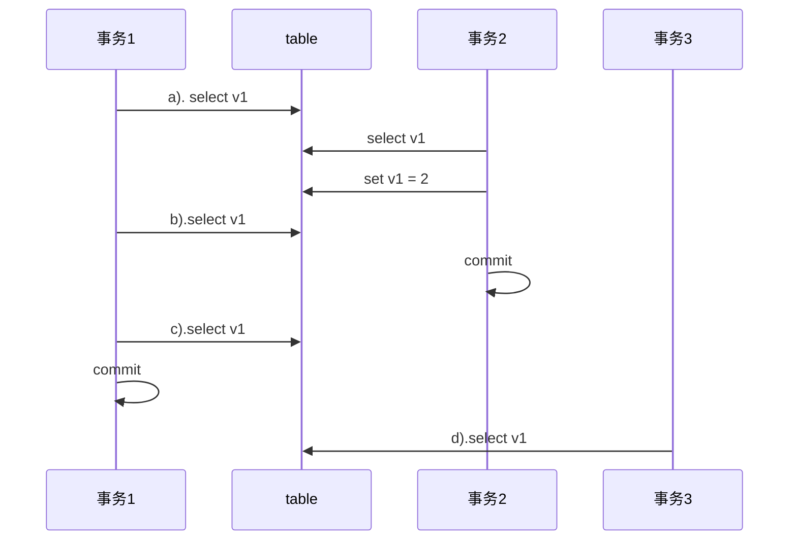
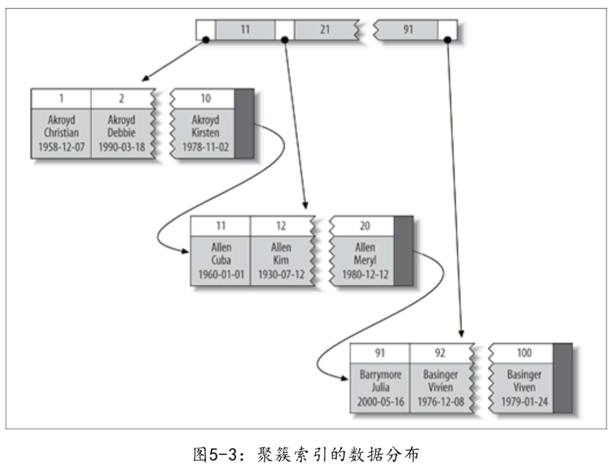
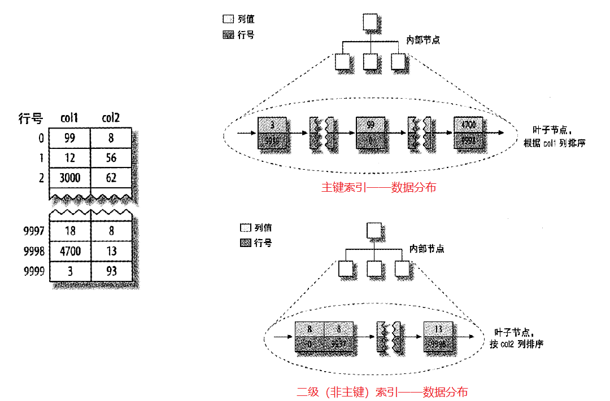
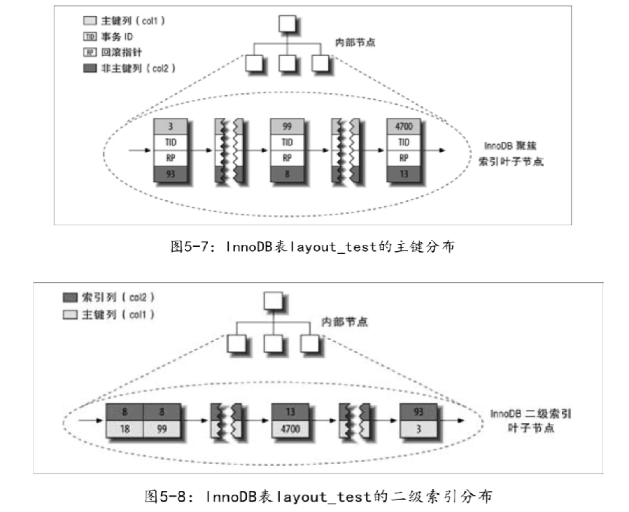

# 1 MySQL架构与历史

## 架构


第一层是MySQL服务器，负责连接处理、授权认证、安全等等。

第二层是MySQL的核心服务功能，所有跨存储引擎的功能都在这一层实现，包括存储过程、触发器、视图等等。

第三层主要是存储引擎，存储引擎负责MySQL中数据的存储和提取，服务器通过API与存储引擎通信。

#### 一条SQL语句在MySQL内部是如何执行的

客户端的SQL语句被执行，会经过以下几个步骤：

- **连接器：** 身份认证和权限相关(登录 MySQL 的时候)。
- ~~**查询缓存：** 执行查询语句的时候，会先查询缓存（MySQL 8.0 版本后移除，因为这个功能不太实用）。~~
- **分析器：** ~~没有命中缓存的话，~~SQL 语句就会经过分析器，先分析 SQL 语句要干什么，再检查 SQL 语句语法是否正确。
- **优化器：** 按照 MySQL 认为最优的方案去执行。
- **执行器：** 执行语句，然后从存储引擎返回数据。 执行语句之前会先判断是否有权限，如果没有权限的话，就会报错。

> **插件式存储引擎** ： 主要负责数据的存储和读取，采用的是插件式架构，支持 InnoDB、MyISAM、Memory 等多种存储引擎。

## 并发控制

1. 读写锁

   处理并发时，通过实现一个由两种类型的锁组成的锁系统来解决问题，分别是共享锁（读锁）和排他锁（写锁）。

2. 锁粒度

   尽量只锁住需要修改的部分数据，而不是所有数据，在给定的资源上，锁定的数据越少，系统的并发度更高。锁粒度的大小与锁的开销成反比。

   锁策略：在锁的开销和数据的安全性之间寻求平衡。

   **MySQL中最重要的两种锁策略: 表锁和行级锁。**

1. 服务器层的并发控制

   服务器会为诸如ALTER TABLE之类的语句使用表锁，忽略存储引擎的锁机制。

2. 存储引擎层的并发控制

   行级锁在存储引擎层面实现，MySQL服务器层没有实现。

## 死锁

死锁是指两个或多个事务在同一资源上相互占用，并请求锁定对方占用的资源，从而导致恶性循环。

两个事务都等待对方释放锁，又持有对方需要的锁。

解决办法：只有部分或者完全回滚其中一个事务，才能打破死锁。

1. 主动死锁检测：不同的存储引擎有不同的检测死锁的机制。
   - InnoDB检测到死锁后的处理的方式是：将持有最少行级排他锁的事务进行回滚。
2. 死锁超时机制：当查询的时间达到锁等待超时的设定后自动放弃锁请求。


## MySQL中的事务

### 事务

事务：逻辑上的一组操作，要么都执行，要么都不执行。

数据库事务：一个或者多个数据库操作构成一个逻辑上的整体，这些数据库操作，要么全部执行成功，要么全部不执行，也就是说，不管事务是否执行，数据库总能保持一致性状态。

### 并发事务带来哪些问题

#### 写的问题

如果同一时刻，允许多个事务对同一数据进行修改，可能导致：

- 第一类丢失修改：一个事务的回滚，导致另一个事务已提交的数据丢失
- 第二类丢失修改：一个事务的提交，导致另一个事务已提交的数据被覆盖


#### 读的问题

如果同一时刻，允许多个事务对同一数据、同一数据表进行读或写操作，可能导致：

- 脏读：一个事务读取了另一个事务未提交的数据
- 不可重复读：一个事务结束之前，对同一数据多次读取的值不一致
- 幻读：一个事务在结束之前，对数据表某一范围 行的统计值 多次统计的结果不一致

### ACID

#### 事务的ACID特性

原子性（atomicity）、一致性（consistency）、隔离性（isolation）、持久性（durability）

一致性是执行事务的最终目的。


#### 事务的隔离级别

例子,，假设一开始v1的值为1：




为了防止并发问题的发生，SQL标准定义了四个隔离级别：

- **READ-UNCOMMITED（读未提交**）

  - 一个事务还没提交时，它做的变更就能被别的事务看到。
  - a) 1   b) 2   c) 2   d) 2

- **READ-COMMITED（读已提交）**

  - 一个事务提交之后，它做的变更才会被其他事务看到
  - 可以解决脏读
  - a) 1   b) 1   c) 2   d) 2

- **REPEATABLE-READ（可重复读）**

  - 一个事务执行过程中看到的数据，总是跟这个事务在启动时看到的数据是一致的。
  - 可以解决脏读、不可重复读
  - a) 1   b)1   c) 1   d) 2

- **SERIALIZABLE（串行化）**

  - 可以解决脏读、不可重复读、幻读
  - a) 1   b) 1   c) 1   d) 2 ；与 REPEATABLE-READ 的不同之处在于，事务2执行更新操作时会加锁，此时事务1会阻塞直到事务2提交

  ***

> 注意：
>
> - 从上到下隔离级别的程度递增，安全性递增，效率递减
> - <font color='red'>MySQL默认隔离级别是REPEATABLE-READ，使用事务型存储引擎时可以达到SERIALIZABLE同等的效果</font>


#### MySQL如何保证ACID？

- 通过预写式日志（Write-Ahead Logging）保证原子性和持久性，undo log保证原子性，redo log保证持久性

  > undolog记录事务执行前的数据，回滚的时候恢复状态；redolog是一种物理日志，记录数据页提交过的更新事务，crush之后可以恢复以前提交过的事务

- 通过锁机制保证隔离性

- 保证了原子性、持久性、隔离性，从而保证数据库的一致性

> Write-Ahead Logging
>
> ```
> 例如：数据库中A=1,B=2,需要update A=3,B=4
> 
> 1.事务开始
> 
> 2.记录A=1到undo log
> 
> 3.修改A=3
> 
> 4.记录A=3到redo log
> 
> 5.记录B=2到undo log
> 
> 6.修改B=4
> 
> 7.记录B=4到redo log
> 
> 8.将redo log顺序写入磁盘
> 
> 9.事务提交
> ```
>
> 如果整个事务执行的过程系统崩溃或者断电了，在系统重启的时候，恢复机制会将redo log中已提交的事务重做，保证事务的持久性；而undo log中未提交的事务进行回滚，保证事务的原子性。


### 事务型存储引擎

MySQL服务层不管理事务，事务是由下层的存储引擎实现的，MySQL是一个支持多引擎的系统，但不是所有的引擎都支持事务。

MySQL提供了两个事务型存储引擎：InnoDB和NDB Cluster（MySQL集群模式下的存储引擎）

> 实际上MySQL很少会使用集群模式，一般只会做到读写分离


## 多版本并发控制

MySQL大多数事务型存储引擎实现的都不是简单的行级锁，他们一般都同时实现了**多版本并发控制（MVCC）**，**MVCC只有在REPEATABLE READ和READ COMMITED两个隔离级别下工作。**

1. MVCC：通过保存数据在某个时间点的快照来实现的。

   1. 不管执行多长时间，每个事务看到的数据都是一致的，看到的都是事务开启时【快照】的数据；
   2. 不同事务开始的时间不同，每个事务对同一张表，同一时刻看到的数据可能不一致。


## InnoDB隔离级别的实现原理

### InnoDB的锁

#### 锁的范围

1. 表级锁：开销小，加锁快，发生锁冲突的几率高，并发度低，不会出现死锁
2. 行级锁：开销大，加锁满，发生锁冲突的几率小，并发度高，会出现死锁

#### 锁的类型

1. 共享锁（Share Lock， 简称S锁）：行级锁，读取一行
2. 排他锁（Exclusive Lock，简称X锁 ）：行级锁，更新一行

> **1. 「多个事务可以同时读取记录，即共享锁之间不互斥，但共享锁会阻塞排他锁。排他锁之间互斥」**
>
> 2. select .. lock in share mode，对读取的记录加S锁
>
> 3. select ... for update ，对读取的记录加X锁

3. 意向共享锁（IS）：表级锁，准备加共享锁

4. 意向排他所（IX）：表级锁，准备加排他锁

   > 意向锁是表级锁，意向锁之间互相兼容

5. 间隙锁（Next-Key Lock，简称N-K锁）：行级锁，使用范围条件时，对范围条件内不存在的记录加锁。（比如查询id>105的数据，表中的数据id最大为110，间隙锁就是对id>110的行加锁，防止插入多的数据）

#### 单个记录锁和间隙锁

1. Record Lock：对单个记录加锁
2. Gap Lock：间隙锁，锁住前面的间隙，不允许插入记录
3. Next-key Lock：间隙锁，同时锁住数据和数据前面的间隙

### 执行SQL时加的是什么锁

SQL执行加什么样的锁受很多条件的制约，比如事务的隔离级别，执行时使用的索引（如，聚集索引，非聚集索引等）。

> InnoDB的行锁是针对索引字段加的锁，表级锁是针对非索引字段加的锁，当我们执行UPDATE、DELETE语句时，如果WHERE条件中的字段没有命中索引，就会导致扫描全表对表中的所有记录加锁。

#### Record Lock

```mysql
-- READ UNCOMMITTED/READ COMMITTED/REPEATABLE READ 利用主键进行等值查询
-- 对id=8的记录加S型Record Lock
select * from girl where id = 8 lock in share mode;

-- READ UNCOMMITTED/READ COMMITTED/REPEATABLE READ 利用主键进行等值查询
-- 对id=8的记录加X型Record Lock
select * from girl where id = 8 for update;
```

#### Gap Lock

如果一个事务对 id=8 的记录加间隙锁，意味着在这个事务提交提前，不允许 id=8 的记录前面的间隙插入新记录。假设一开始不存在 id=7 的记录，一个事务准备插入 id=7 的记录，为了防止其他事务执行相同的查询语句时，<font color='blue'>一开始查不到，后来又查到 id=7 的记录</font>，所以给id=8 的记录加 <font color='red'>间隙锁</font>。

```mysql
-- REPEATABLE READ 利用主键进行等值查询
-- 但是主键值并不存在
-- 对id=8的聚集索引记录加Gap Lock
SELECT * FROM girl WHERE id = 7 LOCK IN SHARE MODE;
```

#### Next-key Lock

**同时锁住数据和数据前面的间隙，即数据和数据前面的间隙都不允许插入记录**，所以你可以这样理解Next-key Lock=Record Lock+Gap Lock，如果一个事务需要对id > 8的记录进行插入或删除操作，为了防止其他事务<font color='blue'>查询这部分记录时出现数值上的不一致</font>，InnoDB会做如下处理：

```mysql
-- REPEATABLE READ 利用主键进行范围查询
-- 对id=8的聚集索引记录加S型Record Lock
-- 对id>8的所有聚集索引记录加S型Next-key Lock，包括Supremum伪记录（页的最后一条记录）
SELECT * FROM girl WHERE id >= 8 LOCK IN SHARE MODE;
```

### InnoDB与MVCC

InnoDB的【读已提交】和【可重复读】是通过MVCC来实现的，本质就是MySQL通过undoLog存储了多个版本的历史数据，根据规则读取某一历史版本的数据，这样就可以在无锁的情况下实现读写并行。

对于InnoDB来说，通过在每行记录后面保存两个隐藏的列来实现MVCC。

- 行版本号：一个保存行的创建时间（创建这行的事务的 版本号trx_id）
- 删除标识：一个保存行的删除时间（当前的系统版本号roll_pointer）

每开启一个事务，系统的版本号+1，事务开始时刻的系统版本号是事务的版本号。

```
查询：
	a.只查询版本早于当前事务版本的数据行；
	b.行的删除版本要么为定义，要么大与当前事务版本号
插入
	a.当前系统版本号设置为行版本号
删除
	a.为删除的每一行保存当前系统版本号作为删除标识
更新
	a.当前系统版本号设置为行版本号
	b.保存当前系统版本号作为删除标识
```

保存这两个额外的版本号，使大多数读操作都可以不加锁。


# 2 存储引擎

MySQL架构中，存储引擎位于第三层，负责数据的存储和读取。

MySQL存储引擎采用的是**插件式架构**，支持多种存储引擎，存储引擎是基于表的，而不是基于数据库的。我们可以为不同的数据库表指定不同的存储引擎以适应不同场景的需要。

查看MySQL的存储引擎：

```mysql
show variables like '%storage_engine%';
```

查看表的存储引擎：

```mysql
show status like 'table_name';
```


## InnoDB存储引擎

`InnoDB`是`MySQL 5.5`版本后的默认事务型存储引擎。

特点：

- `MySQL`默认<font color='red'>事务型</font>存储引擎

- `InnoDB`的数据存储在表空间，表空间是由`InnoDB`管理的一个黑盒子，由一系列的数据文件组成。
- `InnoDB`采用<font color='red'>MVCC来支持高并发</font>，并且实现了<font color='red'>四个</font>标准的隔离级别。
- 默认隔离级别是REPEATABLE READ，并且通过<font color='red'>间隙锁策略</font>防止幻读的出现。
- `InnoDB`是<font color='red'>基于聚簇索引</font>建立的，对主键查询有很高的性能。
- 支持<font color='red'>外键</font>
- 支持<font color='red'>真正的热备份</font>，<font color='red'>自动崩溃恢复</font>


## MyISAM存储引擎

是`MySQL5.1`之前默认的存储引擎。

特点：

- 支持全文索引、前缀索引，压缩、空间函数等；
- **不**支持事务和行级锁，读取时对读取的表加共享锁，写入时对写入的表加排他锁；
- **不**支持外键；
- 崩溃后**无法**安全恢复，只能手工或者自动执行检查和修复操作，但也可能导致一些数据丢失； 
- 适用于只读的表、或者比较小的可以忍受修复的表；

***

> MyISAM是否比InnoDB快？
>
> 这个结论实际上不是绝对正确的，尤其是使用到聚簇索引的时候，或者需 要访问的数据都可以放入内存的应用，InnoDB的速度都是MyISAM望尘莫及的。


## 其他存储引擎

除了以上两个存储引擎以外，`MySQL`还有一些特殊用途的存储引擎，比如Archive、CSV、Memory、NDB集群引擎等；另外还有许多第三方存储引擎，如OLTP类引擎、面向列的存储引擎等。


## 选择合适的引擎

- 除非需要用到某些`InnoDB`不具备的特性，并且没有其他办法可以替代，否则都应该优先选择`InnoDB`引擎。
- 某些情况下你并不在乎可扩展能力和并发能力，也不需要事务支持，也不在乎崩溃后的安全恢复问题的话，选择`MyISAM`也是⼀个不错的选择
- 除非万不得已，否则建议不要混合使用多种存储引擎，混合存储引擎对一致性备份和服务器参数配置都带来了一些困难

***

### 考虑因素

选择存储引擎时需要考虑以下几个因素：

1. 事务
2. 备份
3. 崩溃恢复
4. 某些存储引擎特有的特性


### 常见的应用以及存储引擎选择

日志型应用：实时记录网站访问信息，对插入速度要求很高，选择MyISAM或者Archive比较合适。

只读或者大部分情况下只读的表：如果不介意崩溃恢复问题，选择MyISAM

订单处理：涉及到事务和外键，选用InnoDB


# 3 Schema和数据类型优化

## 选择优化的数据类型

表的字段的数据类型的选择与高性能至关重要，一般来说有以下几个原则：

1. 更小的通常更好，选择不会超过范围的最小类型
2. 简单就好，简单的数据类型的擦走哦通常需要更少的CPU周期
3. 尽量避免NULL，尤其是需要建立索引的列应该设置为 NOT NULL

***

### 整数类型

有两种类型的数字，整数和实数

| 数据类型  | 存储空间 |
| :-------: | :------: |
|  TINIINT  |   8bit   |
| SAMLLINT  |  16bit   |
| MEDIUMINT |  24bit   |
|    INT    |  32bit   |
|  BIGINT   |  64bit   |

整数类型可以选择UNSIGNED属性，表示无符整型

```
TINIINT                  -128~127
TINIINT UNSIGNED         0~256
```


### 实数类型

实数类型是带小数部分的数字。

| 数据类型 |                           存储空间                           |
| :------: | :----------------------------------------------------------: |
|  FLOAT   |                             4bit                             |
|  DOUBLE  |                             8bit                             |
| DECIMAL  | 可以指定小数点前后所允许的最大位数<br />比如DECIMAL(18, 9)表示小数点前后各四个字节，小数点占一个字节 |

只有在需要对小数进行精确计算时才使用DECIMAL。


### 字符串类型

| VARCHAR                                                      | CHAR                                                         |
| :----------------------------------------------------------- | :----------------------------------------------------------- |
| 可变长字符串                                                 | 定长字符串                                                   |
| 需要额外的1-2个字节记录字符串长度                            | 不需要额外记录长度                                           |
| 应用场景：<br />字符串列的最大长度比平均长度大很多；<br />列的更新很少，碎片化不是问题 | 应用场景：<br />字符串列的长度均衡；<br />适合存储很短的字符串；<br />经常变更的字符串 |


### BLOD和TEXT类型

存储大数据的字符串类型数据，BLOD采用二进制方式存储，TEXT采用字符串类型存储。

MySQL把BLOD和TEXT类型的数据当做独立的对象处理，存储引擎存储时通常会做特殊的处理。

BLOD属于二进制类型，TEXT属于字符类型，所以他们唯一的区别是BLOD没有排序规则或字符集，而TEXT类型有字符集和排序规则。MySQL对BLOD和TEXT类型的排序是只对每个列的最前max_sort_length字节排序。


### 日期和时间类型

| DATETIME      | TIMESTAMP                               |
| ------------- | --------------------------------------- |
| 1001年-9999年 | 1970年1月1日午夜以来的秒数（1970-2038） |
| 精度为秒      | 精度为秒                                |
| 8字节         | 4字节                                   |
| 与时区无关    | 与时区有关                              |
| 无默认值      | 默认为当前时间                          |

MySQL能存储的最小时间粒度为秒，如果要存储比秒更小粒度的日期和时间值，可以使用BIGINT存储微妙级别的时间截，也可以使用DOUBLE存储秒之后的小数部分。


### 位数据类型

BIT，SET


### 选择标识符（identifier）

数据表的标识列又称为自增长列，含义: 可以不用手动的插入值，系统提供默认的序列值。标识列可以通过创建表的时候 设置AUTO_INCREMENT来设置，也可以在创建表之后使用以下语句设置。

```mysql
ALTER TABLE 'table_name' modify column 'column_name' 数据类型 AUTO_INCREMENT
```

一般来说，标识列应该选择整数类型，内存占用小，且可以很快执行AUTO_INCREMENT。


### 特殊类型数据

IPv4地址：应该采用32为无符号整数而不是VARCHAR(15)


## MySQL schema设计中的陷阱

1. 太多的列。MYSQL的存储引起API工作是需要在服务器层和存储引擎层之间通过行缓存格式拷贝数据，然后在服务器层将缓冲内容解码成各种列。太多的列会导致转换代价过高。
2. 太多的关联。如果希望查询执行得快速且并发性好，单个查询最好在12个表以内做关联。
3. 注意防止过度使用枚举，当需要在枚举列表中增加新的值，就需要做一次“ALTER TABLE”操作，一般是阻塞的。


## 范式和反范式

### 范式化的优缺点

优点：

- 范式化的表很少有多余的数据，所以通常更小
- 范式化的更新操作通常比反范式化快
- 检索列表数据是更少需要DISTINCT或者GROUP BY语句

缺点：

- 范式化设计的schema通常需要关联，稍微复杂一点的查询语句在符合范式的schema上都可能需要至少一次关联


### 反范式化的优缺点

优点：

- 反范式化的schema所有数据都在一张表中，可以避免关联，查询更快

缺点：

- 信息冗余
- 修改数据时可能造成不一致

> 注意：
>
> 实际应用中，不会使用完全范式化或者完全反范式化的schema，一般是使用部分范式化的schema


## 缓存表和汇总表

有时需要创建一张完全独立的汇总表或者缓存表，有时被允许有少量的脏数据。

缓存表：存储哪些可以比较简单地从schema其他表获取数据的表，主表和缓存表通常使用不同的存储引擎。

汇总表：存储使用CROUP BY语句聚合数据的表。


# 4 索引

索引是存储引擎用于快速找到记录的一种数据结构。

在表的某列或者某些列上建立索引，存储引擎先在索引上找到匹配值，然后根据匹配的索引记录找到对应的数据行。

查看索引：

```mysql
show index from ’table_name‘;
```


索引可以包含一个或者多个列，请注意，**索引的顺序十分重要**，如果索引包含多个列，MySQL只能高效的使用索引的最左前缀列。

MySQL中，索引是在**存储引擎实现**的而非服务器层实现的，不同的存储引擎的索引的工作方式不一样，即使采用同一种类型的索引，底层的实现也可能不一样。


## 4.1 索引分类

（回答前四个）

### InnoDB支持的索引

- 主键索引：设定主键之后数据库自动创建聚簇索引，主键索引索引列值不能为空
- 单值索引（index）：一个索引只包含一个列，一个表可以有多个单列索引
- 唯一索引（unique）：索引列的值必须唯一，但允许有空值
- 复合索引：一个索引包含多个列

```mysql
1. 最左前缀原则;
2. mysql 引擎在查询是为了更好利用索引，在查询过程中会动态查询字段顺序利用索引
（name, age, bir）
 name bir age   不能利用索引，可优化
 name age bir   能利用索引
 age bir        不能利用索引
 bir age name   不能利用索引，可优化
 age bir        不能利用索引
```


### MyISAM支持的索引

- 全文索引（5.7之前只有MyISAM支持）


## 4.2 MySQL支持的索引的数据结构

### B-Tree索引

B-Tree索引，就是使用B-Tree数据结构存储索引。这里不细分B-Tree的类别以及各种优化版本。

B-Tree通常意味着所有的值都按照顺序存储，并且每一个叶子页到根的距离相同。


采用B-Tree建立索引能够加快访问数据的速度，因为存储引擎不再需要进行全表扫描来获取需要的数据，而是从索引的根节点开始搜索。B-Tree对索引列是**顺序组织存储**的，它的结构特点是：

- 树形结构：由根节(root)、分支(branches)、叶(leaves)三级节点组成，其中分支节点可以有多层。
- 多分支结构：与binary tree不相同的是，B-Tree索引中单root/branch可以有多个子节点(超过2个)。
- 双向链表：整个叶子节点部分是一个双向链表(后面会描述这个设计的作用)
- 单个数据块（一页）中包括多条索引记录
- 叶子节点的指针指向被索引的数据

而由于Btree索引对结构的**利用率很高，定位高效。**当1千万条数据时，Btree索引也是三层结构(依稀记得亿级数据才是3层与4层的分水岭)，定位记录仍只需要三次I/O，100条数据和1千万条数据的定位，在btree索引中的花销是一样的。


**可以使用B-Tree索引的查询类型**

1. 全值匹配
2. 匹配最左前缀
3. 匹配列前缀
4. 匹配范围值
5. 精确匹配某一列并范围匹配另外一列
6. 只访问索引的查询
7. 可以用于order by语句


**B-Tree索引的限制**

比如建表的时候，索引设置为 `key (last_name, first_name, dob)`

1. 如果不是按照索引的最左列开始查找，则无法使用索引；

   ```
   即无法使用索引优化条件查查询 first_name=Bill的行。
   ```

2. 不能跳过索引的列；

   ```
   如果查询last_name=Smith and dob='1972-02-26'的行，MySQL只能使用索引的第一列
   ```

3. 如果查询中有某个列的模糊查询（Like），则模糊查询右边的所有列都无法使用索引优化查找。


### 哈希索引

哈希索引基于哈希表实现，只有**精确匹配索引所有列**的查询才有效。

存储引擎对**每一行数据的索引列**计算一个哈希值，不同的键值的行计算出来的索引是不一致的，哈希索引将哈希码存储在索引中，同时在哈希表中保存每个数据行的指针。

MySQL中只有Memory存储引擎**显示**支持哈希索引（其默认索引），并且支持非唯一哈希索引，用拉链法解决哈希冲突。

NDB cluster也支持唯一哈希索引。


**优点**

哈希索引只需要存储对应的哈希值，所以哈希索引的结构非常紧凑而且哈希索引的查找速度非常快。

**限制**

1. 哈希索引不按照索引值得顺序排序，**无法用于需要排序的查询；**
2. 只支持全值匹配，不支持部分索引列匹配查询；
3. 只支持等值查找（=，<=>, in()），**不支持任何范围查找**（>=, <=, >, <）
4. 哈希冲突大的时候，索引维护操作的代价会很高，要避免在**选择性**小的列上建立哈希索引。


扩展：

```
InnoDB有一个特殊的功能是“自适应哈希索引”，如果InnoDB注意到某些列使用非常频繁，会在内存中基于B-Tree索引之上再创建一个hash索引，让B-Tree也具备快速的hash查找功能。
```


### 空间数据索引

R-Tree，可以用作地理数据存储，MyISAM支持空间索引。

空间索引会从所有维度来索引数据，需要使用GIS。


### 全文索引

全文索引查找的是文本中的关键词，而不是直接比较索引中的值，在相同的列上创建全文索引和基于值得B-Tree索引不会冲突。


## 索引的优缺点

优点：<font color='red'>大大加快查询速度</font>

1. 索引大大减少了服务器需要扫描的数据量
2. 索引可以帮助服务器避免排序和临时表
3. 索引可以将随机I/O变成顺序I/O

> **注意：**
>
> 但是只有当索引可以帮助存储引擎快速查找记录带来的好处大于其带来的额外工作时，建立索引才是有效的。对于很小的表，大部分情况下全表扫描更高效；中大型表建立索引就非常有效；对于特大型的表，建立索引的代价也随之增加，这时候就可以建立元数据信息表，先缩小查询的范围。


缺点：

1. 维护索引需要耗费数据库资源
2. 索引需要占用磁盘空间
3. 当对表的数据进行增删该操作时，因为要维护索引，速度会受到影响


## 高性能的索引策略

### 1. 独立的列

索引列不应该是表达式的一部分，也不能是函数的参数，否则MySQL将不会使用索引。正确是做法是 始终将索引列单独放在操作符的一侧。

> 如果要使用索引，就不要把索引列放在条件的函数或者表达式中


### 2. 前缀索引和索引选择性

索引的**选择性**：不重复的索引值（基数）和 数据表的记录总数（T）的比值，索引的选择性越高则查询的效率越高。

但是有些情况下，需要索引很长的字符列，但是不能在完整的字符上创建索引，会过于笨重，对于BLOB、TEXT或者很长的VARCHAR列，必须使用前缀索引，但这会降低索引选择性。

策略：**选择足够长的前缀以保证较高的索引选择性，但又不能太长**。

**如果决定前缀的长度？**

1. 前缀的“基数”最接近完整列的“基数”

2. 前缀的选择性接近于完整列的选择性
3. 同时不能只看平均选择性，最好是最常出现的前缀的数量是分布均匀的，而不是相差很大；所以【1】和【2】这两个策略应该结合使用。

```mysql
# 完整列的选择性 0.031
count(DISTINCT city) / count(*)
 
# 前缀长度为7的选择性 0.0310
count(DISTINCT LEFT(city, 7))/count(*)
```

> 前缀索引能使索引更小、更快；但是MySQL无法使用前缀索引做ORDER BY和GROUP BY，也无法使用前缀索引做覆盖扫描。


### 3. 多列索引

在多个列上创建独立的单列索引大部分情况下并不能提高MySQL的查询性能，有时候还不如创建优秀的多列索引。


### 4. 选择合适的索引列顺序（适用于B-Tree索引）

比如在(name，class_id)上创建索引，索引的顺序也很重要，经验法则是：**将选择性最高的列放到索引的最前列**

- 当不考虑排序和分组的时候，经验法则是很有效的
- 通常情况下，也需要根据那些运行频率最高的查询来调整索引列的顺序
- 实际情况中，不能只考虑平均情况下的性能，也需要考虑特殊情况下的性能


### 5. 聚簇索引

”聚簇“ 表示**数据行和相邻的键值紧凑地存储在一起**。

聚簇索引并不是一种索引类型，而是一种**数据存储方式**，当表存在聚簇索引时，他的数据行实际上存放在索引的叶子页（叶子页存放的不再是数据行指针，而是数据行本身）。

注意：

- 一个表只能有<font color='red'>一个</font>聚簇索引，因为数据行不能存放在两个不同的地方
- 并不是所有的存储引擎都支持聚簇索引
- InnoDB支持聚簇索引


#### **InnoDB的聚簇索引**

`InnoDB`的聚簇索引实际上是在<font color='red'>同一个结构中保存了B-Tree索引和数据行</font>。叶子页包含了行的全部数据，但是节点页只包含索引列。



> 在InnoDB中，**聚簇索引就是”表“**。每个叶子节点都包含了主键值、事务ID、用于事务和MVCC的回滚指针，以及所以剩余的列的值，如果主键是前缀索引，也会包含完整的主键列和剩余的其他了列。


InnoDB选择**主键聚集数据**，但是

- 如果表没有定义主键，InnoDB会选择<font color = 'red'>唯一的非空索引</font>代替主键
- 如果不存在这样的索引，InnoDB会隐式地定义一个主键来作为聚簇索引
- 如果设置了主键为聚簇索引有希望再单独设置聚簇索引，必须先删除主键，然后添加我们想要的聚簇索引，最后恢复设置主键。


##### 聚簇索引的优点（适合I/O密集型）

- 可以把相关的数据保存到一起，一次I/O可以查询大量数据
- 数据访问更快，聚簇索引将数据和索引保存在同一个B-Tree
- 使用覆盖索引扫描的查询可以直接使用页节点的主键值


##### 聚簇索引的缺点

- 如果数据存储在内存中，聚簇索引没有必要
- 插入速度严重依赖于插入顺序
- 更新聚簇索引列的代价很高
- 基于聚簇索引的表在插入新数据时，或者主键更新需要移动行的时候，可能导致<font color='blue'>”页分裂“</font>
- 行稀疏的时候，聚簇索引可能导致全表扫描变慢
- 二级索引（非聚簇索引）更大，一般存储主键作为 “行指针”
- 二级索引访问<font color='blue'>需要两次索引查找</font>，因为二级索引叶子页中存储的是行主键值而不是行的物理地址，所以需要先找到主键值，再去聚簇索引查找对应的行。


#### 深入理解聚簇索引和非聚簇索引

从InnoDB和MyISAM的数据分布对比，理解聚簇索引和非聚簇索引，以及对应的主键索引和二级索引区别。

```mysql
CREATE TABLE layout_test(
	col1 int NOT NULL,
    col2 int NOT NULL,
    PRIMARY KEY(col1),
    KEY(col2)
);
```

**MyISAM**

对于MyISAM，在主键上建立索引和在非主键上创建索引在结构上没有什么区别，他们的叶子页存储的都是指向数据表行的指针。



**InnoDB**

InnoDB的<font color = 'red'>二级（辅助）索引和聚簇索引在叶子页节点的结构上不一样</font>，InnoDB的二级索引叶子节点中存储的不是”行指针“，而是用主键值作为指向行的”指针“，这也使二级索引占用更多空间；而聚簇索引的叶子节点包含了行的全部信息。



图5-8可以看到，以col2建立索引的叶子节点，包含了索引列和主键值。

> 为什么二级索引不存储”行指针“？
>
> 二级索引存储【主键】作为【行指针】可以减轻的二级索引的维护工作，这样基于聚簇索引的表更新时发生行移动或者”页分裂“时无需更新二级索引的叶子节点中的指针。


#### 在InnoDB中按照主键顺序插入行

最好在主键或者顺序写入的列上（AUTO_INCREMENT）建立聚簇索引，新增数据的时候，可以把新纪录存储在上一条记录的后面，当页满的时候，写入新的页。

但如果在随机的列上建立（主键）聚簇索引，假设在UUID上建立聚簇索引，数据在插入时就变得完全随机，新行的主键值不一定比上一条记录小，所以需要做额外的工作找到新行的插入位置，可能造成频繁的页分裂。

所以，使用InnoDB应该<font color = 'red'>尽可能地按主键顺序</font>插入数据，并且尽可能的使用单调增加的聚簇键的值来插入新行。


### 6. 覆盖索引

如果一个索引包含（或者说覆盖）所有需要查询的字段的值，就称为 ”覆盖索引“。

覆盖索引必须要存储索引列的值，而哈希索引、空间索引等都不存储索引列的值，在MySQL中，只有B-Tree索引能做覆盖索引。

例如，假设sets表上有一个多列索引（col_id, row_id），如果MySQL只需要访问这两列，就可以使用这个索引做覆盖索引：

```mysql
select col_id, row_id from sets
```

在合适的情况下，使用覆盖索引可以<font color = 'red'>直接从索引 (叶子结点) 获取列的数据，不必再回表查询</font>。

使用覆盖索引的好处：

- 索引条目通常远小于数据行大小，如果只需要读取索引，MySQL就会极大地减少数据访问量；

- 因为索引是按照列值顺序存储的，所以I/O密集型的范围查询，会比随机从磁盘中读取一行数据的I/O要少得多。

- 由于InnoDB的聚簇索引，覆盖索引对InnoDB表特别有用。InnoDB的二级索引在叶子节点存储了行的主键值，如果二级索引可以覆盖查询，就能避免二次查询

  ```mysql
  # 比如在last_name上建立二级索引
  select id, last_name from actor where last_name = 'STEPHEN';
  # 因为二级索引存储了索引列last_name的值和主键id的值，所以这里可以利用二级索引做覆盖查询
  # 避免了二次查询
  ```

  


### 7. 使用索引扫描来做排序

MySQL有两种方式可以生成有序的结果：

- 排序
- 按索引顺序扫描

如果索引可以覆盖查询所需的所有的列，使用索引扫描做排序就会非常快，因为只需要从一条索引记录移动到紧接着的下一条记录。只有满足一些条件时，才能MySQL才能使用索引对结果做排序：

- 索引的列顺序与order by子句的顺序完全一致；
- 当查询关联多张表时，order by子句引用的字段全部为一个表；
- order by子句满足索引的最左列前缀的要求


### 8. 压缩（前缀）索引

MyISAM使用前缀压缩来减少索引的大小，从而让更多的索引可以放进内存中，某些情况下能极大提高性能。

默认情况下只压缩字符串。

MyISAM压缩索引块的方式：完全保存索引的第一个值，然后其他值与第一个值进行比较得到相同前缀的字节数和剩余的不同的后缀部分，把这部分保存起来。

比如：

```
              1           2
           perform   performance
前缀压缩后： perform     7,ance
```


优点：

- 可以让索引占用更少的内存空间
- 适合正序扫描
- 适合I/O密集型应用

缺点

- 由于每个值得压缩都依赖于前面的值，所以倒序查询非常慢
- 不适用于CPU密集型应用（随机查找）


### 9. 重复和冗余索引

重复索引和冗余索引会增加MySQL的维护的压力，也会加大优化的难度，大多数情况下，应该避免创建重复索引和冗余索引，如果已经有了应该删除！

- 重复索引：在相同的列上按照相同的顺序创建的相同类型的索引

  ```mysql
  CREATE TABLE (
  	ID INT NOT NULL PROMARY_KEY,
      NAME VARCHAR(16) NOT NULL,
      AGE INT NOT NULL,
      UNIQUE(ID),
      INDEX(ID)
  ) ENGINE=InnoDB
  ```

  这种情况下会创建重复索引，因为MySQL的唯一限制和主键限制都是通过索引实现的，所以实际上创建了三个重复的主键索引。

- 冗余索引：一个索引可以通过另一个索引实现。

  ```mysql
  索引 (A, B)
  又创建一个索引（A） 这实际上是冗余的
  因为索引（A）是索引（A,B）的前缀索引， (A, B)可以当做（A）来使用
  ```

  冗余索引通常发生在为表创建新的索引的情况下，所以应该尽量扩展已有的索引而不是创建新索引。


### 10. 未使用的索引

有些索引可能永远用不到，这样的索引是累赘的，应该删除。


### 11. 索引和锁

索引可以让查询锁定更少的行。

InnoDB只有在访问行的时候会加锁，而索引能够减少InnoDB访问的行数，从而减少锁的数量。

