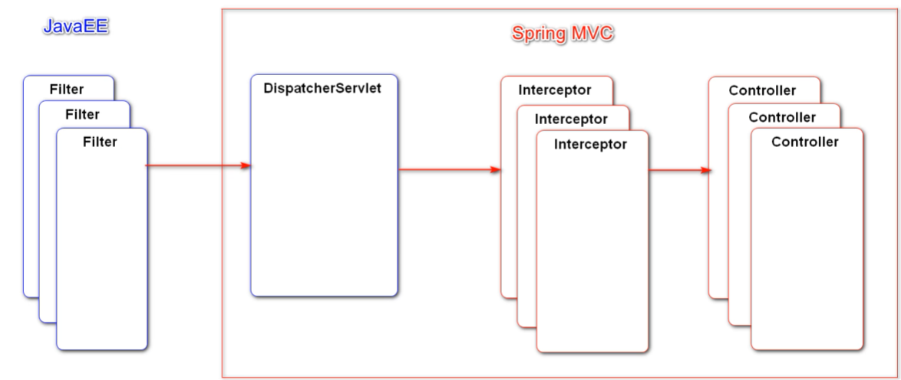

title: newcoder
date: 2022-03-22 21:42:31
tags: 项目


# 1 项目简介

## **实现论坛讨论区功能**

1. 社区首页，可以按照最新/最热排序查看帖子，可以发布帖子
2. 帖子详情页面，点赞评论功能
3. 注册/登陆功能
4. 账号
   1. 个人主页：查看关注列表/粉丝列表，查看自己发布的帖子和回复
   2. 账号信息设置
   3. 退出登陆
5. 消息
   1. 私信
   2. 系统通知
6. 搜索功能
7. （隐藏）管理员功能
   1. 网站UV
   2. 活跃用户

## 技术架构

框架：SpringBoot + Spring、SpringMVC、Mybatis 

性能：

​	数据库：Redis，MySQL

​	消息队列：Kafka

​	搜索引擎：Elasticsearch

安全与运维：Spring Security + Spring Actuator

## 开发环境

构建工具：Apache Maven

集成开发工具：IDEA

数据库：MySQL、Redis

应用服务器：Tomcat

版本控制工具：Git

# 2 开发准备阶段

## 搭建开发环境

1. Maven

   版本3.6.0

   配置远程仓库：阿里镜像

   简单命令演示：

   1. 编译：在项目pom所在的目录下，cmd执行mvn compile即可
   2. clean：清理之前的编译结果，可以与compile结合使用：mvn clean compile
   3. test：测试，包含了compile

2. IDEA

   1. 配置Maven环境为自己下载的Maven

3. JDK 8以上

4. Spring Initializr：管理包的工具，对工具包按照功能分类，底层是基于Maven的

5. 使用Spring Initializr创建项目工程

   1. 导入相关包：AOP，Web，Thymeleaf（模板引擎），DevTools（开发者工具）

## Sping复习

- Spring**是一个轻量级的控制反转**(IoC)**和面向切面**(AOP)的容器（框架）。
- spring通过容器创建对象，默认是单例的。
- 可以定义自己的配置类，将java自带的类的对象放入容器。
- controller --> service --> dao


## SpringMVC复习

- 三层架构：表现层、业务层、数据访问层

- MVC：是一种设计模式

  - Model：模型层
  - View：视图
  - Controller：控制层

  

- SpringMVC：是基于spring的一个框架， 实际上就是spring的一个模块， **专门是做web开发的框架**。

- 核心组件： DispatcherServlet  中央调度器，也叫前端控制器

- SpringMVC是如何获取请求对象的？

  - 也可以直接获取请求中所携带的请求参数
  - 处理器方法的形式参数可以有request和response，方法内可以调用其对应的方法获取参数
  - 可以通过request对象获取请求数据
  - 可以通过response对象返回响应数据

- Controller方法的不同应用场景

  - 响应GET请求：一般用于查询功能
  - 响应POST请求：表单提交一般采用POST方式
  - 返回视图和数据：ModelAndView
  - 返回视图：View
  - 响应异步请求：没有返回值，或者返回Map/List等，框架会将其转换为json响应给客户端

## MySQL版本更新

1. MySQL5.7 升级MySQL 8.0.28

   - 卸载

     - 删除MySQL安装的文件夹
     - 删除注册表
     - 删除Program Data中的MySQL文件夹

   - 重装

     - 下载安装包，在你想要的安装目录下重装

     - 新建配置文件my.ini

     - 以管理员身份打开CMD，属于以下命令：

       ```mysql
       mysqld --initialize --console # 初始化
       # 要记住最后一行提示的初始密码，第一次登陆时需要
       ```

       

     - net start mysql 启动MySQL的服务
     - 登陆：mysql -u root -p密码
     - 修改密码：ALTER USER ‘root’@‘localhost’ IDENTIFIED BY ‘你的密码’;

   - 安装MySQL workBench，如果提示要安装vc 2019之类的，那就先去安装，之后就会一切顺利。

   - 导入相关的数据，如果在命令行导入不成功，可以将命令复制到MySQL workBench中执行。

## MyBatis复习

- 核心组件
  - SqlSessionFatory
  - SqlSession
  - 主配置文件：整合Spring之后已经并不需要单独配置了
  - Mapper接口：与数据库表对应的操作接口
  - Mapper映射器：编写SQL，将SQL与实体类映射起来，采用XML配置文件或者注解

- 数据库配置

  ```properties
  # DataSourceProperties
  spring.datasource.driver-class-name=com.mysql.cj.jdbc.Driver
  spring.datasource.url=jdbc:mysql://localhost:3306/community?characterEncoding=utf-8&useSSL=False&serverTimezone=Hongkong
  spring.datasource.password=root
  spring.redis.username=root
  spring.datasource.type=com.zaxxer.hikari.HikariDataSource
  spring.datasource.hikari.maximum-pool-size=15
  spring.datasource.hikari.minimum-idle=5
  spring.datasource.hikari.idle-timeout=30000
  
  # MybatisProperties
  mybatis.mapper-locations=classpath:mapper/*.xml
  mybatis.type-aliases-package=com.ganjing.entity
  mybatis.configuration.use-generated-keys=true
  # 下划线命名方式与驼峰命名对应
  mybatis.configuration.map-underscore-to-camel-case=true
  ```

- HikariDataSource：数据库连接池，性能比较好

- 准备Mapper及其配置文件

  ```xml
  <!--定义sql字段，实现一长串内容的复用-->
  <sql id="selectFields">
          id, username, password, salt, email, type, status, activation_code, header_url, create_time
  </sql>
  
  <select id="selectById" resultType="User">
      select <include refid="selectFields"></include>
      from user
      where id = #{id}
  </select>
  
  <select id="selectByName" resultType="User">
      select <include refid="selectFields"></include>
      from user
      where username = #{username}
  </select>
  ```


# 3 项目调试技巧

## 响应状态码的含义

1. 200 请求成功

2. 以3开头的状态码：与重定向有关
   - 302
3. 以4开头的状态码：与客户端响应有关
   - 404 在服务器找不到请求的资源，路径可能不对
4. 以5开头的状态码：与服务端响应有关——应该检查服务器程序
   - 500 服务器在执行请求的时候发生了错误

## 服务端断点调试技巧

1. 第一步：给程序打断点，以debug模式执行，访问相应的路径；
2. F8逐行执行；F7进入方法内部，F8返回；F9程序执行到下一个断点

## 客户端断点调试技巧

在浏览器鼠标右键，选择【检查】，可以给js代码加断点

## 日志

学会观察日志输出，应该优先于断点调试。

Spring默认的记录日志的工具——logback（https://logback.qos.ch/），可以在配置文件中指定日志的输出级别。如果选定了debug级别，那么严重程度大于debug级别的日志都会输出（严重程度级别从上到下越来越严重）。


一般情况下不会选择trace级别，常见的方式是：开发阶段选择debug级别，上线以后选择info级别。

将日志记录进行持久化而非简单的打印在控制台，需要配置logback配置文件：

- logback-spring.xml，放置在resources根目录下

- 不同级别的日志用不同的文件记录
- 当日志文件超过一定大小，新建一个日志文件


# 4 版本控制

说明是版本控制：

版本控制是一种记录一个或若干文件内容变化，以便将来查阅特定版本修订情况的系统。

将本地代码上传到版本控制服务器，可以记录历史版本方便恢复，也方便团队协作。

常用工具：Git

## 什么是Git

Git是一种分布式版本控制系统（Distributed Version Control System，简称 DVCS）， 在这类系统中，客户端并不只提取最新版本的文件快照， 而是把代码仓库完整地镜像下来，包括完整的历史记录。 这么一来，任何一处协同工作用的服务器发生故障，事后都可以用任何一个镜像出来的本地仓库恢复。 因为每一次的克隆操作，实际上都是一次**对代码仓库的完整备份**。

Git与其他版本控制系统的区别是，其他版本控制系统是基于差异的，这类系统（CVS、Subversion、Perforce、Bazaar 等等） 将它们存储的信息看作是一组基本文件和每个文件随时间逐步累积的差异。而Git是基于快照的，在 Git 中，每当你提交更新或保存项目状态时，它基本上就会**对当时的全部文件创建一个快照并保存这个快照的索引**。 为了效率，如果文件没有修改，Git 不再重新存储该文件，而是只保留一个链接指向之前存储的文件。 Git 对待数据更像是一个 **快照流**。

## 如何使用Git

1. 命令行方式
   - 初始化 init
   - 添加到本地仓库
   - 提交到本地仓库
   - 保存到远程仓库
2. IDEA集成Git
   - 
   - 初始化本地仓库，添加，提交
   - 上传本地仓库，要在远程仓库新建一个仓库，并且不要做任何初始化，将仓库地址添加到idea，点击push，提示输入用户名和密码
   - 
   - 

# 5 基础功能开发

## 5.1 开发社区首页

### 分析

1. 开发流程

  - 一次请求的执行过程
  - 

2. 分布实现
  - 开发社区首页，显示前10个帖子
  - 开发分页组件，分页显示所有的帖子

3. 分析表：

   

4. 分析代码实现流程：

   - 遵从dao --> service --> controller的开发顺序
   - dao
     - 新建一个与帖子表相对应的实体类DiscussPost
     - 创建与实体类对应的Mapper，定义首页需要用到的数据库CUDR方法
     - 创建与Mapper接口对用的Mapper.xml配置文件，完成sql语句
     - 注意：良好的开发习惯是，dao层的开发完毕以后，先测试一下这一层的业务是否能正常运行。
   - service
     - 创建Mapper接口相对应的Service接口及其实现类
     - 有些时候需要增加一些业务功能
   - controller
     - 处理请求
     - 响应视图和数据
   - 修改前端的动态资源

5. 注意：thymeleaf的语法中${page.curPage}的底层，其实调用了page.getCurPage()

6. 目前的项目结构：

   

### 后台代码实现

1. DAO

   DiscussPostMapper

   ```java
   @Mapper
   public interface DiscussPostMapper {
   
       /**
        * 查询帖子
        * @param userId 首页查询时不需要这个参数，个人主页显示用户自己的帖子时需要使用这个参数
        * 下面两个参数是用来实现分页查询的
        * @param offset 起始页
        * @param limit 每页显示多少条数
        * @return 这一页的帖子
        */
       List<DiscussPost> selectDiscussPosts(int userId, int offset, int limit);
   
       /**
        * 查询帖子的总数量
        * @Param("userId"): 用于给参数起别名，如果方法只有一个参数，并且要拼接动态SQL，则必须加别名
        * @param userId 用于个人主页
        * @return 数量
        */
       int discussPostRows(@Param("userId") int userId);
   
   }
   ```

   DiscussPostMapper.xml

   ```xml
   <select id="selectDiscussPosts" resultType="DiscussPost">
           select <include refid="selectFields"></include>
           from discuss_post
           where status != 2
           <if test="userId != 0">
               and user_id = #{userId}
           </if>
           order by type desc, create_time desc
           limit #{offset}, #{limit}
       </select>
   
       <select id="discussPostRows" resultType="int">
           select count(id)
           from discuss_post
           where status != 2
           <if test="userId != 0">
               and user_id = #{userId}
           </if>
       </select>
   ```

2. Service

   ```java
   public interface DiscussPostService {
   	// 查询帖子信息
       List<DiscussPost> selectDiscussPosts(int userId, int offset, int limit);
       // 根据帖子中的userId查询作者信息
       // 不采用联合查询是为了做redis优化
       int discussPostRows(int userId);
   }
   ```

   业务接口实现类，注意@Service注解加载实现类上面。

   ```java
   @Service
   public class DiscussPostServiceImpl implements DiscussPostService {
   
       @Resource
       private DiscussPostMapper discussPostMapper;
   
       @Override
       public List<DiscussPost> selectDiscussPosts(int userId, int offset, int limit) {
           return discussPostMapper.selectDiscussPosts(userId, offset, limit);
       }
   
       @Override
       public int discussPostRows(int userId) {
           return discussPostMapper.discussPostRows(userId);
       }
   }
   ```

3. Controller

   ```java
   @Controller
   public class HomeController {
       @Resource
       private DiscussPostServiceImpl discussPostService;
       @Resource
       private UserServiceImpl userService;
       /**
        * 首页控制器
        * @param model 封装响应数据
        * @param page 客户端传递给服务器的页面信息参数
        * @return
        */
       @RequestMapping(path = "/index", method = RequestMethod.GET)
       public String homePage(Model model, Page page){
           // springMVC会自动实例化Model对象和Page对象，并将page对象注入model
           // 所以thymeleaf可以直接使用page对象
           // 获取分页信息
           page.setTotalRows(discussPostService.discussPostRows(0));
           page.setPath("/index");
           List<DiscussPost> discussPosts =
                   discussPostService.selectDiscussPosts(0, page.getOffset(), page.getLimit());
           List<Map<String, Object>> postList = new ArrayList<>();
           // 把用户信息和帖子信息封装到map，一起响应到客户端
           for(DiscussPost discussPost : discussPosts){
               Map<String, Object> post = new HashMap<>();
               post.put("post", discussPost);
               post.put("user", userService.selectUserById(discussPost.getUserId()));
               postList.add(post);
           }
           model.addAttribute("postList", postList);
           return "/index";
       }
   }
   ```

   注意：实现分页功能涉及到前后端数据交互，前端需要告诉后端当前页码curPage和页面最大显示条数limit，后端需要根据前端提供的信息，查询数据库，得到当前页面起始索引和当前页面的信息，所以需要封装一个Page类存放这些与分页相关的数据。

## 5.2 开发注册登陆模块

### 发送邮件

1. 邮箱设置

   - 启用客户端SMTP服务

   

2. Spring Email

   - 导入jar包
   - 邮箱参数配置

   ```properties
   # MailProperties
   spring.mail.host=smtp.163.com
   spring.mail.port=465
   spring.mail.username=ganjjing524@163.com
   spring.mail.password=开启SMTP时生成的动态密码
   spring.mail.protocol=smtps
   spring.mail.properties.mail.smtp.ssl.enable=true
   ```

   - 使用JavaEmailSender发送邮件
     - 封装一个工具类，封装发送邮件的功能

3. 模板引擎

   - 使用thymeleaf发送HTML邮件（因为邮件中一般携带图片和链接）

### 注册功能

把注册功能按照请求拆解：

1. 访问注册页面
   1. 点击顶部区域内的链接，打开注册页面
2. 提交注册数据
   1. 通过表单提交数据
   2. 服务端验证账号是否存在、邮箱是否已注册
   3. 服务端发送激活邮件
3. 激活注册账号
   1. 点击邮件中的链接，访问服务端的激活服务


1. 访问注册页面

   - 创建一个新的controller完成页面跳转
   - 修改index页面中的【注册】字样的超链接，复用index页面的header部分
   - 修改register.html中的静态资源链接、用index页面的header替代当前页面的header

2. 提交注册数据

   1. 准备工作

      1. 导入commons-lang包，提供了字符串查找，替换，分割，去空白，去掉非法字符等等操作。

      2. 在配置文件中配置一个链接，用于用户激活

      3. 创建工具类CommunityUtil，提供两个静态方法。

         1）生成随机字符串，随机字符串可用于给用户的上传的头像随机命名，对用户密码加密等；

         ```java
         // 生成随机字符串
         public static String generateUUID(){
             return UUID.randomUUID().toString().replaceAll("-", "");
         }
         ```

         2）MD5加密，对用户的密码加密，防止被盗，使用**MD5加密（用户密码+随机字符串）**的方式加密。

         ```java
         /**
          * md5加密
          * 用户密码+salt ---> 加密后的密码
          * @param key : 密码+salt
          * @return 加密后的密码
          */
         public static String md5(String key){
             if(StringUtils.isBlank(key)){
                 return null;
             }
             return DigestUtils.md5DigestAsHex(key.getBytes());
         }
         ```

   2. 实现注册功能

      1. Dao层实现操作数据库的方法

      2. Service层实现注册功能

         1. 用户名、密码、邮箱不能为空
         2. 用户名、邮箱不能是数据库中已注册的
         3. 对用户的密码加密
         4. 补全用户信息，即设置用户的类型、激活状态、激活码、随机头像、创建时间
         5. 将用户添加到数据库
         6. 给用户发送激活邮件

      3. Controller

         1. 调用service的register方法，获取返回结果
         2. 如果map为空，说明注册成功，跳转到注册成功的提示页面
         3. 如果map不为空，则说明注册输入的字段有误，将错误信息加入model，在注册页面显示错误信息

      4. 模板修改

         1. 注册成功的提示页面

            1. 设置页面提示信息

            2. 设置跳转链接（跳转会首页）

               ```html
               您也可以点此 <a id="target" th:href="@{${target}}" class="text-primary">链接</a>, 手动跳转!
               ```

         2. register页面

            1. 需要修改表单字段的name，以便与User属性相对应

            2. 设置is-invalid属性动态显示错误信息

               ```html
               <input type="text" th:class="|form-control ${nameMsg != null ? 'is-invalid' : ''}|"
                     th:value="${user != null ? user.username : ''}"
                     id="username" name="username" placeholder="请输入您的账号!" required>
               <div class="invalid-feedback" th:text="${nameMsg}">
                  该账号已存在!
               </div>
               ```

3. 实现激活功能

   首先创建一个接口，定义三种激活状态；然后在service层新建一个激活业务，根据用户的状态和激活码得到激活的状态；在Controller（路径与激活链接的路径保持一致）中新建一个激活控制器方法，根据激活状态完成页面跳转功能。

   1. 激活成功，跳转到登录页面
   2. 重复激活，跳转到首页
   3. 激活失败，跳转到首页


### 会话管理

HTTP是无状态，有会话的。

一次会话：浏览器第一次给服务器资源发送请求，会话建立，直到有一方断开为 止。 

会话技术的功能：在一次会话的范围内的多次请求之间共享数据。

**Cookie**

1. 什么是Cookie

   1. 客户端会话技术
   2. cookie是服务器发送到服务器，并保存在浏览器端的一小块数据
   3. 浏览器下次访问改服务器时，会自动携带改数据，将其发送给服务器

   

2. cookie的使用：

   1. 创建cookie
   2. 设置cookie的生效范围
   3. 设置cookie的生存时间
   4. 发送cookie，response.addCookie(cookie)

3. Cookie的缺点

   1. 不安全，一般用于存储少量的不太敏感的数据 

   

**Session**

1. 什么是session

   1. 服务器端会话技术
   2. 是JavaEE的标准，用于在服务端记录客服端信息
   3. 数据存放在服务端更安全，但是也会增加服务端的内存压力
   4. session是依赖于cookie的，服务器端发送给客户端浏览器的数 据，被浏览器保存到Cookie中

   

2. session的使用
   1. 控制器方法中可以直接使用Session实例
   2. setAttribute(key, value)
   3. getAttribute(key, value)
3. 缺点：
   1. 分布式部署时使用session，存在session共享问题，虽然有以下几种解决方案：
      1. 粘性session：破坏负载均衡
      2. 同步session：数据冗余
      3. 共享session：用一个单独的服务器处理session，一旦这个服务器崩溃，就会导致session不可用
   2. 所以在分布式情况下，尽量不使用session，或者将session存到缓存数据库

### 登陆功能

#### 生成验证码

使用工具：Kaptcha，这是一个生产验证码的工具，spring boot没有为Kaptcha提供自动配置，通过Spring boot使用kaptcha需要我们自己为其创建配置类。Producer是kaptcha的颗心接口，这个接口只有两个方法，一个是生成随机文本，另一个是通过随机文本生成图片。kaptcha配置类就是要对图片和文本进行配置。

- 导入jar包

- 编写配置类


#### 开发登陆、退出功能

- 访问登录页面
  - 点击顶部区域的【登陆】，可以跳转到登录页面
- 登陆
  - 验证用户名、密码、验证码
  - 成功时，生成登陆凭证，发放给客户端
  - 失败时，跳转回登陆页
- 退出
  - 将登陆凭证修改为失效状态
  - 跳转至网站首页


1. 登陆凭证
   1. 登陆凭证有什么用？
      - 当浏览器记住用户的登陆状态，用户登陆了网页，之后又关闭了网页，再次使用这个浏览器访问同样的网页时显示的是【已登陆】状态
   2. 完成Login_ticket表的dao层
      - 提供添加loginTicket的接口
      - 提供根据ticket查询登陆状态的接口
      - 提供根据ticket修改登陆状态的接口
2. 登陆校验
   1. Service
      1. 判断用户名、密码是否为空
      2. 判断用户名是否正确、判断是否激活、密码（加密）是否正确
      3. 如果信息正确，则创建LoginTicket对象，加入数据库（这里有个问题，以前登陆过的用户再次登陆又重新添加一条记录吗？）
      4. 浏览器需要获取ticket，所以记录ticket的值
   2. Controller
      1. 先判断验证码是否正确，如果不正确，直接给出提示信息
      2. 在常量接口中定义两个有效时间，默认的登陆凭证的超时时间，勾选了【记住我】的登陆凭证的超时时间
      3. 检查账号信息 --- 业务层
         1. 登陆成功
            - 将登陆凭证以cookie的方式发放给客户端
              - 设置cookie的值
              - 有效路径
              - 有效时间
         2. 登陆失败
            - 将错误信息带给登录页面
   3. 修改模板
3. 退出
   1. Service：修改用户的登陆凭证的状态
   2. Controller：调用service的退出方法

### 显示登陆信息

需求分析：如果用户登陆了，那么首页导航栏的【登陆】【注册】选项要隐藏，头像的下拉列表中显示用户信息。

1. 实现工具：拦截器

   - 拦截器：用于对象拦截，行为干预（可以改变拦截对象的属性和行为），拦截器中用于在某个方法或字段被访问之前，进行拦截，并在之前或之后加入某些操作，比如日志，安全等。

   - 一般拦截器方法都是通过动态代理的方式实现。

   - 可以通过它来进行权限验证，或者判断用户是否登陆，或者是像12306 判断当前时间是否是购票时间。

2. SpringBoot拦截器入门

   1. 定义拦截器，实现HandlerInterceptor接口
   2. 创建一个配置类实现WebMvcConfigurer接口，重写addInterceptors方法配置拦截器，指定拦截、排除的路径

3. 如何利用拦截器实现【显示登陆信息】的需求

   1. 在请求开始前查询用户信息

      - 根据浏览器携带的名为ticket的cookie信息，查询登陆凭证是否失效

      - 如果登陆凭证有效，则根据此凭证查询用户信息

   2. 在本次请求中持有用户信息

      - 用线程隔离的方式存储用户信息，以便在后续处理中用到

   3. 在模板视图上显示用户信息

      - 设置导航栏中的【消息】【注册】【登陆】【个人信息】这些选项的显示条件

   4. 在请求结束时清理用户数据

      - 清除线程中的用户信息

## 5.3 开发用户功能

### 账号设置——修改用户信息

#### 修改头像

上传文件：

- 请求：必须是POST请求
- 表单：enctype= "multipat/form-data"
- Spring MVC ：通过MuiltipartFile处理上传文件

开发步骤：

- 访问账号设置页面
- 上传头像
- 获取头像

#### 修改密码

- Service
  - 判断输入的原/新密码是否为空、是否错误，如果是则返回提示信息
  - 使用以前的salt和新密码生成新的加密密码，并更新到数据库
- Controller
  - 使用hostHolder获取登陆的用户信息
  - 使用Service调用updatePassword，返回map
    - 如果map为空，表示已经重新修改，则重定向到退出登陆
    - 如果map不为空，则向用户提示信息
- 修改模板
  - 修改部分与其他模本修改类似
  - 值得注意的是：校验两次输入的新密码是否一致有前端页面完成，使用的是register.js中的方法

### 个人主页

#### 个人信息

开发关注列表、粉丝列表、和点赞数量统计功能。

#### 我（TA）的帖子


根据用户id查询帖子总数和帖子列表。

#### 我（TA）的回复


只统计对帖子的恢复，在DAO层和Service层都添加根据用户ID和实体类型查询回复个数和回复列表的功能。

**注意**：根据登陆用户和个人主页id是否一样，显示为“我的回复”或者“TA的回复”。

### 检查登陆状态

需求：当用户没有登陆时，不能通过url直接访问用户登陆状态下才能使用的功能，比如修改信息的页面。

如何实现：拦截器

- 使用拦截器

  - 在方法前标注自定义注解
  - 拦截所有请求，只处理带注解的方法

- 自定义注解

  - 常用元注解

    @Target、@Retention、@Document、@Interited

  - 如何读取注解
    - method.getDeclaredAnnotations()
    - Method.getAnnotation(Class<T> annotationClass)

## 附加：过滤敏感词

前导知识：前缀树

- 名称：Trie、字典树、查找树
- 特点：查找效率高，消耗内存大
- 应用：字符串检索、词频统计、字符串排序等
- q前缀树结构特点
  - 每个节点只包含一个字符，根节点不包含字符
  - 同一即节点的字符不能相同
  - 从根节点到当前节点途径的所有字符就是这个节点代表的字符串
  - 表示敏感词的节点做出标记

设计一个敏感词过滤器：

1. 定义前缀树
2. 根据敏感词，初始化前缀树
3. 编写过滤敏感词的算法（跳过特殊符号）


实现步骤：

1. 在resource目录下新建一个存放敏感词的文件
2. 创建一个敏感词过滤器工具类，定义前缀树结构，早服务启动时构建敏感词前缀树，完成敏感词过滤

## 5.4 开发帖子相关功能

### 发布帖子（Ajax）

前导知识：AJAX请求，异步请求，是一种在无需重新加载整个网页的情况下，能够更新部分网页的技术。

1. AJAX：Asynchronous JavaScript and XML

   1. 异步的JavaScript与XML，不是一门新技术，只是一个新术语
   2. 使用AJAX，网页能够将增量更新呈现在页面上，而不需要刷新整个页面
   3. 虽然X代表XML，但是目前JSON的使用比XML更普遍
   4. 使用jQuery发送AJAX更简洁。

2. 什么是异步请求？

   异步和同步：客户端和服务器端相互通信的基础上
   * 同步：客户端必须等待服务器端的响应。在等待的期间客户端不能做其他操作。
   * 异步：客户端不需要等待服务器端的响应。在服务器处理请求的过程中，客户端可以进行其他的操作

3. 实践：采用AJAX请求，实现发布帖子的功能。

   1. 导入fastjson依赖
   2. 增加处理json数据的工具

4. 开发流程

   1. 在CommunityUtils中新增一个方法，封装JSON数据

   2. Dao

      - 新增一个添加帖子的接口
      - 在xml文件中实现sql语句

   3. Service

      - 如果用户发布的帖子包含html标签，为了防止浏览器误以为是html语句，所以要对其进行转义，使用HtmlUtils工具类中的方法
      - 过滤敏感词
      - 调用mapper接口添加帖子到数据库

   4. Controller

      - 新建一个与帖子相关的controller类
      - 检查用户是否登陆，如果没有登陆则不能发布帖子，提示信息
      - 从浏览器获取帖子标题和帖子内容，并封装一个DiscussPost对象
      - 调用Service添加对象

   5. 前端

      1. 使用ajax请求，获取表单中输入的标题和内容
      2. 发送ajax请求，获取服务器返回的数据，在页面显示提示信息

      ```json
      $(function(){
         $("#publishBtn").click(publish);
      });
      
      function publish() {
         $("#publishModal").modal("hide");
         var title = $("#recipient-name").val();
         var contex = $("#message-text").val();
         $.post(
            CONTEXT_PATH + "/post/addPost",
            {"title":title, "context":contex},
            function(data) {
               // data = $.parseJSON(data);
               // 在提示框中显示返回消息
               $("#hintBody").text(data.msg);
               // 显示提示框
               $("#hintModal").modal("show");
               setTimeout(function(){
                  $("#hintModal").modal("hide");
                  if(data.code == 0){
                     window.location.reload();
                  }
               }, 2000);
            },
            "json"
         );
      }
      ```

### 帖子详情

1. DAO
   - 增加一个根据id查询帖子信息的接口
   - 在Mapper.xml中实习查询
2. Service
   - 调用Mapper接口查询
3. Controller
   - 根据URL路径获取帖子的id
   - 调用Service查询帖子信息
   - 根据UserId查询用户信息
   - 将帖子和用户传给模板
4. 模板
   - index中在每个帖子标题上增加访问路径
   - 在detail路径复用导航栏，修改帖子和用户的真实信息

### 评论功能（事务）

#### Spring事务管理

声明式事务，对整个方法添加事务

1. XML配置，适合大型项目，使业务方法与事务配置分离
2. 注解配置

编程式事务：可以对方法中某一部分业务代码添加事务

1. 通过TransactionTemplate管理事务

#### 显示评论

1. 分析表：

```mysql
CREATE TABLE `comment` (
  `id` int NOT NULL AUTO_INCREMENT,
  `user_id` int DEFAULT NULL,
  `entity_type` int DEFAULT NULL,        # 1：对帖子的评论；2：对评论的回复
  `entity_id` int DEFAULT NULL,			# 帖子的id或者所回复的评论的id
  `target_id` int DEFAULT NULL,			# 对于回复而言，表示所回复的评论的作者的id
  `content` text,
  `status` int DEFAULT NULL,			# 0：正常；1：拉黑或删除
  `create_time` timestamp NULL DEFAULT NULL,
  PRIMARY KEY (`id`),
  KEY `index_user_id` (`user_id`) /*!80000 INVISIBLE */,
  KEY `index_entity_id` (`entity_id`)
) ENGINE=InnoDB AUTO_INCREMENT=232 DEFAULT CHARSET=utf8mb3
```

2. DAO
   1. 创建comment表的实体类
   2. 创建CommentMapper接口和xml配置文件
   3. 接口中定义两个方法：
      1. 根据评论的类型和类型id分页查询帖子的评论
         - 如果类型为1，类型Id则为帖子的ID，表示分页查询帖子的评论
         - 如果类型为2，类型Id则为所回复的评论的ID，表示分页查询评论的回复
      2. 根据评论的类型和类型id查询评论总数
         - 如果类型为2，类型Id则为所回复的评论的ID，表示评论一共有多少回复
3. Service
   1. 调用CommentMapper实现分页查询业务和查询评论总数业务
4. Controller：依旧在帖子详情页控制器方法上增加业务
   1. 分页显示评论：使用Page对象
   1. 分页查询帖子评论，每条评论用Map封装Comnnet对象、其对应的User对象和所有的回复replys，以及回复数量
   1. 对replys也做相应的处理，用Map封装Reply对象（就是Comment）、其对应的User对象和其回复的User对象
5. 模板的修改要注意信息很多，对应这静态页面修改，分页部分可以复用index的分页

#### 添加评论

1. 数据层 

   1. - 增加评论数据。
      - 修改帖子的评论数量。 

2. 业务层 

   - 处理添加评论的业务： 先增加评论、再更新帖子的评论数量。

   - 事务

     ```java
         @Override
         @Transactional(isolation = READ_COMMITTED, propagation = Propagation.REQUIRED)
         public int addComment(Comment comment){
             if(comment == null){
                 throw new IllegalArgumentException("参数不能为空！");
             }
             // Html标签过滤
             comment.setContent(HtmlUtils.htmlEscape(comment.getContent()));
             // 敏感词过滤
             comment.setContent(sensitiveFilter.filter(comment.getContent()));
             // 添加评论
             int rows = commentMapper.insertComment(comment);
             // 更新评论数量
             int count = commentMapper.selectCountByEntity(comment.getEntityType(), comment.getEntityId());
             discussPostService.updateCommentCount(comment.getEntityId(), count);
             return rows;
         }
     ```

3. 表现层 

   - 处理添加评论数据的请求。

   - 设置添加评论的表单。

## 5.5 开发消息相关的功能

### 私信列表


展现的是“我”和其他人的会话，多次对话为一次会话，点进去才能看到对话详情。

私信表：


- from_id：特殊的是id为1表示系统消息
- conversation_id表示会话id，112-->111 以及111-->112的消息都是同一个会话id，为了方便查询一个回话中有几条消息而设置的。
- status：0表示未读，1表示已读，2表示已拉黑

#### 显示私信列表

1. DAO

   1. 新建实体类

   2. 创建Mapper接口，确定需要什么样的操作数据库的接口

      - 分页查询用户私信页面的会话，只显示最新的一条消息

        ```mysql
        select * from message
        where id in (
        	select max(id) from message
        	where status != 2 and from_id != 1 and (from_id=111 or to_id =111)
        	group by conversation_id
        )
        order by id desc
        limit 0, 10;
        
        # 内层查询：与用户111有关的每个会话中，最新的消息的id（最新的消息对应最大的id）
        # 外层查询：查询信息id位于最新消息id集合中的消息，并且按照时间倒序排列
        ```

      - 查询用户私信页面的会话的数量

        ```mysql
        select count(m.maxid) from (
        	select max(id) as maxid from message
        	where status != 2 and from_id != 1 and (from_id=111 or to_id =111)
        	group by conversation_id
        ) as m;
        
        # 或者
        select count(distinct conversation_id) from message 
        where status != 2 and from_id != 1 and (from_id=111 or to_id =111);
        ```

      - 分页查询会话下面包含的消息

        ```mysql
        # 查询用户111与用户112之间的会话的消息
        select * from message
        where status != 2 and from_id != 1 and conversation_id = "111_112"
        order by id desc
        limit 0, 10;
        ```

      - 查询会话下的消息数量

        ```mysql
        # 查询用户111与用户112之间的会话的消息数量
        select count(id) from message
        where status != 2 and from_id != 1 and conversation_id = "111_112";
        ```

      - 查询未读消息的数量

        ```mysql
        # 用户111的未读信息
        select count(id) from message
        where status = 0 and to_id = 111 and from_id != 1;
        ```

2. Service层

   1. 实现Mapper定义数据库操作的业务功能即可

3. Controller：/message/listMessage

   1. 封装分页对象Page，设置path和会话总条数
   2. 查询当前用户的私信列表中有多少会话，将会话以及参与会话的网友信息记录，还要记录每条会话中有多少消息、会话中有多少条是未读信息。
   3. 查询用户总共有多少消息未读，添加到model中
   4. 跳转到私信列表页面。

#### 查看会话

1. DAO：主要用到的操作数据库的方法是查询某一个会话id下面的消息，并按照时间倒序排列
2. Service：实现dao的业务
3. Controller：/message/detail
   1. 从url中获取会话id，查询会话下面的所有信息
   2. 对消息有关的属性进行封装：消息本身，发送消息的用户，（站在登陆者的角度）聊天的对象
   3. 跳转到私信详情页

### 发送私信与消息已读

#### 发送私信

业务需求：

- 在私信列表页面，可以给指定的用户名的网友发送私信，发送成功后显示在私信列表；
- 在私信详情页也可以发送私信，发送给当前会话下的对象，发送成功后显示在会话中。


开发：

1. DAO
   1. 增加添加消息的接口
2. Service
   1. 调用DAO层添加消息
3. Controller
   1. 根据浏览器带给服务器的信息，构造message对象，调用service对象添加数据
   2. 根据添加是否成功，返回给浏览器一个对应的json对象
4. 前端：发送异步请求


#### 私信已读

需求：每点进一个私信会话详情页之后，就把对应会话中的未读消息标为已读

1. DAO

   1. 将未读消息的状态改为1

      ```xml
      update message set status = #{status} where id in
      <foreach collection="ids" item="id" open="(" close=")" separator=",">
          #{id}
      </foreach>
      <!--ids 表示当前会话下，toId是当前用户ID，并且状态为0的所有消息的id的集合-->
      ```

2. Service

   1. 调用DAO层修改状态为1

3. Controller

   1. 在/message/detail控制器方法中，添加修改未读消息状态的功能
   2. 通过比较当前会话下的消息有哪些是（toId是当前用户ID，并且状态为0），调用service将这些信息的状态改为1

## 5.6 统一处理异常

1. SpringBoot：有一种简单的处理方案，如果发生异常，就跳转到指定的错误页面

   - 要求：错误页面必须存放在templates/error目录下

2. 但是只是跳转页面，虽然给用户的带来了良好的体验，但也应该给后台开发人员提供一些错误日志记录

   - 使用spring进行统一异常处理

   - @ControllerAdvice — 用于修饰类，表示该类是Controller的全局配置类。在此类中，可以对Controller进行如下三种全局配置： 异常处理方案、绑定数据方案、绑定参数方案。 

   - @ExceptionHandler — 用于修饰方法，该方法会在Controller出现异常后被调用，用于处理捕获到的异常。
   
   - @ModelAttribute — 用于修饰方法，该方法会在Controller方法执行前被调用，用于为Model对象绑定参数。

   - @DataBinder — 用于修饰方法，该方法会在Controller方法执行前被调用，用于绑定参数的转换器
   
     ```java
     @ControllerAdvice(annotations = Controller.class)
     public class ExceptionAdvice {
     
         private static final Logger logger = LoggerFactory.getLogger(ExceptionAdvice.class);
     
         @Value("${server.servlet.context-path}")
         private String contextPath;
     
         @ExceptionHandler({Exception.class})
         public void exceptionHandler(Exception e, HttpServletRequest request, HttpServletResponse response) throws IOException {
             logger.error("服务器异常：" + e.getMessage());
             for(StackTraceElement element: e.getStackTrace()){
                 logger.error(element.toString());
             }
     		
             // 判断是不是异步请求
             String xRequestedWith = request.getHeader("x-requested-with");
             if("XMLHttpRequest".equals(xRequestedWith)){
                 // 如果是异步请求，就发送普通文本数据
                 response.setContentType("application/plain; charset=utf-8");
                 PrintWriter writer = response.getWriter();
                 writer.write(CommunityUtil.getJSON(0, "服务器异常"));
             }else{
                 // 如果不是异步请求，就重定向到错误页面
                 response.sendRedirect(contextPath + "/error");
             }
         }
      }
     ```


## 5.7 统一记录日志

目的：是业务需求与系统需求解耦合

使用：AOP

```java
@Component
@Aspect
public class LoggerAspect {

    private static final Logger logger = LoggerFactory.getLogger(LoggerAspect.class);

    @Pointcut("execution(* com.ganjing.service.*.*(..))")
    public void pointcut(){ }

    @Before("pointcut()")
    public void LoggerAdvice(JoinPoint joinPoint){
        // [用户]在[xxxx-xx-xx xx:xx:xx] 访问了[com.ganjing.service.xx]
        ServletRequestAttributes requestAttributes = (ServletRequestAttributes) RequestContextHolder.getRequestAttributes();
        HttpServletRequest request = requestAttributes.getRequest();
        String user = request.getRemoteHost();

        String now = new SimpleDateFormat("yyyy-MM-dd HH:mm:ss").format(new Date());

        String typeName = joinPoint.getSignature().getDeclaringTypeName();
        String method = typeName + joinPoint.getSignature().getName();
        logger.info(String.format("用户：[%s],在[%s],访问了[%s]", user, now, method));
    }
}
```

问答：老师那异常处理是不是也可以AOP做呢，和之前的方法比哪种好一点呢

```
异常处理当然也可以用AOP，因为AOP可以灵活的自定义切面，可以解决一切共性问题。Advice属于Spring MVC的内容，使用它便于获取与请求有关的参数，如Request、Response，这样就很方便做重定向。所以，能使用Advice、Interceptor解决的，我们就用。不能使用他们解决的，我们才会选择AOP。
```

# 6 性能提升——Redis

## 6.1 点赞功能

由于点赞这样的操作很随意，而且可能频繁的点赞或者取消点赞，所以如果使用MySQL会给数据库带来不小的压力，所以使用Redis，将点赞信息存储在缓存中。

#### 点赞

1. 对Redis键的命名进行规范，创建一个RedisKeyUtil工具类，对不同类型的缓存数据进行命名规范；

2. 创建点赞功能的Service `LikeServiceImpl.java`

   1. 点赞 `like(int, int)`
      1. 考虑到用户可以查看到哪些人给自己点过赞，所以用set类型存储点赞的用户
      2. 如果某次点赞，发现set中没有对应的user，则添加user（点赞）；如果某次点赞，发现set中已有对应的user，则删除user（取消点赞）
   2. 统计帖子/评论的点赞数
      1. 统计set中的用户数量。
   3. 获取点赞状态
      1. 用不同的数字表示用户对帖子的不同的点赞状态:1--已赞，0--未赞

3. 创建点赞功能的Controller `LikeController`

   1. 点赞
   2. 获取点赞数
   3. 获取点赞状态

4. 修改模板

   1. index，修改帖子的点赞数量
   
   2. discuss-detail，添加点赞功能，需要写一个discuss.js发送异步请求

      ```html
      <li class="d-inline ml-2">
          <a href="javascript:;" th:onclick="|like(this, 1, ${discussPost.id});|" class="text-primary">
         <b th:text="${likeStatus == 1 ? '已赞' : '赞'}">赞</b> <i th:text="${likeCount}">11</i>
      	</a>
      </li>
      ```
   
   3. 修改点赞状态和点赞数量
   
      discuss.js
   
      ```js
      function like(btn, entity, entityId){
          $.post(
              CONTEXT_PATH + "/like",
              {"entity":entity, "entityId":entityId},
              function (data){
                  if(data.code == 0){
                      $(btn).children("i").text(data.likeCount);
                      $(btn).children("b").text(data.likeStatus == 1 ? '已赞' : '赞');
                  }else{
                      alert(data.msg);
                  }
              },
              "json"
          );
      }
      ```
   
   

#### 个人主页显示获得赞的个数

因为每一个实体，无论是帖子（disccuss_post）还是评论（comment）都绑定了发布者的id，所以当有人给相关实体点赞，就可以通过发布者的Id找到对应的用户，可以对这个用户获得的赞的个数进行增加或者减少操作。

步骤：

1. 对Redis键的命名进行规范，增加用户拥有赞的个数的命名规范；

2. Service `LikeServiceImpl.java`

   1. 重构 `like(int, int)` 方法

      1. 需求分析：用户按下点赞案件，实体的点赞用户列表增加一个用户，同时实体的发布者获赞次数+1，取消点赞也是同理
      2. 如何重构：
         1. `like(int, int, int)`, 多增加一个参数entityUserId，用于创建新的redis键
         2. 用事务的方式完成需求

   2. 统计用户已获点赞数

      1. `redisTemplate.opsForValue().get(userLikeKey);`

         

3. Controller `UserController`

   1. 新建用户个人主页的控制器方法
   2. 将用户的个人信息和点赞个数存入model

4. 修改模板 

   1. 修改profile.html
   2. 修改所有页面中存在用户头像的区域，增加跳转用户个人主页的功能

## 6.2 关注功能

#### 关注

需求：

-  开发关注、取消关注功能。 

-  统计用户的关注数、粉丝数

关键 

- 若A关注了B，则A是B的Follower（粉丝），B是A的Followee（目标）。
- 关注的目标可以是用户、帖子、题目等，在实现时将这些目标抽象为实体。

要捋清楚关系：

- 以关注用户为例，用户的个人主页有【关注】按钮，点击【关注TA】按钮可以关注这个用户，关注之后按钮样式变成【已关注】，再点击会取消关注。


- 关注的业务涉及到两个视角：【关注者】与【被关注者】

- 所以需要两个不同的key确定【关注的目标】 和 【粉丝】
  - 【关注的目标】：由点下关注按钮的这个用户的id和他所关注的实体类型唯一确定一个key，里面存储关注的实体id
  - 【粉丝】：由被关注者的类型和它的id唯一确定一个key，里面存储粉丝id。


1. 创建对应的Redis的key，选择合适的数据类型存储 【关注的目标】 和 【粉丝】

2. Service FollowService
   1. 【关注】业务
   
   ```java
   /**
    * 关注
    * @param userId 关注者（点击关注的用户）
    * @param entityType 被关注的实体类型
    * @param entityId 被关注的实体id
    * followService.follow(user.getId(), entityType, entityId);
    */
   public void follow(int userId, int entityType, int entityId) {
       redisTemplate.execute(new SessionCallback() {
           @Override
           public Object execute(RedisOperations operations) throws DataAccessException {
               // followeeKey 是针对关注者而言的 由关注者的id和他所关注的实体类型唯一确定
               String followeeKey = RedisKeyUtil.getFolloweeKey(userId, entityType);
               // followerKey 是针对被关注者而言的 由被关注者的类型和id唯一确定
               String followerKey = RedisKeyUtil.getFollowerKey(entityType, entityId);
   
               operations.multi();
   
               // followeeKey 集合中应该存入实体的id，便于查看关注列表
               operations.opsForZSet().add(followeeKey, entityId, System.currentTimeMillis());
               // followerKey 集合中应该存入用户的id，便于查看粉丝列表，粉丝列表只针对人
               operations.opsForZSet().add(followerKey, userId, System.currentTimeMillis());
   
               return operations.exec();
           }
       });
   }
   ```
   
   1. 【取消关注】业务
   2. 统计某个用户的关注人数
   3. 统计某个用户的粉丝人数
   4. 判断当前登陆用户是否已经关注某个用户
   
3. Controller
   1. FollowController 处理关注和取消关注业务
   2. UserController 处理关注人数和粉丝人数的相关业务
   
4. 模板修改
   1. 个人主页
   2. profile.js

#### 关注列表和粉丝列表

1. 需求分析


点击关注了【3】人的人数，可以跳转到关注列表，显示关注的用户信息，以及关注的时间。点击关注者【1】人的人数，可以跳转到粉丝列表，显示粉丝的用户信息，以及被关注的时间。


2. service
   1. findFollowees，根据用户id和关注的实体类型，可以查询该用户的关注列表
      1. 用List<map<String, Object>>存储关注的用户信息，map中存放用户信息，以及关注的时间信息
   2. findFollowers，根据用户的类型和用户id，可以查询该用户的关注列表
      1. 用List<map<String, Object>>存储粉丝信息，map中存放用户信息，以及被关注的时间信息
3. Controller，调用业务层实现分页查询即可
   - 要注意的细节就是，还需要判断列表中的用户 对于 登陆的当前用户来说 是否已经关注，为其提供关注和取关的功能。

## 6.3 优化登陆模块

#### 从redis中获取验证码

由于验证码是一个频繁刷新的数据，并且需要在两个请求之间共享值，之前的处理是将其存储在session当中，但是session存在分布式问题，所以将其优化为存储在redis中。

kaptchaOwner唯一绑定一次登陆，用于生成此次请求的验证码的key，设置了过期时间，不会长期占用内存：

```java
    @RequestMapping(path = "/kaptcha", method = RequestMethod.GET)
    public void getKaptcha(HttpServletResponse response/*, HttpSession session*/){
        // 生成验证码
        String text = kaptchaProducer.createText();
        BufferedImage image = kaptchaProducer.createImage(text);
        // 验证码存入session
//        session.setAttribute("kaptcha", text);

        // 验证码存入cookie
        String owner = CommunityUtil.generateUUID();
        Cookie kaptchaOwner = new Cookie("kaptchaOwner", owner);
        kaptchaOwner.setMaxAge(60);
        kaptchaOwner.setPath(contextPath);
        response.addCookie(kaptchaOwner);
        // 验证码存入redis
        String kaptchaKey = RedisKeyUtil.getKaptchaKey(owner);
        redisTemplate.opsForValue().set(kaptchaKey, text, 60, TimeUnit.SECONDS);
        ……
    }
```

使用cookie存储当前登陆用户的临时凭证kaptchaOwner：

```java
    @RequestMapping(path="/login", method = RequestMethod.POST)
    public String login(Model model, String username, String password, String code, boolean remember,/*HttpSession session,*/ @CookieValue("kaptchaOwner") String kaptchaOwner, HttpServletResponse response){
        // 从session中获取验证码
        // String kaptcha = (String) session.getAttribute("kaptcha");

        // 从redis中获取验证码
        String kaptcha = null;
        if(StringUtils.isNoneBlank(kaptchaOwner)) {
            String kaptchaKey = RedisKeyUtil.getKaptchaKey(kaptchaOwner);
            kaptcha = (String) redisTemplate.opsForValue().get(kaptchaKey);
        }
        ……
    }
```

#### 将登陆凭证存储在redis中

登陆凭证是一个经常需要存取的值，因为用户切换不同的页面都需要判断登陆状态，所以将登陆凭证存储进redis也能提高性能，而且还能减少MySQL数据库中一个表。

UserServiceImpl.login

```java
		// 设置登陆凭证
        LoginTicket loginTicket = new LoginTicket();
        loginTicket.setUserId(user.getId());
        loginTicket.setStatus(0);
        loginTicket.setExpired(new Date(System.currentTimeMillis() + expireTime * 1000));
        loginTicket.setTicket(CommunityUtil.generateUUID());

        // 把登陆凭证存进redis
        String loginTicketKey = RedisKeyUtil.getLoginTicketKey(loginTicket.getTicket());
        redisTemplate.opsForValue().set(loginTicketKey, loginTicket);

		// 这个mqpper不需要了
		//loginTicketMapper.insertLoginTicket(loginTicket);
        map.put("ticket", loginTicket.getTicket());
```

UserServiceImpl.loginOut

```java
    @Override
    public void logout(String ticket){
        String loginTicketKey = RedisKeyUtil.getLoginTicketKey(ticket);
        LoginTicket loginTicket = (LoginTicket) redisTemplate.opsForValue().get(loginTicketKey);
        loginTicket.setStatus(1);
        redisTemplate.opsForValue().set(loginTicketKey, loginTicket);
		// loginTicketMapper.updateByTicket(ticket, 1);
    }
```

UserServiceImpl.findLoginTicket (拦截器中使用)

```java
    @Override
    public LoginTicket findLoginTicket(String ticket){
        String loginTicketKey = RedisKeyUtil.getLoginTicketKey(ticket);
        return (LoginTicket) redisTemplate.opsForValue().get(loginTicketKey);
	   // return loginTicketMapper.selectByTicket(ticket);
    }
```

#### 将频繁查询的用户存进redis

处理每次请求时，都要根据凭证查询用户信息，在浏览器保存登陆用户的信息，因此访问的频率非常高，所以将查询的用户存进redis可以提高网站的效率。

```java
// 1. 优先从缓存中取值
private User checkCache(int userId){
    String userKey = RedisKeyUtil.getUserKey(userId);
    User user = (User) redisTemplate.opsForValue().get(userKey);
    return user;
}

// 2. 缓存中没有就从数据库中取，并添加到缓存
private User addCache(int userId){
    User user = userMapper.selectById(userId);
    String userKey = RedisKeyUtil.getUserKey(user.getId());
    redisTemplate.opsForValue().set(userKey, user, 3600, TimeUnit.SECONDS);
    return user;
}

// 3. 更新用户数据时，删除缓存旧的值
private void delCache(int userId){
    String userKey = RedisKeyUtil.getUserKey(userId);
    redisTemplate.delete(userKey);
}
```

每次涉及到查询用户，修改用户信息时，都考虑先从缓存中查询，如果没有，就从数据库查询，并保存到缓存；如果修改了数据库中的数据，要把缓存中的旧值删掉。

# 7 消息队列（系统通知）

为什么需要消息队列？

在高并发场景下，由于服务端来不及同步处理数量过多的请求，可能导致请求堵塞。例如，大量的 INSERT、UPDATE 之类的请求同时到达MySQL 服务端，在执行这些请求的过程中，会出现大量的行锁、表锁，甚至到最后，由于请求堆积过多，触发“too many connections”错误。在这类高并发场景下，通过使用消息队列，我们就可以异步处理这些请求，从而缓解系统的压力。

## 阻塞队列

1. 什么是阻塞队列

   阻塞队列（BlockingQueue）是一个支持两个附加操作的队列，put() 和 take()。这两个附加的操作是：在队列为空时，获取元素的线程会等待队列变为非空。当队列满时，存储元素的线程会等待队列可用。

   **阻塞队列常用于生产者和消费者的场景**，生产者是往队列里添加元素的线程，消费者是从队列里拿元素的线程。阻塞队列就是生产者存放元素的容器，而消费者也只从容器里拿元素。

2. BlockingQueue的实现类：
   1. ArrayBlockingQueue
   2. LinkedBlockingQueue
   3. PriorityBlockingQueue
   4. SynchronousQueue
   5. DelayQueue
   6. ……

3. 以ArrayBlockingQueue为例演示阻塞队列的使用：

​	put方法：

```java
public void put(E e) throws InterruptedException {
    checkNotNull(e);
    final ReentrantLock lock = this.lock;
    lock.lockInterruptibly();
    try {
        while (count == items.length)
            // notFull是Condition接口
            // 释放锁并进入阻塞状态
            notFull.await();
        enqueue(e);
    } finally {
        lock.unlock();
    }
}
```

​	take方法：

```java
public E take() throws InterruptedException {
    final ReentrantLock lock = this.lock;
    lock.lockInterruptibly();
    try {
        while (count == 0)
            // 释放锁并进入阻塞状态
            notEmpty.await();
        return dequeue();
    } finally {
        lock.unlock();
    }
}
```

测试

```java
public class BlockingQueueTest {
    public static void main(String[] args) {
        BlockingQueue<Integer> queue = new ArrayBlockingQueue<>(10);
        new Thread(new Producer(queue)).start();
        new Thread(new Consumer(queue)).start();
        new Thread(new Consumer(queue)).start();
        new Thread(new Consumer(queue)).start();
    }
}

// 生产者
class Producer implements Runnable{
    private BlockingQueue<Integer> queue;

    public Producer(BlockingQueue queue){
        this.queue = queue;
    }


    @Override
    public void run() {
        try{
            for(int i = 0; i < 50; i++){
                Thread.sleep(20);
                queue.put(i);
                System.out.println(Thread.currentThread().getName() + "生产中：" + queue.size());
            }
        }catch (Exception e){
            e.printStackTrace();
        }
    }
}

// 消费者
class Consumer implements Runnable{
    private BlockingQueue<Integer> queue;

    public Consumer(BlockingQueue queue){
        this.queue = queue;
    }


    @Override
    public void run() {
        try{
            while(true){
                Thread.sleep(new Random().nextInt(1000));
                queue.take();
                System.out.println(Thread.currentThread().getName() + "消费中：" + queue.size());
            }
        }catch (Exception e){
            e.printStackTrace();
        }
    }
}
```

结果：

Thread-0生产中：1
Thread-0生产中：2
Thread-0生产中：3
Thread-0生产中：4
Thread-0生产中：5
Thread-0生产中：6
Thread-0生产中：7
Thread-0生产中：8
Thread-0生产中：9
Thread-0生产中：10   // 生产者阻塞
Thread-2消费中：9
Thread-0生产中：10
Thread-2消费中：9
……
Thread-0生产中：10
Thread-3消费中：9
Thread-0生产中：10
Thread-2消费中：9
Thread-1消费中：8
Thread-0生产中：9
Thread-1消费中：8
Thread-3消费中：7
Thread-2消费中：6
Thread-1消费中：5
Thread-2消费中：4
Thread-3消费中：3
Thread-1消费中：2
Thread-2消费中：1
Thread-2消费中：0   // 消费者阻塞

## Kafka入门

Kafka简介

Kafka是由Apache软件基金会开发的一个开源**流处理平台**，由Scala和Java编写。Kafka是一种**高吞吐量的分布式发布订阅消息系统**，它可以处理消费者在网站中的所有动作流数据。

用命令行的方式使用Kafka

1.启动zookeeper

```bash
D:\Application\App\kafka_2.13-3.1.0>bin\windows\zookeeper-server-start.bat config\zookeeper.properties
```

2. 启动Kafka

```bash
D:\Application\App\kafka_2.13-3.1.0>bin\windows\kafka-server-start.bat config\server.properties
```

3. 创建一个主题，以下命令都在D:\Application\App\kafka_2.13-3.1.0\ bin\windows目录下使用。

```bash
kafka-topics.bat --create --bootstrap-server localhost:9092 --replication-factor 1 --partitions 1 --topic test
Created topic test.
```

4. 在主题上发布消息

```bash
kafka-console-producer.bat --broker-list localhost:9092 --topic test
>hello
```

5. 读取消息

```bash
kafka-console-consumer.bat --bootstrap-server localhost:9092 --topic test --from-beginning
hello
```

6. 关闭

   ```bash
   zookeeper-server-stop.bat关闭zookeeper，在命令行中调用kafka-server-stop.bat关闭kafka
   ```

## Spring整合Kafka

1. 导入依赖（不指定版本，这样Spring会根据它的版本下载兼容的版本）

2. 添加配置项

   ```properties
   # KafkaProperties
   spring.kafka.bootstrap-servers=localhost:9092
   # 在kafka的consumer配置文件中修改
   spring.kafka.consumer.group-id=community-consumer-group
   spring.kafka.consumer.enable-auto-commit=true
   # ms
   spring.kafka.consumer.auto-commit-interval=3000
   ```

3. 测试

   1. 生产者

   ```java
   @Component
   class KafkaProducer{
   
       @Resource
       private KafkaTemplate kafkaTemplate;
   
       public void sendMessage(String topic, String massage){
           kafkaTemplate.send(topic, massage);
       }
   }
   ```

   2. 消费者

   ```java
   @Component
   class KafkaConsumer{
   
       @KafkaListener(topics = {"test"})
       public void handleMessage(ConsumerRecord record){
           System.out.println(record.value());
       }
   }
   ```

   3. 使用，需要**手动调用生产者的方法发布消息，消费者则是主动的读取消息队列中的消息**，如果消息队列为空则阻塞，如果不为空就读取消息，可能会有一些延迟。

   ```java
   @SpringBootTest
   @ContextConfiguration(classes = CommunityApplication.class)
   public class KafkaTest {
       @Autowired
       private KafkaProducer kafkaProducer;
   
       @Test
       public void kafkaTest(){
           kafkaProducer.sendMessage("test", "你好");
           kafkaProducer.sendMessage("test", "我的19岁");
   
           try{
               // 延迟主线程的关闭时间，等待消费者读取消息
               Thread.sleep(1000*10);
           } catch (InterruptedException e) {
               e.printStackTrace();
           }
       }
   }
   ```


## 发送系统消息


当发生点赞、关注、评论的时候，系统需要发布通知给对应的用户，这是非常频繁的行为。采用消息队列处理系统通知，评论、点赞、关注的消息分别存放在不同主题的消息队列中，主线程（生产者）只管将消息放进消息队列，继续处理其他业务，消费者会异步处理消息，对持久层执行相关的操作。使用消息队列可以提高系统的性能。

**分析**

1. 技术选型：kafka
2. 以事件驱动的方式处理业务
   1. 当用户点赞、评论、或者关注某个用户的时候
      - 触发事件
   2. 处理事件
      - 封装事件对象
      - 开发事件的生产者，把事件发送到消息队列
      - 开发事件的消费者，消费者从消息队列获取事件，并处理事件

3. 开发
   1. 创建事件类Event
   2. 开发生产者——生产事件
   3. 开发消费者——消费事件——存储消息到数据库
   4. 在Controller中触发事件，生产者发送事件信息（消费者会主动处理事件）

## 显示系统通知

1. 业务分析

   - 通知列表 - 显示评论、点赞、关注三种类型的通知 

   - 通知详情 - 分页显示某一类主题所包含的通知 

   - 未读消息 - 在页面头部显示所有的未读消息数量（**拦截器**）

2. 从dao-service-controller依次开发

# 8 Elasticsearch，分布式搜索引擎

#### Elasticsearch入门

1. ElasticSearch简介

   - Elasticsearch 是一个分布式、RESTful 风格的搜索和数据分析引擎
   - 支持对各种类型的数据的检索
   - 搜索速度快，可以提供实时搜索服务
   - 便于水平扩展，每秒可以处理PB级海量数据

2. ElasticSearch术语

   - 索引、类型、文档、字段（7.0之后类型已经废弃）
     - 可以和MySQL中的数据库、表、行（一条数据）、列（数据的一个属性）
   - 集群、节点、分片、副本

3. 安装

   1. 安装ElasticSearch，修改配置文件，设置cluster.name，path.data，path.logs
   2. 配置环境变量，把ElasticSearch的bin目录添加到系统环境变量
   3. 安装中文分词插件ElasticSearch-ik，下载后解压到plugins/ik目录下
   4. 安装postman，模拟网页发送http请求，可以用于测试ElasticSearch

   

   #### Spring整合ElasticSearch

   1. 步骤
      1. 引入依赖
      2. 配置Elasticsearch
      3. 解决与redis的冲突
      4. Spring Data Elasticsearch

# 9 Spring Security构建安全高效的企业服务

## Spring Security

1. 简介

   Spring Security是一个专注于为Java应用程序提供身份认证和授权的框架，它的强大之处在于它可以轻松扩展以满足自定义的需求。

2. 特征

   1. 对身份的【认证】和【授权】提供全面的、可扩展的支持。 
   2. 防止各种攻击，如会话固定攻击、点击劫持、csrf攻击等。 
   3. 支持与Servlet API、Spring MVC等Web技术集成。

3. 底层

   

   Spring Security是基于过滤器的。

## Spring Security基本使用

认证与授权功能

1. 让User实现UserDetails接口，设置用户是否可用、是否锁定等，以及设置用户的权限等级
2. 让UserService实现UserDetailsService接口，重写loadUserByUsername方法，让Spring Security可以接管项目的认证功能
3. 编写Spring Security配置类，继承自WebSecurityConfigurerAdapter，重写configure方法
   - configure(WebSecurity web)
     - 忽略对静态资源的过滤
   - configure(AuthenticationManagerBuilder auth)
     - 设置自定义认证规则
   - configure(HttpSecurity http)
     - 设置认证和授权的处理逻辑

## 权限控制

1. 登录检查 
   - 之前采用拦截器实现了登录检查，这是简单的权限管理方案，现在将其废弃。
2. 授权配置 
   - 对当前系统内包含的所有的请求，分配访问权限（普通用户、版主、管理员）。
3. 认证方案 
   - 绕过Security认证流程，采用系统原来的认证方案。 
4. CSRF配置  
   - 防止 CSRF 攻击的基本原理，以及表单、AJAX相关的配置。

## 置顶，加精，删除

```
discussPost 
type：0-普通 1-置顶
status 0-普通 1-精华 2-删除
```

所以业务的逻辑很简单，修改post的属性即可。要注意的地方在于，每次修改完帖子的状态之后，应该将修改后的帖子重新保存在ElasticSearch的索引中，删除之后，应该删除掉ElasticSearch的索引中的记录。

置顶，加精是版主独享的权限，删除是管理员独享的权限。使用了thymeleaf-extras-springsecurity5在模板中应用springSecurity的权限功能。

有个问题：为什么增加取消置顶，取消加精之后，页面不能局部刷新？但是点赞和取消点赞的功能可以实现局部刷新

## 网站数据统计

#### 统计量

1. UV（Unique Vistor）
   - 独立访客，需通过用户IP排重统计数据
   - 每次访问都要统计
   - HyperLogLog，性能好，且存储空间小
2. DAU（Daily Active User）
   - 日活跃用户，需要统计用户ID排重统计数据（只统计登陆用户）
   - 访问过一次，则认为是活跃用户
   - Bitmap，性能好，且可以统计精确的结果

#### 实现方式——redis

1. service
   1. 根据IP添加UV
   2. 统计某一时间段的UV数量
   3. 根据用户ID添加DAU记录
   4. 统计某一段时间的DAU数量
2. 拦截器，需要再请求到达Controller之前记录UV和DAU
   1. 什么时候添加UV或者DAU呢？
   2. 任何情况下，只有有ip访问了网站，就记录UV
   3. 登陆的情况下，记录ADU
3. Controller
   1. 访问统计页面
   2. 统计某一时间段的UV数量
   3. 统计某一时间段的DAU数量
4. SecurityConfigure
   1. 只有管理员才有权限查看网站的统计数据

## 任务的执行和调度

在实际业务中，并不是所有的请求都是客户端向服务器端发起的，有些任务需要服务器定时处理，此时需要单独使用一个线程去执行定时任务，多线程的情况下需要使用线程池，避免频繁创建和销毁线程。

#### **JDK 线程池** 

- ExcecutorService 普通线程池
- ScheduledExecutorService  可以执行定时任务的线程池

#### **Spring 线程池** 

- ThreadPoolTaskExecutor 普通线程池，需要配置线程池大小和核心线程数

  ```properties
  spring.task.execution.pool.max-size=15
  spring.task.execution.pool.core-size=5
  ```

- ThreadPoolTaskScheduler 可以执行定时任务的线程池

  ```properties
  spring.task.scheduling.pool.size=5 # 配置线程池大小即可
  ```

​		使用Scheduler需要编写配置类：主要就是使@Scheduled注解生效

```java
@Configuration
@EnableScheduling
@EnableAsync
public class ThreadPoolTaskConfig {
}
```

​	配合注解使用：在某个业务方法上添加这个注解，表示改方法需要被定时执行

```java
@Scheduled(initialDelay = 10000, fixedRate = 1000)
```


#### **分布式定时任务** 


ThreadPoolTaskScheduler在分布式环境下会出现问题，所以分布式环境下使用Quartz. Quartz将定时任务存储在数据库中，执行任务的时候通过判断数据库中任务的状态和锁机制，可以防止并发问题。

**Spring Quartz：**

- Scheduler是Quartz的核心调度工具，使用Quartz的步骤：
  1. 实现Job接口，定义任务，创建任务的处理逻辑
  2. 在配置类中，对JobDetail和Trigger进行配置（只在第一次初始化数据库表时使用）
- 完成1，2步之后，启动项目之后quartz就会开始执行定时任务

## 热帖排行

帖子分数计算：log(精华分 + 评论数*10 + 点赞数*2 + 收藏数*2) + (发布时间 – 牛客纪元)

需求：提供根据帖子分数排行的帖子查询页面

实现逻辑：

1. 定时更新帖子分数，如何知道哪些帖子需要更新分数？

   当有新帖发布，旧帖子被评论或点赞，帖子被加精时，需要重新计算分数，所以可以使用redis的Set数据结构保存这些需要更新分数的帖子的ID

2. 在PostScoreRefreshJob中定义计算分数的任务，在QuartzConfig中初始化JobDetail和Trigger

3. 计算完分数后需要做什么？

   1. 更新数据库中帖子的分数；
   2. 更新搜索引擎中帖子的分数，也就是重新添加一次帖子

4. 更新分数后，更新到搜索引擎，需要使用消息队列吗？

   定时更新帖子分数，也有一定的需要修改的帖子积累，所以可以使用消息队列异步更新到搜索引擎，提高性能。

## 生成长图

wkhtmltopdf是一个将网页保存为pdf或者image的工具，常用命令如下：

- wkhtmltopdf url file 
- wkhtmltoimage url file 

 java：可以使用java执行命令，通过代码在项目中实现生成长图的功能

-  Runtime.getRuntime().exec("cmd")

## 将文件存储到云服务器


客户端上传

- 客户端将数据提交给云服务器，并等待其响应。
- 用户上传头像时，将表单数据提交给云服务器。 

服务器直传 

- 应用服务器将数据直接提交给云服务器，并等待其响应。 

- 分享时，服务端将自动生成的图片，直接提交给云服务器。

## 优化网站的性能

#### 本地缓存

将数据缓存在应用服务器上，性能最好，常用缓存工具：Ehcache，Guava，Caffeine等

#### 分布式缓存

讲数据缓存在NoSQL数据库上，跨服务器，常用缓存工具：MemCache、Redis等


#### 多级缓存

一级缓存（本地缓存）> 二级缓存（分布式缓存）> DB。能避免缓存雪崩（缓存失效，大量请求直达DB），提高系统的高可用


按照热门程度查询帖子，每隔一段时间更新一次帖子的分数，对热门帖子做缓存。

caffeine的核心接口：Cache，LoadingCache（线程同步，会阻塞其他线程），AsyncLoadingCache（支持并发）

压力测试——Jmeter

1. 屏蔽缓存，不记录日志


2. 开启缓存，不记录日志

   

关于是否要添加二级缓存：

```
课程讨论区：
在本节课中老师提到了可以用Caffeine+Redis实现多级缓存来缓存热点帖子，我思考了一下发现，老师使用的是Caffeine中LoadingCache（同步缓存），即多个线程线程访问缓存时，若缓存没有对应的数据，只允许一个线程去数据库中取数据，其他线程则排队等候。由于LoadingCache是线程同步的，所以即使Caffeine中的缓存同时失效了，有大量请求访问热点帖子的时候，它也不会出现缓存雪崩的问题。因此我认为对于缓存热点帖子这一功能而言，应该只需要用Caffeine做缓存就足够了，可以不使用Redis作二级缓存，毕竟热点贴的更新频率慢。如果有其他合适的需求，可以再考虑使用多级缓存的策略。也希望和其他学习的小伙伴交流一下这个问题。
```

redis可以增加访问效率？是否有跨服务器需求？

# 10 项目总结和发布

## 单元测试

Spring Boot Testing

1. 依赖：spring-boot-starter-test
2. 包括：Junit、Spring Test、AssertJ、...

单元测试要求：

1. 保证测试方法的独立性（随时随地都能重新测试）
2. 步骤：
   1. 初始化数据，为每一次测试初始化独立的数据
   2. 执行测试代码
   3. 验证测试结果
   4. 清理测试数据
3. 常用注解
   1. @BeforeClass：在测试类加载之前调用
   2. @AfterClass：在类销毁之前调用
   3. @Before（初始化数据）：测试方法执行之前执行
   4. @After（清除数据）：测试方法执行之后执行

## 项目监控

Spring Boot Actuator

- Endpoints：监控应用的入口，Spring Boot内置了许多端点，也支持自定义端点
- 监控方式：HHTP 或者 JMX
- 访问路径：例如"/actuator/health"
- 注意事项：按需配置暴露的端点，并对所有的端点进行权限控制 （SecurityConfig中设置）

自定义端点：

```java
/**
 * 例如：检查数据库连接是否正常
 */

@Component
@Endpoint(id="database")
public class DatabaseEndpoint {

    private static final Logger logger = LoggerFactory.getLogger(DatabaseEndpoint.class);

    @Resource
    private DataSource dataSource;

    @ReadOperation
    public String getConnection(){
        try(
                Connection connection = dataSource.getConnection();
                ){
            return CommunityUtil.getJSON(0, "获取数据库连接成功！");
        }catch (Exception e){
            logger.error("获取数据库连接失败！" + e.getMessage());
            return CommunityUtil.getJSON(1, "获取数据库连接失败！");
        }
    }

}
```

## 项目总结


# 附录1：遇到的一些错误

- 数据库链接错误：

  - Mysql Unknown time-zone ID: HongKong
  - 原因：应该写Hongkong

- sql语句

  - set 和 values的属性应该对应上

  - ```xml
    <insert id="insertUser" parameterType="User" keyProperty="id">
        insert into user (<include refid="insertFields"></include>)
        values(#{username}, #{password}, #{salt}, #{email}, #{type}, #{status}, #{activationCode}, #{headerUrl}, #{createTime})
    </insert>
    ```

- thymeleaf语法错误
  - th:href="@{${target}}" 写成 th:href="${target}"导致页面跳转失败

- 使用拦截器时，忘记给拦截器加@Componet注解，拦截器配置类忘记加@Configuration注解

- 重定向

  ```java
  return "redirect:/post/detail/" + postId;  //为什么报错???第二天重启idea就没问题了
  ```

- js语法错误，比如少一个；也会导致单击事件不起作用

- 要特别注意前端传参的时候要和controller的形参名称一样，否则会接收到null

- kafka如果不安全退出，可能会导致后续使用的过程中连接失败，一旦出现了这种情况，就把kafka的数据都删除再重新启动即可

# 附录2：常见面试题

## MySQL

#### 存储引擎

MyISAM ——  5.1 —— InnoDB

NDB也支持事务，但用的比较少，因为NDB用于数据库集群，但是MySQL数据库很少采用集群式部署。

#### 事务

1. 事务的特性
   1. 原子性
   2. 一致性
   3. 隔离性
   4. 持久性

2. 事务的隔离级别
   1. 并发异常
      1. 脏读
      2. 不可重复读
      3. 丢失修改
      4. 幻读

   2. 隔离级别
      1. Read Uncommitted
      2. Read Committed
      3. Repeatable Read
      4. Serializable

3. Spring事务管理
   1. 声明式事务
   2. 编程式事务


#### 锁

1. 范围
   1. 表级锁：开销小，加锁快，发生锁冲突的几率高，并发度低，不会出现死锁
   2. 行级锁：开销大，加锁满，发生锁冲突的几率小，并发度高，会出现死锁
2. 类型（InnoDB）
   1. 共享锁（S）：行级锁，读取一行
   2. 排他锁（X）：行级锁，更新一行
   3. 意向共享锁（IS）：表级锁，准备加共享锁
   4. 意向排他所（IX）：表级锁，准备加排他锁
   5. 间隙锁（NK）：行级锁，使用范围条件时，对范围条件内不存在的记录加锁。（比如查询id>105的数据，表中的数据id最大为110，间隙锁就是对id>110的行加锁，防止插入多的数据）
      1. 防止幻读
      2. 满足恢复和复制的需要


3. 加锁
   1. 增加行级锁之前，InnoDB会自动给表加意向锁
   2. 执行DML语句时，InnoDB会自动给数据加排他锁
   3. 执行DQL语句时，InnoDB一般默认不加锁
      1. 如果要加共享锁（S）：SELECT …… FROM …… WHERE …… LOCK IN SHARE MODE；
      2. 如果要加排他所（X）：SELECT …… FROM …… WHERE …… FOR UPDATE；
      3. 间隙锁：查询语句使用范围条件查询时，InnoDB对不存在的记录自动加间隙锁。
   
4. 死锁
   1. 场景：两个事务互相持有对方需要的锁，但又都不释放锁
   2. 解决方案：
      1. 一般InnoDB会自动检测到死锁，让一个或多个事务回滚
      2. 设置超时等待参数 innodb_lock_wait_timeout；
   3. 避免死锁
      1. 不同的业务并发访问多个表时，应约定以相同的顺序来访问这些表；
      2. 以批量的方式处理数据时，应事先对数据排序，保证线程按固定的顺序来处理数据；
      3. 在事务中，如果要更新记录，应直接申请足够级别的锁，即排他锁；
   
5. 数据库的锁机制
   1. 数据库默认使用悲观锁
   
   2. 可以自定义使用乐观锁
      1. 版本号机制
      
         ```mysql
         UPDATE … SET …,VERSION=#{version+1} WHERE … AND VERSION=${version}
         ```
      
      2. CAS算法: 是一种无锁的算法，该算法涉及3个操作数（内存值V、旧值A、新值B），当V等于A时，采用原子方式用B的值更新V的值。该算法通常采用自旋操作，也叫自旋锁。
      
         缺点：
      
         1. ABA问题：某线程将A改为B，再改回A，则CAS会误认为A没被修改过。
         2. 自旋操作采用循环的方式实现，若加锁时间长，则会给CPU带来巨大的开销。
         3. CAS只能保证**一个共享变量**的原子操作。
      
         

#### 索引

B+Tree（InnoDB）


特点：

1. 数据分块存储，每一块称为一页；
2. 所有的值都是按顺序存储的，并且每一个叶子到根的距离相同； 
3. 非叶节点存储数据的边界，叶子节点存储指向数据行的指针； 
4. 通过边界缩小数据的范围，从而避免全表扫描，加快了查找的速度。

## Redis

#### 数据类型


#### 过期策略

Redis会把设置了过期时间的key放入一个独立的字典里，在key过期时并不会立刻删除它。Redis会通过如下两种策略，来删除过期的key：

1. 惰性删除

   客户端访问某个key时，Redis会检查该key是否过期，若过期则删除。

2. 定期扫描

   Redis默认每秒执行10次过期扫描（配置hz选项），扫描策略如下：

   1. 从过期字典中随机选择20个key； 
   2. 删除这20个key中已过期的key； 
   3. 如果过期的key的比例超过25%，则重复步骤1

   

#### 淘汰策略

当Redis占用内存超出最大限制（maxmemory）时，可采用如下策略（maxmemory-policy），让Redis淘汰一些数据，以腾出空间继续提供读写服务：

1. noeviction：对可能导致增大内存的命令返回错误（大多数写命令，DEL除外）；
2. volatile-ttl：在设置了过期时间的key中，选择剩余寿命（TTL）最短的key，将其淘汰；
3. volatile-lru：在设置了过期时间的key中，选择最少使用的key（LRU），将其淘汰；
4. volatile-random：在设置了过期时间的key中，随机选择一些key，将其淘汰；
5. allkeys-lru：在所有的key中，选择最少使用的key（LRU），将其淘汰；
6. allkeys-random：在所有的key中，随机选择一些key，将其淘汰；


补充：LRU算法

维护一个链表，用于顺序存储被访问过的key。 在访问数据时，最新访问过的key将被移动到表头， 即最近访问的key在表头，最少访问的key在表尾。

redis采用的**近似LRU算法**：

给每个key维护一个时间戳，淘汰时随机采样5个key， 从中淘汰掉最旧的key。如果还是超出内存限制，则继续随机采样淘汰。 优点：比LRU算法节约内存，却可以取得非常近似的效果。


#### 分布式锁

1. 场景

   - 对数据进行修改时，经常需要先将数据读取到内存，在内存中修改后再存回去。

   - 在分布式应用中，多线程、多进程并且分布在不同的机器上，当多个进程同时执行上述操作，而读取和修改非原子操作，就会产生冲突，而原单机部署情况下的并发控制锁策略是同步锁，在分布式应用中失效。

   - 增加分布式锁，可以解决此类问题，分布式锁就是一种跨JVM的共享资源的**互斥**机制。

2. 基本原理

   - 同步锁：在多个**线程**都能访问到的地方，做一个标记，标识该数据的访问权限。

   - 分布式锁：在多个**进程**都能访问到的地方，做一个标记，标识该数据的访问权限。

3. 实现方式
   1. 基于数据库实现分布式锁； 
   2. 基于Redis实现分布式锁； 
   3. 基于Zookeeper实现分布式锁；

**代码实现可以看Redis笔记。

## Spring

#### IoC

控制反转，是一种思想。把对象的创建，赋值，管理工作都交给代码之外的容器实现， 也就是对象的创建是有其它外部资源完成。**spring是使用DI的方式实现了IoC的功能**， Spring容器也就是一个依赖注入容器，管理对象及其依赖关系，给属性赋值， 底层是反射创建对象。

Bean作用域


#### AOP

面向切面编程，可以实现业务方法与非业务方法分离的效果，提高代码的可维护性，AOP是基于动态代理实现的，当容器检查到某个类需要增强的时候，会为它创建一个代理对象，让代理对象给目标类的方法增加额外的功能。

JointPoint——需要增强的业务方法

PointCut——JointPoint的集合

Aspect——切面，表示增强的功能

Advice——切面执行的时间，使用注解@Before，@After，@Around等标注


#### SpringMVC

SpringMVC是Spring的一个模块，是专注于Web开发的框架。MVC是一种设计模式，分别表示模型Model、视图View和控制层Controller，MVC集体解决表现层的问题。当浏览器向服务器发送请求时，控制层(Controller）接收并处理请求，获取请求中的数据，交给业务层（Service层）处理，业务层将返回结果交给控制器，控制器将其封装为Model交给视图层(View)，视图层通过解析生成页面响应给浏览器。

SpringMVC容器中管理的是控制器对象，控制器对象能够接收用户的请求，显示处理结果，拥有Servlet的功能。

SpringMVC的核心组件是DispatcherServlet（中央调度器），负责用户的所有请求的接收和派发，他是一个servlet，他的父类是继承HttpServlet


SpringMVC的执行流程：

1. 浏览器提交请求到【中央调度器】 

2. 中央调度器直接将请求转给【处理器映射器】。
3. 处理器映射器会根据请求，找到处理该请求的处理器，并将其封装为【处理器执行链】后返回给中央调度器。
   1. 处理器执行链中包含处理器对象，拦截器对象
4. 中央调度器根据处理器执行链中的处理器，找到能够执行该处理器的【处理器适配器】。 
5. 处理器适配器调用执行处理器方法，处理器方法将处理结果及要跳转的视图封装到一个对象 【ModelAndView】 中，并将其返回给处理器适配器。 
6. 处理器适配器又直接将结果返回给中央调度器。
7. 中央调度器调用【视图解析器】，将 ModelAndView 中的视图名称封装为视图对象。
8. 视图解析器将封装了的视图对象返回给中央调度器 
9. 中央调度器调用视图对象，让其自己进行渲染，即进行数据填充（setAttribute，转发等操作），形成响应对象。
10. 中央调度器响应浏览器。

  
