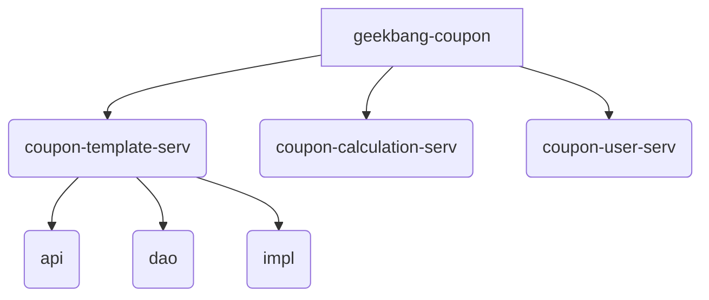
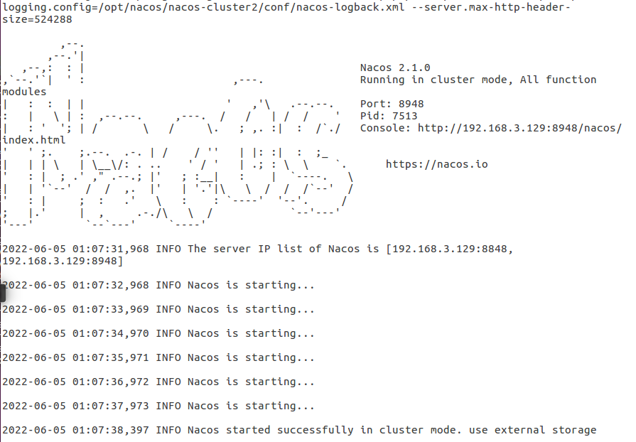
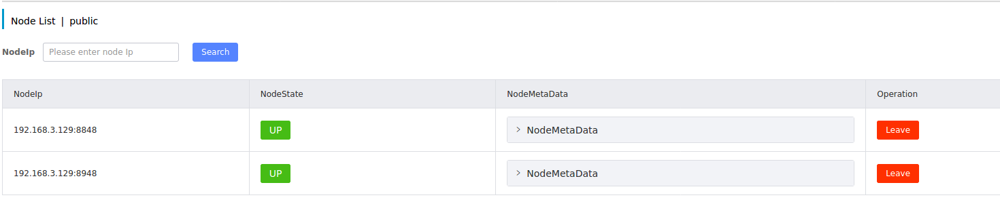
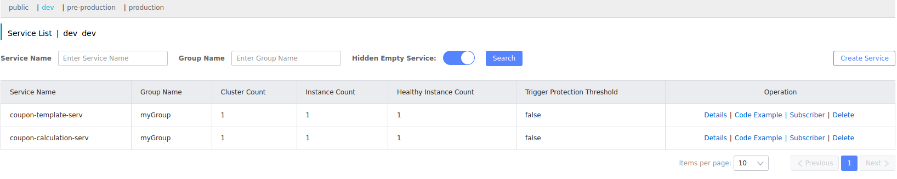
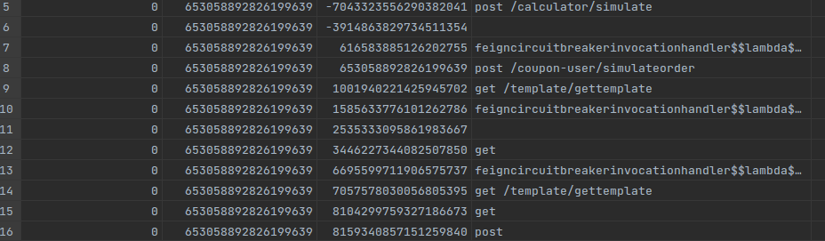
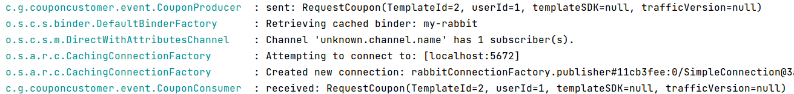
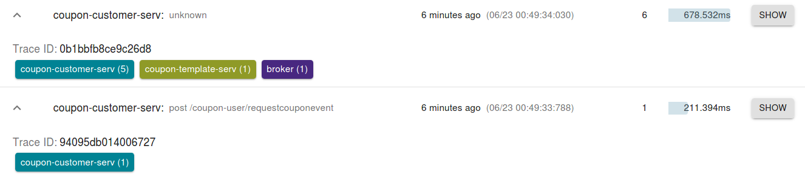

# Spring CLoud简介

## 单体应用与微服务架构

### 单体应用

- 单体应用：把系统中所有的功能、模块耦合在一个应用中的架构方式。
- 也就是将所有的代码及功能都包含在一个WAR包中的项目组织方式。
- 它的组成就是由 多个模块（所有资源）打成一个war包，运行在一个服务器上，也就是 一个进程去运行。
- 典型的就是用SSM框架做的web项目，部署在tomact服务器上

缺点：

1. 扩展难，迭代困难，回滚困难；
2. 团队协作难

优点：

1. 项目易于管理
2. 部署简单


### 微服务架构

- 微服务架构是在 SOA（面向服务架构）之上做的进一步扩展

- 单一应用程序划分成一组小的服务，服务之间互相协调、互相配合，为用户提供最终价值的架构方式；
- 微服务 是将一个大的应用拆分成多个小的应用 ( 微服务  ) ；
- 每个服务运行在其<font color='red'>独立</font>的进程中，服务与服务间采用轻量级的通信机制互相沟通（通常是基于HTTP的RESTful API），所有的应用一起工作完成整个项目的业务。
- 系统中的各个微服务可被技术选项，独立开发，独立部署，独立运维，各个微服务之间是松耦合的。
- 每个微服务仅关注于完成一件任务并很好地完成该任务。在所有情况下，每个任务代表着一个小的业务能力。

优点：

1. 方便局部扩展，团队协作方便；
2. 技术选型多样化；
3. 单个微服务的复杂性低、易于维护和开发；
4. 快速迭代+快速回滚；
5. 资源利用大大提高（弹性机房水位调拨；流量整形；熔断降级）；
6. 高可用

缺点：

1. 项目总体比较复杂；
2. 开发成本高；
3. 微服务的部署相对麻烦。


## 简介

Spring开源社区主导孵化的专门为了解决微服务架构难题诞生的一款“微服务全家桶”框架。

Spring Boot和 Spring Cloud达成了一种默契的配合：

- Spring Boot主内，通过自动装配合各种开箱即用的特性，搞定数据访问层、RESTful接口、日志组件、内置容器等基础功能；
- Spring Cloud主外，在应用集群之外提供各种分布式系统的支持特性，实现负载均衡、熔断降级、配置管理等诸多微服务领域的功能。


## Spring Cloud组件

Spring Cloud Alibaba组件库是由阿里巴巴提供的组件库，逐渐取代了Spring Cloud Netflix组件库。

Spring Cloud的核心组件库如下图所示：


## 项目简介

搭建一个简化版的营销优惠计算系统，实现优惠券模块的创建、用户领取优惠券、下单核销优惠券和订单价格试计算等功能。


1. 优惠券模板服务

   > 在这个项目中，定义了满减、随机立减、满折、晚间双倍优惠等多种券模板类型，模板服务实现了模板规则的创建、克隆、分页查找等功能。

2. 优惠计算服务

   > 这个模块是根据用户购物车中的商品信息（单价、数量、所属门店）和优惠券信息，来计算当前订单优惠后的价格。另外，如果用户有多张优惠券，我还提供了“优惠金额试算”服务，帮助用户挑选最省钱的优惠券。

3. 用户服务

   > 这是暴露给外部用户使用的接口，它依赖于模板服务和优惠计算服务完成底层逻辑，主要业务场景是用户领券、订单价格试算、下单核销和订单金额试算等功能。

4. 平台类组件

   > 主要包括一些业务无关的中心化组件，比如 Gateway 网关等等。


开发流程：先用 Spring Boot 搭建出优惠券平台的单体应用，然后在这个基础上做 Spring Cloud 改造。

- Spring Boot开发阶段

  > 使用 spring-data-jpa 实现数据库 CRUD 操作，使用spring-web 是开发 RESTFul 风格的 API 接口

  - 通过 Spring Boot 快速落地了优惠券平台的三个业务模块

  ***


- Spring Cloud微服务化改造

  1. 第一阶段：搭建基础的微服务功能，实现**微服务之间的通信**

     > 关键技术是 Nacos 注册中心、Loadbalancer 客户端负载均衡组件和 OpenFeign 服务间调用组件

     1. 服务治理：搭建基础的跨服务调用功能
     2. 负载均衡：在服务治理的基础上，引入 Loadbalancer 组件为跨服务调用添加负载均衡的能力
     3. 简化服务调用：使用 OpenFeign 组件对用户服务进行改造，将原先复杂的 WebClient 调用替换为简洁的 OpenFeign 调用

  2. 第二阶段：为各个模块构建**服务容错**、**分布式配置中心**、**分布式链路追踪能力**

     > 涉及的技术组件是 Sentinel、Nacos Config、Sleuth+Zipkin+ELK

     1. 配置管理：配置管理的重点是将三个微服务应用接入到 Nacos Config 配置中心，使用远程配置中心存储部分配置项。
     2. 服务容错：搭建 Sentinel Dashboard 控制台，通过控制台将降级规则和流量整形规则应用到业务埋点中。
     3. 链路追踪：这部分的重点是搭建分布式链路追踪与日志系统。

  3. 第三阶段：进一步实现**微服务网关**、**消息驱动**和**分布式事务**

     > 涉及的技术组件是 Gateway、Stream 和 Seata。


# 搭建Spring boot单体项目




## coupon-template-serv子摸块

业务分类：创建、查找、克隆、删除优惠券模板。它内部包含了三个子模块：

- coupon-template-api：存放公共 POJO 类或者对外接口的子模块；
- coupon-template-dao：存放数据库实体类和 Dao 层的子模块；
- coupon-template-impl：核心业务逻辑的实现层，对外提供 REST API。


### coupon-template-api模块

存放了接口 Request 和 Response 的类模板，是另两个子模块需要依赖的公共类库。

- coupon-template-api 模块是专门用来存放公共类的仓库，我把 REST API 接口的服务请求和服务返回对象的 POJO 类放到了里面。
- <font color='red'>在微服务领域，将外部依赖的 POJO 类或者 API 接口层单独打包是一种通用做法</font>，这样就可以给外部依赖方提供一个“干净”（不包含非必要依赖）的接口包，为远程服务调用（RPC）提供支持。

#### 依赖

工具类依赖：

- lombok ： 快速生成类的基础代码

  > @Data 注解自动生成 getter、setter、toString等方法，@NoArgsConstructor 和@AllArgsConstructor 两个注解分别生成无参构造器和全参构造器，@Builder注解用来链式生成对象。

- guava ：

- validation-api ：对参数做判定和验证

  > @NotNull非空验证，如果请求参数为空，自动返回 Bad request 异常


#### 类

- 枚举类：优惠券类型CouponType

- 服务请求和服务返回对象的 POJO 类：CouponTemplateInfo类、CouponInfo类、PageCouponTemplateInfo类 和 TemplateSearchParam 类

  > CouponTemplateInfo类是优惠券模板类，对应CouponType的类型和优惠券使用规则
  >
  > CouponInfo类是领取到用户手中的具体的优惠券类

- 优惠券规则类：TemplateRule 和 Discount类


#### 思想

- ”防御性编程“思维
- 电商项目中的金额用Long表示 分，比使用Double或者BigDecimal表示 元 更好


### coupon-template-dao模块

负责管理数据库实体类、DAO层接口。

#### 依赖

- coupon-template-api: 引入 api 包下的公共类；
- spring-boot-starter-data-jpa: 添加 spring-data-jpa 的功能进行 CRUD 操作；
- mysql-connector-java: 引入 mysql 驱动包，驱动版本尽量与 mysql 版本保持一致


#### 类

- 数据库实体类：CouponTemplate

- Dao：CouponTemplateDao

- Conventer：CouponTypeConventer、RuleConventer

  > 与@Convent注解配合使用


#### 思想：约定大于配置

- 对于数据库实体类，用了 javax.persistence 包和 Spring JPA 包的标准注解，对数据库字段进行了映射，一些常用注解：

  - @Entity：作用于类上，声明了“数据库实体”对象，它是数据库 Table 在程序中的映射对象

  - @EntityListeners(AuditingEntityListener.class)

  - @Table(name = "table_name")：指明对应于数据库表的名称

  - @ID/@GeneratedValue：指定某一字段为唯一主键，定义主键生成策略

  - @Column(name = "rule", nullable = false)：字段与列的映射

  - @CreatedDate：日期类为空时自动填充当前时间

  - @Convert(converter = RuleConverter.class)：如果数据库中存放的是 code、string、数字等等标记化对象，可以使用 Convert 注解指定一个继承自 AttributeConverter 的类，将 DB 里存的内容转化成一个 Java 对象。

    ```java
    @Convert(converter = RuleConverter.class) 
    private TemplateRule rule;
    
    @Converter
    public class RuleConverter implements AttributeConverter<TemplateRule, String > {
        @Override
        public String convertToDatabaseColumn(TemplateRule rule) {
            return JSON.toJSONString(rule);
        }
    
        @Override
        public TemplateRule convertToEntityAttribute(String rule) {
            return JSON.parseObject(rule, TemplateRule.class);
        }
    }
    ```

- DAO层，借助 Spring Data 的强大功能，只通过接口名称就可以声明一系列的 DB 层操作

  ```java
  public interface CouponTemplateDao
          extends JpaRepository<CouponTemplate, Long> {
  
      List<CouponTemplate> findAllByShopId(Long shopId);
  
      Page<CouponTemplate> findAllByIdIn(List<Long> Id, Pageable page);
  
      Integer countByShopIdAndAvailable(Long shopId, Boolean available);
  
      @Modifying
      @Query("update CouponTemplate c set c.available = 0 where c.id = :id")
      int makeCouponUnavailable(@Param("id") Long id);
  }
  ```

  - Dao接口继承自`JpaRepository<T, ID>`，会自动注入容器，不需要@mapper注解, 要在启动类上加`@EnableJpaAuditing`注解

    ```java
    public interface JpaRepository<T, ID> extends PagingAndSortingRepository<T, ID>, QueryByExampleExecutor<T>
    ```

  - JpaRepository 类中内置了各种各样的数据操作方法。比如通过内置的 `save 方法`完成对象的创建和更新，也可以使用内置的 `delete 方法`删除数据。

  - 有三种查询方式：

    1. 通过接口名称查询：将查询语句写到接口的名称中；

       ```java
       // jpa 使用了一种约定大于配置的思想
       // 把要查询的字段定义在接口的方法名中，发起调用时后台就会自动转化成可执行的 SQL 语句。
       // 构造方法名的过程需要遵循 < 起手式 >By< 查询字段 >< 连接词 > 的结构。
       List<CouponTemplate> findAllByShopId(Long shopId);
       Integer countByShopIdAndAvailable(Long shopId, Boolean available);
       ```

    2. 通过Example对象查询：构造一个模板对象，使用 findAll 方法来查询；

       ```java
       // 构造一个 CouponTemplate 的对象，将你想查询的字段值填入其中,做成一个查询模板
       // 调用 Dao 层的 findAll 方法即可
       CouponTemplate example = CouponTemplate.builder()
                       .shopId(request.getShopId())
                       .category(CouponType.convert(request.getType()))
                       .available(request.getAvailable())
                       .name(request.getName())
                       .build();
       
       Pageable page = PageRequest.of(request.getPage(), request.getPageSize());
       // 使用example对象做分页查询，查询字段包括shopId、category、available、name
       Page<CouponTemplate> templates = couponTemplateDao.findAll(Example.of(example), page);
       ```

    3. 自定义查询 : 通过 Query 注解自定义复杂查询语句。

       ```java
       @Modifying
       @Query("update CouponTemplate c set c.available = 0 where c.id = :id")
       int makeCouponUnavailable(@Param("id") Long id);
       ```


### coupon-template-impl模块

用于实现业务逻辑，相当于service层和controller层。


#### 依赖

- 引入了 coupon-template-api 和 coupon-template-dao 两个内部依赖项
- spring-boot-starter-web依赖


#### 类

- service层：CouponTemplateService接口和CouponTemplateServiceImpl
- controller层：CouponTemplateController，对外暴露REST API


#### 注解

- **@Valid：**用于校验，对于前端传进来的参数进行判断检查。

- @**RequestBody**：参数校验，将请求主体中的参数绑定到一个对象中。原理是：**根据请求主体中的参数名与对象的属性（字段）名进行匹配绑定值。**

  > @RequestBody一般与@Valid注解一起使用，在参数的校验上，是十分友好的

- **@RequestParam(value, required, defaultValue)**：将请求参数绑定至方法参数

***


## coupon-calculation-serv子模块

这个子模块提供了用于计算订单的优惠信息的接口，它是一个典型的“计算密集型”服务。计算密集型服务一般具备两个特征：

- **不吃网络 IO 和磁盘空间；**
- **运行期主要占用 CPU、内存等计算资源。**

> 做大型架构的时候，通常把I/O密集型服务与计算密集型服务分割开来，提高资源利用率


calculation模块分为了两个子模块

- coupon-calculation-api：定义公共的POJO类
- coupon-calculation-impl：实现优惠价格计算业务，依赖于api层的公共类

> 根据依赖关系，搭建项目时先搭建依赖关系中处于底层的模块，比如这个先搭建api层


### coupon-calculation-api模块

#### 依赖

- 需要用到template-serv中的消费券模板类，所以导入coupon-template-api 的依赖项


#### 类

- 订单信息类：ShoppingCart 类
- 商品信息类：Product
- ”价格试算“订单类：SimulationOrder
- ”价格试算“结果类：SimulationResponse


### coupon-calculation-impl模块

运用<font color='red'>模板设计模式</font>来封装计算逻辑。模板模式是一种基于抽象类的设计模式，它的思想很简单，就是将共性的算法骨架部分上升到抽象层，将个性部分延迟到子类中去实现。

优惠券类型有很多种，比如满减券、打折券、随机立减等等，这些券的 计算流程（共性部分）是【相同】的，但具体的计算规则（个性部分）是【不同】的。

<font color='red'>采用模板模式：将共性的部分抽象成了 AbstractRuleTemplate 抽象类，将各个券的差异性计算方式做成了抽象类的子类。</font>


#### 依赖

- coupon-template-api 和 coupon-calculation-api 两个依赖项
- spring-boot-starter-web


#### 类

- 优惠券计算规则接口与抽象类：RuleTemplate、AbstractRuleTemplate

- 优惠券计算规则具体实现类：DiscountTemplate、MonetOffTemplate、RandomReductionTemplate、DummyTemplate、LonelyNightTemplate

- 优惠券工厂类：CouponTemplateFactory

  > 工厂方法会根据订单将 优惠券子类 转为顶层接口 RuleTemplate 返回，但实际的优惠情况是由子类重写的方法实现的。这样做可以 尽可能对上层业务屏蔽其底层业务复杂度，底层具体业务逻辑的修改对上层是无感知的，这其实也是开闭原则的思想。

- 业务类：CouponCalculateionService

- 控制类：CouponCalculationController

  > 提供两个接口，一个完成订单最优惠价格计算，第二个接口完成优惠券价格试算

#### 思想

- 模板模式
- 工厂模式


## coupon-customer-serv子模块


# Spring cloud基础

## 服务治理——Nacos体系架构

### 注册中心

各微服务所提供的服务信息的集中管理者，所有微服务节点在启动后都要将自己的【地址信息】和【服务名称】添加到注册中心，通过上面这两个信息，调用方就能精确定位到目标微服务。

1. 服务注册：服务B将自己的信息添加到注册中心
2. 服务发现：服务A从注册中心获取服务B的所有节点列表
3. 发起服务调用：服务A从服务B提供的服务列表中选择一个发起调用
4. 服务剔除：注册中心检测到节点异常 或 服务节点关闭会重启发送”服务下线“指令，注册中心标记当前节点为下线状态

#### 异常容错

如果服务B集群因为未知的网络故障导致无法响应服务，这时服务A向服务B发起服务调用，就会发生超时或者服务无法响应的异常情况。

注册中心通过 `“healthcheck”` 或者 `”heartbeat“` 机制来标记异常服务。

- heartbeat：每个节点每隔一段时间向注册中心同步自己当前的状态。
  - 如果节点持续发送心跳信息，则一切正常，服务可以被发现；
  - 如果注册中心在一段时间内没有收到 Client 的心跳包，注册中心就会将这个节点标记为【下线】状态，进而将该服务从服务列表中【剔除】。

完整的微服务生命周期图如下：


### Nacos体系架构

Spring Cloud 中的服务注册中心。

官网slogan：一个更易于构建云原生应用的动态服务发现、配置管理和服务管理平台。

优势：

1. 动态配置服务：动态配置服务让您能够以中心化、外部化和动态化的方式管理所有环境的配置。动态配置消除了配置变更时重新部署应用和服务的需要
2. 服务发现和管理：动态服务发现对以服务为中心的（例如微服务和云原生）应用架构方式非常关键。Nacos支持DNS-Based和RPC-Based（Dubbo、gRPC）模式的服务发现。Nacos也提供实时健康检查，以防止将请求发往不健康的主机或服务实例。
3. 动态DNS服务：通过支持权重路由，动态DNS服务能让您轻松实现中间层负载均衡、更灵活的路由策略、流量控制以及简单数据中心内网的简单DNS解析服务


#### 领域模型

Nacos的服务领域模型是以”服务''为维度构建起来的。

- 描述了服务与实例之间的边界和层级关系。
- 这个服务是指微服务的服务名，而不是集群中的单个服务器。

- Nacos的服务领域模型从上到下分为服务、集群和实例三层


**服务**

- 元数据：一组包含了服务描述信息（如服务版本等）和自定义标签的数据集合
- 保护阈值：服务的健康实例树与总实例的比例小于保护阈值的时候，Nacos会开启保护模式，不再主动剔除服务实例，同时还会将不健康的实例返回给消费者

**集群**

- 一个服务由多个服务实例组成，可以设置自己的数据，还可以为每个服务实例设置它所属的集群
- 集群这个层级可以为持久化节点设置健康检查模式
- 持久化节点是会保存到Nacos服务端的实例，即使该实例的客户端进程没有在运行也不会被服务端删除；Nacos会采取 “主动探活” 的方式检查持久化节点的健康情况
- 临时节点不会被持久化保存在 Nacos 服务器，并且通过主动发送 heartbeat 请求向服务器报送自己的状态

**实例**

- 实例就是指服务节点，我们可以在 Nacos 控制台查看每个实例的 IP 地址和端口、编辑实例的元数据信息、修改它的上线 / 下线状态或者配置路由权重等等。


#### 数据模型

服务调用的发起方是如何定位到领域模型中的服务实例？通过Nacos的数据模型定位。

Nacos的数据模型有三个层次结构，他们是依次包含的关系

- Namespace

  > 即命名空间，最顶层的数据结构，区分开发环境、生产环境等不同的环境。默认情况下，所有服务都被部署到“public”公共命名空间。

- Group

  > 命名空间下有一个分组结构，不同分组间的微服务是相互隔离的，默认情况下所有微服务都属于“DEFAULT_GROUP”分组

- Service/DataId

  > 具体的微服务，如订单服务、用户服务等

通过Namespace+Group+Service的方式可以精确定位到一个具体的微服务。


#### Nacos基本架构

Nacos 的核心功能有两个“

- 一个是 **Naming Service**，也就我们用来做服务发现的模块；
- 另一个是 **Config Service**，用来提供配置项管理、动态更新配置和元数据的功能


Nacos 在功能模块层面的基本架构如上图：

- Open API：服务提供者和服务消费者通过Open API的Nacos服务器的核心模块通信，Open API是一组对外暴露的RESTful风格的HTTP接口

- Naming Service：将对象和实体的”名字“映射到元数据

- Nacos Core：提供一系列的平台基础功能，是支撑 Nacos 上层业务场景的基石

- Consistency Protocol：一致性协议，用来确保Nacos集群中各个节点之间数据一致性。

  > - Nacos 内部支持两种一致性协议，
  > - 一种是侧重一致性的 Raft 协议，基于集群中选举出来的 Leader 节点进行数据写入；
  > - 另一种是针对临时节点的 Distro 协议，它是一个侧重可用性（或最终一致性）的分布式一致性协议。

  

### Nacos集群环境搭建

搭建一个<font color='red'>高可用</font>的 Nacos 服务集群，以及使用 MySQL 作为 Nacos 的底层数据存储方案，实现了配置项的持久化。

保障系统高可用：

- 避免单点故障：在做系统架构的时候，应该假设任何服务器都有可能挂掉。
- 故障机器状态恢复：尽快将故障机器返回到故障前的状态。

Nacos 通过构建服务集群来保证自己的搞可用性。集群环境不仅可以有效规避单点故障引发的问题，同时对于故障恢复的场景来说，重新上线的机器也可以从集群中的其他节点同步数据信息，恢复到故障前的状态。


#### 下载

github地址下载最新稳定版，在自定义目录下解压后复制一份，模拟两台Nacos Server组成的集群。

```bash
# 解压
sudo tar -zxvf nacos-server-2.1.0.tar.gz -C /opt/nacos/
# 重命名文件夹
sudo mv nacos nacos-cluster1
# 复制
sudo cp -r nacos-cluster1 nacos-cluster2

/opt/nacos/nacos-cluster1
/opt/nacos/nacos-cluster2
```


#### 修改配置文件

- 端口号：默认8848
- 数据库配置：将 Nacos Server 的数据源迁移到更加稳定的 MySQL 数据库


#### 创建 DB Schema 和 Table

Nacos Server 的数据库用来保存配置信息、Nacos Portal 登录用户、用户权限等数据，下面我们分两步来创建数据库。

1. 创建一个数据库：nacos
2. 创建数据库表：运行nacos配置文件目录下的nacos-mysql.sql


#### 添加集群机器列表

Nacos Server 可以从一个本地配置文件中获取所有的 Server 地址信息，从而实现服务器之间的数据同步。

所以要在 Nacos Server 的 conf 目录下创建 cluster.conf 文件，并将 nacos-cluster1 和 nacos-cluster2 这两台服务器的 IP 地址 + 端口号添加到文件中。

```bash
# 1. 创建cluster.conf
sudo touch cluster.conf
# 2. 获取本地内网ip
ifconfig | grep “inet”
# 3. 在cluster.conf添加nacos集群服务器的ip地址
192.168.3.129:8849
192.168.3.129:8949
# 4. 将cluster.conf复制到集群中另一个服务器conf目录下
```


#### 启动服务

在bin目录下，有startup.sh启动文件，这是以集群模式启动。

```bash
sudo sh startup.sh
```

如果提示找不到logs文件夹，就按照它提示的位置创建logs文件夹。

启动之后，命令行提示：

```bash
nacos is starting with cluster
nacos is starting，you can check the /opt/nacos/nacos-cluster2/logs/start.out
```

可以打开`/opt/nacos/nacos-cluster2/logs/start.out` 查看启动情况，如果是这样的，就说明启动成功了



然后在浏览器访问http://192.168.3.129:8948/nacos/打开nacos控制台，使用 Nacos 默认创建好的用户 nacos 登录系统，用户名和密码都是 nacos，在ClusterManagement下可以看到集群各节点的健康状况。



下线：

```bash
gj@ubuntu:/opt/nacos/nacos-cluster2/bin$ sudo sh shutdown.sh 
The nacosServer(7513) is running...
Send shutdown request to nacosServer(7513) OK
```


### 集成Nacos

在 Nacos 的地盘上，下游服务需要先将自己作为“服务提供者”注册到 Nacos，这个流程叫做“服务注册”；而上游服务作为“服务消费者”，需要到 Nacos 中获取可供调用的下游服务的列表，这个流程就是“服务发现”。

- 下游服务：coupon-template-serv和coupon-calculation-serv 注册服务
- 上游服务：coupon-customer-serv 发现服务

我们要改造改造coupon-template-serv和coupon-calculation-serv，它们作为服务提供者，利用Nacos将他们的服务注册到注册中心； 改造coupon-customer-serv 服务，借助 Nacos 的服务发现功能从注册中心获取可供调用的服务列表，并发起一个远程服务调用。


#### 导入依赖

Nacos是Spring-Cloud-Alibaba项目中的一款组件，所以，首先需要在项目顶层pom中要引入pring Cloud 和 Spring Cloud Alibaba依赖并指定版本，Spring Boot、Spring Cloud 和 Spring Cloud Alibaba 三者之间有**严格的版本匹配关系**

[版本依赖关系](https://github.com/alibaba/spring-cloud-alibaba/wiki/%E7%89%88%E6%9C%AC%E8%AF%B4%E6%98%8E)

| Spring Cloud Alibaba Version | Spring Cloud Version     | Spring Boot Version |
| ---------------------------- | ------------------------ | ------------------- |
| 2021.0.1.0                   | Spring Cloud 2021.0.1    | 2.6.3               |
| 2.2.7.RELEASE                | Spring Cloud Hoxton.SR12 | 2.3.12.RELEASE      |
| 2021.1（项目中选择的版本）   | Spring Cloud 2020.0.1    | 2.4.2               |

- 在coupon-template-serv和coupon-calculation-serv 中加入 nacos-discovery-spring-boot-starter 依赖，他们是服务提供者，要注册服务。
- 在 coupon-customer-serv （服务消费者）中加入spring-cloud-starter-alibaba-nacos-discovery、spring-cloud-starter-loadbalancer、spring-boot-starter-webflux三个依赖，分别用于服务发现、负载均衡、服务调用。

```markdown
spring-cloud-starter-alibaba-nacos-discovery: Nacos 服务治理的组件，实现服务的注册与发现

spring-cloud-starter-loadbalancer：Spring Cloud 御用负载均衡组件 Loadbalancer，用来代替已经进入维护状态的 Netflix Ribbon 组件。

spring-boot-starter-webflux：Webflux 是 Spring Boot 提供的响应式编程框架，响应式编程是基于异步和事件驱动的非阻塞程序。Webflux 实现了 Reactive Streams 规范，内置了丰富的响应式编程特性。将用 Webflux 组件中一个叫做 WebClient 的小工具发起远程服务调用。
```


#### Nacos自动装配

Nacos 通过<font color='red'>自动装配流程（auto configuration）</font>加载配置项并开启服务注册，Spring Cloud 各个组件都采用了自动装配器实现了轻量级的组件集成功能，你只需要几行配置，剩下的初始化工作都可以交给背后的自动装配器来实现。

Spring-Cloud可以仅凭配置项就能开启Nacos的功能，Nacos是如何在启动阶段自动加载配置项并开启相关功能的？这是因为Nacos 的依赖项中包含了了几个自动装配器，它们掌管了Nacos核心功能的初始化任务。

- **NacosDiscoveryAutoConfiguration**：服务发现功能的自动装配器，它主要做两件事儿：加载 Nacos 配置项，声明 NacosServiceDiscovery 类用作服务发现；
- **NacosServiceAutoConfiguration**：声明核心服务治理类 NacosServiceManager，它可以通过 service id、group 等一系列参数获取已注册的服务列表；
- **NacosServiceRegistryAutoConfiguration**：Nacos 服务注册的自动装配器。


#### 添加Nacos配置项

#### 验证 Nacos 服务注册功能

- Nacos控制台——创建 namespace（命名空间）

分别创建三个不同的环境：production、pre-production 和 dev，用来表示生产环境、预发环境和开发环境。在创建 namespace 的过程中，一定要保证命名空间的 ID 和项目中的 namespace 属性是一致的。

- 启动coupon-template-impl和coupon-calculation-impl，日志输出

```java
coupon-template-impl
2022-06-06 01:06:15.803  INFO 10154 --- [           main] c.a.c.n.registry.NacosServiceRegistry    : nacos registry, myGroup coupon-template-serv 192.168.3.129:20000 register finished
coupon-calculation-impl
2022-06-06 01:07:17.988  INFO 10436 --- [main] c.a.c.n.registry.NacosServiceRegistry : nacos registry, myGroup coupon-calculation-serv 192.168.3.129:20001 register finished
```

- Nacos控制台——服务列表



#### 通过服务发现机制向服务提供者发起调用

##### 改造coupon-customer-serv

1. 添加依赖
2. 划清服务之间的依赖关系
3. 添加Nacos配置项
4. 将 Autowire 注入本地服务的方式，替换为使用 WebClient 发起远程调用

##### WebClient 远程调用

1. 创建一个WebClient配置类，这样才能在业务类中注入WebClient对象，并发起服务调用

   ```java
   // Configuration注解声明配置类
   @org.springframework.context.annotation.Configuration
   public class Configuration {
       // 注册Bean并添加负载均衡功能
       @Bean
       @LoadBalanced
       public WebClient.Builder register() {
           return WebClient.builder();
       }
   }
   ```

   

2. 将本地调用改造为WebClient远程调用

   ```java
   //CouponTemplateInfo templateInfo = templateService.loadTemplateInfo(request.getCouponTemplateId());
   
   CouponTemplateInfo templateInfo = webClientBuilder.build()
           .get()
           .uri("http://coupon-template-serv/template/getTemplate?id=" + request.getCouponTemplateId())
           .retrieve()
           .bodyToMono(CouponTemplateInfo.class)
           .block();
   ```

   - get：指明了 Http Method 是 GET，如果是其他请求类型则使用对应的 post、put、patch、delete 等方法；
   - uri：指定了访问的请求地址；
   - retrieve + bodyToMono：指定了 Response 的返回格式；
   - block：发起一个阻塞调用，在远程服务没有响应之前，当前线程处于阻塞状态。

   

### Nacos服务发现的底层原理

- Nacos Client 通过一种**主动轮询**的机制从 Nacos Server 获取服务注册信息，包括地址列表、group 分组、cluster 名称等一系列数据；

- Nacos Client 会开启一个本地的**定时任务**，每间隔一段时间，就尝试从 Nacos Server “pull"最新的注册信息更新到本地；

- 负责拉取服务的任务是 **UpdateTask 类**，它实现了 Runnable 接口。Nacos 以开启线程的方式调用 UpdateTask 类中的 run 方法，触发本地的服务发现查询请求。

- 触发过程：

  ```
  spring.factory 文件中配置了 NacosDiscoveryClientConfiguration 类，用于 springboot 的初始化时的自动装配。
  在 NacosDiscoveryClientConfiguration 类中会向 spring 容器中添加  NacosWatch 这个 bean, NacosWatch发布心跳事件。
  
  NacosWatch.start() -> NacosNamingService.subscribe() -> HostReactor.subscribe() -> HostReactor.getServiceInfo() ->  HostReactor.scheduleUpdateIfAbsent() -> HostReactor.addTask(new UpdateTask(serviceName, clusters)); UpdateTask 就是作为 task 添加到定时执行队列里的。
  ```


## 负载均衡——LoadBalance

负载均衡：将访问流量分散到集群中的各个服务器上。

常见的有 服务端负载均衡 和 客户端负载均衡。

#### 服务层负载均衡

又称为网关层负载均衡，实现方式时在服务集群中设置一个中心化负载均衡器，比如API Gateway。

- 发起服务间调用的时候，服务请求并不直接发向目标服务器，而是发给这个**全局负载均衡器**，它再根据配置的**负载均衡策略**将请求转发到目标服务。


服务层负载均衡技术的优点是：客户端不需要知道完整的服务列表，也不关心负载均衡技术，整个调用服务的过程对于客户端来说完全透明。

缺点是：

1. **网络消耗：**多了一次客户端请求网关层的网络开销
2. **复杂度和故障率提升：**需要额外搭建内部网关组件作为负载均衡器，增加了系统复杂度，而多出来的那一次的网络调用无疑也增加了请求失败率。


#### 客户端负载均衡

Spring Cloud Loadbalancer 采用了客户端负载均衡技术，每个发起服务调用的客户端都存有完整的目标服务地址列表，根据配置的负载均衡策略，由客户端自己决定向哪台服务器发起调用。

优点：

1. 网络开销小：由客户端直接发起点对点的服务调用，没有中间商赚差价；
2. 配置灵活：各个客户端可以根据自己的需要灵活定制负载均衡策略。


- 先置条件：发起服务调用的客户端必须获取所有目标服务器的地址
  - 客户端负载均衡技术依赖于服务发现技术来获取服务列表
  - LoadBalancer 和 Nacos 配合


#### 金丝雀测试

当你想要上线一个 【涉及上下游代码改动】 的线上应用的时候，首先想到的是先要做一个线上测试。这个测试必须在极小规模的范围内进行，不能影响到整个集群。

- 可以把代码改动部署到极个别的几台机器上，这几台机器就叫做“金丝雀”；
- 只有带着【测试流量标记】的请求会被发到这几台服务器上，而正常的流量只会打到集群中的其它机器上。

测试：

```markdown
用户领券的接口位于 coupon-customer-serv 子模块中，它通过负载均衡策略调用了 coupon-template-serv 完成了领券操作。

我们把负载均衡策略定义在 coupon-customer-serv 中，把 coupon-template-serv 作为金丝雀测试的目标服务。
1. 创建了一个叫 CanaryRule 的负载均衡规则类；
2. CanaryRule 借助 Http Header 中的属性和 Nacos 服务节点的 metadata 完成测试流量的负载均衡。
	1. CanaryRule 如何识别测试流量：如果 WebClient 发出一个请求，其 Header 的 key-value 列表中包含了特定的流量 Key：traffic-version，那么这个请求就被识别为一个测试请求，只能发送到特定的金丝雀服务器上。
	2. CanaryRule 如何对测试流量做负载均衡：包含了【新的代码改动的服务器】就是这个金丝雀，我会在这台服务器的 Nacos 元数据中插入同样的流量密码：traffic-version。如果 Nacos 元数据中的 traffic-version 值与测试流量 Header 中的一样，那么这个 Instance 就是我们要找的那只金丝雀。
3. coupon-customer-serv 的启动类上添加一个 @LoadBalancerClient 注解，将 CanaryRuleConfiguration 类和目标服务关联起来；
4. 启动两个 coupon-template-serv 实例，其中一个的实例的元数据中添加一个新变量traffic-version=coupon-template-test001；
5. 本地启动项目并调用 coupon-customer-serv 的用户领券接口做测试。
	1. 如果你在请求参数中指定了 traffic-version=coupon-template-test001，那么这个请求将调用到金丝雀服务器；
	2. 如果没有指定 traffic-version，那么请求会被转发到正常的服务节点；
	3. 如果你乱填了一个错误的 traffic-version，那么方法会返回 503-Service Unavailable 的异常。
```

> 一定要启动多个coupon-template-serv 实例，因为不涉及到流量密码的请求需要正常的服务节点处理，只有带有流量密码的请求会交由金丝雀处理。


## 服务间调用——OpenFeign

对比WebClient远程调用：

```java

webClientBuilder.build()
    // 声明这是一个POST方法
    .post()
    // 声明服务名称和访问路径
    .uri("http://coupon-calculation-serv/calculator/simulate")
    // 传递请求参数的封装
    .bodyValue(order)
    .retrieve()
    // 声明请求返回值的封装类型
    .bodyToMono(SimulationResponse.class)
    // 使用阻塞模式来获取结果
    .block()
```

WebClient 的远程调用使得 业务层 引入了很多与业务无关的概念，比如请求地址、请求类型等等。从【职责分离】的角度来说，我们应该尽量把这些业务无关的逻辑，从业务代码中剥离出去。

### OpenFeign

OpenFeign 使用了一种“动态代理”技术来封装远程服务调用的过程。

- 远程服务调用的信息被写在了 FeignClient 注解所声明的接口中；
- 服务的名称、接口类型、访问路径都通过相应的注解做出声明；
- OpenFeign 通过解析这些注解标签生成一个“动态代理类”，这个代理类会将接口调用转化为一个远程服务调用的 Request，并发送给目标服务，从而向业务层屏蔽具体的服务调用逻辑。

### OpenFeign动态代理原理


流程：

1. 项目启动的时候OpenFeign框架会自动开启扫包，找到指定目录下的被@FeignClient修饰的接口；
2. OpenFeign对每个被@FeignClient修饰的接口生成代理对象，代理对象会被自动添加到Spring上下文，从而可以在业务层被注入；
3. 业务层调用接口相关服务，会由其代理对象接管，发起远程服务调用。

动态代理过程：


1. 项目加载：项目启动阶段，EnableFeignClients 注解使用 Spring 框架的 Import 注解导入了 FeignClientsRegistrar 类，开始了 OpenFeign 组件的加载过程；
2. 扫包：FeignClientsRegistrar 会在指定的包路径下扫描所有的 FeignClients 类，并构造 FeignClientFactoryBean 对象来解析 FeignClient 接口；
3. 解析FeignClient注解：FeignClientFactoryBean 有两个重要的功能，一个是解析 FeignClient 接口中的请求路径和降级函数的配置信息；另一个是触发动态代理的构造过程；
4. 构建动态代理对象：动态代理构造是由更下一层的 ReflectiveFeign 完成的，它主要负责创建出 FeignClient 接口的动态代理对象。ReflectiveFeign有两个重要任务：
   - 一个是解析 FeignClient 接口上各个方法级别的注解，将其中的远程接口 URL、接口类型（GET、POST 等）、各个请求参数等封装成元数据，并为每一个方法生成一个对应的 MethodHandler 类作为方法级别的代理；
   - 另一个重要任务是将这些 MethodHandler 方法代理做进一步封装，通过 **Java 标准的动态代理协议**，构建一个实现了 InvocationHandler 接口的动态代理对象，并将这个动态代理对象绑定到 FeignClient 接口上。


### OpenFeign实现服务间调用

1. 引入依赖

   ```
   spring-cloud-starter-openfeign
   ```

2. 改造Template 和 calculation 远程调用

   1. 构建FeignClient接口，如：

      ```java
      @FeignClient(value = "coupon-template-serv", path = "/template")
      public interface TemplateService {
          // 读取优惠券
          @GetMapping("/getTemplate")
          CouponTemplateInfo getTemplate(@RequestParam("id") Long id);
          
          // 批量获取
          @GetMapping("/getBatch")
          Map<Long, CouponTemplateInfo> getTemplateInBatch(@RequestParam("ids") Collection<Long> ids);
      }
      ```

   2. 在业务层将WebClient远程调用改为OpenFeign 接口调用

3. 在customer启动类上添加@EnableFeignClient注解，指定要扫描的包所在路径。如 `@EnableFeignClients(basePackages = {"com.ganjing"})`

**注意：**

- FeignClient：使用该注解修饰 OpenFeign 的代理接口，你需要确保**接口中每个方法的寻址路径和你要调用的目标服务保持一致**。除此之外，FeignClient 中指定的**服务名称也要和 Nacos 服务端中的服务注册名称保持一致**；
- EnableFeignClients：在启动类上声明 EnableFeignClients 注解，并指定加载 FeignClient 接口的包路径，这样 OpenFeign 组件才能在你的程序启动之后对 FeignClient 接口进行初始化和动态代理。


### OpenFeign高级玩法

#### 异常信息排查——日志信息打印

让OpenFeign自动打印所有远程方法的 Request 和 Response，方便我们做异常信息排查。

1. 在配置文件中指定 FeignClient 接口的日志级别为 Debug；
2. 在应用的上下文中使用代码的方式声明 Feign 组件的日志级别（Configuration·类），指定OpenFiegn向日志中记录什么样内容
   1. NONE：不记录任何信息，这是 OpenFeign 默认的日志级别；
   2. BASIC：只记录服务请求的 URL、HTTP Method、响应状态码（如 200、404 等）和服务调用的执行时间；
   3. HEADERS：在 BASIC 的基础上，还记录了请求和响应中的 HTTP Headers；
   4. FULL：在 HEADERS 级别的基础上，还记录了服务请求和服务响应中的 Body 和 metadata，FULL 级别记录了最完整的调用信息。

> 日志打印级别：从低到高：trace -> debug -> info -> warn -> error -> fatal
>
> 1. debug级别：DEBUG | 调试：指明细致的事件信息，对调试应用最有用。
> 2. info级别：INFO | 信息：指明描述信息，从粗粒度上描述了应用运行过程。

日志信息在哪查看？——控制台会输出

```java
@PostMapping("simulateOrder")
public SimulationResponse simulate(@Valid @RequestBody SimulationOrder order){
    return userService.simulateOrderPrice(order);
}


--> CouponTemplateInfo templateInfo = templateService.getTemplate(coupon.getTemplateId());
--> calculationService.simulate(order);

// ------------------------ 日志 -------------------------------------
[CalculationService#simulate] ---> POST http://coupon-calculation-serv/calculator/simulate HTTP/1.1
[CalculationService#simulate] Content-Length: 704
[CalculationService#simulate] Content-Type: application/json
[CalculationService#simulate] 
[CalculationService#simulate] {"products":[{"productId":null,"price":3000,"count":2,"shopId":3},{"productId":null,"price":1000,"count":10,"shopId":1}],"couponIds":[10,21],"couponInfos":[{"id":10,"templateId":7,"userId":1,"shopId":null,"status":1,"template":{"id":7,"name":"随机立减券","desc":"满50随机立减最多5元","type":"3","shopId":null,"rule":{"discount":{"quota":500,"threshold":5000},"limitation":10,"deadline":null},"available":true}},{"id":21,"templateId":4,"userId":1,"shopId":null,"status":1,"template":{"id":4,"name":"随机立减券","desc":"满50随机立减最多5元","type":"3","shopId":null,"rule":{"discount":{"quota":500,"threshold":5000},"limitation":10,"deadline":null},"available":true}}],"userId":1}
[CalculationService#simulate] ---> END HTTP (704-byte body)
[CalculationService#simulate] <--- HTTP/1.1 200 (228ms)
[CalculationService#simulate] connection: keep-alive
[CalculationService#simulate] content-type: application/json
[CalculationService#simulate] date: Thu, 09 Jun 2022 02:10:23 GMT
[CalculationService#simulate] keep-alive: timeout=60
[CalculationService#simulate] transfer-encoding: chunked
[CalculationService#simulate] 
[CalculationService#simulate] {"bestCouponId":21,"couponToOrderPrice":{"21":15720,"10":15779}}
[CalculationService#simulate] <--- END HTTP (64-byte body)
```


#### 超时判定——防止服务雪崩

为了隔离下游接口调用超时所带来的的影响，我们可以在程序中设置一个超时判定的阈值，一旦下游接口的响应时间超过了这个阈值，那么程序会自动取消此次调用并返回一个异常。

- 添加配置项即可

  ```yml
  feign:
    client:
      config:
        # 全局超时配置
        default:
          # 网络连接阶段1秒超时
          # 单位毫秒
          connectTimeout: 1000
          # 服务请求响应阶段5秒超时
          readTimeout: 5000
        # 针对某个特定服务的超时配置
        coupon-template-serv:
          connectTimeout: 1000
          readTimeout: 2000
  ```

  1. default 节点配置了全局层面的超时判定规则，它的生效范围是所有 OpenFeign 发起的远程调用；
  2. coupon-template-serv 下面配置的超时规则只针对向 coupon-template-serv 服务发起的远程调用。
  3. connectTimeout 的超时判定作用于“建立网络连接”的阶段；
  4. readTimeout 的超时判定则作用于“服务请求响应”的阶段（在网络连接建立之后）；
  5. RT（即服务响应时间）受后者影响比较大

在loadTemplate方法中睡眠2000ms：

```java
DEBUG 15891 --- [TemplateService#getTemplate] <--- ERROR SocketTimeoutException: Read timed out (2081ms)
DEBUG 15891 --- [TemplateService#getTemplate] java.net.SocketTimeoutException: Read timed out
```


#### 服务降级——FallBack

降级逻辑是在远程服务调用发生超时或者异常（比如 400、500 Error Code）的时候，自动执行的一段业务逻辑。

- OpenFeign 对服务降级的支持是借助 Hystrix 组件实现的；
- OpenFeign 支持两种不同的方式来指定降级逻辑，一种是定义 fallback 类，另一种是定义 fallback 工厂；

OpenFeign 接口的 getTemplate 远程调用发生了【异常或者超时】的情况，那么 OpenFeign 会主动执行对应的降级方法，也就是 TemplateServiceFallback 类中的 getTemplate 方法：

```java
2022-06-08 19:19:07.615  INFO 15891 --- [ HystrixTimer-1] c.g.c.f.f.TemplateServiceFallback: fallback getTemplate
```


#### 总结

**在日志打印方面**，OpenFeign 的日志信息是测试开发联调过程中的好帮手，但是在生产环境中你是用不上的，因为几乎所有公司的生产环境都不会使用 Debug 级别的日志，最多是 Info 级别。

**在超时判定方面**，有时候我们在线上会使用**多维度的超时判定**，比如 **OpenFeign + 网关层超时判定 + Sentinel** 等等判定。它们可以互相作为兜底方案，一旦某个环节突然发生故障，另一个可以顶上去。但这就形成了一个木桶理论，也就是几种判定规则中最严格的那个规则会优先生效。

> 有哪些超时判定算法？底层原理是什么？


# Spring Cloud 进阶

## Nacos 配置中心

Nacos既能用作注册中心，也能用作配置管理中心，分别是：nacos-discovery包和nacos-config包。

在微服务的架构体系中，我们会使用一个**中心化的分布式配置中心**作为配置文件的管理者。

- 在应用程序端，我们只将一些必要的配置项添加到配置文件中（如 application.yml 和 bootstrap.yml），而大部分的配置项都被保存在配置中心集群里。
- 客户端在启动的时候从配置中心获取所有的配置项，用于各个组件的初始化。


**动态属性推送——如何巧妙地利用配置中心的动态推送功能，将“变化的需求部分”和“不变的代码部分”隔离开来**


### Nacos Config


- **高可用**：集群化配置中心
- **环境隔离**
- **多格式支持**
- **访问控制**：控制用户的访问权限和读写权限
- **职责分离**：配置项与业务代码之间的职责分离
- **版本控制和审计功能**：根据Nacos 的“历史版本”功能，可以查看任何一个配置文件的历史修改记录，包括改动的时间和操作人。针对每一个改动记录，我们可以查看这一版本的配置详情，或者做线上配置项的回滚操作
- **多文件源读取**以及**运行期配置变更**：不重启应用程序的前提下更新配置信息
  - 配置项动态更新的使用场景：
    1. 业务开关
    2. 业务规则更新
    3. 灰度发布验证


### 集成nacos Config 实现配置项动态刷新

#### 动态配置推送

1. 将一些业务抽离成可动态配置的模式，也就是通过动态配置改变线上业务的表现方式；
2. 通过动态配置推送来实现业务场景。


#### SpringBoot的配置文件

|          | bootstrap                      | application    |
| -------- | ------------------------------ | -------------- |
| 加载顺序 | 先加载                         | 后加载         |
| 应用场景 | 配置系统级别的参数，一般不改动 | 应用级别的参数 |

在 Spring Cloud 2020.0.0 版本之后，bootstrap 文件不会被自动加载，你需要主动添加 spring-cloud-starter-bootstrap 依赖项，来开启 bootstrap 的自动加载流程。

为什么要将Nacos 配置中心的配置放在bootstrap配置文件中？

- Nacos配置中心存放了其他服务启动所必须的配置，比如数据库连接配置信息，所以要确保Nacos 配置项加载的优先级最高；
- 而在 Spring Boot 规范中，bootstrap 文件通常被用于应用程序的上下文引导，bootstrap.yml 文件的加载优先级是高于 application.yml 的。


### 接入 Nacos 配置中心实战

1. 导入依赖

   - nacos-config
   - bootstrap

2. 添加本地 Nacos config 配置项

3. 添加配置文件到 Nacos Config Server

   ```java
   [fixed-localhost_8848-dev] [subscribe] coupon-customer-serv+DEFAULT_GROUP+dev
   [fixed-localhost_8848-dev] [add-listener] ok, tenant=dev, dataId=coupon-customer-serv, group=DEFAULT_GROUP, cnt=1
   ```

   > 测试数据库的CRUD接口，如果业务正常运作，那么就说明你的程序可以从 Nacos Config 中获取到正确的数据库配置信息。

4. 动态配置推送

   1. Nacos Config 中添加了一个 disableCouponRequest 配置项;
   2. 声明一个变量disableCoupon控制是否发放优惠券;
   3. 在CouponCustomerController 类头上添加一个 **@RefreshScope 注解**，动态同步Nacos Config 中的属性变动 到当前类的变量中
   4. 测试：服务运行时，改变disableCouponRequest配置项，服务可以动态获取改变后的配置项，@RefreshScope可以将变更后的值刷新上下文context

   ```java
   [alhost_8848-dev] ： Refresh keys changed: [disableCouponRequest, spring.cloud.bootstrap.enabled]
   ```

   

## Sentinel体系结构

Sentinel：Sentinel 是面向分布式服务架构的高可用防护组件，主要以流量为切入点，从流量控制、熔断降级、系统自适应保护等多个维度来帮助用户保障微服务的稳定性。


资源：Setinel中的核心概念之一，最常见的资源是代码中的Java方法。

规则：流控规则来指定允许该资源 通过的请求次数等

规则的设定就是为了保护资源。

### 服务容错

服务容错主要用于防止服务雪崩，整个集群陷入瘫痪，一般来说两个因素会导致服务雪崩

1. 外部的高并发流量导致的请求数量急剧增多；
2. 内部各种未知异常导致的接口响应异常超时。

所以服务容错可以从【内外】两个方面入手。

- Sentinel对内部异常采用**降级熔断**的方式；
- 对外部流量采用**限流/整形**的方式。


#### 降级熔断

- **降级**：是指当服务调用发生了响应超时、服务异常等情况时，我们在服务内部可以执行一段“降级逻辑”。

  在降级逻辑中，可以对用户的请求返回一个能让业务执行下去的默认结果，也可以直接忽略异常，这个逻辑完全是自己设定，最重要的还是要让服务不会崩溃

- **熔断**：在异常降级和慢调用请求的比例达到一个阈值、窗口时间内降级请求达到一定数量的情况下，所有来访请求直接执行降级逻辑，给下游服务一段时间缓解压力

> 关于降级熔断，经验是
>
> 1. 主链路服务（也就是核心业务链路的重要服务）一定要设置降级预案，防止服务雪崩在核心业务上的传播。
> 2. 非核心链路的服务，应该设置手动降级开关，在大促等高并发场景下做主动降级，将额外的计算资源通过弹性方案匀给主链路服务。


#### 外部流量控制

在 Sentinel 中我们可以根据集群的处理能力，为每个服务设置一个限流规则。当外部访问量超过设定的阈值，后续的请求：

1. fast fail：快速失败
2. 预热模型：设定一个预热时间窗口，窗口时间内，阈值逐渐拉高，直到到达所预设的最高阈值
3. 排队模型：如果访问量超过了阈值，服务请求会被放入一个等待队列，并给定一个超时时间，如果服务请求在预设的超时时间内仍然未被处理，那么就会被移出队列。


#### Sentinel工作原理


当一个外部请求想要访问 Sentinel 的资源时，便会创建一个 Entry 对象。每一个 Entry 对象都要过五关斩六将，经过 Slot 链路的层层考验最终完成自己的业务，你可以把 Slot 当成是一类完成特定任务的“Filter”，这是一种典型的**职责链设计模式**。

SlotChain里面的每个Slot各司其职，执行不同的检查任务，也可以自定义slot，也可以设置优先级调整各个slot的执行顺序，官网的 slot 比如：

- NodeSelectorSlot
- ClusterBuilderSlot
- StatisticSlot

> 统计数据，负责做限流降级检查

- FlowSlot : 做流控规则的判定
- DegradeSlot : 做降级熔断判定
- ParamFlowSlot : 可以根据请求参数做精细粒度的流控，它经常被用来在大型应用中控制热点数据所带来的突发流量
- AuthoritySlot : 可以针对特定资源设置黑白名单，限制某些应用对资源的访问


### Sentinel实战——实施流量整形和限流策略

0. 下载sentinel控制台 jar包，启动dashboard，在浏览器直接访问 localhost:8080 地址

   ```bash
   java -Dserver.port=8080 -Dcsp.sentinel.dashboard.server=localhost:8080 -Dproject.name=sentinel-dashboard -jar sentinel-dashboard-1.8.2.jar
   ```

   

1. 将微服务接入Sentinel控制台

   1. 项目中导入依赖；
   2. 配置Sentinel属性；
   3. 对Sentinel资源进行标记——@SentinelResource
   4. 启动服务，对服务发起调用，即可在Sentinel控制台看到微服务信息；

   > Sentinel 会为 Controller 中的 API 生成一个默认的资源名称，这个名称就是 URL 的路径，如 /template/getTemplateInBatch; 也可以用@SentinelResource为每个方法设定更简洁的资源名称

2. 设置流控规则，Sentinel支持三种不同的流控模式

   1. **直接流控**：根据访问阈值直接限制对当前资源的访问（简单直观，适合小型项目）
   2. **关联流控：**对于存在竞争关系的资源，对优先级低的资源进行限流，尽可能保证高优先级的资源的竞争优势；访问阈值作用于高优先级的资源，限流规则作用于低优先级资源；
   3. **链路流控：**某一资源有多个访问链路，对其中的某条访问链路进行限流

   > 阈值类型有两种：
   >
   > 1. QPS：每秒请求次数； 2.  并发线程数。

3. 实现针对调用源的限流

   在微服务架构中，一个服务可能被多个服务调用，如果想对 调用此服务的某一来源的请求 进行限流（限流规则只对它起作用），就需要对 Sentinel 源代码做一些改造。

   1. 第一步，你要想办法在服务请求中加上一个特殊标记，告诉 Template 服务是谁调用了你；
   2. 第二步，你需要在 Sentinel 控制台设置流控规则的针对来源。

4. Sentinel控流效果

   Sentinel 总共支持三种流控效果，分别是快速失败、Warm Up 和排队等待。

   1. **快速失败**
   2. **Warm Up**
   3. **排队等待**


### Sentinel实战——为项目添加异常降级方案

降级熔断规则一般设置在下游服务，因为许多上游的业务场景都依赖这个接口，所以访问压力想对较大，容易发生各种服务超时之类的异常情况。

**微服务中如何设置？**

@SentinelResource，可以添加两个属性：blockHandler和fallback

- blockHandler：当接口抛出BlockException时，blockHandler属性指定降级逻辑；BlockException是Sentinel定义的属性，发生在请求被Sentinel规则拦截的时候
- fallback：抛出普通异常时的通用降级逻辑

> 在大多数的实际场景下，我们在降级方法中执行的是静默逻辑，即尽可能返回一个可被服务处理的默认值。

**熔断规则如何设置？**

在sentinel控制台中对应的服务模块下，设置熔断规则，一般基于三种判定条件：

1. **异常比例：**特定统计窗口内，如果异常调用的比例超过了阈值，并且请求数量总数达到了阈值，则开始一段熔断时间。

2. 异常数：统计窗口内发生异常的个数超过阈值，并且请求数量总数达到了阈值，则开始一段熔断时间

3. **慢调用比例：**在特定的统计窗口内，如果 慢请求 所占总请求数量的比例超过了 0.4，并且请求总数量达到阈值，此时将触发 Sentinel 的熔断开关，开始一段熔断时间。

   > 慢请求是由自己定义的，如果设置最大RT为1000ms，那么响应时间大于1000ms的请求就是慢请求


**Sentinel 熔断开关的状态转换**

熔断时间结束之后，Sentinel不会立即恢复到正常状态，而是进入【半开状态】，处于半开状态时接收到的第一个请求如果失败，则再次开启一段熔断；如果请求成功，退出熔断，恢复正常。


### Sentinel规则持久化

前面再Sentinel控制台上设置的限流规则和熔断规则都是一次性的，如果Sentinel服务器重启，或者服务重启，配置的规则都会丢失，所以需要对规则进行持久化。

- 集成 Nacos Config 来实现一套持久化方案，把 Sentinel 中设置的限流规则保存到 Nacos 配置中心
- 配置了一个 Sentinel Datasource，从 Nacos Config 服务器获取具体配置信息
- 在应用启动阶段，程序会主动从 Sentinel Datasource 获取限流规则配置。
- 在运行期，我们也可以在 Sentinel 控制台动态修改限流规则，应用程序会实时监听配置中心的数据变化，进而获取变更后的数据。

**具体的做法：**修改Sentinel源码


## 链路追踪——Sleuth


用户通过浏览器的 H5 页面访问系统，这个用户请求会先抵达微服务网关组件，然后网关再把请求分发给各个微服务。所以你会发现，用户请求从发起到结束要经历很多个微服务的处理，这里面还涉及到消息组件的集成。

**如果页面发生了一个500错误，如何排查？**

如果可以将依次请求中所有访问到的微服务日志前后串联起来，那么顺藤摸瓜就可以将前后的关联日志信息全部找到。


### Spring Cloud 的链路追踪组件 Sleuth

调用链追踪有两个任务

- 一是标记出一次调用请求中的所有日志 —— Trace ID
- 二是梳理日志间的前后关系 —— Span ID 和 Parent Span ID


#### Sleuth相关术语

1. Span：基本工作单元；
2. Trace：一系列spans组成的一个树状结构，例如，如果你正在跑一个分布式工程，你可能需要创建一个trace。
3. Annotation：用来及时记录一个事件的存在，一些核心annotations用来定义一个请求的开始和结束

#### Annotation——“事件”

- Client Sent （cs）： 客户端发起请求的时间
- Server Received（sr）： 服务端接收到客户端请求并开始处理的时间 
- Server Sent（ss）： 服务端处理完客户端请求并将结果返回给客户端的时间
- Client Recieved（cr）： 客户端成功接收到来自服务端响应的时间


### Sleuth+ZipKin实战

Sleuth：打标记

Zipkin：可视化

#### 集成 Sleuth 实现链路打标

1. 在三个服务中导入依赖
2. 配置sleuth，添加采样率和每秒采样记录条数
   - 采样率probability：0-1，1表示对所有请求100%采样
   - 每秒采样记录条数rate：每秒最多可以对多少个 Request 进行采样，超过阈值则不会被调用链记录

效果演示：中括号中分别是TraceID和SpanID

```bash
DEBUG [coupon-customer-serv,6f8748bcb509c63d,755cce783a7cfb4b] 15219 --- [io-20003-exec-3] c.g.c.feign.TemplateService
```


#### Sleuth 如何在调用链中传递标记

以 Customer 微服务为例，在我们访问 findCoupon 接口查询优惠券的时候，用户微服务通过 OpenFeign 组件向 Template 微服务发起了一次查询请求。

Sleuth 为了将 Trace ID 和 Customer 服务的 Span ID 传递给 Template 微服务，它在 OpenFeign 的环节动了一个手脚。Sleuth 通过 TracingFeignClient 类，将一系列 Tag 标记塞进了 OpenFeign 构造的服务请求的 **Header** 结构中。


#### 使用 Zipkin 收集并查看链路数据

- Zipkin 是一个分布式的 Tracing 系统，它可以用来收集时序化的链路打标数据。
- 通过 Zipkin 内置的 UI 界面，我们可以根据 Trace ID 搜索出一次调用链所经过的所有访问单元，并获取每个单元在当前服务调用中所花费的时间。


使用 RabbitMQ 作为中转站，让各个应用服务器将服务调用链信息传递给 RabbitMQ，而 Zipkin 服务器则通过监听 RabbitMQ 的队列来获取调用链数据，消息队列可以大幅度提高信息的传达率和传递效率。

#### 搭建Zipkin服务器

1. 下载jar包
2. 导入Zipkin 适配插件和 Stream 的依赖
3. 添加Zipkin配置信息

```yaml
spring:
  zipkin:
    sender:
    # 指定信息传递的方式时Rabbitmq，还支持ActiveMQ、Kafka 和直连的方式
    # 一般推荐Rabbitmq和kafka
      type: rabbit
    rabbitmq:
    # 声明消息组件的连接地址和消息投递的队列名称
      addresses: 127.0.0.1:5672
      queue: zipkin
```

4. 发起微服务调用，登陆zipkin[首页](localhost:9411)，可以查看调用数据链


#### MySQL数据源

```
Zipkin 在默认情况下将链路数据保存在内存中，默认最多保存 50000 个 Span 数据，但Zipkin 天然支持通过 Cassandra、ElasticSearch 和 MySQL 这三种方式保存数据，如果想要将内存方式切换为其它数据源，则需要在启动命令中添加数据源的连接信息。
```

步骤：

1. 创建数据库“zipkin”，根据zipkin官方github上的mysql脚本创建表

2. 启动zipkin

   ```bash
   java -jar zipkin-server-2.23.9-exec.jar --STORAGE_TYPE=mysql --MYSQL_HOST=127.0.0.1 --MYSQL_TCP_PORT=3306 --MYSQL_USER=root --MYSQL_PASS=root --MYSQL_DB=zipkin --RABBIT_ADDRESSES=127.0.0.1:5672
   ```

3. 启动微服务，发起一个服务请求，可以看到mysql的表中记录了Span和Annotation信息


### ELK日志检索

> 因为需要使用docker安装，而docker占用内存又比较大，所以没有实现这一步

调用链追踪系统可以串联调用链上下游访问单元，快速定位线上异常出现在哪个环节，但是我们还需要还原这个异常问题的案发现场。

通过ELK组件搭建日志检索系统，可以作为线上异常排查的辅助工具。

#### EKL

Elasticsearch + Logstash + Kibana


- Lofstash：日志收集器，从多个数据源对数据进行采集，也可以对数据做初步过滤和清洗
- Elasticsearch：分布式搜索和数据分析引擎，扮演日志存储和分词器的角色，对外提供了多种 RESTful 风格的接口，上层应用可以通过这些接口完成数据查找和分析的任务。
- Kibana：UI界面，对Elasticsearch中的日志信息进行检索，还提供统计报表功能


#### 搭建ELK环境

分别下载组件进行集成比较麻烦，这里直接下载sebp/elk 镜像（需要试用Docker环境），sebp/elk 镜像已经为我们集成了完整的 ELK 环境，只需要稍加配置就能迅速构建 ELK 环境，而且异常排查也比较方便。


# Spring Cloud 高级篇

## Spring Cloud Gateway 微服务网关

网关：网关可以看做系统与外界联通的入口，我们可以在网关进行处理一些非业务逻辑，比如权限验证，监控，缓存，请求路由等等。

Nginx：是用户到前端工程的网关——对外网关。

Gateway：是前端工程 到 后台服务器之间的——对内网关


微服务网关 可以看做是政府大楼的门卫，要找哪个部门领导都要从门卫这走，如果领导比较忙还会被门卫打发走（网关层限流）

- 微服务的中网关是用来处理外部请求分发到内部服务，用于控制外部流量的分发
- Cateway本身也是一个微服务，是nacos服务注册中心的一员，它也可以通过服务发现获取Nacos中所有服务的注册表。

 

### Gateway路由规则


Gateway 的路由规则主要有三个部分，分别是路由、谓词和过滤器。

- **路由：**路由是 Gateway 的一个基本单元，每个路由都有一个目标地址，这个目标地址就是当前路由规则要调用的目标服务。
- **谓词：**路由的判断规则，一个路由中可以添加多个谓词的组合，Gateway 为我们提供了非常丰富的内置谓词，可以通过内置谓词构建复杂的路由条件。
- **过滤器：**Gateway 在把请求 转发给目标地址的过程中，把这个任务全权委托给了 Filter（过滤器）来处理，Gateway 组件使用了一种 FilterChain 的模式对请求进行处理，每一个服务请求（Request）在发送到目标服务之前都要被一串 FilterChain 处理。
  - 全局过滤器
  - 局部过滤器


### 路由

路由是 Gateway 中的一条基本转发规则，Gateway要根据路由处理服务转发请求。一个route包含ID、URI、Predicate集合、Filter集合。

URI表示：客户端访问服务时使用的URI

#### 声明路由的方式

声明路由就是制定一个 “请求路径” 对应的目标地址是什么？

1. 静态路由
   1. **Java代码：推荐**
   2. yaml文件
2. 动态路由：借助 Nacos 配置中心来存储路由规则，Gateway通过监听Nacos Config中的文件变动动态获取Nacos中配置的规则，并在本地生效。


### 谓词

对请求做出一些限制，比如必须是GET请求，必须携带参数，访问时间必须在某个节点之前等等。

- 谓词可以分为寻址谓词、请求参数谓词和时间谓词；

- 可以在配置路由的时候，添加谓词；
- 可以使用 and、or、negate 这类 “与或非” 逻辑连词 对谓词进行组合，构造一个复杂判断条件。


#### 寻址谓词（最常使用）

就是针对请求地址和类型做判断的谓词条件。

```java
builder.routes()
.route("id-001", route -> route
      .path("/geekbang/**")         // 路径匹配
      .and().method(HttpMethod.GET, HttpMethod.POST) // 请求方法匹配
      .uri("http://time.geekbang.org")
```


#### 请求参数谓词

主要对服务请求所附带的参数进行判断包括 Query 参数、 Cookie 和 Header 中包含的参数。

```java
builder.routes()
.route("id-001", route -> route
    // 验证cookie
    .cookie("myCookie", "regex")
    // 验证header
    .and().header("myHeaderA")
    .and().header("myHeaderB", "regex")
    // 验证param
    .and().query("paramA")
    .and().query("paramB", "regex")
    .and().remoteAddr("远程服务地址")
    .and().host("pattern1", "pattern2")
```

从职责分离的角度来看，不建议在网关层定义过多的参数验证规则，因为参数往往携带了业务层的逻辑。网关层一般包含一些**鉴权和登陆状态检查**就够了，而且一般会在**过滤器**实现。


#### 时间谓词

借助 before、after、between 这三个时间谓词来控制当前路由的生效时间段。

比如可以通过between谓词设定秒杀活动的有效时间段，也可以通过after谓词设定秒杀活动的起始时间。

```java
builder.routes()
.route("id-001", route -> route
   .between(
        ZonedDateTime.parse("起始时间"),
        ZonedDateTime.parse("结束时间"))
```


#### 自定义谓词

可以通过 Gateway 的可扩展谓词工厂来实现自定义谓词，Gateway 组件提供了一个统一的抽象类 AbstractRoutePredicateFactory 作为谓词工厂，可以通过**继承**这个类来添加新的谓词逻辑。


## Gateway：设置请求转发、跨域和限流规则

### 核心依赖项

```yaml
spring-cloud-starter-gateway # 网关层的核心依赖
spring-cloud-starter-alibaba-nacos-discovery # 服务注册与发现
spring-cloud-starter-alibaba-nacos-config # 动态配置
spring-cloud-starter-loadbalancer # 负载均衡
spring-boot-starter-data-redis-reactive # 用redis实现网关层限流
```

网关Gateway在进行请求转发的时候，通过Nacos和Loadbalancer的“服务发现+负载均衡”定位到对应的微服务节点。


### 配置文件

跨域配置的参数来控制跨域访问。这些参数都定义在的 spring.cloud.gateway.globalcors.cors-configurations 节点的`[/**]`路径下，`[/**]`这串通配符可以匹配所有请求路径。

allowed-origins 是最重要的，受信任的域名需要添加到这个列表当中，注意最好不要使用‘*’，否则所有的跨域请求都会被允许。

```yaml
spring:
cloud:
    gateway:
          discovery:
            locator:
              lower-case-service-id: true
              enabled: true
          # 设置跨域规则
          globalcors:
            cors-configurations:
              '[/**]':
                # 授信地址列表
                allowed-origins:
                  - "http://localhost:10000"
                  - "https://www.baidu.com"
                # cookie, authorization认证信息
                allowed-methods: "*"
                allow-credentials: true
                allowed-headers: "*"
```


什么是跨域请求？

如果一个请求发生了跨域名访问，比如位于 geekbang.com 的页面通过 Node.js 访问了 infoq.com 的后端 API，这种情况就叫“跨域请求”。


什么是浏览器的同源保护策略？

浏览器在发起跨域请求的时候会发送一个OPTIONS类型的请求到目标服务器，检测一下后端是否支持跨域调用，如果后端say NO，那么前端服务器会阻止这次非同源请求。


配置跨域规则就是为了告诉浏览器 哪些跨域请求是可以接受的，比如前后端分离的应用中，前端和后端部署在不用的域名上面，这种跨域请求肯定需要被允许。


### 配置路由规则

用一个独立地配置类 RoutesConfiguration 配置路由规则。

```java
@Configuration
public class RoutesConfiguration {

    @Bean
    public RouteLocator declare(RouteLocatorBuilder builder) {
        return builder.routes()
                .route(route -> route
                        .path("/gateway/coupon-user/**")
                        .filters(f -> f.stripPrefix(1))
                        .uri("lb://coupon-customer-serv")
                )
            ).build();
    }
}
```

stripPrefix 过滤器：将 path 访问路径中的第一个前置子路径删除掉。这样一来，/gateway/coupon-user/xxx 的访问请求经由过滤器处理后就变成了 /coupon-user/xxx，就可以正常访问coupon-cusomer服务下的节点了。


### 用过滤器+Redis+Lua实现网关层限流

首先要在RedisLimitationConfig类中定义网关层限流的维度和规则。

限流的规则定义在 request_rate_limiter.lua 这个文件中，默认采用**令牌桶限流算法**。

```java
// customer服务限流规则 
@Bean("customerRateLimiter") public RedisRateLimiter customerRateLimiter() { 
    return new RedisRateLimiter(20, 40); 
}
```

RedisRateLimiter 类接收两个 int 类型的参数，第一个参数表示每秒发放的令牌数量，第二个参数表示令牌桶的容量。

```java
@Autowired
@Qualifier("customerRateLimiter")
private RateLimiter customerRateLimiter;
// 省略不重要的代码
.route(route -> route
        .path("/gateway/coupon-user/**")
        .filters(f -> f.stripPrefix(1)
             .requestRateLimiter(
                 limiter -> {                                                                limiter.setKeyResolver(hostAddrKeyResolver);
					 limiter.setRateLimiter(customerRateLimiter);
           // 请求被限流，失败后返回的HTTP status code
           limiter.setStatusCode(HttpStatus.BANDWIDTH_LIMIT_EXCEEDED);
                     }))
        .uri("lb://coupon-customer-serv"))
```

### 使用Nacos实现动态路由规则

一种简单的方式是使用配置文件的方式定义路由，配置文件在Nacos配置中心定义和修改，然后在控制类上使用@RefreshScope监听配置的动态更新。


## 消息驱动

### 消息驱动的应用场景

- 消息驱动实现**服务间解耦**：通过某个事件驱动多个上下游业务，这样上游业务对于下游业务来说就是透明的，下游业务只需要监听消息队列就可以。

- 消息驱动实现**消息广播**：单播是指在同一个消费组里，最多只有一个消费者实例可以去消费消息，而广播则是说，一个消费组里所有的消费者都会对消息做一次消费。

  > 比如当发生热点事件的时候，需要通知各个服务小心防范，防止崩溃，对热点资源的访问请求，由专门的热点集群做处理。这个通知就可以由消息广播的方式处理。

- 消息驱动实现**延迟业务**：某个业务会在未来某个时间执行，比如订单拍下但没有付款，一般会有一个订单自动取消的倒计时。这时可以使用延迟消息来实现。

- 消息队列实现**削峰填谷**应对高并发：削峰填谷是一种平滑利用资源的手段，适用于实时性要求不高的业务场景。削峰是指当某个重要业务的峰值流量超过系统吞吐量的时候，不能使用限流熔断的方式cut请求，这时可以将一部分请求暂时压入消息队列，消费者会根据自身的吞吐量从队列中获取消息并消费。填谷就是当业务峰值过去之后，逐渐消化先前挤压在消息队列中的请求。


### 集成Stream实现消息驱动

使用Stream注册消息生产者和消息消费者，以往是使用注解的方式，而新版本的Stream不在推荐使用注解的方式对接消息队列，取而代之的是函数式编程。

将生产者和消费者都定义在Customer服务中，是一种自产自销的方式，在真实项目中，生产者消费者一般定义在不同的应用中。

#### 引入stream-rabbit依赖

使用不同的消息队列，就引入对口的依赖。

#### 添加生产者

生产者将消息发送到消息队列，在这个项目的例子中，就是暂存了用户的请求参数，将其存到消息队列中，当业务高峰期过去之后，消费者获取消息队列中的请求参数，处理请求。

使用StreamBridge发送消息。

```java
@Service
@Slf4j
public class CouponProducer {

    @Autowired
    private StreamBridge streamBridge;

    /*
        public boolean send(String bindingName, Object data) {
            return this.send(bindingName, data, MimeTypeUtils.APPLICATION_JSON);
        }
    */

    public void sendCoupon(RequestCoupon coupon){
        log.info("sent: {}", coupon);
        streamBridge.send(EventConstant.ADD_COUPON_EVENT, coupon);
    }

    public void deleteCoupon(Long userId, Long couponId){
        log.info("sent delete coupon event: userId {} couponId {}", userId, couponId);
        streamBridge.send(EventConstant.DELETE_COUPON_EVENT, userId + "," + couponId);
    }
}
```

发送消息的关键方法是`send(String bindingName, Object data)`

- bindingName：通道名称，即消息通过哪个通道发送道rabbitmq消息队列，与配置文件中生产者名称一样
- data：消息（请求参数）

#### 添加消费者

消费者从 RabbitMQ 处消费由生产者发布的消息事件，方法底层仍然是调用 CustomerService 服务来完成业务逻辑，要注意的是消费者中的方法名应该与配置文件中的Function Name 以及 Binding Name 保持一致，否则无法正确从消息队列中获取消息。

```java
@Slf4j
@Service
public class CouponConsumer {

    @Autowired
    private CouponCustomerService customerService;

    @Bean
    public Consumer<RequestCoupon> addCoupon() {
        return request -> {
            log.info("received: {}", request);
            customerService.requestCoupon(request);
        };
    }

    @Bean
    public Consumer<String> deleteCoupon() {
        return request -> {
            log.info("received: {}", request);
            List<Long> params = Arrays.stream(request.split(","))
                    .map(Long::valueOf)
                    .collect(Collectors.toList());
            customerService.deleteCoupon(params.get(0), params.get(1));
        };
    }

}
```

#### 添加配置文件

Stream 的配置项比较多，可以分为 Binder 和 Binding 两部分

- Binder：配置对接外部消息中间件所需要的连接信息，这里是rabbitmq的连接信息

```yaml
spring:
  cloud:
    stream:
      # 如果你项目里只对接一个中间件，那么不用定义binders，使用spring.rabbimq
      # 当系统要定义多个不同消息中间件的时候，使用binders定义
      binders:
        my-rabbit:
          type: rabbit # 消息中间件类型
          environment: # 连接信息
            spring:
              rabbitmq:
                host: localhost
                port: 5672
                username: guest
                password: guest     
```

- Binders：配置生产者、消费者、binder 和 RabbitMQ 四方的关联关系

```yaml
spring:
  cloud:
    stream:
      bindings:
        # 添加coupon - Producer
        addCoupon-out-0:
          destination: request-coupon-topic
          content-type: application/json
          binder: my-rabbit
        # 添加coupon - Consumer
        addCoupon-in-0:
          destination: request-coupon-topic
          content-type: application/json
          # 消费组，同一个组内只能被消费一次
          group: add-coupon-group
          binder: my-rabbit
        # 删除coupon - Producer
        # ...
        # 删除coupon - Consumer
        # ...
      function:
      # 如果你的项目中有多组消费者，需要将消费者所对应的 function name 添加到 spring.cloud.stream.function，否则消费者无法被绑定到正确的信道。
        definition: addCoupon;deleteCoupon
```

spring-function 中约定的命名关系：

- Input 信道（消费者）：< functionName > - in - < index >；
- Output 信道（生产者）：< functionName > - out - < index >。


#### 消息驱动处理业务请求

在Controller中添加新的方法，不提供返回值，接口内部调用生产者将请求参数发送到消息队列，等待消费者处理。

生产者：sent消息，消费者received消息。



可以看到，生产者发送消息和消费者消费消息是两个不同的trace




### 高效处理Stream中的异常

通过Spring Cloud Stream 和 RabbitMQ处理一些业务请求，如果发生异常，要如何处理？

#### 消息重试

默认的异常处理方式是消息重试，当 Consumer 端抛出异常的时候，Stream 会自动执行 2 次重试。重试次数是由 ConsumerProperties 类中的 maxAttempts 参数指定的，它设置了一个消息最多可以被 Consumer 执行几次。

```
maxAttempts = 重试次数 + 1
```

在binders下的consumer下可以配置消息重试的参数。

还可以设置`requeue-rejected: true`将失败的消息丢回原始队列，如果设置了requeue，那么就不需要本地重试了，应该将max-attempts设置为1。


#### 异常降级

消费消息也可以指定这样一段降级逻辑。如果你的服务重试了几次仍然没有成功，那么你就可以借助 spring-integration 组件的能力，为 Consumer 指定一段异常处理方法。

通过@ServiceActivator注解实现：定义一个降级方法，在方法上添加@ServiceActivator注解，制定是哪个通道的消息异常时使用此降级方法。

```java
@ServiceActivator(inputChannel = "request-coupon-topic.add-coupon-group.errors")
    public void requestCouponFallback(ErrorMessage errorMessage) throws Exception{
        log.info("consumer error : {}", errorMessage);
        throw new RuntimeException("打到死信队列");
    }
```

当request-coupon-topic.add-coupon-group这个queue中消息处理发生异常时，执行降级方法，如果给这个消费者配置了死信队列，可以将请求消息暂存到死信队列。


#### 死信队列

配置死信队列：

```yaml
spring:
  cloud:
    stream:
      rabbit:
        bindings:
          deleteCoupon-in-0:
            consumer:
              auto-bind-dlq: true
```

在对应的 Consumer 信道上设置了 auto-bind-dlq=true，开启了死信队列的功能。

如果设置了异常降级，那么降级方法中抛出RuntimeException时就会触发死信队列，如果你没有设置降级方法，但最后一次重试抛出了异常，消息也会被移送到死信队列。

使用死信队列的一个**好处**就是，它可以原汁原味保留原始的消息，给技术人员提供一种异常恢复的途径。**如果是服务器的故障问题，待故障恢复之后，将死信队列的消息转移到原始的队列进行重新消费。（必须主动移动，否则永远不会被处理）**


### 延迟消息

下载rabbitmq的延迟消息插件，可以实现延迟消息功能。

在代码上，最大的不同在于生产者，生产者不直接将消息发送到消息队列，而使用MessageBuilder 来构建消息对象，这样做的一个目的是传入一个特殊的 header，那就是 x-delay，设定延时时间，代表了你想让这个消息在 Queue 里延迟多久以后再被消费者处理，x-delay 对应的单位是毫秒。

```java
// 使用延迟消息发送
public void sendCouponInDelay(RequestCoupon coupon) {
    log.info("sent: {}", coupon);
    streamBridge.send(EventConstant.ADD_COUPON_DELAY_EVENT,
            MessageBuilder.withPayload(coupon)
                    .setHeader("x-delay", 10 * 1000)
                    .build());
}
```


## Seata框架——分布式事务

### 分布式事务

