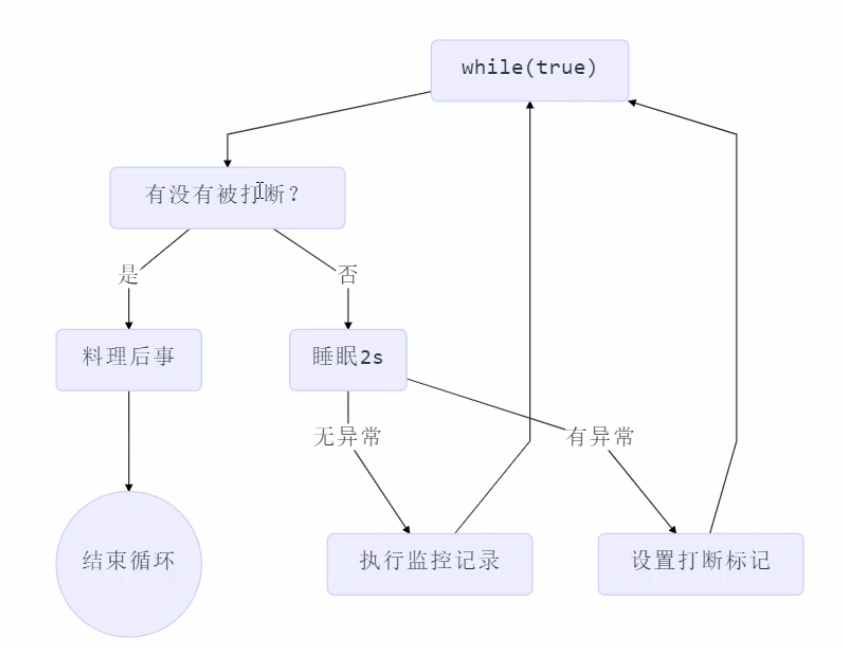
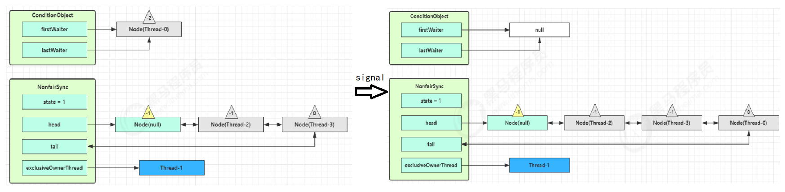
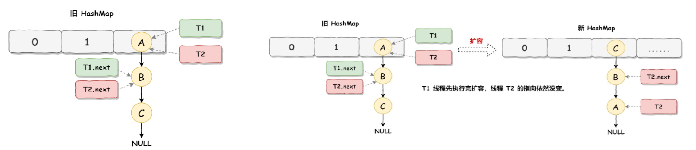

# 1 进程和线程

## 1.1 进程和线程

#### 进程

- 程序由指令和数据组成，但这些指令要运行，数据要读写，就必须将指令加载至CPU，数据加载是内存。在指令运行过程中还需要用到磁盘、网络等设备。进程就是用来记载指令、管理内存、管理IO的
- 当一个程序被运行，从磁盘加载这个程序的代码至内存，这时就开启了一个进程
- 进程可以视为是一个程序的实例，大部分程序可以同时运行多个实例进程（例如记事本、浏览器等），有些程序只能启动一个实例进程（比如网易云音乐）

#### 线程

- 一个进程之内可以分为一到多个线程
- 一个线程就是一个指令流，将指令流中的一条条指令以一定的顺序交给CPU执行
- 在Java中，**进程是操作系统进行资源分配的基本单位，而线程是操作系统进行调度的基本单位**，在windows中，进程是不活动的，只是作为线程的容器。

#### 进程与线程的区别

他们两个本质的区别是**是否单独占有内存地址空间及其它系统资源**（比如I/O）

- 进程单独占有一定的内存地址空间，所以进程间存在内存隔离，数据是分开的，数据共享复杂但是同步简单，各个进程之间互不干扰；而线程共享所属进程占有的内存地址空间和资源，数据共享简单，但是同步复杂。
- 进程单独占有一定的内存地址空间，一个进程出现问题不会影响其他进程，不影响主程序的稳定性，可靠性高；一个线程崩溃可能影响整个程序的稳定性，可靠性较低。
- 进程单独占有一定的内存地址空间，**进程的创建和销毁**不仅需要保存寄存器和栈信息，还需要资源的分配回收以及页调度，开销较大；**线程**只需要保存寄存器和栈信息，**开销较小**。

## 1.2 并发和并行

并发（concurrent）：是同一时间应对（deal with）多件事情的能力

并行（parallel）：是同一时间动手做 (doing) 多件事情的能力

一般会将线程轮流使用CPU的做法称为并发。

```
单核cpu的情况下，线程实际上是串行执行的。操作系统中有一个组件是任务调度器，将cpu的时间片分给不同的线程使用，由于cpu的时间片很短，所以线程间的切换很快，人眼不能察觉，所以感知上是同时运行的。微观串行，宏观并行
```

多核CPU下，每个核都可以调度运行线程，这时候线程可以并行。

例如：

```
——家庭主妇做饭、打扫卫生、给孩子喂奶，她一个人轮流交替做这多件事，这时就是并发
——家庭主妇雇了个保姆，她们一起这些事，这时既有并发，也有并行（这时会产生竞争，例如锅只有一口，一个人用锅时，另一个人就得等待）
——雇了3个保姆，一个专做饭、一个专打扫卫生、一个专喂奶，互不干扰，这时是并行
```

## 1.3 多线程应用

#### 异步调用

多线程可以让方法执行变为异步的（即不要巴巴干等着）比如说读取磁盘文件时，假设读取操作花费了 5 秒钟，如果没有线程调度机制，这 5 秒 cpu 什么都做不了，其它代码都得暂停...

#### 提升效率

多核cpu下，可以将任务拆分为多个子任务，使用不同的线程并行处理，从而提升任务执行的效率。

案例：

```java
public class MyBenchmarks {
    static int[] ARRAY = new int[1000_000_00];
    static {
        Arrays.fill(ARRAY, 1);
    }
    @Benchmark
    public int c() throws Exception {
        int[] array = ARRAY;
        FutureTask<Integer> t1 = new FutureTask<>(()->{
            int sum = 0;
            for(int i = 0; i < 250_000_00;i++) {
                sum += array[0+i];
            }
            return sum;
        });
        FutureTask<Integer> t2 = new FutureTask<>(()->{
            int sum = 0;
            for(int i = 0; i < 250_000_00;i++) {
                sum += array[250_000_00+i];
            }
            return sum;
        });
        FutureTask<Integer> t3 = new FutureTask<>(()->{
            int sum = 0;
            for(int i = 0; i < 250_000_00;i++) {
                sum += array[500_000_00+i];
            }
            return sum;
        });
        FutureTask<Integer> t4 = new FutureTask<>(()->{
            int sum = 0;
            for(int i = 0; i < 250_000_00;i++) {
                sum += array[750_000_00+i];
            }
            return sum;
        });
        new Thread(t1).start();
        new Thread(t2).start();
        new Thread(t3).start();
        new Thread(t4).start();
        return t1.get() + t2.get() + t3.get()+ t4.get();
    }
    @Benchmark
    public int d() throws Exception {
        int[] array = ARRAY;
        FutureTask<Integer> t1 = new FutureTask<>(()->{
            int sum = 0;
            for(int i = 0; i < 1000_000_00;i++) {
                sum += array[0+i];
            }
            return sum;
        });
        new Thread(t1).start();
        return t1.get();
    }
```

结果：多核cpu，四个线程并行运行，效率提升了接近三倍


结论 

1. 单核 cpu 下，多线程不能实际提高程序运行效率，只是为了能够在不同的任务之间切换，不同线程轮流使用 cpu ，不至于一个线程总占用 cpu，别的线程没法干活 
2. 多核 cpu 可以并行跑多个线程，但能否提高程序运行效率还是要分情况的 
   - 有些任务，经过精心设计，将任务拆分，并行执行，当然可以提高程序的运行效率。
   - 但不是所有计算任务都能拆分（参考后文的【阿姆达尔定律】），也不是所有任务都需要拆分，任务的目的如果不同，谈拆分和效率没啥意义 
3. IO 操作不占用 cpu，只是我们一般拷贝文件使用的是【阻塞 IO】，这时相当于线程虽然不用 cpu，但需要一 直等待 IO 结束，没能充分利用线程。所以才有后面的【非阻塞 IO】和【异步 IO】优化

# 2 java线程

## 2.1 创建和运行线程

#### 方法一：直接使用Thread

继承Thread类，推荐使用匿名内部类的方式实现

```java
Thread t1 = new Thread("t1"){ // 指定线程的名字
            @Override
            public void run() {
                log.debug("t1_running"); // 线程要执行的任务
            }
        };
        t1.start();
```

#### 方法二：使用Runnable对象配合Thread

把【线程】和【任务】分开

- Thread代表线程
- Runnable实现可运行的任务

```java
Runnable r = new Runnable() {
    @Override
    public void run() {
        log.debug("running");
    }
};

Thread t1 = new Thread(r, "t1");
t1.start();
```

Runnable接口被@FunctionalInterface注解修饰，这样的接口只有一个方法，jdk8之后可以用lambda表达式简化。

```java
Runnable r1 = () ->{log.debug("t2---running");};
Thread t2 = new Thread(r1, "t2");

// 或者
Thread t3 = new Thread(() -> log.debug("t3---running"), "t3");
```

**Thread和Runnable的关系**

- 方法1 是把线程和任务合并在了一起，方法2 是把线程和任务分开了 
- 用 Runnable 更容易与线程池等高级 API 配合 
- 用 Runnable 让任务类脱离了 Thread 继承体系，更灵活（在Java程序设计中组合优于继承）

方法二源码分析：

```java
// 在构造方法中传入runnable对象
public Thread(Runnable target, String name) {
    init(null, target, name, 0);
}
// 初始化的时候会把runnable赋值给target
-----------------------------------------------------
private void init(ThreadGroup g, Runnable target, String name,
                      long stackSize, AccessControlContext acc,
                      boolean inheritThreadLocals) {
    ……
    this.target = target;
    ……
}
// 执行run()方法的时候会调用runnable对象的run方法
---------------------------------------------------------
@Override
public void run() {
    if (target != null) {
        target.run();
    }
}
```

如果采用方法一，则直接调用的是Thread子类重写的run()方法。

#### 方法三：FutureTask配合Thread

FutureTask能够接收Callable类型的参数，用来处理有返回结果的情况。

```java
FutureTask<Integer> task = new FutureTask<>(new Callable<Integer>() {
    @Override
    public Integer call() throws Exception {
        log.debug("t1---running");
        Thread.sleep(2000);
        return 100; // 有返回值，可用于线程间通信
    }
});

Thread t1 = new Thread(task, "t1");
t1.start();
// 其他线程获取t1的线程的返回值
log.debug("{}", task.get());
```

## 2.2 多个线程同时运行

- 交替执行
- 谁先谁后，不由我们控制

## 2.3 查看进程和线程的方法

#### windows 

- 任务管理器可以查看进程和线程数，也可以用来杀死进程 
- tasklist 查看进程 
- taskkill 杀死进程

#### 查看Java程序进程

- jps 命令查看所有 Java 进程 （windows/linux命令行使用）
- jstack  查看某个 Java 进程（PID）的所有线程状态 
- jconsole 来查看某个 Java 进程中线程的运行情况（图形界面）

## 2.4 线程运行

#### 栈与栈帧

JVM的运行时数据区由堆、虚拟机栈、方法区、程序计数器等组成，其中占内存是给线程使用的，每个线程启动后，虚拟机就会为其分配一块栈内存。

- 每个栈由多个栈帧组成，每个栈帧对应这一次方法调用时所占用的内存
- 每个线程只能有一个活动栈帧，对应着当前正在执行的那个方法。


#### 线程上下文切换（Thread Context Switch）

因为以下一些原因，CPU不再执行当前的线程，转而执行另一个线程的代码，线程状态从保存暂停到再记载的过程就是一次上下文切换。

- 线程的cpu时间片用完了
- 垃圾回收STW
- 有更高优先级的线程需要运行
- 线程自己调用了sleep、yield、wait、join、park、synchronized、lock等方法


main线程的时间片结束，cpu去执行t1线程，main线程的状态被保存。

发生上下文切换的时候，需要由操作系统保存当前线程的状态，并恢复下一个将要占用CPU的线程的状态，Java中对应的概念就是程序计数器（PC），它的作用是记住下一条JVM执行的执行地址，PC也是线程私有的。

- 状态包括程序计数器、虚拟机栈中每个栈帧中的信息，如局部变量表、操作数栈、返回地址等
- 上下文切换频繁会影响性能，所以线程并不是越多越好

## 2.5 常见方法

### start与run

start方法是用来启动线程的，调用start方法之后，线程会进入就绪状态，当线程的时间片到了之后，java虚拟机会主动调用线程的run()方法，线程进入运行状态，达到了多线程的目的；

如果我们没有启动线程（没有调用线程的start()方法），而是在应用代码中直接调用run()方法，那么这个线程的run()方法其实是由当前运行的线程调用的，而不是运行在其自身的线程中，程序依旧还是在运行当前线程，违背了创建线程的初衷。


### sleep和yield

**sleep**

- 调用sleep会让当前线程从Running状态进入TimeWaiting（阻塞）状态

- 其他线程可以使用Interrupt方法打断正在睡眠的线程，这时sleep方法抛出InterruptedException

- 睡眠结束线程未必会立刻得到执行

- 建议使用TimeUnit的sleep代替Thread类的sleep来获得更好的可读性

  ```java
  // 二者等价
  TimeUnit.SECONDS.sleep(1);
  Thread.sleep(1000);
  ```


**yield**

- 调用yield会让当前线程从Running进入Runnable就绪状态，然后调度执行其他线程
- 具体实现依赖于操作系统的任务调度器（cpu时间片让不让得出去，还要看操作系统）


**sleep应用——防止cpu占用100%**

```java
// 不让while(true)空转浪费cpu
while(true){
	try{
        Thread.sleep(10);
    }catch(InterruptedException e){
        e.printStackTrace();
    }
}
```


### 线程优先级

```java
public final void setPriority(int newPriority)
```

- 线程优先级的设置最大为10，最小为1，默认为5
- 线程优先级会提示（hint）任务调度器优先调度优先级高的线程，但是任务调度器可以忽略优先级
- 如果cpu比较忙，优先级更高的线程有更大的可能性获得更多cpu时间片；cpu空闲的时候，优先级几乎不起作用


### Join方法详解

join()：当前线程等待其他线程直至其他线程执行完毕

join(long t)：当前线程等待其他线程直至其他线程执行完毕或者等够 t ms

在A线程中调用了B线程的join()方法时，表示只有当B线程执行完毕时，A线程才能继续执行。

```java
public class Test5 {
    public static int r = 0;
    public static void main(String[] args) throws InterruptedException {
        log.debug("start");
        method1();
    }

    public static int method1() throws InterruptedException {
        Thread t1 = new Thread(() -> {
            log.debug("start");
            try {
                Thread.sleep(20);
                r = 10;
                log.debug("end");
            } catch (InterruptedException e) {
                e.printStackTrace();
            }
        }, "t1");

        t1.start();
        t1.join(); // 主线程会等待t1线程执行结束再继续执行，所以r=10
        // 如果需要等待多个线程，则调用多个join
        log.debug("r = {}", r);
        return r;
    }
}
```

join的主要作用是**同步**，它可以使得线程之间的**并行执行变为串行执行**。


### interrupt方法详解

#### **打断sleep、wait、join的线程**

会清除打断标记，

```java
@Slf4j(topic = "c:test6")
public class Test6 {
    public static void main(String[] args) throws InterruptedException {
        Thread t1 = new Thread(() -> {
            log.debug("t1---sleep");
            try {
                Thread.sleep(5000);
            } catch (InterruptedException e) {
                e.printStackTrace();
            }
        }, "t1");

        t1.start();
        log.debug("interrupt...");
        Thread.sleep(1000);
        t1.interrupt();
        log.debug("t1 is interrupted : {}", t1.isInterrupted()); // false
    }
}
```

==========控制台============

```java
20:14:11.231 [main] DEBUG c:test6 - interrupt...
20:14:11.231 [t1] DEBUG c:test6 - t1---sleep
java.lang.InterruptedException: sleep interrupted
	at java.lang.Thread.sleep(Native Method)
	at com.ganjing.test.Test6.lambda$main$0(Test6.java:11)
	at java.lang.Thread.run(Thread.java:750)
20:14:12.240 [main] DEBUG c:test6 - t1 is interrupted : **false**
```

#### **打断正常运行的线程**

```java
public static void main(String[] args) throws InterruptedException {
    Thread t1 = new Thread(() -> {
        log.debug("t1---start");
        while (true){
            if(Thread.currentThread().isInterrupted()){
               log.debug("被打断了，停止");
                    break;
                }
        	}
        }

    }, "t1");

    t1.start();
    log.debug("interrupt...");
    Thread.sleep(100);
    t1.interrupt();
    log.debug("t1 is interrupted : {}", t1.isInterrupted()); // true
```

线程t1并不会因为被打断就结束，而是继续运行。但可以在t1线程内判断它是否被打断过，如果是，就停止运行。

```java
// 都是判断线程是否被打断过
isInterrupted(); // 判断之后不会清除打断标记
static interrupted(); // 判断之后会清除打断标记
```


#### **打断park线程**

park()是LockSupport中的方法，也会打断当前线程。

```java
public static void test() throws InterruptedException {
    Thread t1 = new Thread( ()-> {
        log.debug("park...");
        LockSupport.park();
        log.debug("unpark...");
        log.debug("打断标记：{}", Thread.currentThread().isInterrupted());
        // 打断标记为True时，park()失效；
        // 如果使用Thread.currentThread().Interrupted()则会清除打断标记，park()可以生效
        LockSupport.park();
        log.debug("unpark...");
    });

    t1.start();
    Thread.sleep(1000);
    t1.interrupt();
}

// 控制台输出
17:28:47.427 [Thread-0] DEBUG c:test8 - park...
17:28:48.436 [Thread-0] DEBUG c:test8 - unpark...
17:28:48.436 [Thread-0] DEBUG c:test8 - 打断标记：true
17:30:44.594 [Thread-0] DEBUG c:test8 - unpark... // 打断标记为true，所以第二个LockSupport.park()不会生效
```


## ~两阶段终止模式

如何优雅地在一个线程T1中杀死线程T2？

应用场景：系统健康状况监控，这个监控线程在后台一直运行（比如每隔2秒检查一次），需要提供方法可以停止这个线程，此时可以使用两阶段终止模式停止该线程。



a. 正常运行情况下被打断，打断标记为true，直接结束

b. 睡眠情况下被打断，会抛出异常，并且打断标记会被清楚，此时需要catch异常，设置打断标记为true


#### 不推荐使用的方法

stop() -- 建议使用两阶段终止

suspend() --建议使用 wait()

resume() -- 建议使用notify()

这些方法会破坏同步代码块，可能导致锁无法释放，最终造成死锁。


## 2.6 主线程和守护线程

默认情况下，只要程序中还有线程没有停止运行，java进程就不会结束。

主线程：main方法所在的线程，但不是守护线程

守护线程：当Java进程中其他的线程都结束时，守护线程会强制结束。一般是程序运行时在后台提供通用服务的线程。

> 注意：
>
> - 当java虚拟机中没有非守护线程时，java虚拟机会退出，所有的守护线程会立即停止，即使守护线程内有finally块，这部分代码也不会执行。
> - 所以不要在守护线程的finally块中执行关闭或清除资源的逻辑。

```java
// 设置守护线程，要在线程启动之前设定
t1.setDaemon(true);
t1.start();
```

注意：

- 垃圾回收线程是一种守护线程
- Tomcat中的Acceptor和Poller线程也是守护线程


## 2.7 线程的状态

### 五种状态？六种状态？

五种状态是操作系统层面的，分别是：


- 【初始状态】: 线程在语言层面被创建就进入初始状态
- 【可运行状态】：线程在操作系统层面被创建，可以有CPU调度执行
- 【运行状态】：获取了CPU时间片
  - 当CPU时间片用完之后，线程又会从【运行状态】切换到【可运行状态】，会导致线程的上下文切换
- 【阻塞状态】：线程在调用了阻塞API，如BIO读写文件，此时线程不会用到CPU，会导致上下文切换，进入阻塞阶段，任务调度器也不会考虑阻塞状态的线程
- 【终止状态】：线程的任务已经完成，生命周期结束，不会再转换为其他状态


#### 六种状态

六种状态是Java API层面的，Thread.Sate枚举中包含六种状态：


- NEW：线程刚被创建，没有调用start()方法
- RUNNABLE：调用了start()方法之后，涵盖了操作系统层面的【可运行状态】、【运行状态】和【阻塞状态】
- BLOCKED：Java API层面的的阻塞状态的一种，等待获取锁
- WAITING：Java API层面的的阻塞状态的一种，调用join()，park()，wait()会进入此状态
- TIMED_WAITING：Java API层面的的阻塞状态的一种，调用sleep(long wait)，join(long wait)，parkNanos()，parkUntil()，wait(long wait)会进入此状态
- TERMINATED：线程的任务已经完成，生命周期结束，不会再转换为其他状态


**分析**


# 3 共享模型之管程（悲观锁）

## 3.1 共享问题

#### 多线程操作共享资源的线程安全问题

**问题描述**

```java
public static int i = 0;
public static void main(String[] args) throws InterruptedException {
    Thread t1 = new Thread(() -> {
        for(int j = 0; j < 5000; j++){
            i++;
        }
    }, "t1");

    Thread t2 = new Thread(() -> {
        for(int j = 0; j < 5000; j++){
            i--;
        }
    }, "t2");

    t1.start();
    t2.start();
    t1.join();
    t2.join();
    log.debug("i={}", i);
}

// 最终i的结果并为0，只有很小的情况下才有可能为0
```

***

**问题分析**

为什么结果不一定为0？因为Java中对静态变量的自增，自减并不是原子操作。

字节码分析，例如 i++ 的JVM字节码指令为：

```java
getstatic i  // 获取静态变量i的值
iconst_1     // 准备常量1
iadd         // i自增
putstatic i  // 将修改后的值存入静态变量i
```

图解单线程与多线程的区别：


**根本原因：**线程上下文切换造成的指令交错，从而导致了多线程访问共享资源的线程安全问题。


#### 临界区 Critical Section

- 一个程序运行多个线程本身是没有问题的
- 问题出在多个线程访问共享资源
  - 多个线程读共享资源其实也没有问题
  - 在多个线程对共享资源读写操作时发生指令交错，就会出现问题
- 一段代码块内如果存在**对共享资源的多线程读写操作**，称这段代码块为**临界区**


#### 竞态条件 Race Condition

**多个线程在临界区内执行**，由于代码快的**执行序列不同**而导致结果无法预测，称之为发生了竞态条件。


## 3.2 synchronized

为了避免临界区的竞态条件发生，有多种手段可以达到目的。

- 阻塞式的解决方案：synchronized，Lock 
- 非阻塞式的解决方案：原子变量

synchronized，即俗称的【对象锁】，它采用互斥的方式让同一 时刻至多只有一个线程能持有【对象锁】，其它线程再想获取这个【对象锁】时就会阻塞住。这样就能保证拥有锁的线程可以安全的执行临界区内的代码，不用担心线程上下文切换。

>**注意**
>
>虽然 java 中互斥和同步都可以采用 synchronized 关键字来完成，但它们还是有区别的：
>
>- 互斥：保证临界区的竞态条件发生，同一时刻，只能有一个线程执行临界区的代码
>- 同步：由于线程执行的先后、顺序不同、需要一个线程等待其他线程运行到某个点


#### synchronized语法

```java
synchronized(对象){
	临界区
}
```

代码加锁：

```java
public static int i = 0;
    public static Object room = new Object();
    public static void main(String[] args) throws InterruptedException {
        Thread t1 = new Thread(() -> {
            for(int j = 0; j < 5000; j++){
                synchronized (room) {
                    i++;
                }
            }
        }, "t1");

        Thread t2 = new Thread(() -> {
            for(int j = 0; j < 5000; j++){
                synchronized (room) {
                    i--;
                }
            }
        }, "t2");
        ......
    }
// 最终i的结果为0
```

***

可以做这样的类比： 

- `synchronized(对象)` 中的对象，可以想象为一个房间（room），有唯一入口（门）房间只能一次进入一人 进行计算，线程 t1，t2 想象成两个人 
- 当线程 t1 执行到 `synchronized(room)` 时就好比 t1 进入了这个房间，并锁住了门拿走了钥匙，在门内执行 `count++` 代码
- 这时候如果 t2 也运行到了 `synchronized(room)` 时，它发现门被锁住了，只能在门外等待，发生了上下文切 换，阻塞住了 
- 这中间即使 t1 的 cpu 时间片不幸用完，被踢出了门外（不要错误理解为锁住了对象就能一直执行下去哦）， 这时门还是锁住的，t1 仍拿着钥匙，t2 线程还在阻塞状态进不来，只有下次轮到 t1 自己再次获得时间片时才能开门进入 
- 当 t1 执行完 `synchronized{}` 块内的代码，这时候才会从 obj 房间出来并解开门上的锁，唤醒 t2 线程把钥匙给他。t2 线程这时才可以进入 obj 房间，锁住了门拿上钥匙，执行它的 `count--` 代码


#### 思考

synchronized实际上是用对象锁保证了临界区代码的原子性，临界区内的代码对外界来说不可分割，不会被线程切换所打断。

- 如果把 synchronized(obj) 放在 for 循环的外面，如何理解？-- 原子性 
- 如果 t1 synchronized(obj1) 而 t2 synchronized(obj2) 会怎样运作？-- 锁对象 
- 如果 t1 synchronized(obj) 而 t2 没有加会怎么样？如何理解？-- 锁对象。如果t2不加锁，它在获取cpu时间拍之后就不会尝试去获得锁，也就不会被阻塞，t2就可以读取t1线程计算的临时结果。


#### 锁对象面向对象改进

将对共享资源的保护，封装在类里面，对外面提供线程安全的接口。

```java
@Slf4j(topic = "c:test10")
public class Test10 {
    public static void main(String[] args) throws InterruptedException {
        Room room = new Room();
        Thread t1 = new Thread(() -> {
            for(int j = 0; j < 5000; j++){
                room.increment();
            }
        }, "t1");

        Thread t2 = new Thread(() -> {
            for(int j = 0; j < 5000; j++){
                room.decrement();
            }
        }, "t2");

        t1.start();
        t2.start();
        t1.join();
        t2.join();
        log.debug("count={}", room.getCount());
    }

}

class Room{
    private int count = 0;

    public void increment(){
        synchronized (this){
            count ++;
        }
    }

    public void decrement(){
        synchronized (this){
            count --;
        }
    }

    public int getCount(){
        synchronized (this) {
            return this.count;
        }
    }
}
```


## 3.3 方法上的synchronized

加在方法上的锁，锁住的也是对象也不是方法。

在成员方法上加锁，锁住的是this对象

```java
class Test{
    public synchronized void test(){
        
    }
}
// 等价于
class Test{
    public void test(){
        synchronized(this){
            
        }
    }
}
```

在静态方法上加锁，锁住的是类的class对象

```java
class Test{
    public synchronized static void test(){
        
    }
}
// 等价于
class Test{
    public void test(){
        synchronized(Test.class){
            
        }
    }
}
```

不加synchronized的方法就好比不遵守规则的人，不去老实排队（好比翻窗户进去的）。

***

#### 线程“八锁”——考察 synchronized 锁住的是哪个对象

情况1：<u>2  1s 1或者1s 2，两个线程持有的都是对象n1的锁</u>

```java
@Slf4j(topic = "c.Number")
class Number{
 	public synchronized void a() {
        sleep(1);
 		log.debug("1");
 	}
 	public synchronized void b() {
 		log.debug("2");
 	}
}
public static void main(String[] args) {
 	Number n1 = new Number();
    new Thread(()->{ n1.a(); }).start();
 	new Thread(()->{ n1.b(); }).start();
}

```

情况2：<u>2  1s 1或者1 1s后 2，两个线程持有的都是Number.class的锁</u>

```java
@Slf4j(topic = "c.Number")
class Number{
 	public static synchronized void a() {
 		sleep(1);
 		log.debug("1");
 	}
	 public static synchronized void b() {
 		log.debug("2");
 	}
}
public static void main(String[] args) {
 	Number n1 = new Number();
 	new Thread(()->{ n1.a(); }).start();
 	new Thread(()->{ n1.b(); }).start();
}
```

情况3：<u>2 1s 1，一个线程持有Number.class对象的锁，另一个持有对象n2的锁，没有锁竞争</u>

```java
@Slf4j(topic = "c.Number")
class Number{
 	public static synchronized void a() {
 		sleep(1);
 		log.debug("1");
 	}
 	public synchronized void b() {
 		log.debug("2");
 	}
}
public static void main(String[] args) {
 	Number n1 = new Number();
 	Number n2 = new Number();
 	new Thread(()->{ n1.a(); }).start();
 	new Thread(()->{ n2.b(); }).start();
}
```

其他情况都是类似的分析方法。


## 3.4 变量的线程安全分析

### 成员变量与静态变量是否线程安全

- 如果他们没有被共享，则线程安全‘
- 如果他们被共享
  - 如果只有读操作，则线程安全
  - 如果有读写操作，则这段代码是临界区，需要考虑线程安全

```java
@Slf4j(topic = "c:test11")
public class Test11 {
    public static final int LOOP_NUM = 200;
    public static final int THREAD_NUM = 2;
    public static void main(String[] args) {
        ThreadUnsafe threadUnsafe = new ThreadUnsafe();
        for (int i = 0; i < THREAD_NUM; i++){
            new Thread(() -> {
                threadUnsafe.method1(LOOP_NUM);
            }, "T"+i).start();
        }
    }
}

class ThreadUnsafe{
    ArrayList<Integer> list = new ArrayList<>();
    public void method1(int loopNum){
        for(int i = 0; i < loopNum; i++){
            method2();
            method3();
        }
    }

    private void method2() {
        list.add(1);
    }
    private void method3() {
        list.remove(0);
    }
}
```

因为method2和method3中都是对堆内存中同一个list对象操作，共享变量list会产生线程不安全问题。


### 局部变量是否线程安全

- 普通的局部变量是线程安全的
- 如果局部变量是引用对象
  - 如果该对象没有逃离方法的作用范围，则它是安全的
  - 如果该对象逃离方法的作用范围，则需要考虑线程安全问题


**普通类型的局部变量**

```java
public static void increment(){
    int i = 10;
    i ++;
}
```

不同的线程调用increment方法，i会有线程安全问题吗? 答案是不会。因为不同的线程有他们独享的栈内存，他们调用increment()方法时会在自己的栈内存为方法创建栈帧，在栈帧内存中创建i，所以i不会被共享，也就没有线程安去问题。

>**注意：**
>
>局部变量的自增操作，对应的JVM字节码指令只有一条，就是iinc


**引用类型的局部变量**

引用类型的局部变量没有暴露给外部，线程安全：

```java
class ThreadSafe{
    // final 防止子类修改
    public final void method1(int loopNum){
        ArrayList<Integer> list = new ArrayList<>();
        for(int i = 0; i < loopNum; i++){
            method2(list);
            method3(list);
        }
    }
	
    private void method3(ArrayList list) {
        list.remove(0);
    }
	// private 防止子类修改
    private void method2(ArrayList list) {
        list.add(1);
    }
}
```

> list是局部变量，每个线程调用时会创建其不同的实例，没有共享


***

引用类型的局部变量暴露给外部，线程不安全：

```java
class ThreadSafe {
    public final void method1(int loopNumber) {
    	ArrayList<String> list = new ArrayList<>();
    	for (int i = 0; i < loopNumber; i++) {
    	method2(list);
    	method3(list);
    }
 }
    public void method2(ArrayList<String> list) {
    	list.add("1");
	}
    public void method3(ArrayList<String> list) {
    	list.remove(0);
    }
}

class ThreadSafeSubClass extends ThreadSafe{
    @Override
    public void method3(ArrayList<String> list) {
    	new Thread(() -> {
    	list.remove(0);
    	}).start();
    }
}

@Slf4j(topic = "c:test12")
public class Test12 {
    public static final int LOOP_NUM = 200;
    public static final int THREAD_NUM = 2;
    public static void main(String[] args) {
        ThreadSafeSubClass threadUnsafe = new ThreadSafeSubClass();
        for (int i = 0; i < THREAD_NUM; i++){
            new Thread(() -> {
                threadUnsafe.method1(LOOP_NUM); 
                // 线程不安全，因为子类的method3中又创建了新的线程对list进行操作
                // 此时list又变成了线程之间共享的变量
            }, "T"+i).start();
        }
    }
}
```

> 从这个例子可以看出 private 或 final 提供【安全】的意义所在，请体会开闭原则中的【闭】


### 常见的线程安全类

- String
- Integer
- StringBuffer
- Random
- Vector
- HashTable
- java.util.concurrent包下的类

***

线程安全的类是指，多个线程调用它们的同一个实例的某个方法时，是线程安全的，也可以理解为：

- 他们的方法是原子的

```java
HashTable table = new HashTable();

new Thread(() ->{
    table.put("key", "value1");
}).start();


new Thread(() ->{
    table.put("key", "value2");
}).start();

// 是线程安全的，put方法被sychronized修饰
```


>**注意：**他们的多个方法的组合不是原子的

#### 线程安全类方法的组合

例如：

```java
HashTable table = new HashTable();
new Thread(() ->{test("v1")}, "t1").start();
new Thread(() ->{test("v2")}, "t2").start();

public void test(String value){
    if(table.get("key") == null){
        table.put("key", value);
    }
}
```

test方法并不是 线程安全的，t1把t2的修改结果覆盖了。


#### 不可变类的线程安全性

String、Integer 等都是不可变类（被final修饰），因为其内部的状态不可以改变，因此它们的方法都是线程安全的。

> 如果不希望类的某些方法暴露，也不希望被子类修改，一定要把类设置成final或者把方法设置为private


### 案例分析

案例1：

```java
public class MyServlet extends HttpServlet {
 	// 是否安全？ 不安全
 	Map<String,Object> map = new HashMap<>();
 	// 是否安全？ 安全
	 String S1 = "...";
 	// 是否安全？ 安全
 	final String S2 = "...";
	 // 是否安全？ 不安全
 	Date D1 = new Date();
	 // 是否安全？ 不安全
 	final Date D2 = new Date();
 
 public void doGet(HttpServletRequest request, HttpServletResponse response) {
 	// 使用上述变量
 	}
}
```

分析：

> Date和String的区别在于String是不可变类，字符串对象所引用的真实对象中的值不可改变；但是Date是可变的，final修饰是指D2这个对象所引用的地址不能变化，但地址中存的值是可变的。


案例2：

```java
public class MyServlet extends HttpServlet {
    // 是否安全？ 不安全
    private UserService userService = new UserServiceImpl();
 
    public void doGet(HttpServletRequest request, HttpServletResponse response) {
    	userService.update(...);
    }
}
public class UserServiceImpl implements UserService {
    // 记录调用次数
    private int count = 0;
 
    public void update() {
    	// ...
    	count++;
    }
}
```

分析：

> Service中的成员变量在成员方法中使用，多个线程调用update()会使count++变成临界区代码。正确的做法应该是把count设置为方法内部的局部变量。


案例3：

```java
public class MyServlet extends HttpServlet {
    // 是否安全
    private UserService userService = new UserServiceImpl();

    public void doGet(HttpServletRequest request, HttpServletResponse response) {
        userService.update(...);
    }
}
public class UserServiceImpl implements UserService {
    // 是否安全
    private UserDao userDao = new UserDaoImpl();

    public void update() {
        userDao.update();
    }
}
public class UserDaoImpl implements UserDao {
    public void update() {
        String sql = "update user set password = ? where username = ?";
        // 是否安全
        try (Connection conn = DriverManager.getConnection("","","")){
            // ...
        } catch (Exception e) {
            // ...
        }
    }
}
```

分析：

> dao中没有成员变量被共享，所以dao线程安全 ——> 所以service线程安全 ——> 所以servlet线程安全


案例4：

```java
@Aspect
@Component
public class MyAspect {
    // 是否安全？
    private long start = 0L;
 
    @Before("execution(* *(..))")
    public void before() {
    	start = System.nanoTime();
    }
 
    @After("execution(* *(..))")
    public void after() {
    	long end = System.nanoTime();
    	System.out.println("cost time:" + (end-start));
    }
}
```

分析：

> 成员变量start线程不安全，应该使用环绕通知，将start定义在通知内部。
>
> 是否可以使用多例模式？不行，这样可能会导致调用前置通知和后置通知的是不同对象，使用的start不是同一个对象内部的成员变量。


## ~ 练习

### 练习1：卖票

```java
public class SellTicket {
    public static void main(String[] args) {
        TicketWindow ticketWindow = new TicketWindow(2000);
        List<Thread> list = new ArrayList<>();
        // 用来存储买出去多少张票，线程安全类
        List<Integer> sellCount = new Vector<>();
        for (int i = 0; i < 2000; i++) {
            Thread t = new Thread(() -> {
                // 分析这里的竞态条件
                int count = ticketWindow.sell(randomAmount());
                sellCount.add(count);
            });
            list.add(t);
            t.start();
        }
        list.forEach((t) -> {
            try {
                t.join();
            } catch (InterruptedException e) {
                e.printStackTrace();
            }
        });
        // 买出去的票求和
        System.out.println(String.format("selled count:{%d}", sellCount.stream().mapToInt(c -> c).sum()));
        // 剩余票数
        System.out.println(String.format("remainder count:{%d}", ticketWindow.getCount()));
    }
    // Random 为线程安全
    static Random random = new Random();
    // 随机 1~5
    public static int randomAmount() {
        return random.nextInt(5) + 1;
    }
}

class TicketWindow {
    private int count;

    public TicketWindow(int count) {
        this.count = count;
    }
    public int getCount () {
        return count;
    }
    public int sell ( int amount){
        if (this.count >= amount) {
            this.count -= amount;
            return amount;
        } else {
            return 0;
        }
    }
}
```

分析：

线程不安全的原因是什么？

> 竞态条件发生在TicketWindow类当中，首先ticketWindow是一个共享变量，所有线程都操作这个对象，起来在sell()方法中有对成员变量count的读写操作，多线程调用这个方法发生上下文切换时会出现线程不安全问题。
>
> 解决方式：
>
> 给sell方法加上synchronized关键字，锁住ticketWindow对象。


为什么list可以使用线程不安全的类，而sellCount要使用线程安全的类？

> 因为list只被主线程使用，不会产生线程安全问题


线程内部这两个语句会有线程不安全问题吗？

```java
int count = ticketWindow.sell(randomAmount());
sellCount.add(count);
```

> 不会。因为这两个语句操作的是两个毫无关联的共享变量，并且前后的处理结果不存在传递关系，所以只要保证这两个语句都是原子操作，就不会线程不安全。


### 练习2：转账

```java
@Slf4j(topic = "c:transfer")
public class Transfer {
    public static void main(String[] args) throws InterruptedException {
        Account a = new Account(1000);
        Account b = new Account(1000);
        Thread t1 = new Thread(() -> {
            for (int i = 0; i < 1000; i++) {
                a.transfer(b, randomAmount());
            }
        }, "t1");
        Thread t2 = new Thread(() -> {
            for (int i = 0; i < 1000; i++) {
                b.transfer(a, randomAmount());
            }
        }, "t2");
        t1.start();
        t2.start();
        t1.join();
        t2.join();
        // 查看转账2000次后的总金额
        log.debug("total:{}",(a.getMoney() + b.getMoney()));
    }
    // Random 为线程安全
    static Random random = new Random();
    // 随机 1~100
    public static int randomAmount() {
        return random.nextInt(100) +1;
    }
}
class Account {
    // money是共享变量
    private int money;
    public Account(int money) {
        this.money = money;
    }
    public int getMoney() {
        return money;
    }
    public void setMoney(int money) {
        this.money = money;
    }

    // this.money 和 target.money都是共享变量
    public void transfer(Account target, int amount) {
        if (this.money > amount) {
            this.setMoney(this.getMoney() - amount);
            target.setMoney(target.getMoney() + amount);
        }
    }
}
```

分析：

> 锁应该加在this和target共享的对象上，才能同时保护两个账户。

```java
public void transfer(Account target, int amount) {
    synchronize(Account.class){
        if (this.money > amount) {
            this.setMoney(this.getMoney() - amount);
            target.setMoney(target.getMoney() + amount);
        }
    }
}
```


## 3.5 Monitor概念

### Java对象头

以32虚拟机为例

普通对象的对象头，Mark Word + Klass Word（类信息）：

```ruby
|--------------------------------------------------------------|
| 					Object Header (64 bits)     			   |
|------------------------------------|-------------------------|
|      Mark Word (32 bits)           |  Klass Word (32 bits)   |
|------------------------------------|-------------------------|
```

其中Mark Word结构为:

```ruby
|-------------------------------------------------------|--------------------|
|                   Mark Word (32 bits)                 |              State |
|-------------------------------------------------------|--------------------|
| hashcode:25         | age:4 | biased_lock:0      | 01 |      Normal        |
|-------------------------------------------------------|--------------------|
| thread:23 | epoch:2 | age:4 | biased_lock:1      | 01 |      Biased        |
|-------------------------------------------------------|--------------------|
|               ptr_to_lock_record:30              | 00 | Lightweight Locked |
|-------------------------------------------------------|--------------------|
|               ptr_to_heavyweight_monitor:30      | 10 | Heavyweight Locked |
|-------------------------------------------------------|--------------------|
|                                                  | 11 |     Marked for GC  |
|-------------------------------------------------------|--------------------|
```


### Monitor（锁）

Monitor被翻译为监视器或者管程.

每个Java对象都可以关联一个Monitor对象，如果使用synchronized给对象上锁（重量级）之后，该对象头的 Mark Word中就被设置指向 Monitor 对象的指针。


**从原理的角度理解Monitor**

```java
static final Object lock = new Object();
static int counter = 0;
public static void main(String[] args) {
        synchronized (lock) {
        counter++;
    }
}
```

对应的字节码为：

```java
public static void main(java.lang.String[]);
    descriptor: ([Ljava/lang/String;)V
    flags: ACC_PUBLIC, ACC_STATIC
    Code:
    	stack=2, locals=3, args_size=1
    	0: getstatic #2 			// <- lock引用 （synchronized开始）
    	3: dup
    	4: astore_1 				// lock引用 -> slot 1
    	5: monitorenter 			// 将 lock对象 MarkWord 置为 Monitor 指针
    	6: getstatic #3 			// <- i
    	9: iconst_1 				// 准备常数 1
    	10: iadd 					// +1
    	11: putstatic #3		    // -> i
    	14: aload_1 				// <- lock引用
    	15: monitorexit 			// 将 lock对象 MarkWord 重置, 唤醒 EntryList
    	16: goto 24
    	19: astore_2 				// e -> slot 2 
    	20: aload_1 				// <- lock引用
    	21: monitorexit 			// 将 lock对象 MarkWord 重置, 唤醒 EntryList
    	22: aload_2 				// <- slot 2 (e)
    	23: athrow 					// throw e
    	24: return
    	Exception table:			// 监测异常，如果6-16行发生异常，就去执行19行，避免锁无法释放的情况
    		from to target type
    		6  	 16   19   any
    		19   22   19   any
    	LineNumberTable:
    		line 8: 0
    		line 9: 6
    		line 10: 14
    		line 11: 24
    	LocalVariableTable:
    		Start Length Slot Name Signature
    		0 		25 		0 args [Ljava/lang/String;
 			StackMapTable: number_of_entries = 2
 			 frame_type = 255 /* full_frame */
 			 	offset_delta = 19
 				locals = [ class "[Ljava/lang/String;", class java/lang/Object ]
 				stack = [ class java/lang/Throwable ]
 			frame_type = 250 /* chop */
 				offset_delta = 4
```

> 注意：
>
> 方法级别的 synchronized 不会在字节码指令中有所体现


### synchronized进阶

> 详细笔记见老师的原理篇笔记

#### 1 轻量级锁

一个对象虽然有多个线程访问，但是多线程访问的时间是错开的（没有竞争），那么可以使用轻量级锁来优化。

轻量级锁对使用者是透明的，语法依旧是synchronized。


原理：

- 每个线程的栈帧中都包含一个锁记录（Lock Record）的结构，内部可以存储锁定对象的MarkWord。
- 锁记录包含锁记录地址和对象引用
- 当线程尝试对某个Object加锁时，先让对象引用指向锁对象，然后通过CAS尝试用自己的【锁记录地址】替换锁对象的【Mark Word】
  - 如果成功，对象头中存储了【锁记录地址和状态 00】 ，表示由该线程给对象加锁
  - 如果 cas 失败，有两种情况
    - 如果是其它线程已经持有了该 Object 的轻量级锁，这时表明有竞争，进入锁膨胀过程
    - 如果是自己执行了 synchronized 锁重入，那么再添加一条 Lock Record 作为重入的计数，新添加的锁记录为null，因为其他锁记录中已经有了对象的【Mark Word】了
- 当退出 synchronized 代码块（解锁时）
  - 锁记录的值不为 null，表示发生了锁重入，这时重置锁记录，表示重入计数减一
  - 锁记录的值不为 null，这时使用 cas 将 Mark Word 的值恢复给对象 头
    -  成功，则解锁成功 
    - 失败，说明轻量级锁进行了锁膨胀或已经升级为重量级锁，进入重量级锁解锁流程


#### 2 锁膨胀

如果在尝试加轻量级锁的过程中，CAS操作无法成功，这是一种情况就是其他线程为此对象加上了轻量级锁（有竞争），这是需要进行锁膨胀，将轻量级锁变为重量级锁。

锁膨胀：

- 为锁对象申请Monitor锁，让Object指向重量级锁的地址
- 然后竞争不到锁的线程进入Monitor的EntryList BLOCKED
- 之前给对象加轻量级锁的线程执行完毕后，要采用重量级锁的解锁方式解锁


#### 3 自旋优化

重量级锁竞争的时候，还可以使用自旋优化，如果当前线程自旋成功（这时候持有锁的线程退出同步块，释放了锁），当前线程就可以避免阻塞。

- 自旋成功，获得锁，执行同步快
- 自旋失败，进入EntryList，阻塞


> **注意：**
>
> - Java 6的自旋次数是自适应的


#### 4 偏向锁

轻量级锁在没有竞争时，每次重入仍然需要执行CAS操作。

Java 6中引入了偏向锁来做进一步优化：只有第一次使用CAS将线程ID存入锁对象的MarkWord，之后发现这个线程 ID 是自己的就表示没有竞争，不用重新 CAS。以后只要不发生竞争，这个对象就归该线程所有


##### 偏向状态

**测试：**

```java
@Slf4j(topic = "c:test12")
public class Test12 {
    public static void main(String[] args) {
        Dog dog = new Dog();
        log.debug(ClassLayout.parseInstance(dog).toPrintable());
    }
}

class Dog{ }
```

输出，JVM有延迟，所以刚启动程序是偏向锁没有生效：

```java
OFF  SZ   TYPE DESCRIPTION               VALUE
  0   8        (object header: mark)     0x0000000000000001 (non-biasable; age: 0)
  8   4        (object header: class)    0xf800ef95
 12   4        (object alignment gap)    
Instance size: 16 bytes
Space losses: 0 bytes internal + 4 bytes external = 4 bytes total
```


**测试禁用延迟**

XX:BiasedLockingStartupDelay=0，输出结果，已经开启了偏向锁：

```java
OFF  SZ   TYPE DESCRIPTION               VALUE
  0   8        (object header: mark)     0x0000000000000005 (biasable; age: 0)
  8   4        (object header: class)    0xf800ef95
 12   4        (object alignment gap)    
Instance size: 16 bytes
Space losses: 0 bytes internal + 4 bytes external = 4 bytes total
```


**解释：**

一个对象创建时：

- 如果开启了偏向锁（默认开启），那么对象创建后，markword值为0x05即最后3位为 101，这时它的 thread、epoch、age 都为 0
- 如果没有开启偏向锁，那么对象创建后，markword 值为 0x01 即最后 3 位为 001，这时它的 hashcode、 age 都为 0，第一次用到 hashcode 时才会赋值
- 偏向锁是默认是延迟的，不会在程序启动时立即生效，如果想避免延迟，可以加 VM 参数 - XX:BiasedLockingStartupDelay=0 来禁用延迟


**测试偏向锁对象头的变化**

```java
16:11:34.292 [main] DEBUG c:test12 - synchronized前
OFF  SZ   TYPE DESCRIPTION               VALUE
  0   8        (object header: mark)     0x0000000000000005 (biasable; age: 0)
16:11:34.292 [main] DEBUG c:test12 - synchronized前
OFF  SZ   TYPE DESCRIPTION               VALUE
  0   8        (object header: mark)     0x0000025433efd005 (biased: 0x00000000950cfbf4; epoch: 0; age: 0)
16:11:34.292 [main] DEBUG c:test12 - synchronized前
OFF  SZ   TYPE DESCRIPTION               VALUE
  0   8        (object header: mark)     0x0000025433efd005 (biased: 0x00000000950cfbf4; epoch: 0; age: 0)
```

> 注意：
>
> 处于偏向锁的对象解锁后，线程id仍然存储在对象头中


**测试禁用偏向锁**

 -XX:-UseBiasedLocking=false 禁用偏向锁，加锁会加轻量级锁，解锁之后恢复为正常状态

```java
16:15:34.292 [main] DEBUG c:test12 - synchronized前
OFF  SZ   TYPE DESCRIPTION               VALUE
  0   8        (object header: mark)     0x0000000000000001 (non-biasable; age: 0)
    
16:15:36.555 [main] DEBUG c:test12 - synchronized中
OFF  SZ   TYPE DESCRIPTION               VALUE
  0   8        (object header: mark)     0x000000df51cff218 (thin lock: 0x000000df51cff218)
    
16:15:36.556 [main] DEBUG c:test12 - synchronized后 
OFF  SZ   TYPE DESCRIPTION               VALUE
  0   8        (object header: mark)     0x0000000000000001 (non-biasable; age: 0)
```


**测试hashcode对偏向锁的影响**

> 对象的hashcode默认情况下为0，只有第一次调用hashcode()获取对象的哈希值时才会生成hash码

```java
16:17:34.292 [main] DEBUG c:test12 - synchronized前
OFF  SZ   TYPE DESCRIPTION               VALUE
  0   8        (object header: mark)     0x00000037bba40001 (hash: 0x37bba400; age: 0)

16:17:36.555 [main] DEBUG c:test12 - synchronized中
OFF  SZ   TYPE DESCRIPTION               VALUE
  0   8        (object header: mark)     0x000000e3cc7ff0b8 (thin lock: 0x000000e3cc7ff0b8)

16:17:36.556 [main] DEBUG c:test12 - synchronized后
OFF  SZ   TYPE DESCRIPTION               VALUE
  0   8        (object header: mark)     0x00000037bba40001 (hash: 0x37bba400; age: 0)
```

调用 hashCode 会导致偏向锁被撤销，因为：

- 偏向锁的对象 MarkWord 中存储的是线程 id，没有位置存放对象的hashcode
- 轻量级锁会在锁记录中记录 hashCode 
- 重量级锁会在 Monitor 中记录 hashCode


##### 撤销— 调用hashCode


##### 撤销— 其他线程使用对象

线程1给对象加偏向锁，后来线程2尝试给对象加锁（发现锁对象的头里面是线程1的id），对象会从可偏向变成不可偏向，锁也从偏向锁升级为轻量级锁。

> 注意：两个线程是交错运行的，没有竞争


##### 撤销— 调用wait/notify

wait/notify是重量级锁的情况下使用的


##### 批量重偏向

如果对象虽然被多个线程访问，但没有竞争，这时偏向了线程T1的对象仍有机会重新偏向T2，重偏向会重置对象的Thread ID。

当对象的偏向状态被撤销超过20次，JVM会认为自己偏向错了，不会撤销偏向锁，而是会在给这些对象加锁时重新偏向至加锁线程。

> 前19次，都是撤销偏向锁，加轻量级锁。（性能消耗很大）


##### 批量撤销

当对象的偏向状态被撤销超过40次，JVM会认为: 竞争太大了，自己根本不该偏向。于是整个类中的所有对象都会变成不可偏向，新建的对象也是不可偏向的。


#### 5 锁消除

```java
@Fork(1)
@BenchmarkMode(Mode.AverageTime)
@Warmup(iterations=3)
@Measurement(iterations=5)
@OutputTimeUnit(TimeUnit.NANOSECONDS)
public class MyBenchmark {
 	static int x = 0;
 	@Benchmark
 	public void a() throws Exception {
 		x++;
 	}
    
    // JIT
 	@Benchmark
	public void b() throws Exception {
 		Object o = new Object();
 		synchronized (o) {
 		x++;
  		}
 	}
}
```

JVM锁消除优化：JVM的即时编译器分析b()方法，发现对象o没有逃离b()方法的作用范围，所以对o对象加锁根本没有任何意义，于是，JIT会优化掉synchronized相关的代码。

> XX:-EliminateLocks 可以关闭JVM锁消除优化，默认开启。


## 3.6 wait notify

wait 使持有锁的对象从owner进入waitSet

notify 使waitSet中的线程进入EntrySet


### 原理


- 当Owner线程发现条件不满足时，调用wait()方法进入WaitSet等待，变成WAITING状态
- WaitSet数组和EntrySet中的线程都是阻塞状态，不占用CPU时间片
- EntrySet中的线程（BLOCKED）都会在Owner释放的时候被唤醒，开始竞争cpu时间片
- 当Owner调用notify()或者notifyAll()的时候，WaitSet中的线程（WAITING）会被唤醒，但也不会立刻获得锁，而是进入EntrySet重新竞争


### API

- obj.wait()：让进入 object 监视器的线程释放锁，进入到 waitSet 等待，一直等待直到被notify
- obj.wait(long n) ：有时限的等待, 到 n 毫秒后结束等待，或是被notify
- obj.notify()：在 object 上正在 waitSet 等待的线程中随机挑一个唤醒
- obj.notifyAll()：让 object 上正在 waitSet 等待的线程全部唤醒

这些方法都是线程之间进行协作的手段，都属于Object的方法，只有获得对象锁，成为Owner的线程才能调用对象的wait()或者notify()方法。


## 3.7 wait()和sleep()

- sleep 是 Thread 方法，而 wait 是 Object 的方法 

- wait(long n) 和 sleep(long n) 都会让当前线程进入TIME_WAITED状态
- sleep()的调用没有锁的限制，不需要强制和 synchronized 配合使用，没有获得锁的线程也可以sleep；但 wait 需要和 synchronized 一起用
- 持有锁的线程调用sleep不会释放锁，其他竞争锁的线程依旧竞争不到锁；wait会让当前持有锁的线程释放锁


## ~正确使用wait()和notify()的姿势

```java
synchronized(lock){
    while(!条件){
        lock.wait();
    }
    // 干活
}

// 另一个线程
synchronized(lock){
    // 修改条件
    lock.notifyAll();
}
```


## ~同步模式之保护暂停

即 Guarded Suspension，用在一个线程等待另一个线程的执行结果


要点：

- 有一个结果需要从一个线程传递到另一个线程，让他们关联同一个GuardedObject
- 如果有一个结果不断从一个线程到另一个线程，那么可以使用消息队列
- JDK中，join的实现、Future的实现，采用的就是此模式
- 因为要等待另一个线程的结果，因此归类到同步模式


### 实现

```java
class GuardedObject{
    private Object response;
    // lock建议设置为final类型，放置其他线程修改lock指向的对象
    private final Object lock = new Object();

    public Object get(){
        synchronized (lock){
            // 如果没有响应结果，就继续一直等待
            while (response == null){
                try {
                    lock.wait();
                } catch (InterruptedException e) {
                    e.printStackTrace();
                }
            }
            return response;
        }
    }

    public void set(Object response){
        synchronized (lock){
            // 获取到响应结果，唤醒其他线程
            this.response = response;
            lock.notifyAll();
        }
    }
}
```

应用：子线程执行发送消息的任务，主线程阻塞等待响应结果

```java
public static void main(String[] args) {
    GuardedObject guarded = new GuardedObject();
        new Thread(() ->{
            log.debug("发送响应");
            try {
                Thread.sleep(1000);
            } catch (InterruptedException e) {
                e.printStackTrace();
            }
            guarded.set("ding~~~~");
            try {
                Thread.sleep(1000);
            } catch (InterruptedException e) {
                e.printStackTrace();
            }
            log.debug("do something other~");
        },"t1").start();

        log.debug("waiting");
        Object o = guarded.get();
        log.debug("The response is : {}", o);
}
```

输出：

```java
16:11:22.783 [main] DEBUG GuardedObject - waiting
16:11:22.783 [t1] DEBUG GuardedObject - 发送响应
16:11:23.789 [main] DEBUG GuardedObject - The response is : ding~~~~
16:11:24.792 [t1] DEBUG GuardedObject - do something other~
```

> join()和wait()的区别在于：
>
> join是等待另一个线程执行完毕，而wait()的使用情景是等待某一条件满足。如果一个线程只需要等待另一个线程的中间结果，使用join()就必须等线程执行完毕才能执行当前线程，性能就会受影响。
>
> 可以观察上述例子的输出，t1线程还没有执行结束时，主线程就拿到了等待的结果，结束了阻塞。


### 带超时版GuardedObject

```java
public Object get(long maxWait){
    // 记录最初时间
    long startTime = System.currentTimeMillis();
    // 记录已经等待的时间
    long timePassed  = 0;
    synchronized (lock){
        while (response == null){
            // 计算还需要等待多长时间
            long waitTime = maxWait - timePassed;
            if(waitTime <= 0){
                break;
            }
            try {
                lock.wait(waitTime);
            } catch (InterruptedException e) {
                e.printStackTrace();
            }
            // 如果提前被唤醒（虚假唤醒），这时需要记录已经等待的时间，避免重复等待
            timePassed = System.currentTimeMillis() - startTime;
            log.debug("time passed:{}, response is {}", timePassed, response == null);
        }
        return response;
    }
}
```

测试：

```java
public static void main(String[] args) {
    Guarded guarded = new Guarded();
    new Thread(() ->{
        log.debug("发送响应");
        try {
            Thread.sleep(1000);
        } catch (InterruptedException e) {
            e.printStackTrace();
        }
        // 虚假唤醒
        guarded.set(null);
    },"t1").start();

    log.debug("waiting");
    Object o = guarded.get(3000);
    log.debug("The response is : {}", o);
}
```

测试结果：

```java
18:58:54.558 [main] DEBUG GuardedObject - waiting
18:58:54.558 [t1] DEBUG GuardedObject - 发送响应
18:58:55.567 [main] DEBUG delayGuarded - time passed:1007, response is true // 一秒后虚假唤醒
18:58:57.567 [main] DEBUG delayGuarded - time passed:3007, response is true // 等待超时，可以看到即使中间被虚假唤醒了，实际上的超时等待时间也还是3秒，这就是设置lock.wait(waitTime)的意义
18:58:57.567 [main] DEBUG GuardedObject - The response is : null
```


### join(long n)原理

join的原理其实就是超时版的保护暂停，只不过join()不是等待另一个线程的结果，而是等待另一个线程的结束。源码分析：

```java
public final synchronized void join(long millis) throws InterruptedException {
    long base = System.currentTimeMillis();
    long now = 0;

    if (millis < 0) {
        throw new IllegalArgumentException("timeout value is negative");
    }

    if (millis == 0) {
        while (isAlive()) { // 判断线程是否结束，不是就继续等待
            wait(0);
        }
    } else {
        while (isAlive()) {
            long delay = millis - now;
            if (delay <= 0) {
                break;
            }
            wait(delay);
            now = System.currentTimeMillis() - base;
        }
    }
}
```


## ~异步模式之生产者/消费者


要点：

- 与前面的保护性暂停中的 GuardObject 不同，不需要产生结果和消费结果的线程一一对应

- 基于消息队列实现，消息队列用于平衡生产者和消费者线程资源

- 生产者仅负责生产消息，不管消息如何被处理；消费者专心处理结果数据
- 消息队列有容量限制，满时不会再加入数据，空时不会再消耗数据


消息队列实现：

```java
class MessageQueue{
    private LinkedList<Massage> list = new LinkedList<>();
    private int capcity;
    // 消息队列的容量
    public MessageQueue(int capcity) {
        this.capcity = capcity;
    }

    // 获取消息——消费者
    public Massage take(){
        Massage massage;
        synchronized (list) {
            // 检查队列是否空，如果空就先等待
            while (list.isEmpty()) {
                try {
                    log.debug("队列空，等待生产者");
                    list.wait();
                } catch (InterruptedException e) {
                    e.printStackTrace();
                }
            }
            // 从队列头部获取数据返回
            log.debug("take……");
            massage = list.removeFirst();
            list.notifyAll();
        }
        return massage;
    }

    // 存放消息——生产者
    public void put(Massage massage){
        synchronized (list){
            // 检查队列是否满，如果满就先等待
            while(list.size() == capcity){
                try {
                    log.debug("队里满，等待消费者");
                    list.wait();
                } catch (InterruptedException e) {
                    e.printStackTrace();
                }
            }
            log.debug("put……");
            list.addLast(massage);
            // 唤醒消费者线程
            list.notifyAll();
        }
    }
}
```


## 3.8 park()和unpark()

`LockSupport`中的方法，是native方法。

**park()**

```java
// 暂停当前线程
LockSupport.park(); 
```

**unpark()**

```java
// 恢复某个线程的运行
LockSupport.unpark(暂停线程对象);
```


### 特点

与 Object 的 wait & notify 相比

- wait、notify和notifyAll必须配合Object Monitor一起使用，而park、unpark不必

- park和unpark是以线程为单位来【阻塞】和【唤醒】线程，而notify只能随机唤醒一个等待线程，notifyAll是唤醒所有等待线程

- park和unpark可以先unpark再park，而wait&notify不能先notify

  ```java
  Thread t1 = new Thread(() -> {
      try {
          Thread.sleep(2000);
      } catch (InterruptedException e) {
          e.printStackTrace();
      }
      log.debug("park...");
      LockSupport.park();
      log.debug("unParked");
  }, "t1");
  
  t1.start();
  Thread.sleep(1000);
  log.debug("unPark...");
  LockSupport.unpark(t1);
  
  // 主线程先调用unpark，t1线程中的park()就不会导致t1阻塞
  ```


### **原理**

park()和unpark()是native方法。Unsafe.park()和Unsafe.unpark()

每个线程都有自己的一个Parker对象，由`_counter`、`_cond`和`_mutex`组成

线程就像一个旅行者，Parker 就像他随身携带的背包，`_cond`就好比背包中的帐篷，`_counter` 就好比背包中的备用干粮（0 为耗尽，1 为充足）


#### 先调用park()再调用unpark()

> 类似于行军路上没有干粮了，所以先原地驻扎休息，等待补给

**park()**

1. 当线程调用park()方法，会先检查counter
2. 此时counter==0，这时获得`_mutex`锁
3. 线程进入cond条件变量，进入阻塞状态
4. 设置counter=0

**unpark()**

1. 调用 Unsafe.unpark(Thread_0) 方法，设置 _counter 为 1 
2. 唤醒 _cond 条件变量中的 Thread_0 
3. Thread_0 恢复运行 
4. 设置 _counter 为 0


#### 先调用unpark再调用park

> 类似于，后勤已经收到了补给，当军队打算停下来等待补给的时候，发现已经有补给干粮了，所以吃了干粮需继续前进，不留在原地等待

1. 调用 Unsafe.unpark(Thread_0) 方法，设置 _counter 为 1 
2. 当前线程调用 Unsafe.park() 方法 
3. 检查 _counter ，本情况为 1，这时线程无需阻塞，继续运行 
4. 设置 _counter 为 0


## 3.9 多把锁

如果一个房子只有一把锁，有人进入书房学习就把大门给锁了，另一个人想去房间睡觉，即便不会干扰学习，他也无法进去，因为大门锁了，这就导致了资源的利用率很低。这种两个任务互相不影响的情况下，可以将锁的粒度细分，书房一把锁，睡觉的房间另一把锁。

将锁的粒度细分

- 好处，可以增强并发度 
- 坏处，如果一个线程需要同时获得多把锁，就容易发生死锁


## 3.10 活跃性

### 死锁

有这样的情况：一个线程需要同时获取多把锁，这时就容易发生死锁


**死锁发生的原因**

两个线程各自拥有一把对象锁，但又想获得对方手里的锁，所以两个线程都陷入阻塞，导致两个线程都无法继续运行下去。比如`t1 线程` 获得 `A对象` 锁，接下来想获取 `B对象` 的锁；`t2 线程` 获得 `B对象` 锁，接下来想获取 `A对象` 的锁。


**定位死锁**

1.  jps 定位进程 id，再用 jstack 定位死锁

```java
PS D:\IdeaProjects\concurrent\perfromance\target> jps
25068 Test14

PS D:\IdeaProjects\concurrent\perfromance\target> jstack 25068

```

```java
Found one Java-level deadlock:
=============================
"t2":
  waiting to lock monitor 0x000001dffa4ccce8 (object 0x0000000776c0c3b8, a java.lang.Object),
  which is held by "t1"
"t1":
  waiting to lock monitor 0x000001dffa4cab38 (object 0x0000000776c0c3c8, a java.lang.Object),
  which is held by "t2"
```

2. jconsle图形界面检测死锁


**避免死锁**

- 注意加锁的顺序，线程都按照同样的顺序加锁。
- 一次性申请所有资源
- 占用部分资源的线程进一步申请其他资源时，如果申请不到，可以主动释放它所占用的资源
- 可以使用带超时的获取锁的API，避免无限阻塞


### 活锁

两个线程互相改变对方的结束条件，导致谁也无法结束。

增加随机的睡眠时间，让线程的指令交错开，避免活锁发生。


### 饥饿

一个线程由于优先级太低，始终得不到 CPU 调度执行，也不能够结束，饥饿的情况不易演示，讲读写锁时会涉及饥饿问题。


## 3.11 ReentrantLock可重入锁

相对synchronized具备以下特点：

- 可中断
- 可以设置超时时间
- 可以设置为公平锁
- 支持多个条件变量

与synchronized一样，都支持可重入

基本语法：

```java
private static ReentrantLock lock = new ReentrantLock();
// 加锁
lock.lock();
try{
    log.debug("main...");
    m1();
}finally {
    // 确保解锁
    lock.unlock();
}
```


### 可重入

可重入是指同一个线程如果首次获得了这把锁，那么因为它是这把锁的拥有者，因此有权利再次获取这把锁

如果是不可重入锁，那么第二次获得锁时，自己也会被锁挡住


### 可打断

可打断的含义是指，提供了一种机制让没有获得锁处于阻塞状态下的线程暂时放弃竞争锁，不再阻塞。

可以用于打破死锁。

使用`lock.lockInterruptibly()`才说明这个线程是可打断的，如果使用lock()，则不会被打断。

```java
Thread t1 = new Thread(() -> {
            try {
                // 如果没有竞争就会获得锁
                // 如果有竞争就会进入阻塞队列，可以被其他线程的interrupt方法打断
                log.debug("try to get lock");
                lock.lockInterruptibly();
            } catch (InterruptedException e) {
                e.printStackTrace();
                log.debug("not get lock");
                return;
            }
            try {
                log.debug("locked");
            } finally {
                lock.unlock();
            }
        }, "t1");
```


### 锁超时

避免线程无限制地等待获得锁。

```java
// 尝试获得锁，如果2s内无法获得锁，就放弃锁竞争
lock.tryLock(2, TimeUnit.SECONDS);
// 尝试获得锁，如果无法获得锁，立刻放弃锁竞争
lock.tryLock();
```

例子：

```java
Thread t1 = new Thread(() -> {
    // 尝试获得锁
    log.debug("try...");
    boolean locked = false;
    try {
        locked = lock.tryLock(2, TimeUnit.SECONDS);
    } catch (InterruptedException e) {
        e.printStackTrace();
        log.debug("interrupted");
        return;
    }
    if(!locked){
        log.debug("give up");
        return;
    }
    try {
        log.debug("locked");
    }finally {
        lock.unlock();
    }
}, "t1");
```


### 公平锁

ReentrantLock默认是不公平的。

```java
public ReentrantLock(boolean fair) {
    sync = fair ? new FairSync() : new NonfairSync();
}
```

公平锁是以【先到先得】的规则分配锁的，谁先进入阻塞队列就能先获得锁。

公平锁一般没有必要，会降低并发度。


### 条件变量

synchronized 中也有条件变量，就是我们讲原理时那个 waitSet 休息室，当条件不满足时进入 waitSet 等待 

ReentrantLock 的条件变量比 synchronized 强大之处在于，它是支持多个条件变量的，

- 这就好比 synchronized 是那些不满足条件的线程都在一间休息室等消息 

- 而 ReentrantLock 支持多间休息室，有专门等烟的休息室、专门等早餐的休息室、唤醒时也是按休息室来唤醒


使用要点： 

- await 前需要获得锁 
- await 执行后，会释放锁，进入 conditionObject 等待 
- await 的线程被唤醒（或打断、或超时）去重新竞争 lock 锁 
- 竞争 lock 锁成功后，继续执行 await 后的代码


主要api：

```java
// 创建不同的休息室
Condition condition1 = lock.newCondition();
Condition condition2 = lock.newCondition();

// 进入某一个休息室休息
condition1.await();        // object.wait()

// 唤醒某个休息室中的线程
condition1.signal();       // object.notify()
condition1.signalAll();    // object.notifyAll()
```


## ~同步模式之顺序控制

### 固定线程运行顺序

1 `wait() notify()` 保证 `t2` 先运行

```java
Thread t1 = new Thread(() ->{
    synchronized (obj){
        while (!t2Runned){
            try {
                obj.wait();
            } catch (InterruptedException e) {
                e.printStackTrace();
            }
        }
        log.debug("2");
    }
}, "t1");

Thread t2 = new Thread(() ->{
    synchronized (obj) {
        log.debug("1");
        t2Runned = true;
        obj.notify();
    }
}, "t2");
```


2 `await() signal()` 保证 `t4` 先运行

```java
Thread t3 = new Thread(() ->{
    lock.lock();
    try{
        while (!t4Runned){
            try {
                condition.await();
            } catch (InterruptedException e) {
                e.printStackTrace();
            }
        }
        log.debug("t3-run");
    }finally {
        lock.unlock();
    }
}, "t3");

Thread t4 = new Thread(() ->{
    lock.lock();
    try{
        log.debug("t4-run");
        t4Runned = true;
        condition.signal();
    }finally {
        lock.unlock();
    }
}, "t4");
```


3 `park() unpark()`

```java
t5 = new Thread(() ->{
    LockSupport.park();
    log.debug("t5");
    LockSupport.unpark(t6);
});

t6 = new Thread(() ->{
    LockSupport.park();
    log.debug("t6");
});

LockSupport.unpark(t5);
```


### 多线程交替输出

1 `wait() notify()` 

```java
/**
 * @param str 当前线程打印的字符
 * @param waitFlag 当前线程运行的条件
 * @param nextFlag 下一线程运行的条件
 */
public void print(String str, int waitFlag, int nextFlag){
    for (int i = 0; i < loopNum; i++){
        synchronized (this){
            while (flag != waitFlag){
                try {
                    this.wait();
                } catch (InterruptedException e) {
                    e.printStackTrace();
                }
            }
            System.out.print(str);
            flag = nextFlag;
            this.notifyAll();
        }
    }
}
```


2 `await() signal()` 

```java
/**
 * @param str 当前线程打印的字符
 * @param cur 当前线程所在的休息室
 * @param next 下一线程所在的休息室
 */
public void print(String str, Condition cur, Condition next) {
    for (int i = 0; i < loopNum; i++) {
        lock();
        try {
            try {
                cur.await();
            } catch (InterruptedException e) {
                e.printStackTrace();
            }
            System.out.print(str);
            next.signalAll();
        } finally {
            unlock();
        }
    }
}
```


3 `park() unpark()`

```java
/**
 * @param str 当前线程打印的字符
 * @param next 要唤醒的下一线程
 */
public void print(String str, Thread next){
    for (int i = 0; i < loopNum; i++) {
        LockSupport.park();
        System.out.print(str);
        LockSupport.unpark(next);
    }
}
```


# 4 共享模型之内存（JMM）

【可见性】【有序性】


## 4.1 Java内存模型

JMM是java内存模型，定义了主存、工作内存等抽象概念。

JMM体现在一下几个方面：

- 原子性 - 保证指令执行时不会受到上下文切换的影响
- 可见性 - 保证指令不会受 cpu 缓存的影响
- 有序性 - 保证指令不会受到 cpu 指令并行优化的影响


## 4.2 可见性

JMM通过控制主内存与每个线程的工作内存之间的交互，为java程序员提供内存可见性保证。

#### **可见性问题**

一个线程对主存中的数据进行修改，默认情况下对另一个线程不可见。

```java
public static boolean run = true;
public static void main(String[] args) {
    Thread t = new Thread(() ->{
       while (run){

       }
    });
    t.start();
    Thread.sleep(1000);
    log.debug("1s后停止");
    run = false;
}
```

问题描述：


#### **解决方式**

**volatile**

volatile可以修饰局部变量和类变量，他可以避免线程从自己的工作缓存中读取共享变量的值，必须到主存中获取它的值，线程操作 volatile 变量都是直接操作主存。

```java
public volatile static boolean run = true;
```

**synchronized**

synchronized关键字也可以保证同步代码块中共享变量的可见性，原因是使用了Monitor，synchronized会清空工作内存，从主存中读取最新的值到工作内存，代码快结束之后将更改后的共享变量的值刷新到主内存中。

> 但是synchronized关键字是重量级的操作，技能保证代码块的原子性，也能保证可见性，如果只是为了保证共享变量的可见性，推荐使用**volatile**


#### 可见性 vs 原子性

可见性：保证的是在多个线程之间，一个线程对 volatile 变量的修改对另一个线程可见，不能保证原子性，仅用在一个写线程，多个读线程的情况。

原子性：保证多个指令不会受到线程上下文切换的影响，防止线程之间的指令交错


#### ~终止模式之两阶段终止模式

用volatile改进两阶段终止模式，将终止变量设置为volatile，这样无需判断打算标记就可以终止任务。

```java
class TPTVolatile {
    private Thread thread;
    private volatile boolean stop = false; // volatile保证了主线程对stop的更改对其他线程可见
    public void start(){
        thread = new Thread(() -> {
            while(true) {
                if(stop) {
                    log.debug("料理后事");
                    break;
                }
                try {
                    Thread.sleep(1000);
                    log.debug("将结果保存");
                } catch (InterruptedException e) {
                }
                // 执行监控操作
            }
        },"监控线程");
        thread.start();
    }
    public void stop() {
        stop = true;
        thread.interrupt(); // 希望线程立即停止，打断睡眠中的线程
    }
}
```


#### ~同步模式之Balking

Balking （犹豫）模式用在一个线程发现另一个线程或本线程已经做了某一件相同的事，那么本线程就无需再做 了，直接结束返回。

```java
private boolean start = false; // 标记start()是否被执行过

public void start() {
    // Balking模式实践
    synchronized (this) {
        if (start) {
            log.debug("监控已启动");
            return;
        }
        log.debug("启动监控线程");
        start = true;
    }
    thread = new Thread(() -> {
        ...
    },"监控线程");
    thread.start();
}
```

测试方法中启动三个线程，分别调用start方法，最终`t3`启动了监控线程之后，`t1`和`t2`不会再执行同样的方法：

```java
14:38:56.272 [t3] DEBUG twoPhase - t3-start
14:38:56.272 [t2] DEBUG twoPhase - t2-start
14:38:56.272 [t1] DEBUG twoPhase - t1-start
14:38:56.274 [t3] DEBUG TPTVolatile - 启动监控线程
14:38:56.274 [t1] DEBUG TPTVolatile - 监控已启动
14:38:56.274 [t2] DEBUG TPTVolatile - 监控已启动
```


还常用于实现线程安全的单例：

```java
public final class Singleton {
private Singleton() {}
private static Singleton INSTANCE = null;
    
public static synchronized Singleton getInstance() {
	if (INSTANCE != null) {
		return INSTANCE;
 	}
 
 	INSTANCE = new Singleton();
 	return INSTANCE;
 	}
}
```


## 4.3 有序性

JVM在不影响正确性的情况下，可以调整语句的执行顺序。这种特性称之为【指令重排】，多线程应用下，指令重排会影响程序运行的正确性。

```java
int num = 0;
boolean ready = false;
// 线程1 执行此方法
public void actor1(I_Result r) {
 	if(ready) {
 		r.r1 = num + num;
 	} else {
 		r.r1 = 1;
 	}
}
// 线程2 执行此方法
public void actor2(I_Result r) { 
 	num = 2;
 	ready = true; 
}
```

由于`actor2()`方法中可能发生指令重排，所以最终 `r1` 的值可能为4， 2， 或者0


**解决办法**

用 `volatile`修饰ready可以禁止指令重排，在这个例子中，就是禁止`ready = true`之前的语句重排到ready = true之后执行。


## 4.4 volatile原理

volatile的底层原理是内存屏障，Memory Barrier （Memory Fence）

- 对volatile变量的写指令后加入写屏障
- 对volatile变量的读指令前加入读屏障


### 如何保证可见性

- 写屏障保证在该屏障之前的，对共享变量的改动都同步到主存中（无论是不是volatile变量）
- 读屏障保证在该屏障之后的，对共享变量的读取，加载的都是主存中的最新数据


### 如何保证有序性

- 写屏障会确保指令重排时，不会将写屏障之前的代码排到写屏障之后

  ```java
  public void actor2(I_Result r) { 
   	num = 2;
   	ready = true;  // 写屏障
  }
  ```

- 读屏障会确保指令重排时，不会将读屏障之后的代码排到读屏障之前


> 注意：
>
> - 写屏障仅仅保证之后的读能够读到最新的结果，但不能保证其他线程不能读取之前的数据
> - volatile保证有序性，是保证线程内代码的有序性，阻止线程内的指令重排，但是不能阻止线程间的指令交错


### volatile的内存语义

对volatile变量的单个读写，可以看作是使用同一个锁对这些单个读/写操作做了同步。

锁的happens-before规则保证：释放锁和获取锁的两个线程之间的内存可见性；所以，对一个volatile变量的读，总是能看到对这个volatile变量的最后一次写入。

**从JDK5开始，volatile变量的写-读可以实现线程之间的通信。**（例如：两阶段终止模式）

所以从内存语义的角度来说：对volatile变量的写-读与锁的释放-获取有相同的内存语义。

- volatile写的内存语义：当写一个volatile变量时，JMM会把该线程对应的工作内存中的共享变量的值刷新到主内存中。
- volatile读的内存语义：当读一个volatile变量时，JMM会把该线程对应的工作内存置为无效，线程接下来去主内存中读取共享变量。


**volatile内存语义的实现**

为了实现volatile的内存语义，JMM会限制编译器和处理器重排序，

- JMM针对编译器**制定violatile重排序规则**限制编译器重排序：
  - volatile写之前的操作不能被编译器重排序到volatile写之后
  - volatile读之后的操作不能被编译器重排序到volatile读之前
  - 第一个操作是volatile写，第二个操作是volatile读，不能重排序

- 限制处理器重排序：编译器在生成字节码时，会在指令序列中插入**内存屏障**来禁止特定类型的处理器重排序。
  - 在每个volatile写之前加StoreStore屏障
  - 在每个volatile写之后加StoreLoad屏障
  - 在每个volatile读之后加LoadLoad屏障
  - 在每个volatile读之后加LoadStore屏障


## 4.5 double-checked locking 问题

```java
public final class Singleton {
	private Singleton() { }
	private static Singleton INSTANCE = null;
	public static Singleton getInstance() { 
        if(INSTANCE == null) { // t2
            // 首次访问会同步，而之后的使用没有 synchronized
            synchronized(Singleton.class) {
                if (INSTANCE == null) { // t1
                    INSTANCE = new Singleton();
                } 
            }
        }
        return INSTANCE;
    }
}
```

特点：

- 懒惰实例化
- 首次使用`getInstance()`时才使用synchronized加锁，后续使用无需加锁
- 第一个 if 使用了 INSTANCE 变量，是在同步块之外，多线程环境下，会有问题。


> 对于synchronize的一些说明：
>
> synchronized关键字可以保证同步代码块中的原子性，可见性和有序性，其中保证可见性不是指可以禁止同步代码块中发生指令重拍，而是说如果共享变量完全被synchronized保护，那么即使发生指令重排也不会发生错误，因为其他线程此时无法操作这个共享变量，使用不到同步代码块中的中间结果。
>
> 但是在这个例子中，INSTANCE并没有完全被synchronized保护，所以有线程安全问题。


**分析**

上面代码的字节码指令如下：

```java
0: getstatic #2 	// Field INSTANCE:Lcn/itcast/n5/Singleton;
3: ifnonnull 37
6: ldc #3 			// class cn/itcast/n5/Singleton
8: dup
9: astore_0
10: monitorenter
11: getstatic #2 	// Field INSTANCE:Lcn/itcast/n5/Singleton;
14: ifnonnull 27
17: new #3 			// class cn/itcast/n5/Singleton
20: dup
21: invokespecial #4 	// Method "<init>":()V
24: putstatic #2 		// Field INSTANCE:Lcn/itcast/n5/Singleton;
27: aload_0
28: monitorexit
29: goto 37
32: astore_1
33: aload_0
34: monitorexit
35: aload_1
36: athrow
37: getstatic #2 		// Field INSTANCE:Lcn/itcast/n5/Singleton;
40: areturn

```

同步代码块中，要执行`INSTANCE = new Singleton();`，对应的字节码指令是17~24行，但是21行和24行可能会发生指令重排，这时其他线程可能会获取到没有初始化的对象。


**解决办法**

对 INSTANCE 使用 volatile 修饰即可，可以禁用指令重排


## 4.6 happens-before规则

《并发编程的艺术》第三章

happens-before规定了对共享变量的写操作对其他线程的读操作可见，它是可见性与有序性的一套规则总结，抛开以下Happens-before规则，JMM并不能保证一个线程对共享变量的写操作，对于其他线程对改共享变量的读可见。

- 线程解锁m之前对变量的写，对于接下来对m加锁的其他线程对该变量的读可见

  > 获得synchronized锁之后，会刷新工作内存，每次都从主存中获取最新的值，解锁的时候也会把工作内存更新到主存。

- 线程对volatile变量的写，对接下来其他线程对该变量的读可见

- 线程start前对变量的写，对线程开始后对改变量的读可见

- 线程结束前对变量的写，对其它线程得知它结束后的读可见（比如其他线程程调用 `t1.isAlive()` 或 `t1.join()` 等待它结束)

  > 线程结束以后会将工作内存更新到主存

- 线程 t1 打断 t2（interrupt）前对变量的写，对于其他线程得知 t2 被打断后对变量的读可见（通过 `t2.interrupted` 或 `t2.isInterrupted`）

  ```java
  static int x;
  public static void main(String[] args) {
      Thread t2 = new Thread(()->{
          while(true) {
              if(Thread.currentThread().isInterrupted()) {
                  System.out.println(x); // 10
                  break;
              }
          }
      },"t2");
  	t2.start();
      
      new Thread(()->{
          sleep(1);
          x = 10; // 线程 t1 打断 t2（interrupt）前对变量的写
          t2.interrupt();
      },"t1").start();
      
      while(!t2.isInterrupted()) {
      	Thread.yield();
      }
      System.out.println(x); // 10
  }
  
  ```

- 对变量默认值（0，false，null）的写，对其它线程对该变量的读可见

- 具有传递性，如果 `x hb-> y` 并且 `y hb-> z` 那么有 `x hb-> z` ，配合 volatile 的防指令重排，有下面的例子

  ```java
  volatile static int x;
  static int y;
  new Thread(()->{ 
       y = 10;
       x = 20;
  },"t1").start();
  
  new Thread(()->{
       // x=20 对 t2 可见, 写屏障的存在 y = 10 一定发生在 x=20 之前，所以 y=10 也对 t2 可见
       System.out.println(x); 
  },"t2").start();
  
  ```

  

## 4.7 线程安全练习——单例模式

单例模式有很多实现方式，饿汉式、懒汉式、静态内部类、枚举类，试分析每种实现下获取单例对象时的线程安全。

> 饿汉式：类加载就会导致该单实例对象被创建 
>
> 懒汉式：类加载不会导致该单实例对象被创建，而是首次使用该对象时才会创建


实现一：饿汉式

```java
// 问题1：为什么加 final —— 防止子类修改父类的方法
// 问题2：如果实现了序列化接口, 还要做什么来防止反序列化破坏单例 —— 添加一个readResolve()方法，反序列化获得是创建好的单例对象
public final class Singleton implements Serializable {
     // 问题3：为什么设置为私有? 是否能防止反射创建新的实例? —— 设置私有是为了其他类创建对象，但是不能防止反射创建新实例
     private Singleton() {}
     // 问题4：这样初始化是否能保证单例对象创建时的线程安全? —— 可以，因为final静态成员变量会在类加载时初始化，JVM可以保证类加载过程的线程安全性
     private static final Singleton INSTANCE = new Singleton();
     // 问题5：为什么提供静态方法而不是直接将 INSTANCE 设置为 public, 说出你知道的理由 —— 提供更好的封装性；以便以后扩展功能等
     public static Singleton getInstance() {
     	return INSTANCE;
     }
     public Object readResolve() {
     	return INSTANCE;
     }
}
```


实现二：枚举类

```java
// 问题1：枚举单例是如何限制实例个数的 —— 枚举类提供的单例就是类中的一个final类型的静态变量
// 问题2：枚举单例在创建时是否有并发问题 —— 没有，同实现一
// 问题3：枚举单例能否被反射破坏单例 —— 可以
// 问题4：枚举单例能否被反序列化破坏单例 —— 可以
// 问题5：枚举单例属于懒汉式还是饿汉式 —— 懒汉式
// 问题6：枚举单例如果希望加入一些单例创建时的初始化逻辑该如何做 —— 添加静态方法
enum Singleton { 
	INSTANCE; 
}

```


实现三：懒汉式

```java
public final class Singleton {
    private Singleton() { }
	private static Singleton INSTANCE = null;
	// 分析这里的线程安全, 并说明有什么缺点 —— 锁的范围过大，每次获取单例都需要加锁，性能较差
	public static synchronized Singleton getInstance() {
        if( INSTANCE != null ){
        	return INSTANCE;
        } 
        INSTANCE = new Singleton();
        return INSTANCE;
	}
}
```


实现四：懒汉式（DCL）

```java
public final class Singleton {
    private Singleton() { }
    // 问题1：解释为什么要加 volatile ?
    private static volatile Singleton INSTANCE = null;

    // 问题2：对比实现3, 说出这样做的意义 
    public static Singleton getInstance() {
        if (INSTANCE != null) { 
        	return INSTANCE;
        }
        synchronized (Singleton.class) { 
            // 问题3：为什么还要在这里加为空判断, 之前不是判断过了吗
            if (INSTANCE != null) { // t2 
            	return INSTANCE;
            }
            INSTANCE = new Singleton(); 
            return INSTANCE;
        } 
    }
}
```

> 问题1：防止INSTANCE = new Singleton(); 指令重排序。
>
> 问题2：减小了锁的范围，只有第一次获取单例的时候需要加锁，之后可以直接返回创建好的单例
>
> 问题3：第一次并发的时候并没有创建出单例对象，所以可能有 t1 获得锁，t2 没有获得锁被阻塞的情况，当 t1 线程创建好单例释放锁之后，t2 进入同步代码块通过 if 语句之后，可以直接返回创建好的单例，不会重复创建。


实现五：静态内部类

```java
public final class Singleton {
    private Singleton() { }
    // 问题1：属于懒汉式还是饿汉式
    private static class LazyHolder {
    	static final Singleton INSTANCE = new Singleton();
    }
    // 问题2：在创建时是否有并发问题
    public static Singleton getInstance() {
    	return LazyHolder.INSTANCE;
    }
}
```

> 问题1：懒汉式，因为如果不调用`getInstance()`方法，`LazyHolder`就不会被加载，也就不会创建`Singleton`对象
>
> 问题2：创建时没有并发问题，因为对象创建发生在`LazyHolder`的类加载阶段


# 5 共享模型之无锁

- CAS 与 volatile
- 原子整数
- 原子引用
- 原子累加器
- Unsafe


## 5.1 问题提出

如果需要保证`account.withdraw()`的线程安全，可以怎么做？

```java
interface Account {
    // 获取余额
    Integer getBalance();
    // 取款
    void withdraw(Integer amount);
    /**
     * 方法内会启动 1000 个线程，每个线程做 -10 元 的操作
     * 如果初始余额为 10000 那么正确的结果应当是 0
     */
    static void demo(Account account) {
        List<Thread> ts = new ArrayList<>();
        long start = System.nanoTime();
        for (int i = 0; i < 1000; i++) {
            ts.add(new Thread(() -> {
                account.withdraw(10);
            }));
        }
        ts.forEach(Thread::start);
        ts.forEach(t -> {
            try {
                t.join();
            } catch (InterruptedException e) {
                e.printStackTrace();
            }
        });
        long end = System.nanoTime();
        System.out.println(account.getBalance()
                + " cost: " + (end-start)/1000_000 + " ms");
    }
}
```


**解决方式一：加锁**

```java
public synchronized void withdraw(Integer amount) {
    this.balance -= amount;
}
```


**解决方式二：CAS**

```java
private AtomicInteger balance;

@Override
public void withdraw(Integer amount) {
    while (true){
        int pre = balance.get();
        int next = pre - amount;
        // 比较并修改值
        if(balance.compareAndSet(pre, next)){
            break;
        }
    }
    // 也可以用这一行代码代替
    // balance.addAndGet(-1 * amount);
}
```


## 5.2 CAS与volatile

### CAS

`AtomicInteger`是如何保护共享变量的线程安全的？关键操作是`compareAndSet()`

compareAndSet也可以叫做Compare And Swap，也就是CAS，翻译过来就是比较并交换，当执行`balance.compareAndSet(pre, next)`时，会比较 `balance` 的最新值和 `pre` 的值是否一样，如果一样就将 `balance` 修改为 `next` ；如果不一样，就不交换，而是获取新的 `balance` 值重新尝试，直到修改成功。


> - 其实 CAS 的底层是 lock cmpxchg 指令（X86 架构），在单核 CPU 和多核 CPU 下都能够保证【比较- 换】的原子性。
> - 在多核状态下，某个核执行到带 lock 的指令时，CPU 会让总线锁住，当这个核把此指令执行完毕，再开启总线。这个过程中不会被线程的调度机制所打断，保证了多个线程对内存操作的准确性，是原子 的。


### volitile

分析AtomicInteger源码：

```java
public class AtomicInteger extends Number implements java.io.Serializable {
    private static final long serialVersionUID = 6214790243416807050L;

   	...

    private volatile int value;

    /**
     * Creates a new AtomicInteger with the given initial value.
     *
     * @param initialValue the initial value
     */
    public AtomicInteger(int initialValue) {
        value = initialValue;
    }
```

当我们设置AtomicInteger的值时，就是将其赋给 volatile 变量 `value`，volatile可以避免线程从自己的工作缓存中查找变量的值，必须到主存中获取 它的值，线程操作 volatile 变量都是直接操作主存。即一个线程对 volatile 变量的修改，对另一个线程可见。

**CAS 必须借助 `volatile` 才能读取到共享变量的最新值来实现【比较并交换】的效果**。


### 为什么无锁效率高

- 无锁情况下，即使重试失败，也会保持运行状态，不断重试；而synchronized会让线程在没有获得锁的时候发生上下文切换，进入阻塞状态。
- 线程从RUNNABLE 到 BLOCKED 再从BLOCKED 到 RUNNABLE的代价很大
- 但是不代表无锁就不会发生上下文切换，如果自旋的线程没有争取到 CPU 时间片，也会从【运行状态】进入【可运行状态】。


### CAS特点

结合 CAS 和 volatile 可以实现**无锁并发**，适用于线程数少、多核 CPU 的场景下。

> 但如果线程数量多、竞争激烈，可以想到重试必然频繁发生，反而效率会受影响

- CAS基于乐观锁的思想：认为其他线程不会来修改共享变量，即使改了也没关系，我重新试一次就行
- synchronized基于悲观锁的思想：认为其他线程一定能会修改共享变量，所有每次修改都要加锁，改完了再解锁让其他线程操作。
- CAS体现的是【无锁并发】【无阻塞并发】
  - CAS不加锁
  - 因为没有使用 synchronized，所以线程不会陷入阻塞，这是效率提升的因素之一


## 5.3 原子整数

J.U.C并发包提供了：

- AtomicInteger
- AtomicBoolean
- AtomicLong

以 `AtomicInteger` 为例介绍一些常用的API：

- ++i 原子操作

  ```java
  i.incrementAndGet()
  ```

- i++ 原子操作

  ```java
  i.getAndIncrement()
  ```

- 自增 value 并获取值 原子操作

  ```java
  i.addAndGet(5)
  ```

- 任意运算 的原子操作 `updateAndGet(IntUnaryOperator updateFunction)`

  ```java
  i.updateAndGet(value -> value * 10);
  ```

​		`IntUnaryOperator` 是一个 `@FunctionalInterface` 接口，有一个抽象方法 `int applyAsInt(int operand);`，可以指定任意我们想要的运算操作，并且底层用CAS保证了操作的原子性。


## 5.4 原子引用

- AtomicReference
- AtomicMarkableReference
- AtomicStampedReference

有些情况下涉及到对引用类型的线程安全的保护，就可以使用原子引用。


### ABA问题及解决

```java
static AtomicReference<String> ref = new AtomicReference<>("A");
public static void main(String[] args) throws InterruptedException {
    log.debug("main start...");
    // 获取值 A
    // 这个共享变量被它线程修改过？
    String prev = ref.get();
    other();
    sleep(1000);
    // 尝试改为 C
    log.debug("change A->C {}", ref.compareAndSet(prev, "C"));
}

private static void other() throws InterruptedException {
    new Thread(() -> {
        log.debug("change A->B {}", ref.compareAndSet(ref.get(), "B"));
    }, "t1").start();
    sleep(500);
    new Thread(() -> {
        log.debug("change B->A {}", ref.compareAndSet(ref.get(), "A"));
    }, "t2").start();
}
```

在other()中将 ”A" 改成 "B"， 又将 "B" 改回 "A"，但是主线程不能察觉到这种变化。

输出：

```java
15:21:28.205 [main] DEBUG c:test3 - main start...
15:21:28.237 [t1] DEBUG c:test3 - change A->B true
15:21:28.742 [t2] DEBUG c:test3 - change B->A true
15:21:29.747 [main] DEBUG c:test3 - change A->C true
```

主线程仅能判断出共享变量的值与最初值 A 是否相同，不能感知到这种从 A 改为 B 又 改回 A 的情况

如果主线程希望： 只要有其它线程【动过了】共享变量，那么自己的 cas 就算失败，这时，仅比较值是不够的，需要再加一个**版本号**


#### AtomicStampedReference

`AtomicStampedReference` 可以给原子引用加上版本号，追踪原子引用整个的变化过程，每修改一次就更新一次版本号。如： A -> B -> A -> C ，通过 `AtomicStampedReference`，我们可以知道，引用变量中途被更改了几次。

初始化的时候需要指定初始版本号：

```java
AtomicStampedReference<String> ref = new AtomicStampedReference<>("A", 0);
```

修改的时候需要传递原来的值和原来的版本号，只有两个都没有发生变化的时候才能修改：

```java
int stamp = ref.getStamp();
log.debug("{}", stamp);
log.debug("change A->B {}", ref.compareAndSet(ref.getReference(), "B", stamp, stamp +1));
```


#### AtomicMarkableReference

但是有时候，并不关心引用变量更改了几次，只是单纯的关心是否更改过，所以就有了 AtomicMarkableReference， 用一个boolean值标记是否更改过。


## 5.5 原子数组

可以保证对数组内元素的操作的原子性。

- AtomicIntegerArray 
- AtomicLongArray 
- AtomicReferenceArray

以AtomicIntegerArray为例：

```java
demo(
        () -> new AtomicIntegerArray(10),
        (array) -> array.length(),
        (array, index) -> array.getAndAdd(index, 1),
        (array) -> System.out.println(array)
);

// 输出：[10000, 10000, 10000, 10000, 10000, 10000, 10000, 10000, 10000, 10000]
// 如果是普通数组：[6876, 6892, 6923, 6950, 6962, 6915, 6921, 6877, 6863, 6904] 就可能有一些修改丢失
private static <T> void demo(
            Supplier<T> arraySupplier,
            Function<T, Integer> lengthFun,
            BiConsumer<T, Integer> putConsumer,
            Consumer<T> printConsumer ) {
        List<Thread> ts = new ArrayList<>();
        T array = arraySupplier.get();
        int length = lengthFun.apply(array);
        for (int i = 0; i < length; i++) {
            // 每个线程对数组作 10000 次操作
            ts.add(new Thread(() -> {
                for (int j = 0; j < 10000; j++) {
                    putConsumer.accept(array, j%length);
                }
            }));
        }
        ts.forEach(t -> t.start()); // 启动所有线程
        ts.forEach(t -> {
            try {
                t.join();
            } catch (InterruptedException e) {
                e.printStackTrace();
            }
        }); // 等所有线程结束
        printConsumer.accept(array);
    }
```


## 5.6 字段更新器

对对象的某个字段进行原子操作，必须配合volatile修饰的字段使用。

- AtomicReferenceFieldUpdater // 域 字段 
- AtomicIntegerFieldUpdater 
- AtomicLongFieldUpdater

```java
public static void main(String[] args) {
        Student student = new Student();
        AtomicIntegerFieldUpdater updater = AtomicIntegerFieldUpdater.newUpdater(Student.class, "age");
        AtomicReferenceFieldUpdater updaterReference = AtomicReferenceFieldUpdater.newUpdater(Student.class, String.class,"name");
        updater.compareAndSet(student, 0, 15);
        updaterReference.compareAndSet(student, null, "lisi");
        System.out.println(student);  // student{age=15, name='lisi'}
    }

class Student{
    volatile int age;
    volatile String name;
    
    @Override
    public String toString() {
        return "student{" +
                "age=" + age +
                ", name='" + name + '\'' +
                '}';
    }
}
```


## 5.7 原子累加器

- LongAdder
- AtomicLong()

### 原子累加器性能比较

4个线程分别累计50w次，最后的结果为200w。

```java
System.out.println("=============AtomicLong==============");
for (int i = 0; i < 5; i++) {
    demo(
            () -> new AtomicLong(0),
            (adder) -> adder.getAndIncrement()
    );
}
System.out.println("=============LongAdder==============");
for (int i = 0; i < 5; i++) {
    demo(
            () -> new LongAdder(),
            (adder) -> adder.increment()
    );
}

=============AtomicLong==============
20000000 cost:245
20000000 cost:223
20000000 cost:222
20000000 cost:226
20000000 cost:228
=============LongAdder==============
20000000 cost:48
20000000 cost:9
20000000 cost:8
20000000 cost:11
20000000 cost:8
```

> 结论：`LongAdder`的性能是20倍左右。

原因：性能提升的原因很简单，就是在有竞争时，`LongAdder`设置多个累加单元，Therad-0 累加 Cell[0]，而 Thread-1 累加 Cell[1]... 最后将结果汇总。这样它们在累加时操作的不同的 Cell 变量，因此减少了 CAS 重试失败，从而提高性能。


### LongAdder源码

#### 关键域

```java
public class LongAdder extends Striped64
```

Striped64中有几个关键域：

```java
/**
 *  累加单元数组, 懒惰初始化
 */
transient volatile Cell[] cells;

/**
 * 基础值, 如果没有竞争, 则用 cas 累加这个域
 */
transient volatile long base;

/**
 * CAS锁 0表示无锁，1表示加锁
 */
transient volatile int cellsBusy;
```

关于用CAS实现锁：

当state为0的时候，表示没有线程获得锁，此时可以加锁，加锁之后state设置为1，这时候其他线程想加锁就一直自旋，知道加锁的线程释放锁（state设置为0）。

> CAS锁更适合用于底层设计，平时的开发中不要使用这种方式加锁

```java
public class LockCas {
     private AtomicInteger state = new AtomicInteger(0);
     public void lock() {
         while (true) {
             if (state.compareAndSet(0, 1)) {
            	 break;
             }
         }
     }
     public void unlock() {
         log.debug("unlock...");
         state.set(0);
     }
}
```


#### Cell伪共享

Cell为累计单元

```java
// 防止缓存行伪共享
@sun.misc.Contended 
static final class Cell {
    volatile long value;
    Cell(long x) { value = x; }
    // 最重要的方法, 用来 cas 方式进行累加, prev 表示旧值, next 表示新值
    final boolean cas(long cmp, long val) {
        return UNSAFE.compareAndSwapLong(this, valueOffset, cmp, val);
    }

    // Unsafe mechanics
    // 省略不重要的代码
}
```

从缓存的角度理解Cell：


因为 CPU 与 内存的速度差异很大，需要靠预读数据至缓存来提升效率。处理器的L1、L2、L3缓存的高速缓存行是64个字节宽，不支持部分填充缓存行。

CPU为了保证多处理器的缓存一致性，每个处理器通过嗅探在总线上传播的数据来检查自己缓存的值是不是过期，当一个处理器发现自己缓存行对应的内存地址被修改，就会将当前处理器的缓存行设置为无效，重新去系统内存中读取数据到缓存行。

对与Cell[]，在内存是连续存储的，一个Cell只占24字节，两个Cell对象会被读到同一个告诉缓存行，假设是cell[0]和cell[1]。假设：

- Core-0 要修改 Cell[0] 
- Core-1 要修改 Cell[1]

无论谁修改成功，都会导致对方 Core 的缓存行失效，比如 Core-0 中 `Cell[0]=6000, Cell[1]=8000` 要累加 `Cell[0]=6001, Cell[1]=8000` ，这时会让 Core-1 的缓存行失效。

`@sun.misc.Contended`的作用是在Cell前后各增加 128 字节大小的 padding，从而让 CPU 将对象预读至缓存时占用不同的缓存行，这样，一个单元的修改不会造成另一个单元的锁定。


#### add（）

```java
/**
 * Adds the given value.
 * @param x the value to add
 */
public void add(long x) {
    // as 累加单元数组
    // b 为基础值
    // x 为累加值
    Cell[] as; long b, v; int m; Cell a;
    // 1. as 有值, 表示已经发生过竞争, 进入 if
    // 2. cas 给 base 累加时失败了, 表示 base 发生了竞争, 进入 if 
    // 如果12不满足，说明没有竞争累加成功之后直接退出
    if ((as = cells) != null || !casBase(b = base, b + x)) {
        // uncontended=false 表示 cell 没有竞争
        boolean uncontended = true;
        // 1.as 还没有创建
        if (as == null || (m = as.length - 1) < 0 ||
            // 2.线程对应的 cell 还没有创建
            (a = as[getProbe() & m]) == null ||
            // 3.cas给当前线程的 cell 累加失败，uncontended等于false
            !(uncontended = a.cas(v = a.value, v + x))){
    			// 进入cell数组创建、cell创建的流程
            	longAccumulate(x, null, uncontended);
        }
    }
}
```

**longAccumulate()**

```java
/**
 * @param x the value
 * @param fn the update function, or null for add (this convention
 * avoids the need for an extra field or function in LongAdder).
 * @param wasUncontended false if CAS failed before call
 */
final void longAccumulate(long x, LongBinaryOperator fn,
                          boolean wasUncontended) {
    // 当前线程还没有对应的 cell, 需要随机生成一个 h 值用来将当前线程绑定到 cell
    int h;
    if ((h = getProbe()) == 0) {
        ThreadLocalRandom.current(); // force initialization
        h = getProbe();
        wasUncontended = true;
    }
    boolean collide = false;                // collide 为 true 表示需要扩容
    for (;;) {
        Cell[] as; Cell a; int n; long v;
        // 1.cells数组已经创建
        if ((as = cells) != null && (n = as.length) > 0) {
            // 1.1 当前线程还没有分配Cell
            if ((a = as[(n - 1) & h]) == null) {
                // 为当前线程创建Cell，初始累加值为x，并将其赋值给cells某个槽位
                if (cellsBusy == 0) {       
                    Cell r = new Cell(x);   
                    if (cellsBusy == 0 && casCellsBusy()) {
                        boolean created = false;
                        try {               
                            Cell[] rs; int m, j;
                            if ((rs = cells) != null &&
                                (m = rs.length) > 0 &&
                                rs[j = (m - 1) & h] == null) {
                                rs[j] = r;
                                created = true;
                            }
                        } finally {
                            cellsBusy = 0;
                        }
                        if (created)
                            break;
                        continue;           // Slot is now non-empty
                    }
                }
                collide = false;
            }
            // 1.2 有竞争，改变线程对应的 cell 来重试 cas
            else if (!wasUncontended)       
                wasUncontended = true;
            // 1.3 已经有cell了，cas 尝试累加
            else if (a.cas(v = a.value, ((fn == null) ? v + x :
                                         fn.applyAsLong(v, x))))
                break;
            // 1.4 cas 累加失败如果，cells 长度已经超过了最大长度, 或者已经扩容, 改变线程对应的 cell 来重试 cas
            else if (n >= NCPU || cells != as)
                collide = false;  
            // 1.5  collide 为 false 进入此分支, 就不会进入下面的 else if 进行扩容了
            else if (!collide)
                collide = true;
            // 1.6 cells 长度没有超过了最大长度, 进行扩容
            else if (cellsBusy == 0 && casCellsBusy()) {
                try {
                    if (cells == as) {      // 扩容
                        Cell[] rs = new Cell[n << 1];
                        for (int i = 0; i < n; ++i)
                            rs[i] = as[i];
                        cells = rs;
                    }
                } finally {
                    cellsBusy = 0;
                }
                collide = false;
                continue;                  
            }
            // 改变线程对应的cell
            h = advanceProbe(h);
        }
        // 2.cells数组还没有创建，cas加锁创建cells数组
        else if (cellsBusy == 0 && cells == as && casCellsBusy()) {
            boolean init = false;
            try {
                //确保此时没有其他线程创建cells
                if (cells == as) {
                    // 创建cells数组，并未当前线程分配Cell，初始累加值为x
                    Cell[] rs = new Cell[2];
                    rs[h & 1] = new Cell(x);
                    cells = rs;
                    init = true;
                }
            } finally {
                // 解锁退出
                cellsBusy = 0;
            }
            if (init)
                break;
        }
        // 3.cells数组还没有创建，cas加锁创建cells数组失败，尝试对base累加
        else if (casBase(v = base, ((fn == null) ? v + x :
                                    fn.applyAsLong(v, x))))
            break;                          
    }
}
```

图解：


#### sum()

```java
// 将每个Cell的值累加
public long sum() {
    Cell[] as = cells; Cell a;
    long sum = base;
    if (as != null) {
        for (int i = 0; i < as.length; ++i) {
            if ((a = as[i]) != null)
                sum += a.value;
        }
    }
    return sum;
}
```


## 5.8 Unsafe类

Unsafe提供了是非常底层的，操作内存、线程的方法，Unsafe对象不能直接调用，只能通过反射获得。

Unsafe类有一个静态成员变量：`private static final Unsafe theUnsafe;`

```java
// 通过反射获得Unsafe对象
Field theUnsafe = Unsafe.class.getDeclaredField("theUnsafe");
theUnsafe.setAccessible(true);
Unsafe unsafe = (Unsafe) theUnsafe.get(null);
```


#### Unsafe的基本方法

Unsafe对对象的域进行修改需要获得对象域的偏移量，然后就可以进行属性值得设置。

```java
long idOffset = unsafe.objectFieldOffset(Teacher.class.getDeclaredField("id"));
long nameOffset = unsafe.objectFieldOffset(Teacher.class.getDeclaredField("name"));

Teacher t = new Teacher();
unsafe.compareAndSwapInt(t, idOffset, 0, 666);
unsafe.compareAndSwapObject(t, nameOffset, null, "zhangsan");
```


#### 用Unsafe自己实现AtomicInteger

```java
class MyAtomicInteger{
    private volatile int value;
    private static final Unsafe UNSAFE;
    private static final long valueOffset;
    static {
        UNSAFE = UnsafeAccessor.getUnsafe();
        try {
            valueOffset = UNSAFE.objectFieldOffset(MyAtomicInteger.class.getDeclaredField("value"));
        } catch (NoSuchFieldException e) {
            e.printStackTrace();
            throw new RuntimeException(e);
        }
    }

    public MyAtomicInteger(int value) {
        this.value = value;
    }

    public int getValue(){
        return value;
    }

    // 原子减法
    public void decrement(int amount){
        while (true){
            int pre = value;
            int next = pre - amount;
            if(UNSAFE.compareAndSwapInt(this, valueOffset, pre, next)){
                break;
            }
        }
    }
```


# 6 共享模型之不可变

如果一个对象不能够修改其内部状态（属性），那么它就是线程安全的，因为不存在并发修改！

不可变对象，实际是另一种避免竞争的方式。


## 6.1 不可变设计

以String类为例（JDK 8）：

```java
public final class String
    implements java.io.Serializable, Comparable<String>, CharSequence {
    /** The value is used for character storage. */
    private final char value[];

    /** Cache the hash code for the string */
    private int hash; // Default to 0
    
    // ...
}
```


### final的使用

类、类中的属性都是final的：

- 属性用final修饰保证了该属性是只读的，不能修改
- 类用final修饰保证了该类的方法不能被覆盖，防止子类无意识破坏不可变性


### 保护性拷贝

一些看上去是修改字符串的方法，实际上并没有对原本的字符串做任何改动，而是返回了一个新的字符串对象。采用的是保护性拷贝的方式。

例如substring()：

```java
public String substring(int beginIndex) {
    if (beginIndex < 0) {
        throw new StringIndexOutOfBoundsException(beginIndex);
    }
    int subLen = value.length - beginIndex;
    if (subLen < 0) {
        throw new StringIndexOutOfBoundsException(subLen);
    }
    return (beginIndex == 0) ? this : new String(value, beginIndex, subLen);
}
```

其内部是调用 String 的构造方法创建了一个新字符串，再看看`String(char[], int, int)`这个构造方法：

```java
public String(char value[], int offset, int count) {
    // ...省略不重要的代码
    // value : 原本的char数组
    // offset : 其实索引
    this.value = Arrays.copyOfRange(value, offset, offset+count);
}
```

构造新字符串对象时，会生成新的 char[] value，对原本的value进行复制，即`copyOfRange(char[], int, int)`

```java
public static char[] copyOfRange(char[] original, int from, int to) {
    int newLength = to - from;
    if (newLength < 0)
        throw new IllegalArgumentException(from + " > " + to);
    // 创建了一个新的char数组
    char[] copy = new char[newLength];
    System.arraycopy(original, from, copy, 0,
                     Math.min(original.length - from, newLength));
    return copy;
}
```

> 通过创建副本对象来避 免共享的手段称之为【保护性拷贝（defensive copy）】


## 6.2 享元模式

### 简介

利用共享技术有效地支持大量细粒度的对象。

英文名称：Flyweight pattern. 当需要重用数量有限的同一类对象时


### 体现

#### 包装类的常量池

在JDK中 Boolean，Byte，Short，Integer，Long，Character 等包装类都实现了常量池。例如Long，当使用 valueOf 方法创建包装类对象时，如果范围在 -128 ~ 127之间，会重用常量池（LongCache）中的对象，只有大于这个范围时，才会创建新的Long对象。

```java
public static Long valueOf(long l) {
    final int offset = 128;
    if (l >= -128 && l <= 127) { // will cache
        return LongCache.cache[(int)l + offset];
    }
    return new Long(l);
}
```

LongCache

```java
private static class LongCache {
    private LongCache(){}

    static final Long cache[] = new Long[-(-128) + 127 + 1];

    static {
        for(int i = 0; i < cache.length; i++)
            cache[i] = new Long(i - 128);
    }
}
```


>注意： 
>
>- Byte, Short, Long 缓存的范围都是 -128~127 
>- Character 缓存的范围是 0~127 
>- Integer的默认范围是 -128~127 最小值不能变,但最大值可以通过调整虚拟机参数 `  -Djava.lang.Integer.IntegerCache.high` 来改变 
>- Boolean 缓存了 TRUE 和 FALSE


#### String串池

JVM为了提高性能和减少内存开销，在实例化字符串常量的时候进行了一些优化。

- 为字符串开辟一个字符串常量池，类似于缓存区。
- 字符串常量池逻辑上属于运行时常量池。
- 创建字符串常量时，首先检查字符串常量池是否存在该字符串。
- 存在该字符串，返回引用实例，不存在，实例化该字符串并放入池中。


#### BigDecimal BigInteger


> 包装类、String、BigDecimal、BigInteger都是不可变类，是线程安全的。
>
> 这些类的方法独立来看是线程安全的，但是如果是方法的组合，就不能保证线程安全了。


## 7.3 final原理

#### final域的重排序规则

- 在构造函数内对一个final域的写入，与随后把这个被构造对象的引用赋值给一个引用变量，这两个操作之间不可重排序；
- （如果是引用类型）在构造函数内对一个final引用的对象的成员域的写入，与随后把这个被构造对象的引用赋值给一个引用变量，这两个操作之间不可重排序；
- 初次读一个包含final域对象的引用，与随后初次读这个final域，这两个操作之间不可重排序。


#### 写final域的重排序规则

写final域的重排序规则禁止把final域的写重排序到构造函数之外。

- JMM禁止编译器把final域的写重排序到构造函数之外；
- 编译器会在final域的写之后，构造函数return之前，插入StoreStore屏障，这个屏障会禁止把final域的写重排序到构造函数之外。

这个规则可以保证：<font color='red'>在对象引用为任意线程可见之前，对象的final域已经被正确初始化了</font>，但是普通域没有这个保证。


> 在构造函数内部，不能让这个【被构造对象的引用】为其他线程可见，也就是对象引用不能在构造函数中溢出。下面的例子中对象引用obj溢出了构造方法，假设线程A调用writer，线程B调用reader，对象还没有完全构造就对线程B可见了，此时i可能还没有被初始化，<font color='red'>因为1 和 2 可能重排序</font>。

```java
public class Main{
    final int i; 
    static Main obj; 
    
    public Main(){
        i = 1;       // 1
        obj = this;  // 2
    }
    
    public static void writer(){
        new Main;
    }
    
    public static void reader(){
        if(obj != null){
            int temp = obj.i;
        }
    }
}
```


#### 读final域的重排序规则

初次读一个包含final域对象的引用，与随后初次读这个final域，JMM禁止处理器重排序这两个操作。

- 这个规则仅针对处理器，因为【读一个包含final域对象的引用与初次读这个final域】之间存在间接依赖关系，编译器不会重排序这个两个操作；
- 但是少部分处理器会允许对存在间接依赖关系的操作重排序，为了禁止处理器重排序，所以编译器会在读final域之前插入LoadLoad 屏障。


## 7.4 无状态

在 web 阶段学习时，设计 Servlet 时为了保证其线程安全，都会有这样的建议，不要为 Servlet 设置成员变量，这种没有任何成员变量的类是线程安全的。

> 因为成员变量保存的数据也可以称为状态信息，因此没有成员变量就称之为【无状态】


# 8 共享模型之工具

## 8.1 线程池

### 1 自定义线程池


#### 自定义阻塞队列

```java
class BlockingQueue<T>{
    // 任务队列
    private Deque<T> queue = new ArrayDeque<>();
    // 锁
    private ReentrantLock lock = new ReentrantLock();
    // 消费者条件变量
    private Condition emptyWaitSet = lock.newCondition();
    // 生产者条件变量
    private Condition fullWaitSet = lock.newCondition();
    // 容量
    private int capcity;

    public BlockingQueue(int capcity) {
        this.capcity = capcity;
    }

    // 带超时的阻塞获取
    public T poll(long timeout, TimeUnit unit){
        // ...
    }

    // 阻塞获取
    public T take(){
        // ...
    }

    // 阻塞添加
    public void put(T element){
        // ...
    }

    // 带超时时间阻塞添加
    public boolean offer(T element, long timeout, TimeUnit unit){
        // ...
    }
    
    // 带拒绝策略的阻塞添加
    public void tryPut(RejectPolicy<T> rejectPolicy, T element) {
        lock.lock();
        try{
            if(queue.size() < capcity){
                log.debug("加入任务队列,{}", element);
                queue.addLast(element);
                emptyWaitSet.signal();
            }else{
                rejectPolicy.reject(this, element);
            }
        }finally {
            lock.unlock();
        }
    }

    // 获取大小
    public int size(){
        // ...
    }
}
```


#### 拒绝策略接口

```java
@FunctionalInterface
interface RejectPolicy<T>{
    public void reject(BlockingQueue<T> queue, T task);
}
// 1）队列满了就一直等，知道队列空
// 2）带超时的等待
// 3）让调用者放弃任务执行
// 4）让调用者抛出异常
// 5）让调用者自己执行任务
// 6) ...
```

> 提供给用户的接口，阻塞队列满时，用户自定义是否需要将任务添加至队列，如何添加


#### 自定义线程池

```java
class ThreadPool{
    // 任务队列
    private BlockingQueue<Runnable> taskQueue;
    // 任务队列的上限
    private int queueCapcity;
    // 线程集合
    private HashSet<Worker> workers = new HashSet();
    // 核心线程数
    private int coreSize;
    // 获取任务的超时时间
    private long timeout;
    private TimeUnit timeUnit;
	// 拒绝策略
    private RejectPolicy<Runnable> rejectPolicy;

    public ThreadPool(int coreSize, long timeout, TimeUnit timeUnit, int queueCapcity, RejectPolicy<Runnable> rejectPolicy) {
        this.coreSize = coreSize;
        this.timeout = timeout;
        this.timeUnit = timeUnit;
        this.rejectPolicy = rejectPolicy;
        this.taskQueue = new BlockingQueue<>(queueCapcity);
    }

    public void execute(Runnable task){
        synchronized (workers) {
            // 任务数没有超过核心线程数，直接交给worker执行
            if (workers.size() < coreSize) {
                Worker worker = new Worker(task);
                log.debug("新增worker{}, {}", worker, task);
                workers.add(worker);
                worker.start();
            } else { // 任务数超过核心线程数，将任务加到任务队列
                taskQueue.tryPut(rejectPolicy, task);
            }
        }
    }

    class Worker extends Thread{
        private Runnable task;
        public Worker(Runnable task) {
            this.task = task;
        }
        @Override
        public void run() {
            // 执行任务
            // 1) 当task不为空，执行任务
            // 2) 当task执行完毕，再接着去任务队列获取任务并执行
            while (task != null || (task = taskQueue.poll(timeout, timeUnit)) != null){
//            while (task != null || (task = taskQueue.take()) != null){
                try{
                    log.debug("正在执行...{}", task);
                    task.run();
                }catch (Exception e){
                    e.printStackTrace();
                }finally {
                    task = null;
                }
            }
            synchronized (workers){
                log.debug("任务结束, worker被移除");
                workers.remove(this);
            }
        }
    }
}
```


#### 测试

```java
public static void main(String[] args) {
        ThreadPool threadPool = new ThreadPool(2, 1000, TimeUnit.MILLISECONDS, 3,
                (blockingQueue, task) ->{
                    // blockingQueue.put(task);
                    // blockingQueue.offer(task, 1000, TimeUnit.MILLISECONDS);
                    // task.run();
                    // log.debug("放弃{}", task);
                    throw new RuntimeException("任务执行失败" + task);
                });
        for (int i = 0; i < 7; i++) {
            int j = i;
            threadPool.execute(() ->{
                log.debug("任务{}...", j);
                try {
                    Thread.sleep(2000L);
                } catch (InterruptedException e) {
                    e.printStackTrace();
                }
            });
        }
    }
```


### 2 ThreadPoolExecutor


#### 1）线程池状态

ThreadPoolExecutor用int的高三位保存线程池状态，低29位表示线程数量

| 状态名     | 高三位 | 是否接受新任务 | 是否执行阻塞队列中的任务 | 说明                                         |
| ---------- | ------ | -------------- | ------------------------ | -------------------------------------------- |
| RUNNING    | 111    | Y              | N                        |                                              |
| SHUTDOWN   | 000    | N              | Y                        | 不会接受新任务，但会处理阻塞队列中的任务     |
| STOP       | 001    | N              | N                        | 会中断正在执行的任务，并抛弃阻塞队列中的任务 |
| TIDYING    | 010    | -              | -                        | 任务全部执行完毕，活动线程为0即将进入终结    |
| TERMINATED | 011    | -              | -                        | 终结状态                                     |

从数字上看：TERMINATED > TIDYING > STOP > SHUTDOWN > RUNNING

这些信息存储在一个原子变量 ctl 中，目的是将线程池状态与线程个数合二为一，这样就可以用一次 cas 原子操作进行赋值.

```java
// c 为旧值， ctlOf 返回结果为新值
ctl.compareAndSet(c, ctlOf(targetState, workerCountOf(c))));

// rs 为高 3 位代表线程池状态， wc 为低 29 位代表线程个数，ctl 是合并它们
private static int ctlOf(int rs, int wc) { return rs | wc; }
```


#### 2） 构造方法——线程池的重要属性

```java
public ThreadPoolExecutor(int corePoolSize,
                          int maximumPoolSize,
                          long keepAliveTime,
                          TimeUnit unit,
                          BlockingQueue<Runnable> workQueue,
                          ThreadFactory threadFactory,
                          RejectedExecutionHandler handler)
```

- `int corePoolSize：`核心线程数量
-  `int maximumPoolSize：` 线程池中最大线程数量
- `long keepAliveTime：`救急线程的存活时间（针对救急线程）
- `TimeUnit unit：`存活时间的单位（针对救急线程）
- `BlockingQueue<Runnable> workQueue：`阻塞队列
- `ThreadFactory threadFactory：`线程工厂，主要作用就是用来指定创建的线程的名字
- `RejectedExecutionHandler handler：`拒绝的策略


**救急线程**

- 线程池中刚开始并没有线程，当一个任务提交给线程池之后，线程池会创建一个新线程来执行任务。
- 当线程数达到 `corePoolSize` 并没有线程空闲，这时再加入任务，新加的任务会被加入`workQueue` 队列排 队，直到有空闲的线程。
- 如果队列选择了有界队列，那么任务超过了队列大小时，会创建 `maximumPoolSize - corePoolSize` 数目的线程来**救急**。
- 如果线程到达 `maximumPoolSize` 仍然有新任务这时会执行**拒绝策略**。
- 当高峰过去后，超过`corePoolSize` 的救急线程如果一段时间没有任务做，需要结束节省资源，这个时间由 `keepAliveTime` 和 `unit` 来控制。


**拒绝策略**

拒绝策略jdk提供了四种实现：


- AbortPolicy 让调用者抛出 RejectedExecutionException 异常，这是默认策
- CallerRunsPolicy 让调用者运行任务
- DiscardPolicy 放弃本次任务
- DiscardOldestPolicy 放弃队列中最早的任务，本任务取而代之

其他框架也提供了一些拒绝策略，比如：

- Netty 的实现，是创建一个新线程来执行任务
- Dubbo 的实现，在抛出 RejectedExecutionException 异常之前会记录日志，并 dump 线程栈信息，方 便定位问题
- ActiveMQ 的实现，带超时等待（60s）尝试放入队列，类似我们之前自定义的拒绝策略


#### 3）**工厂方法**

JDK `Executors 类`中提供了众多工厂方法来创建各种用途的线程池

##### newFixedThreadPool

```java
public static ExecutorService newFixedThreadPool(int nThreads, ThreadFactory threadFactory) {
    return new ThreadPoolExecutor(nThreads, nThreads,
                                  0L, TimeUnit.MILLISECONDS,
                                  new LinkedBlockingQueue<Runnable>(),
                                  threadFactory);
}
```

> 核心线程数等于线程池大小，没有救急线程，阻塞队列是`LinkedBlockingQueue`，没有界限的队列
>
> 适用于任务量已知，相对耗时的任务


例如：创建一个`FixedThreadPool`，线程名称由自定义的`ThreadFactory`确定

```java
ExecutorService threadPool = Executors.newFixedThreadPool(2, new ThreadFactory() {
    private AtomicInteger num = new AtomicInteger(1);
    private String PREFIX = "myPool-t";
    @Override
    public Thread newThread(Runnable r) {
        return new Thread(r, PREFIX + num.getAndIncrement());
    }
});
```


##### newCachedThreadPool

```java
public static ExecutorService newCachedThreadPool(ThreadFactory threadFactory) {
    return new ThreadPoolExecutor(0, Integer.MAX_VALUE,
                                  60L, TimeUnit.SECONDS,
                                  new SynchronousQueue<Runnable>(),
                                  threadFactory);
}
```

> 核心线程数为0，线程池中所以的线程都是救急线程，救急线程可以无限创建，存活时间为60s，阻塞队列为`SynchronousQueue`
>
> - 队列采用了 `SynchronousQueue` 实现特点是，它没有容量，没有线程来取是放不进去的（一手交钱、一手交货）
> - 整个线程池表现为线程数会根据任务量不断增长，没有上限，当任务执行完毕，空闲 1分钟后释放线程。 适合任务数比较密集，但每个任务执行时间较短的情况


##### newSingleThreadExecutor

```java
public static ExecutorService newSingleThreadExecutor(ThreadFactory threadFactory) {
    return new FinalizableDelegatedExecutorService
        (new ThreadPoolExecutor(1, 1,
                                0L, TimeUnit.MILLISECONDS,
                                new LinkedBlockingQueue<Runnable>(),
                                threadFactory));
}
```

> 单线程，适用于多任务排队执行的情景。

注意：

- 自己创建一个单线程串行执行任务，效果是否一样？

  - 自己创建一个单线程，如果任务执行失败而终止那么没有任何补救措施，而线程池还会新建一 个线程，保证池的正常工作

- `Executors.newSingleThreadExecutor()` 线程个数始终为1，不能修改

  - 返回的是`FinalizableDelegatedExecutorService` ，应用的是装饰器模式，只对外暴露了 `ExecutorService` 接口，因 此不能调用 `ThreadPoolExecutor` 中特有的方法

- 将`Executors.newFixedThreadPool(1)` 初始时为1，是否和`SingleThreadExecutor`效果一样？

  - 对外暴露的是 `ThreadPoolExecutor` 对象，可以强转后调用 `setCorePoolSize` 等方法进行修改

  - ```java
    // ThreadPoolExecutor中有setCorePoolSize()可以改变核心线程数量
    // newSingleThreadExecutor返回的是FinalizableDelegatedExecutorService对象，只向外暴露了ExecutorService的方法
    public void setCorePoolSize(int corePoolSize)
    ```


#### 4）提交任务

```java
// 执行任务
void execute(Runnable command);

// 执行任务，带返回值，可以用future的get()方法获取返回值
// 当主线程需要使用future的值时，会自动阻塞等待线程运行结束
<T> Future<T> submit(Callable<T> task);

// 执行所有任务
<T> List<Future<T>> invokeAll(Collection<? extends Callable<T>> tasks) throws InterruptedException;

// 执行所有任务，带超时时间，如果时间到了集合中的任务没有执行完，没有执行的任务会被取消
<T> List<Future<T>> invokeAll(Collection<? extends Callable<T>> tasks, long timeout, TimeUnit unit)
            throws InterruptedException;

// 执行任务集合中的任务(正在执行的，不包括阻塞队列中的)，只要有一个任务执行完毕，就返回这个任务的执行结果，并取消其他任务
<T> T invokeAny(Collection<? extends Callable<T>> tasks) throws InterruptedException, ExecutionException;

// 执行任务集合中的任务，只要有一个任务执行完毕，就返回这个任务的执行结果，并取消其他任务，带超时时间
<T> T invokeAny(Collection<? extends Callable<T>> tasks, long timeout, TimeUnit unit)
        throws InterruptedException, ExecutionException, TimeoutException;    
```


### 5) 关闭线程池

**shutdown**

```java
/**
 * 线程池状态变成 SHUTDOWN
 * 先前提交的任务会被执行，但不接受新的任务
 * 该方法不等待先前提交的任务完成执行（不阻塞调用线程的执行，即后台完成善后工作，主线程立即执行之后的代码）
 */
void shutdown();
```

具体实现：

```java
public void shutdown() {
    final ReentrantLock mainLock = this.mainLock;
    mainLock.lock();
    try {
        checkShutdownAccess();
        // 修改线程池状态
        advanceRunState(SHUTDOWN);
        // 仅会打断空闲线程
        interruptIdleWorkers();
        onShutdown(); // 扩展给子类使用 —— ScheduledThreadPoolExecutor
    } finally {
        mainLock.unlock();
    }
    // 尝试终结（没有运行的线程可以立刻终结，如果还有运行的线程也不会等）
    tryTerminate();
}
```


**shutdown Now**

```java
/**
 * 线程池状态变为STOP
 * 不会接受新任务
 * 试图停止所有正在执行的任务，停止处理等待中的任务，并返回一个等待执行的任务的列表。
 * 用interrupt打断正在执行的任务
 */
List<Runnable> shutdownNow();
```

具体实现：

```java
public List<Runnable> shutdownNow() {
    List<Runnable> tasks;
    final ReentrantLock mainLock = this.mainLock;
    mainLock.lock();
    try {
        checkShutdownAccess();
        // 修改线程池状态为STOP
        advanceRunState(STOP);
        // 打断所有线程（包括正在执行的线程）
        interruptWorkers();
        // 获取阻塞队列中等待执行的任务
        tasks = drainQueue();
    } finally {
        mainLock.unlock();
    }
    // 尝试终结（此时已经没有正在执行的任务了）
    tryTerminate();
    return tasks;
}
```


**其他方法**

```java
// true if this executor has been shut down
boolean isShutdown();
// 判断线程池是否终止
boolean isTerminated();
// 阻塞调用shutdown/shutdownNow的线程，等待线程池任务执行任务（适用于需要获取任务执行结果的情形）
boolean awaitTermination(long timeout, TimeUnit unit) throws InterruptedException;
```


### 6) 任务调度线程池 

#### newScheduledThreadPool

```java
public static ScheduledExecutorService newScheduledThreadPool(int corePoolSize) {
        return new ScheduledThreadPoolExecutor(corePoolSize);
    }

public ScheduledThreadPoolExecutor(int corePoolSize) {
    super(corePoolSize, Integer.MAX_VALUE, 0, NANOSECONDS,
          new DelayedWorkQueue());
}
```


#### 执行任务的方法

1 `schedule`

```java
public ScheduledFuture<?> schedule(Runnable command,
                                   long delay, TimeUnit unit);

public <V> ScheduledFuture<V> schedule(Callable<V> callable,
                                           long delay, TimeUnit unit);
```


2 `scheduleWithFixedDelay`  固定间隔的任务调度器 （一个任务的开始与另一个任务的开始时间 间隔为delay，如果任务的执行时间超过了delay，则以任务的执行时间为准）

```java
public ScheduledFuture<?> scheduleWithFixedDelay(Runnable command,
                                                     long initialDelay,
                                                     long delay,
                                                     TimeUnit unit);
```


3 `scheduleWithFixedDelay` 固定延迟的任务调度器（一个任务的结束与另一个任务的开始时间 间隔为delay）

```java
public ScheduledFuture<?> scheduleWithFixedDelay(Runnable command,
                                                 long initialDelay,
                                                 long delay,
                                                 TimeUnit unit);
```


#### 应用——定时任务

```java
public class Test5 {
    public static void main(String[] args) {
        ScheduledExecutorService scheduledThreadPool = Executors.newScheduledThreadPool(1);
        LocalDateTime now = LocalDateTime.now();
        LocalDateTime thursday = now.withHour(18).withMinute(0).withSecond(0).withNano(0).with(DayOfWeek.THURSDAY);
        if(now.isAfter(thursday)){
            thursday = thursday.plusWeeks(1);
        }
        long initialDelay = Duration.between(now, thursday).toMillis();
        long delay = 1000 * 60 * 60 * 24 * 7;
        scheduledThreadPool.scheduleWithFixedDelay(() -> {
            log.debug("周四六点到！");}, initialDelay, delay, TimeUnit.MILLISECONDS);
    }
}
```


### 7）Tomcat线程池


- LimitLatch 用来限流，可以控制最大连接个数，类似 J.U.C 中的 Semaphore 后面再讲 
- Acceptor 只负责【接收新的 socket 连接】 
- Poller 只负责监听 socket channel 是否有【可读的 I/O 事件】 一旦可读，封装一个任务对象（socketProcessor），提交给 Executor 线程池处理
- Executor 线程池中的工作线程最终负责【处理请求】


#### 为什么Tomcat要扩展java提供的ThreadPoolExeutor

- Java线程池主要目的是解决CPU密集型任务的并发处理
- Tomcat是开发web项目的框架，是主要要解决IO密集型任务
- JDK线程池: 当线程数达到`corePoolSize`后，任务首先被放到queue；当前线程数大于`maximumPoolSize`，则调用拒绝策略丢弃任务
- Tomcat线程池：当前线程数大于`corePoolSize`，但小于`maximumPoolSize`，则去创建工作线程；当前线程数大于`maximumPoolSize`，尝试将任务放入到阻塞队列中，当阻塞队列满了之后，则调用拒绝策略丢弃任务

```java
public void execute(Runnable command, long timeout, TimeUnit unit) {
     submittedCount.incrementAndGet();
     try {RejectedExecutionException
     	super.execute(command);  // 如果总线程数达到 maximumPoolSize，JDK抛出RejectedExecutionException
     } catch (RejectedExecutionException rx) {
         if (super.getQueue() instanceof TaskQueue) {
             final TaskQueue queue = (TaskQueue)super.getQueue();
             try {
                 // 尝试将任务加入队列（超时等待）
                 if (!queue.force(command, timeout, unit)) {
                     // 如果队列满了，就会跑出队列满异常（此时会创建救急线程）
                     submittedCount.decrementAndGet();
                     throw new RejectedExecutionException("Queue capacity is full.");
                 }
             } catch (InterruptedException x) {
                 submittedCount.decrementAndGet();
                 Thread.interrupted();
                 throw new RejectedExecutionException(x);
             }
         } else {
             submittedCount.decrementAndGet();
             throw rx;
         }
     }
}
```

TaskQueue

```java
public boolean force(Runnable o, long timeout, TimeUnit unit) throws InterruptedException {
     if ( parent.isShutdown() ) 
     throw new RejectedExecutionException(
    	 "Executor not running, can't force a command into the queue"
     );
     return super.offer(o,timeout,unit); 
    //forces the item onto the queue, to be used if the task is rejected
}
```


**Tomcat什么时候创建救急线程？**

> JDK线程池（固定大小的线程池）会在阻塞队列但是线程池中数量小于`maximumPoolSize`时创建救急线程临时处理任务, Tomcat线程池的处理策略不一样。


### 8） Fork/Join

- Fork/Join 是 JDK 1.7 加入的新的线程池实现，它体现的是一种分治思想，适用于能够进行任务拆分的 cpu 密集型运算 
- 所谓的任务拆分，是将一个大任务拆分为算法上相同的小任务，直至不能拆分可以直接求解。跟递归相关的一些 算，如归并排序、斐波那契数列、都可以用分治思想进行求解 
- Fork/Join 在分治的基础上加入了多线程，可以把每个任务的分解和合并交给不同的线程来完成，进一步提升了运算效率 
- Fork/Join 默认会创建与 cpu 核心数大小相同的线程池
- 提交给 Fork/Join 线程池的任务需要继承 `RecursiveTask`（有返回值）或 `RecursiveAction`（没有返回值）
- 使用`ForkJoin`线程池最重要的就是要将任务进行合适的划分，才能发挥最高性能


## ~ 异步模式之工作线程

让有限的工作线程（Worker Thread）来轮流异步处理无限多的任务。也可以将其归类为分工模式，它的典型实现就是线程池，也体现了经典设计模式中的享元模式。

例如，海底捞的服务员（线程），轮流处理每位客人的点餐（任务），如果为每位客人都配一名专属的服务员，那 么成本就太高了（对比另一种多线程设计模式：Thread-Per-Message） 

**注意，不同任务类型应该使用不同的线程池，这样能够避免饥饿，并能提升效率**

例如，如果一个餐馆的工人既要招呼客人（任务类型A），又要到后厨做菜（任务类型B）显然效率不咋地，分成 服务员（线程池A）与厨师（线程池B）更为合理，当然你能想到更细致的分工


### 饥饿

固定大小线程池会有饥饿现象

> **解释：**同一个线程池当中，线程之间的任务有依赖关系，当线程全部被一种任务占用，但是这种任务又需要其他任务的结果时，就会出现饥饿现象，因为此时线程池中已经没有多余的线程可以执行任务了

- 两个工人是同一个线程池中的两个线程 
- 他们要做的事情是：为客人点餐和到后厨做菜，这是两个阶段的工作 
  - 客人点餐：必须先点完餐，等菜做好，上菜，在此期间处理点餐的工人必须等待 
  - 后厨做菜：没啥说的，做就是了 
- 比如工人A 处理了点餐任务，接下来它要等着 工人B 把菜做好，然后上菜，他俩也配合的蛮好 
- 但现在同时来了两个客人，这个时候工人A 和工人B 都去处理点餐了，这时没人做饭了，饥饿


解决方式：点餐和做菜使用不同的线程池管理


### 创建多少线程合适

- 过小会导致程序不能充分地利用系统资源、容易导致饥饿 
- 过大会导致更多的线程上下文切换，占用更多内存


####  CPU 密集型运算

`cpu核数+1`


#### I/O密集型运算

CPU 不总是处于繁忙状态，例如，当你执行业务计算时，这时候会使用 CPU 资源，但当你执行 I/O 操作时、远程 RPC 调用时，包括进行数据库操作时，这时候 CPU 就闲下来了，你可以利用多线程提高它的利用率。

经验公式：

`线程数 = 核数 * 期望CPU利用率 + 总时间（CPU计算时间 + 等大概时间/ CPU计算时间`


# 9 J.C.U

`Java Concurrent Util`： java并发工具包

## 9.1 AQS

`AbstractQueueSynchronized`，是**阻塞式锁**和相关的同步器工具的框架

特点：

- 用 state 属性来表示资源的状态（分独占模式和共享模式），子类需要定义如何维护这个状态，控制如何获取锁和释放锁
  - `getState` - 获取 state 状态 
  - `setState` - 设置 state 状态 
  - `compareAndSetState` - cas 机制设置 state 状态 
  - 独占模式是只有一个线程能够访问资源，而共享模式可以允许多个线程访问资源
- 提供了基于FIFO的等待队列，类似于 Monitor 的 EntryList
- 条件变量实现wait/notify机制，支持多个条件变量，类似于 Monitor 的 WaitSet


子类主要实现这些方法：

- tryAcquire 
- tryRelease 
- tryAcquireShared 
- tryReleaseShared 
- isHeldExclusively


## 9.2 ReentrantLock原理


`ReentrantLock` 内部有一个AQS子类——Sync，用以实现阻塞式锁和同步逻辑。

`ReentrantLock` 支持可重入，支持公平锁（FairSync）和非公平锁（NonFairSync）。


### 非公平锁实现原理

默认为非公平锁

```java
public ReentrantLock() {
    sync = new NonfairSync();
}
```

#### 加锁流程

```java
final void lock() {
    if (compareAndSetState(0, 1))  // state=1表示锁已经被占用
        setExclusiveOwnerThread(Thread.currentThread());
    else
        acquire(1);
}
```

**没有竞争时：**

> Thread-0发现state=0，CAS的方式尝试将state更新为1，因为没有竞争，所以可以成功，成功后，将Owner设置为当前线程，也就是Thread-0

**有竞争时：**

> - Thread-0已经持有锁，此时Thread-0 CAS 尝试将state更新为1，但是state已经是1了，所以失败，进入acquire(1)
>
>   - 再次尝试获取锁 `tryAcquire(arg)`，这时 state 已经是1，结果仍然失败，返回false
>
>     ```java
>     public final void acquire(int arg) {
>         if (!tryAcquire(arg) &&
>             acquireQueued(addWaiter(Node.EXCLUSIVE), arg))
>             selfInterrupt();
>     }
>     ```
>
>   - 进入`addWaiter(Node.EXCLUSIVE)`逻辑，构造 Node 队列，队列的第一个结点称为Dummy，不关联线程，图中黄色三角为结点的WaitStatus属性，默认为0
>
>   - 
>
>   - 进入`acquireQueued`逻辑
>
>     1. acquireQueued 会在一个死循环中不断尝试获得锁，失败后进入 park 阻塞 
>     2. 如果自己是紧邻着 head（排第二位），那么再次 tryAcquire 尝试获取锁，当然这时 state 仍为 1，失败 
>     3. 进入 `shouldParkAfterFailedAcquire` 逻辑
>        1. 第一次，将前驱 node，即 head 的 waitStatus 改为 -1，这次返回 false，回到上面的第一步
>        2. 第二次，`shouldParkAfterFailedAcquire` 返回true，在`parkAndCheckInterrupt()`中park当前线程
>
>     ```java
>     final boolean acquireQueued(final Node node, int arg) {
>             boolean failed = true;
>             try {
>                 boolean interrupted = false;
>                 for (;;) {
>                     final Node p = node.predecessor();
>                     // 如果当前线程所在的结点是头结点后面的第一个结点，那么还会再次尝试获得锁
>                     if (p == head && tryAcquire(arg)) {
>                         setHead(node);
>                         p.next = null; // help GC
>                         failed = false;
>                         return interrupted;
>                     }
>                     if (shouldParkAfterFailedAcquire(p, node) &&
>                         parkAndCheckInterrupt())
>                         interrupted = true;
>                 }
>             } finally {
>                 if (failed)
>                     cancelAcquire(node);
>             }
>         }
>     ```
>
>   - 
>
> 

#### 解锁流程

Thread-0释放锁

```java
public void unlock() {
    sync.release(1);
}
```

在`tryRelease()`中，`setExclusiveOwnerThread(null);`, `setState(0);`

```java
public final boolean release(int arg) {
    if (tryRelease(arg)) {
        Node h = head;
        if (h != null && h.waitStatus != 0)
            unparkSuccessor(h); // 唤醒阻塞队列中的第一个线程 Thread-1
        return true;
    }
    return false;
}
```

对release()的说明：

- 当前队列不为 null，并且 head 的 waitStatus = -1，进入 unparkSuccessor 流程 

- 找到队列中离 head 最近的一个 Node（没取消的），unpark 恢复其运行，本例中即为 Thread-1 

- 回到 Thread-1 的 acquireQueued 流程

  - 如果加锁成功：

    ```java
    if (p == head && tryAcquire(arg)) { // exclusiveOwnerThread 为 Thread-1，state = 1
        setHead(node);  // head 指向刚刚 Thread-1 所在的 Node，该 Node 清空 Thread
        p.next = null; // 原本的 head 因为从链表断开，而可被垃圾回收
        failed = false;
        return interrupted;
    }
    ```

  - 由于是非公平锁，若此是有其他线程（阻塞队列之外的线程）来竞争，并且抢先获得了锁，此时Thread-1又竞争失败

    - Thread-4 被设置为 exclusiveOwnerThread，state = 1 
    - Thread-1 再次进入 acquireQueued 流程，获取锁失败，重新进入 park 阻塞


### 可重入原理

以非公平锁为例：

```java
// 加锁  acquires=1
final boolean nonfairTryAcquire(int acquires) {
    final Thread current = Thread.currentThread();
    int c = getState();
    // 如果state = 0， 说明锁没有被其他线程持有，直接CAS加锁
    if (c == 0) {
        if (compareAndSetState(0, acquires)) {
            setExclusiveOwnerThread(current);
            return true;
        }
    }
    // 如果state != 0， 说明锁已经被持有了，判断Owner是不是当前线程
    // 如果是，就让state+1
    else if (current == getExclusiveOwnerThread()) {
        int nextc = c + acquires;
        if (nextc < 0) // overflow
            throw new Error("Maximum lock count exceeded");
        setState(nextc);
        return true;
    }
    return false;
}

// 释放锁 release=1
protected final boolean tryRelease(int releases) {
    int c = getState() - releases;
    if (Thread.currentThread() != getExclusiveOwnerThread())
        throw new IllegalMonitorStateException();
    // 如果当前线程是Owner，并且c-1之后不是1，那么将sate-1，返回false
    // 因为当前线程还没有完全释放锁，只是重入次数-1
    boolean free = false;
    if (c == 0) {
        free = true;
        setExclusiveOwnerThread(null);
    }
    setState(c);
    return free;
}
```


### 可打断原理

```java
// 使用lock()是不可打断模式
// 使用lockInterruptibly()是可打断模式
public void lockInterruptibly() throws InterruptedException {
    sync.acquireInterruptibly(1);
}

public final void acquireInterruptibly(int arg)
    throws InterruptedException {
    if (Thread.interrupted())
        throw new InterruptedException();
    // 没有获得锁，进入doAcquireInterruptibly
    if (!tryAcquire(arg))
        doAcquireInterruptibly(arg);
}

private final boolean parkAndCheckInterrupt() {
    LockSupport.park(this); // 如果打断标记已经是true，则park会生效
    return Thread.interrupted();  // 如果被打断过，会返回true但会清除打断标记
}

private void doAcquireInterruptibly(int arg)
    throws InterruptedException {
    final Node node = addWaiter(Node.EXCLUSIVE);
    boolean failed = true;
    try {
        for (;;) {
            final Node p = node.predecessor();
            if (p == head && tryAcquire(arg)) {
                setHead(node);
                p.next = null; // help GC
                failed = false;
                return;
            }
            if (shouldParkAfterFailedAcquire(p, node) &&
                parkAndCheckInterrupt())
                // 在park的过程中，如果被打断，会进入这个if
                // 这时候抛出异常，而不会在进入for (;;)循环
                throw new InterruptedException();
        }
    } finally {
        if (failed)
            cancelAcquire(node);
    }
}


```

### 公平锁实现原理

```java
final void lock() {
    acquire(1);
}

// AQS继承过来的方法
public final void acquire(int arg) {
    if (!tryAcquire(arg) &&
        acquireQueued(addWaiter(Node.EXCLUSIVE), arg))
        selfInterrupt();
}

// y与飞公平锁的主要区别就是tryAcquire的实现不同
protected final boolean tryAcquire(int acquires) {
    final Thread current = Thread.currentThread();
    int c = getState();
    if (c == 0) {
        // 先检查AQS队列中是否有前驱结点，如果没有，才会去执行加锁
        if (!hasQueuedPredecessors() &&
            compareAndSetState(0, acquires)) {
            setExclusiveOwnerThread(current);
            return true;
        }
    }
    else if (current == getExclusiveOwnerThread()) {
        int nextc = c + acquires;
        if (nextc < 0)
            throw new Error("Maximum lock count exceeded");
        setState(nextc);
        return true;
    }
    return false;
}
```


### 条件变量的实现原理

每个条件变量其实就对应着一个等待队列，其实现类是`ConditionObject`，AQS的内部类。

#### await()


```java
public final void await() throws InterruptedException {
    if (Thread.interrupted())
        throw new InterruptedException(); 
    Node node = addConditionWaiter();     // 将当前线程保存到ConditionObject中的WaitList中
    int savedState = fullyRelease(node);  // 释放锁的全部Owner（可能发生了重入），并唤醒EntryList队列中的第一个结点
    int interruptMode = 0;
    while (!isOnSyncQueue(node)) {
        LockSupport.park(this);  // park当前线程
        if ((interruptMode = checkInterruptWhileWaiting(node)) != 0)
            break;
    }
    if (acquireQueued(node, savedState) && interruptMode != THROW_IE)
        interruptMode = REINTERRUPT;
    if (node.nextWaiter != null) // clean up if cancelled
        unlinkCancelledWaiters();
    if (interruptMode != 0)
        reportInterruptAfterWait(interruptMode);
}

private Node addConditionWaiter() {
    Node t = lastWaiter;
    // 删除所有已经取消的Node
    if (t != null && t.waitStatus != Node.CONDITION) {
        unlinkCancelledWaiters();
        t = lastWaiter;
    }
    // 新建一个node，添加至队列尾部设置状态为-2
    Node node = new Node(Thread.currentThread(), Node.CONDITION);
    if (t == null)
        firstWaiter = node;
    else
        t.nextWaiter = node;
    lastWaiter = node;
    return node;
}

final int fullyRelease(Node node) {
    boolean failed = true;
    try {
        int savedState = getState();  // 把state改为0
        if (release(savedState)) {
            failed = false;
            return savedState;
        } else {
            throw new IllegalMonitorStateException();
        }
    } finally {
        if (failed)
            node.waitStatus = Node.CANCELLED;
    }
}
```


#### signal()



```java
public final void signal() {
    if (!isHeldExclusively())  // 判断当前线程是不是锁的持有者
        throw new IllegalMonitorStateException();
    Node first = firstWaiter;  // 唤醒waitSet中的第一个结点中的线程
    if (first != null)
        doSignal(first);
}

// 唤醒 - 将没取消的第一个节点转移至 AQS 队列
private void doSignal(Node first) {
    do {
        if ( (firstWaiter = first.nextWaiter) == null)
            lastWaiter = null;    // 再把前面断开
        first.nextWaiter = null;  // 先把后面断开
    } while (
        // 将等待队列中的 Node 转移至 AQS 队列, 不成功且还有节点则继续循环
        !transferForSignal(first) &&
             (first = firstWaiter) != null);
}

final boolean transferForSignal(Node node) {
    // 尝试把状态从-2改成0
    if (!compareAndSetWaitStatus(node, Node.CONDITION, 0))
        return false;  // 如果被打断或者被发生了异常，就会取消这个任务
    
    // 加入 AQS 队列尾部,返回其前驱结点
    Node p = enq(node);
    int ws = p.waitStatus;
    
    // 上一个节点被取消 || 上一个节点不能设置状态为 Node.SIGNAL
    if ( ws > 0 || !compareAndSetWaitStatus(p, ws, Node.SIGNAL))
        // unpark 取消阻塞, 让线程重新同步状态 
        LockSupport.unpark(node.thread);
    // 转移成功
    return true;
}
```


## 9.3 读写锁

### ReentrantReadWriteLock

当读操作远高于写操作的时候，这时使用`读写锁`让`读-读`可以并发，提高性能。类似于数据库中的`select from ... lock in share mode`

提供一个`数据容器类`内部分别使用读锁保护数据的read方法，写锁保护数据的write方法。

```java
@Slf4j(topic = "Data")
class DataContainer{
    private Object data;
    private ReentrantReadWriteLock rw = new ReentrantReadWriteLock();
    private ReentrantReadWriteLock.ReadLock r = rw.readLock();
    private ReentrantReadWriteLock.WriteLock w = rw.writeLock();

    public Object read(){
        log.debug("获取读锁");
        r.lock();
        try{
            log.debug("读取");
            Thread.sleep(1000);
        } catch (InterruptedException e) {
            e.printStackTrace();
        } finally {
            log.debug("释放读锁");
            r.unlock();
        }
        return data;
    }

    public void write(){
        log.debug("获取写锁");
        w.lock();
        try{
            log.debug("写入");
            Thread.sleep(1000);
        } catch (InterruptedException e) {
            e.printStackTrace();
        } finally {
            log.debug("释放写锁");
            w.unlock();
        }
    }
}
```

测试结果：

- 读-读操作不会相互阻塞
- 读-写，写-写会相互阻塞


#### 注意事项

- 读锁不支持条件变量
- 锁重入不支持升级：一个线程已经拥有了读锁，又想获取写锁进行写操作，会陷入获取写锁永久等待
- 锁重入支持降级：即持有写锁的情况下可以去获取读锁

`ReentrantReadWriteLock`源代码中给了一个锁升级-降级的例子：

```java
/**Sample usages. 
 *Here is a code sketch showing how to perform lock downgrading after updating a cache (exception handling is particularly tricky when handling multiple locks in a non-nested fashion):
 */
  
 class CachedData {
   Object data;
   volatile boolean cacheValid;
   final ReentrantReadWriteLock rwl = new ReentrantReadWriteLock();

   void processCachedData() {
     rwl.readLock().lock();
     // 这个if可能有多个线程同时进入，但是写锁只有一个线程能获得
     if (!cacheValid) {
       // 拥有读锁想升级为写锁，必须先释放读锁
       rwl.readLock().unlock();
       rwl.writeLock().lock();
       try {
         // 再次确认数据是否有效，判断是否有其它线程已经获取了写锁、更新了缓存,防止多次修改
         if (!cacheValid) {
           data = ...
           cacheValid = true;
         }
         // 在释放写锁之前，降级为读锁
         rwl.readLock().lock();
       } finally {
         rwl.writeLock().unlock(); // Unlock write, still hold read
       }
     }
	
     // 用完数据，释放读锁
     try {
       use(data);
     } finally {
       rwl.readLock().unlock();
     }
   }
 }
```


#### 缓存应用（缓存一致性）


### 读写锁原理

读写锁用的是同一个Sync同步器，因此等待队列、state等也是同一个

```java
final Sync sync;

public ReentrantReadWriteLock(boolean fair) {
    sync = fair ? new FairSync() : new NonfairSync();
    readerLock = new ReadLock(this);
    writerLock = new WriteLock(this);
}

// 读锁和写锁共用一个sync
protected ReadLock(ReentrantReadWriteLock lock) {
    sync = lock.sync;
}

protected WriteLock(ReentrantReadWriteLock lock) {
    sync = lock.sync;
}
```


#### `t1 w.lock, t2 r.lock`

读锁的占用state的高16位，写锁占用sate的低16位。

t1执行`w.lock()`:

```java
public void lock() {
    sync.acquire(1);
}
// acquire
public final void acquire(int arg) {
    if (!tryAcquire(arg) &&
        acquireQueued(addWaiter(Node.EXCLUSIVE), arg))
        selfInterrupt();
}
// tryAcquire
protected final boolean tryAcquire(int acquires) {
    /*
     * Walkthrough:
     * 1. 如果写锁的state != 0，并且Owner不是当前线程，则加锁失败
     * 2. 如果写锁的state != 0，并且Owner是当前线程，但是超过了最大重入次数，则加锁失败
     * 3. 可以获得写锁
     */
    Thread current = Thread.currentThread();
    int c = getState();
    int w = exclusiveCount(c);   // 获取写锁的state
    if (c != 0) {
        // 写锁空闲，但读锁被占用，失败
        if (w == 0 || current != getExclusiveOwnerThread())
            return false;
        // 超过重入次数，失败
        if (w + exclusiveCount(acquires) > MAX_COUNT)
            throw new Error("Maximum lock count exceeded");
        // 获得/重入写锁，成功
        setState(c + acquires);
        return true;
    }
    
    // 非公平锁writerShouldBlock()总是返回false，无需阻塞
    // 修改state，将当前线程设置为Owner
    if (writerShouldBlock() ||
        !compareAndSetState(c, c + acquires))
        return false;
    setExclusiveOwnerThread(current);
    return true;
}
```

**图解：**


t2执行`r.lock()` ，被阻塞:

```java
public void lock() {
    sync.acquireShared(1);
}

// acquireShared
public final void acquireShared(int arg) {
    if (tryAcquireShared(arg) < 0)  // 返回-1，进入doAcquireShared逻辑
        doAcquireShared(arg);
}

// tryAcquireShared
protected final int tryAcquireShared(int unused) {
    /*
     * 1. 另一个线程持有写锁, 失败，返回-1.
     * 2. 没有其他线程持有写锁，成功获得读锁，返回1
     */
    Thread current = Thread.currentThread();
    int c = getState();
    if (exclusiveCount(c) != 0 &&
        getExclusiveOwnerThread() != current)
        return -1;
    int r = sharedCount(c);
    if (!readerShouldBlock() &&
        r < MAX_COUNT &&
        compareAndSetState(c, c + SHARED_UNIT)) {
        // 省略不重要的代码...
        return 1;
    }
    return fullTryAcquireShared(current);
}

// doAcquireShared
private void doAcquireShared(int arg) {
    final Node node = addWaiter(Node.SHARED);  // 将当前线程添加到EntrySet,设置为Node.SAHRE，并增加一个头结点
    boolean failed = true;
    try {
        boolean interrupted = false;
        for (;;) {
            // 检查一下自己是不是老二，如果是就还有一次尝试加锁的机会
            final Node p = node.predecessor();
            if (p == head) {
                int r = tryAcquireShared(arg);
                // 加锁成功则进入if
                if (r >= 0) {
                    setHeadAndPropagate(node, r);
                    p.next = null; // help GC
                    if (interrupted)
                        selfInterrupt();
                    failed = false;
                    return;
                }
            }
            // 加锁失败
            // 第一次，shouldParkAfterFailedAcquire将当前节点的前驱状态改为-1，返回false，再次进入for循环
            // 第二次，shouldParkAfterFailedAcquire返回true，进入parkAndCheckInterrupt将当前线程park
            if (shouldParkAfterFailedAcquire(p, node) &&
                parkAndCheckInterrupt())
                interrupted = true;
        }
    } finally {
        if (failed)
            cancelAcquire(node);
    }
}
```


#### `t3 r.lock, t4 w.lock`

这种状态下，假设又有 t3 加读锁和 t4 加写锁，这期间 t1 仍然持有锁，t3, t4都会被阻塞，就变成了下面的样子


#### `t1 w.unlock`

```java
public void unlock() {
    sync.release(1);
}

// release
public final boolean release(int arg) {
    if (tryRelease(arg)) {  // 本案例中没有锁重入，所以tryRelease返回true，如果阻塞队列不为空，进入unparkSuccessor
        Node h = head;
        if (h != null && h.waitStatus != 0)
            unparkSuccessor(h);
        return true;
    }
    return false;
}

// tryRelease
// 1. 如果没有锁重入 exclusiveCount(nextc) == 0，将Owner设置为null，state设置为0，返回true
// 2. 如果发生了锁重入 exclusiveCount(nextc) != 0，返回false
 protected final boolean tryRelease(int releases) {
     if (!isHeldExclusively())
         throw new IllegalMonitorStateException();
     int nextc = getState() - releases;
     boolean free = exclusiveCount(nextc) == 0;
     if (free)
         setExclusiveOwnerThread(null);
     setState(nextc);
     return free;
 }

// unparkSuccessor
private void unparkSuccessor(Node node) {
    int ws = node.waitStatus;
    if (ws < 0)
        compareAndSetWaitStatus(node, ws, 0); // 如果头结点的WaitStatus == -1, 表示有需要唤醒的结点

    Node s = node.next;
    if (s == null || s.waitStatus > 0) {
        s = null;
        for (Node t = tail; t != null && t != node; t = t.prev)
            if (t.waitStatus <= 0)
                s = t;
    }
    // 老二不为空，唤醒老二线程
    if (s != null)
        LockSupport.unpark(s.thread);
}

// （老二在这个逻辑中被阻塞，所以会在这被唤醒，进入for循环）
private void doAcquireShared(int arg) {
    final Node node = addWaiter(Node.SHARED);  
    boolean failed = true;
    try {
        boolean interrupted = false;
        for (;;) {
            // 检查一下自己是不是老二，如果是尝试加锁
            final Node p = node.predecessor();
            if (p == head) {
                int r = tryAcquireShared(arg);
                // 加锁成功则进入if
                if (r >= 0) {
                    // 将本节点设置为头结点，并检查后继节点是不是SHARE结点，如果是就唤醒
                    setHeadAndPropagate(node, r);
                    p.next = null; // sa
                    if (interrupted)
                        selfInterrupt();
                    failed = false;
                    return;
                }
            }
            if (shouldParkAfterFailedAcquire(p, node) &&
                parkAndCheckInterrupt())  // 被唤醒,进入循环
                interrupted = true;
        }
    } finally {
        if (failed)
            cancelAcquire(node);
    }
}

private void setHeadAndPropagate(Node node, int propagate) {
    Node h = head; // Record old head for check below
    setHead(node);
  
    if (propagate > 0 || h == null || h.waitStatus < 0 ||
        (h = head) == null || h.waitStatus < 0) {
        Node s = node.next;
        if (s == null || s.isShared())
            // 如果后继结点是SHARE结点，会被唤醒，在doAcquireShared中醒来，重复之前的逻辑
            // 所以EntryList中连着的SHARE都会被唤醒，因为读锁不是排他锁
            doReleaseShared();  
    }
}
```

**结果图解：**


### StampedLock

JDK 8之后加入，是为了进一步优化读性能，特点是在使用读锁、写锁时都必须配合【戳】使用。

加/解读锁

```java
long stamp = lock.readLock();
lock.unlockRead(stamp);
```

加/解写锁

```java
long stamp = lock.writeLock();
lock.unlockWrite(stamp);
```

乐观读，`StampedLock` 支持 `tryOptimisticRead()` 方法（乐观读），读取完毕后需要做一次 `戳校验`，如果校验通 过，表示这期间确实没有写操作，数据可以安全使用，如果校验没通过，需要重新获取读锁，保证数据安全。

```java
long stamp = lock.tryOptimisticRead();
// 验戳
if(lock.validate(stamp)){
    log.debug("读取中，{}", stamp);
    return data;
}else{
    // 锁升级
}
```


**缺点：**

- 不支持条件变量
- 不支持锁重入


## 9.4 Semaphore

信号量，用来**限制**能同时访问共享资源的**线程上限**。

```java
@Slf4j(topic = "test_semaphore")
public class SemaphoreTest {
    public static void main(String[] args) {
        // 同时最多三个线程访问共享变量
        Semaphore semaphore = new Semaphore(3);
        for (int i = 0; i < 10; i++) {
            new Thread(() ->{
                try {
                    semaphore.acquire();
                } catch (InterruptedException e) {
                    e.printStackTrace();
                }
                log.debug("running");
                try {
                    Thread.sleep(1000);
                } catch (InterruptedException e) {
                    e.printStackTrace();
                } finally {
                    semaphore.release();
                }
                log.debug("end...");
            }).start();
        }
    }
}

// 输出
15:18:47.093 [Thread-2] DEBUG test_semaphore - running
15:18:47.093 [Thread-0] DEBUG test_semaphore - running
15:18:47.093 [Thread-1] DEBUG test_semaphore - running
15:18:48.101 [Thread-0] DEBUG test_semaphore - end...
15:18:48.101 [Thread-3] DEBUG test_semaphore - running
15:18:48.101 [Thread-5] DEBUG test_semaphore - running
15:18:48.101 [Thread-2] DEBUG test_semaphore - end...
15:18:48.101 [Thread-1] DEBUG test_semaphore - end...
15:18:48.101 [Thread-4] DEBUG test_semaphore - running
15:18:49.115 [Thread-3] DEBUG test_semaphore - end...
15:18:49.115 [Thread-7] DEBUG test_semaphore - running
15:18:49.115 [Thread-6] DEBUG test_semaphore - running
15:18:49.115 [Thread-5] DEBUG test_semaphore - end...
15:18:49.115 [Thread-8] DEBUG test_semaphore - running
15:18:49.115 [Thread-4] DEBUG test_semaphore - end...
15:18:50.117 [Thread-7] DEBUG test_semaphore - end...
15:18:50.117 [Thread-6] DEBUG test_semaphore - end...
15:18:50.117 [Thread-9] DEBUG test_semaphore - running
15:18:50.117 [Thread-8] DEBUG test_semaphore - end...
15:18:51.127 [Thread-9] DEBUG test_semaphore - end...
```


### 原理

Semaphore 有点像一个停车场，permits 就好像停车位数量；

当线程获得了 permits 就像是获得了停车位，然后停车场显示空余车位减一

```java
Semaphore semaphore = new Semaphore(3);

// 构造方法
public Semaphore(int permits) {
    sync = new NonfairSync(permits);
}

// permits设置为state的值
Sync(int permits) {
    setState(permits);
}
```

**acquire 获取permit：**

```java
public void acquire() throws InterruptedException {
    sync.acquireSharedInterruptibly(1);
}

// 继承自父类
public final void acquireSharedInterruptibly(int arg) throws InterruptedException {
    if (Thread.interrupted())
        throw new InterruptedException();
    if (tryAcquireShared(arg) < 0)  // 每获取一次，就让state - 1，直到state == 0时，返回state - 1 < 0
        doAcquireSharedInterruptibly(arg);
}

// tryAcquireShared
protected int tryAcquireShared(int acquires) {
    return nonfairTryAcquireShared(acquires);
}

final int nonfairTryAcquireShared(int acquires) {
    for (;;) {
        int available = getState();
        int remaining = available - acquires;
        if (remaining < 0 ||
            compareAndSetState(available, remaining)) // remianing < 0 不再修改state
            return remaining;
    }
}

// doAcquireSharedInterruptibly 没有停车位时的逻辑
private void doAcquireSharedInterruptibly(int arg) throws InterruptedException {
    final Node node = addWaiter(Node.SHARED);  // 加入EntryList
    boolean failed = true;
    try {
        for (;;) {
            final Node p = node.predecessor();
            // 如果是老二就再尝试获得许可
            if (p == head) {
                int r = tryAcquireShared(arg);
                if (r >= 0) {
                    // 成功后本线程出队（AQS）, 所在 Node设置为 head
 					// 如果 head.waitStatus == Node.SIGNAL ==> 0 成功, 下一个节点 unpark
 					// 如果 head.waitStatus == 0 ==> Node.PROPAGATE 
					// r 表示可用资源数, 为 0 则不会继续传播
                    setHeadAndPropagate(node, r);
                    p.next = null; // help GC
                    failed = false;
                    return;
                }
            }
            // 不成功, 设置上一个节点 waitStatus = Node.SIGNAL, 下轮进入 park 阻塞
            if (shouldParkAfterFailedAcquire(p, node) &&
                parkAndCheckInterrupt())
                throw new InterruptedException();
        }
    } finally {
        if (failed)
            cancelAcquire(node);
    }
}
```


**release释放permit:**

```JAVA
public void release() {
    sync.releaseShared(1);
}

// 继承自AQS的方法
public final boolean releaseShared(int arg) {
    if (tryReleaseShared(arg)) {
        doReleaseShared();
        return true;
    }
    return false;
}

// state + 1
protected final boolean tryReleaseShared(int releases) {
    for (;;) {
        int current = getState();
        int next = current + releases;
        if (next < current) // overflow
            throw new Error("Maximum permit count exceeded");
        if (compareAndSetState(current, next))
            return true;
    }
}

// 继承自AQS的方法
private void doReleaseShared() {
    for (;;) {
        Node h = head;
        if (h != null && h != tail) {
            int ws = h.waitStatus;
            if (ws == Node.SIGNAL) {
                if (!compareAndSetWaitStatus(h, Node.SIGNAL, 0))
                    continue;            // loop to recheck cases
                unparkSuccessor(h);  // 唤醒后继节点
            }
            else if (ws == 0 &&
                     !compareAndSetWaitStatus(h, 0, Node.PROPAGATE))
                continue;                // loop on failed CAS
        }
        if (h == head)                   // loop if head changed
            break;
    }
}

// 线程唤醒之后，进入doAcquireSharedInterruptibly
private void doAcquireSharedInterruptibly(int arg) throws InterruptedException {
    final Node node = addWaiter(Node.SHARED);  // 加入EntryList
    boolean failed = true;
    try {
        for (;;) {
            final Node p = node.predecessor();
            // 如果是老二就再尝试获得许可
            if (p == head) {
                int r = tryAcquireShared(arg);
                if (r >= 0) {
                    // 成功后本线程出队（AQS）, 所在 Node设置为 head
 					// 如果 head.waitStatus == Node.SIGNAL ==> 0 成功, 下一个节点 unpark
 					// 如果 head.waitStatus == 0 ==> Node.PROPAGATE 
					// r 表示可用资源数, 为 0 则不会继续传播
                    setHeadAndPropagate(node, r);
                    p.next = null; // help GC
                    failed = false;
                    return;
                }
            }
            // 不成功, 设置上一个节点 waitStatus = Node.SIGNAL, 下轮进入 park 阻塞
            if (shouldParkAfterFailedAcquire(p, node) &&
                parkAndCheckInterrupt())
                throw new InterruptedException();
        }
    } finally {
        if (failed)
            cancelAcquire(node);
    }
}
```


## 9.5 CoundownLatch

### 原理

用来进行线程同步协作，等待所有线程完成倒计时。

其中构造参数用来初始化等待计数值，await() 用来等待计数归零，countDown() 用来让计数减一

```java
CountDownLatch count = new CountDownLatch(3);
new Thread(() ->{
    log.debug("start");
    Thread.sleep(1000);
    count.countDown();  // 计数减一
    log.debug("end");
}).start();

new Thread(() ->{
    log.debug("start");
    Thread.sleep(1500);
    count.countDown();
    log.debug("end");
}).start();

new Thread(() ->{
    log.debug("start");
    Thread.sleep(2000); 
    count.countDown();
    log.debug("end");
}).start();

log.debug("wait...");
count.await();   // 一直等待count计数为0
log.debug("waiting end");
```

测试输出：

```java
10:07:50.002 [main] DEBUG test - wait...
10:07:50.002 [Thread-0] DEBUG test - start
10:07:50.002 [Thread-1] DEBUG test - start
10:07:50.002 [Thread-2] DEBUG test - start
10:07:51.006 [Thread-0] DEBUG test - end
10:07:51.507 [Thread-1] DEBUG test - end
10:07:52.006 [Thread-2] DEBUG test - end
10:07:52.006 [main] DEBUG test - waiting end
```


源码：

```java
// 构造器
public CountDownLatch(int count) {
    if (count < 0) throw new IllegalArgumentException("count < 0");
    this.sync = new Sync(count);
}

// CountdownLatch内部的同步器
private static final class Sync extends AbstractQueuedSynchronizer {
    private static final long serialVersionUID = 4982264981922014374L;

    Sync(int count) {
        setState(count);
    }

    int getCount() {
        return getState();
    }
	
    // await内部使用的核心函数
    // 当state != 0，unpark
    // 当state == 0 返回1，unpark
    protected int tryAcquireShared(int acquires) {
        return (getState() == 0) ? 1 : -1;
    }

    // countDown内部使用的核心函数，每次让计数-1，当state == 0时返回true，唤醒阻塞线程
    protected boolean tryReleaseShared(int releases) {
        for (;;) {
            int c = getState();
            if (c == 0)
                return false;
            int nextc = c-1;
            if (compareAndSetState(c, nextc))
                return nextc == 0;
        }
    }
}
```


### 应用

#### **1 等待多个线程准备完毕**

```java
public static void main(String[] args) throws InterruptedException {
    ExecutorService pool = Executors.newFixedThreadPool(10, new ThreadFactory() {
        private AtomicInteger num = new AtomicInteger(1);
        @Override
        public Thread newThread(Runnable r) {
            return new Thread(r, "t" + num.getAndIncrement());
        }
    });
    CountDownLatch count = new CountDownLatch(10);
    Random r = new Random();
    String[] all = new String[10];
    for (int j = 0; j < 10; j++) {
        int idx = j;
        pool.submit(new Thread(() -> {
            for (int i = 1; i <= 100; i++) {
                try {
                    Thread.sleep(r.nextInt(100));
                } catch (InterruptedException e) {
                    e.printStackTrace();
                }
                all[idx] = Thread.currentThread().getName() + "(" + ( i + "%") + ")";
                System.out.print("\r" + Arrays.toString(all));
            }
            count.countDown();
        }));
    }

    count.await();

    System.out.println("\n游戏开始！");
    pool.shutdown();
}

/** 输出
 *  [t1(100%), t2(100%), t3(100%), t4(100%), t5(100%), t6(100%), t7(100%), t8(100%), t9(100%), t10(100%)]
 *  游戏开始！
 */
```


#### 2 等待多个远程调用结束

> - 如果多个远程调用没有返回值，应该使用`CountDownLatch`计数；
> - 如果多个远程调用有返回值，应该使用Future获取返回值的当时等待远程调用结束。

```java
RestTemplate restTemplate = new RestTemplate();
log.debug("begin");
ExecutorService service = Executors.newCachedThreadPool();
// CountDownLatch latch = new CountDownLatch(4); 当线程有返回结果是不需要使用countdownLatch计数
Future<Map<String,Object>> f1 = service.submit(() -> {
     Map<String, Object> r =
     restTemplate.getForObject("http://localhost:8080/order/{1}", Map.class, 1);
     return r;
});
Future<Map<String, Object>> f2 = service.submit(() -> {
     Map<String, Object> r =
     restTemplate.getForObject("http://localhost:8080/product/{1}", Map.class, 1);
     return r;
});
Future<Map<String, Object>> f3 = service.submit(() -> {
     Map<String, Object> r =
     restTemplate.getForObject("http://localhost:8080/product/{1}", Map.class, 2);
     return r;
});
Future<Map<String, Object>> f4 = service.submit(() -> {
     Map<String, Object> r =
     restTemplate.getForObject("http://localhost:8080/logistics/{1}", Map.class, 1);
     return r;
});
System.out.println(f1.get().toString());
System.out.println(f2.get().toString());
System.out.println(f3.get().toString());
System.out.println(f4.get().toString());
log.debug("执行完毕");
service.shutdown();
```


## 9.6 CyclicBarrier

循环栅栏，用来进行线程间协作，等待线程满足某个计数。

构造时设置【计数】，每个线程执行到某个需要"同步"的时刻调用await()方法进行等待，当等待的线程数满足【计数个数】时，所有继续向下执行。

> `CyclicBarrier` 的计数可以重用，当计数变为0，但是又有线程调用await()时，又从原始计数开始-1.

```java
public static void main(String[] args) {
    CyclicBarrier cyclicBarrier = new CyclicBarrier(2, () -> {
        log.debug("thread1 thread2 is finished");
    });
    ExecutorService pool = Executors.newFixedThreadPool(2);
    for (int i = 0; i < 3; i++) {
        pool.execute(() -> {
            log.debug("thread1, begin");
            sleep(1);
            try {
                cyclicBarrier.await();
            } catch (InterruptedException e) {
                e.printStackTrace();
            } catch (BrokenBarrierException e) {
                e.printStackTrace();
            }
        });

        pool.execute(() -> {
            log.debug("thread2, begin");
            sleep(2);
            try {
                cyclicBarrier.await();
            } catch (InterruptedException e) {
                e.printStackTrace();
            } catch (BrokenBarrierException e) {
                e.printStackTrace();
            }
        });
    }
    pool.shutdown();
}
```

输出：

```java
12:02:36.903 [pool-1-thread-1] DEBUG cbTest - thread1, begin
12:02:36.903 [pool-1-thread-2] DEBUG cbTest - thread2, begin
12:02:38.925 [pool-1-thread-2] DEBUG cbTest - thread1 thread2 is finished
12:02:38.925 [pool-1-thread-2] DEBUG cbTest - thread1, begin
12:02:38.925 [pool-1-thread-1] DEBUG cbTest - thread2, begin
12:02:40.927 [pool-1-thread-1] DEBUG cbTest - thread1 thread2 is finished
12:02:40.927 [pool-1-thread-1] DEBUG cbTest - thread1, begin
12:02:40.927 [pool-1-thread-2] DEBUG cbTest - thread2, begin
12:02:42.940 [pool-1-thread-2] DEBUG cbTest - thread1 thread2 is finished
```


# 10 线程安全集合类概述


线程安全集合类可以分为三大类：

- 遗留的线程安全集合：HashTable，Vector。内部方法有synchronized修饰，锁粒度大，性能较差；

- 使用Collections装饰的线程安全集合，如：

  - `Collections.synchronizedList`

  - `Collections. SynchronizedMap`

    ```java
    private static class SynchronizedMap<K,V> implements Map<K,V>, Serializable {
        private static final long serialVersionUID = 1978198479659022715L;
    
        private final Map<K,V> m;     // Backing Map
        final Object      mutex;        // Object on which to synchronize
    
        SynchronizedMap(Map<K,V> m) {
            this.m = Objects.requireNonNull(m);
            mutex = this;
        }
    
        SynchronizedMap(Map<K,V> m, Object mutex) {
            this.m = m;
            this.mutex = mutex;
        }
    
        public int size() {
            synchronized (mutex) {return m.size();}
        }
        public boolean isEmpty() {
            synchronized (mutex) {return m.isEmpty();}
        }
        public boolean containsKey(Object key) {
            synchronized (mutex) {return m.containsKey(key);}
        }
        public boolean containsValue(Object value) {
            synchronized (mutex) {return m.containsValue(value);}
        }
        public V get(Object key) {
            synchronized (mutex) {return m.get(key);}
        }
    ```

​				其实就是调用了原始的map的方法，只不过用synchronized装饰了一遍。

- `java.util.concurrent.*`下的线程安全集合类，可以发现它们有规律:
  - 里面包含三类关键词： `Blocking`、`CopyOnWrite`、`Concurrent` 
  - `Blocking` 大部分实现基于锁，并提供用来阻塞的方法 
  - `CopyOnWrite` 之类容器修改开销相对较重
  -  `Concurrent` 类型的容器 
    - 内部很多操作使用 `cas` 优化，一般可以提供较高吞吐量 
    - 弱一致性 
      - 遍历时弱一致性，例如，当利用迭代器遍历时，如果容器发生修改，迭代器仍然可以继续进行遍 历，这时内容是旧的 
      - 求大小弱一致性，size 操作未必是 100% 准确 
      - 读取弱一致性

> 遍历时如果发生了修改，对于非安全容器来讲，使用 fail-fast 机制也就是让遍历立刻失败，抛出 ConcurrentModificationException，不再继续遍历


## 10.1 ConcurrentHashMap

### JDK 7 HashMap 并发死链

#### 分析

JDK7  的 HashMap 发生hash冲突时，新加入的结点总是插入链表的头部，这是并发扩容时产生死链的原因。

> JDK 8 虽然将扩容算法做了调整，不再将元素加入链表头（而是保持与扩容前一样的顺序），但仍不意味着能够在多线程环境下能够安全扩容，还会出现其它问题（如扩容丢数据）
>
> 所以，在多线程环境下应该使用线程安全的map集合

#### 源码分析

JDK 7 HashMap死链发生在扩容时，由于两个线程同时对哈希表扩容时，由于头插法时原来链表会**逆序**插入新的节点中（此时导致了链表指针反向）

正常情况下：


当一个线程使得链表中部分节点指针的顺序逆向； **部分：表示没有插完；**另一个线程在扩容时再次插入 就很可能产生循环链。

扩容源码：

```java
// 将 table 迁移至 newTable
void transfer(Entry[] newTable, boolean rehash) { 
     int newCapacity = newTable.length;
     for (Entry<K,V> e : table) {
         while(null != e) {
             Entry<K,V> next = e.next;
             // 1 处
             if (rehash) {
                e.hash = null == e.key ? 0 : hash(e.key);
             }
             int i = indexFor(e.hash, newCapacity);
             // 2 处
             // 将新元素加入 newTable[i], 原 newTable[i] 作为新元素的 next
             // 这一步会让原来链表逆序插入newTable的节点中
             e.next = newTable[i];
             newTable[i] = e;
             e = next;
         }
     }
}
```

图片来源：https://www.zhihu.com/question/394039290/answer/2314917909

假设线程T1，T2都要对HashMap插入一个新元素，并且都达到了扩容的临界值，此时两个线程都将触发扩容机制，当他们运行到transfer的【标记1】处时:

```
e 是桶中链表的第一个节点 A->B->C->null
next 是e的后继节点 B->C->null
```

假设此时T2的时间片用完了，进入阻塞状态，此时线程T1继续执行扩容，并且扩容完毕，这时候假设A、B、C都还在newTable的2号桶，但是发生了倒序，此时对于线程T2来说，e和next引用的内容发生了改变：

```
e 是桶中链表的第一个节点 A->null
next 是e的后继节点 B->A->null
```



此时T2恢复了运行，它对于结点位置的变化是未知的，所以继续执行扩容：

```
第一次循环：
e  A->null
next  B->A->null
newTable[2] = A->null

第二次循环：
e  B->A->null
next  A->null
newTable[2] = B->A->null

第三次循环(形成死链)：
e  A->null
next  null
newTable[2] = A->B->A
```


HashMap死循环的常用解决方案有以下3个：

- 使用线程安全容器ConcurrentHashMap替代（推荐使用此方案）。
- 使用线程安全容器Hashtable替代（性能低，不建议使用）。
- 使用synchronized或Lock加锁HashMap之后，再进行操作，相当于多线程排队执行（比较麻烦，也不建议使用）。
  

### JDK 8 ConcurrentHashmap


#### 源码分析之重要的属性和内部类

```java
// 默认为 0
// 当初始化时, 为 -1
// 当扩容时, 为 -(1 + 扩容线程数)
// 当初始化或扩容完成后，为 下一次的扩容的阈值大小
private transient volatile int sizeCtl;

// 整个 ConcurrentHashMap 就是一个 Node[]
static class Node<K,V> implements Map.Entry<K,V> {}

// hash 表
transient volatile Node<K,V>[] table;

// 扩容时的 新 hash 表
private transient volatile Node<K,V>[] nextTable;

// 扩容时如果某个 bin 迁移完毕, 用 ForwardingNode 作为旧 table bin 的头结点
static final class ForwardingNode<K,V> extends Node<K,V> {}

// 用在 compute 以及 computeIfAbsent 时, 用来占位, 计算完成后替换为普通 Node
static final class ReservationNode<K,V> extends Node<K,V> {}

// 作为 treebin 的头节点, 存储 root 和 first
static final class TreeBin<K,V> extends Node<K,V> {}

// 作为 treebin 的节点, 存储 parent, left, right
static final class TreeNode<K,V> extends Node<K,V> {}
```


#### 源码分析之重要的方法

```java
// 获取 Node[] 中第 i 个 Node
static final <K,V> Node<K,V> tabAt(Node<K,V>[] tab, int i)
 
// cas 修改 Node[] 中第 i 个 Node 的值, c 为旧值, v 为新值
static final <K,V> boolean casTabAt(Node<K,V>[] tab, int i, Node<K,V> c, Node<K,V> v)
 
// 直接修改 Node[] 中第 i 个 Node 的值, v 为新值
static final <K,V> void setTabAt(Node<K,V>[] tab, int i, Node<K,V> v)
```


#### 构造器分析

可以看到实现了懒惰初始化，在构造方法只计算了table的大小，以后在第一次使用时才会真正创建

```java
public ConcurrentHashMap(int initialCapacity,
                         float loadFactor, int concurrencyLevel) {
    if (!(loadFactor > 0.0f) || initialCapacity < 0 || concurrencyLevel <= 0)
        throw new IllegalArgumentException();
    if (initialCapacity < concurrencyLevel)   // Use at least as many bins
        initialCapacity = concurrencyLevel;   // as estimated threads
    // tableSizeFor保证初始大小是2的n次方
    long size = (long)(1.0 + (long)initialCapacity / loadFactor);
    int cap = (size >= (long)MAXIMUM_CAPACITY) ?
        MAXIMUM_CAPACITY : tableSizeFor((int)size);
    this.sizeCtl = cap;
}
```


#### get流程

```java
public V get(Object key) {
    Node<K,V>[] tab; Node<K,V> e, p; int n, eh; K ek;
    // spread方法确保hash码是正整数
    int h = spread(key.hashCode());
    if ((tab = table) != null && (n = tab.length) > 0 &&
        (e = tabAt(tab, (n - 1) & h)) != null) {
        // 如果头结点已经是要查找的key
        if ((eh = e.hash) == h) {
            if ((ek = e.key) == key || (ek != null && key.equals(ek)))
                return e.val;
        }
        // hash为负数，表示该bin正在扩容中 或者 已经转换为红黑树，这时调用find方法寻找
        else if (eh < 0)
            return (p = e.find(h, key)) != null ? p.val : null;
        // 头结点不是要查找的key，所以就遍历链表
        while ((e = e.next) != null) {
            if (e.hash == h &&
                ((ek = e.key) == key || (ek != null && key.equals(ek))))
                return e.val;
        }
    }
    return null;
}
```


#### put流程

```java
public V put(K key, V value) {
    return putVal(key, value, false);
}

/** Implementation for put and putIfAbsent */
final V putVal(K key, V value, boolean onlyIfAbsent) {
    // 不允许有空的key或者空的value
    if (key == null || value == null) throw new NullPointerException();
    int hash = spread(key.hashCode());
    // 对链表的长度计数
    int binCount = 0;
    // 遍历table
    for (Node<K,V>[] tab = table;;) {
        
        Node<K,V> f; int n, i, fh;
        // 如果tab还没有创建，就初始化table，初始化之后再次进入循环
        if (tab == null || (n = tab.length) == 0)
            tab = initTable();
        // tab已经创建，根据hash值找到桶的位置，发现是null，就cas的方式尝试put在这个位置
        else if ((f = tabAt(tab, i = (n - 1) & hash)) == null) {
            if (casTabAt(tab, i, null,
                         new Node<K,V>(hash, key, value, null)))
                break;
        }
        // 如果发现这个位置的头结点是 ForwardingNode，说明其他线程正在扩容，则帮助一起扩容
        else if ((fh = f.hash) == MOVED)
            tab = helpTransfer(tab, f);
        // 如果没有扩容，并且头结点也不为空，就要在链表中查找put的位置
        else {
            V oldVal = null;
            // f是头结点，对头结点加锁，锁住这个链表
            synchronized (f) {
                if (tabAt(tab, i) == f) {
                    // 如果是链表的节点
                    if (fh >= 0) {
                        binCount = 1;
                        // 遍历链表
                        for (Node<K,V> e = f;; ++binCount) {
                            K ek;
                            // 如果key已经存在，替换原来旧的value
                            if (e.hash == hash &&
                                ((ek = e.key) == key ||
                                 (ek != null && key.equals(ek)))) {
                                oldVal = e.val;
                                if (!onlyIfAbsent)
                                    e.val = value;
                                break;
                            }
                            // 如果没有这个key，就添加到尾部
                            Node<K,V> pred = e;
                            if ((e = e.next) == null) {
                                pred.next = new Node<K,V>(hash, key,
                                                          value, null);
                                break;
                            }
                        }
                    }
                    // 如果不是链表结点，判断是否是红黑树结点，如果是就调用putTreeVal添加到红黑树
                    else if (f instanceof TreeBin) {
                        Node<K,V> p;
                        binCount = 2;
                        if ((p = ((TreeBin<K,V>)f).putTreeVal(hash, key,
                                                       value)) != null) {
                            oldVal = p.val;
                            if (!onlyIfAbsent)
                                p.val = value;
                        }
                    }
                }
            }
            // 判断一下链表长度是否超过了树化阈值，超过了就treeifyBin判断是应该树化还是应该扩容
            if (binCount != 0) {
                if (binCount >= TREEIFY_THRESHOLD)
                    treeifyBin(tab, i);
                if (oldVal != null)
                    return oldVal;
                break;
            }
        }
        // 释放锁
    }
    // 增加 size 计数（底层是类似LongAdder的方式+1）
    addCount(1L, binCount);
    return null;
}
```


#### Init 初始化table

```java
private final Node<K,V>[] initTable() {
    Node<K,V>[] tab; int sc;
    while ((tab = table) == null || tab.length == 0) {
        // sizeCtl正常情况下为初始化容量或者默认值0
        if ((sc = sizeCtl) < 0)
            Thread.yield(); // lost initialization race; just spin
        // 尝试将sizeCtl从sc改为-1，如果成功就能进行扩容
        else if (U.compareAndSwapInt(this, SIZECTL, sc, -1)) {
            try {
                // 二次确认没有其他线程初始化
                if ((tab = table) == null || tab.length == 0) {
                    int n = (sc > 0) ? sc : DEFAULT_CAPACITY;
                    @SuppressWarnings("unchecked")
                    // 很久容量创建table
                    Node<K,V>[] nt = (Node<K,V>[])new Node<?,?>[n];
                    table = tab = nt;
                    // sc变为下次扩容的大小
                    sc = n - (n >>> 2);
                }
            } finally {
                sizeCtl = sc;
            }
            break;
        }
    }
    return tab;
}
```


#### size计算流程

size 计算实际发生在 put，remove 改变集合元素的操作之中 

- 没有竞争发生，向 baseCount 累加计数 
- 有竞争发生，新建 counterCells，向其中的一个 cell 累加计数 
  - counterCells 初始有两个 
  - cell 如果计数竞争比较激烈，会创建新的 cell 来累加计

```java
public int size() {
    long n = sumCount();
    return ((n < 0L) ? 0 :
            (n > (long)Integer.MAX_VALUE) ? Integer.MAX_VALUE :
            (int)n);
}
```

```java
final long sumCount() {
    CounterCell[] as = counterCells; CounterCell a;
    long sum = baseCount;
    // 便利每个累计单元的值，相加
    if (as != null) {
        for (int i = 0; i < as.length; ++i) {
            if ((a = as[i]) != null)
                sum += a.value;
        }
    }
    return sum;
}
```


#### 扩容transfer

```java
private final void transfer(Node<K,V>[] tab, Node<K,V>[] nextTab) {
    int n = tab.length, stride;
    if ((stride = (NCPU > 1) ? (n >>> 3) / NCPU : n) < MIN_TRANSFER_STRIDE)
        stride = MIN_TRANSFER_STRIDE; // subdivide range
    if (nextTab == null) {           
        // initiating 创建一个大小为原来两倍的table
        nextTable = nextTab;
        transferIndex = n;
    }
    int nextn = nextTab.length;
    ForwardingNode<K,V> fwd = new ForwardingNode<K,V>(nextTab);
    boolean advance = true;
    boolean finishing = false; // to ensure sweep before committing nextTab
    for (int i = 0, bound = 0;;) {
        Node<K,V> f; int fh;
        while (advance) {
            // 寻找下一个需要处理的结点
        }
        if (i < 0 || i >= n || i + n >= nextn) {
            // 省略不重要的代码
        }
        // 如果原来的table中这个头结点已经为null，说明这个链表已经处理完毕，将头结点设置为fwd
        else if ((f = tabAt(tab, i)) == null)
            advance = casTabAt(tab, i, null, fwd);
        // 如果原来的table中这个头结点是fwd，说明这里处理完毕，应该处理下一个结点
        else if ((fh = f.hash) == MOVED)
            advance = true; // 前进一步
        else {
            // 如果没有处理，对这个链表加锁，移动到新的table
            synchronized (f) {
                if (tabAt(tab, i) == f) {
                    Node<K,V> ln, hn;
                    // 链表头结点，走链表的移动策略
                    if (fh >= 0) {
                       // 省略不重要的代码
                    }
                    // 红黑书头结点，走树的移动策略
                    else if (f instanceof TreeBin) {
                        // 省略不重要的代码
                    }
                }
            }
        }
    }
}
```

#### 总结

Java 8 数组（Node） +（ 链表 Node | 红黑树 TreeNode ） 以下数组简称（table），链表简称（bin） 

- 初始化，使用 cas 来保证并发安全，懒惰初始化 table 
- 树化，当 table.length < 64 时，先尝试扩容，超过 64 时，并且 bin.length > 8 时，会将链表树化，树化过程 会用 synchronized 锁住链表头 
- put，如果该 bin 尚未创建，只需要使用 cas 创建 bin；如果已经有了，锁住链表头进行后续 put 操作，元素添加至 bin 的尾部
- get，无锁操作仅需要保证可见性，扩容过程中get 操作拿到的是 `ForwardingNode` ，它会让 get 操作在新 table 进行搜索
- 扩容，扩容时以 bin 为单位进行，需要对 bin 进行 synchronized，但这时妙的是其它竞争线程也不是无事可做，它们会帮助把其它 bin 进行扩容，扩容时平均只有 1/6 的节点会把复制到新 table 中 
- size，元素个数保存在 baseCount 中，并发时的个数变动保存在 CounterCell[] 当中。最后统计数量时累加 即可


### JDK 7 ConcurrentHashMap

在JDK1.7 中，ConcurrentHashmap底层采用**分段数组+链表**对整个桶数组进行了分割分段（segment），每一把锁只对容器的其中一部分数据进行锁定。


每个 segment 对应一把锁，segment就是一个小的table（是`HashEntry<key, value>[]`）

- 优点：如果多个线程访问不同的 segment，实际是没有冲突的，这与 jdk8 中是类似的 
- 缺点：Segments 数组默认大小为16，这个容量初始化指定后就不能改变了，并且不是懒惰初始化

#### Segment

```java
 final Segment<K,V>[] segments;
```

Segment继承了`ReentrantLock`，所以它就是一种可重入锁。在`ConcurrentHashMap`，一个Segment就是一个子哈希表，Segment里维护了一个`HashEntry`数组，并发环境下，<font color='red'>对于不同Segment的数据进行操作是不用考虑锁竞争的</font>。（就按默认的`ConcurrentLeve`为16来讲，理论上就允许16个线程并发执行）


#### 构造器

```java
public ConcurrentHashMap(int initialCapacity, float loadFactor, int concurrencyLevel) {
     if (!(loadFactor > 0) || initialCapacity < 0 || concurrencyLevel <= 0)
     	 throw new IllegalArgumentException();
     if (concurrencyLevel > MAX_SEGMENTS)
     	 concurrencyLevel = MAX_SEGMENTS;
     // ssize 必须是 2^n, 即 2, 4, 8, 16 ... 表示了 segments 数组的大小
     int sshift = 0;
     int ssize = 1;
     while (ssize < concurrencyLevel) {
         ++sshift;
         ssize <<= 1;
     }
     // segmentShift 默认是 32 - 4 = 28
     this.segmentShift = 32 - sshift;
     // segmentMask 默认是 15 即 0000 0000 0000 1111
     // 这两个属性是用来定位segment的
     this.segmentMask = ssize - 1;
     
     if (initialCapacity > MAXIMUM_CAPACITY)
     	 initialCapacity = MAXIMUM_CAPACITY;
     // cap是segment中HashEntry[]数组的长度 
     int c = initialCapacity / ssize;
     if (c * ssize < initialCapacity)
         ++c;
     int cap = MIN_SEGMENT_TABLE_CAPACITY;
     while (cap < c)
         cap <<= 1;
     // 创建 segments and segments[0],其余的segment是懒惰初始化
     Segment<K,V> s0 =
     new Segment<K,V>(loadFactor, (int)(cap * loadFactor), (HashEntry<K,V>[])new HashEntry[cap]);
     Segment<K,V>[] ss = (Segment<K,V>[])new Segment[ssize];
     UNSAFE.putOrderedObject(ss, SBASE, s0); // ordered write of segments[0]
     this.segments = ss;
}

```

分析：

- segment数组不是懒惰初始化，对空间利用不够友好
- segmentShift 和 segmentMask这两个属性，用于定位key的hash位于哪一个segment


#### put

```java
public V put(K key, V value) {
    Segment<K,V> s;
    //concurrentHashMap不允许key/value为空
    if (value == null)
        throw new NullPointerException();
    //hash函数对key的hashCode重新散列，避免差劲的不合理的hashcode，保证散列均匀
    int hash = hash(key);
    //返回的hash值无符号右移segmentShift位与段掩码进行位运算，定位segment
    int j = (hash >>> segmentShift) & segmentMask;
    // 判断所在的segment是否为null，如果是，再次确认之后（避免其他线程已经创建了segment）创建segment
    if ((s = (Segment<K,V>)UNSAFE.getObject(segments, (j << SSHIFT) + SBASE)) == null) 
        s = ensureSegment(j);
    // 把key-value put进segment
    return s.put(key, hash, value, false);
}
```

segment 继承了可重入锁（ReentrantLock），它的 put 方法为：

- 首先，`tryLock`尝试获得segment锁
  - 不成功时，遍历要put的 `HashEnry`结点 所在的链表（遍历主要是为了使CPU缓存链表），若找不到这个结点，则创建`HashEntry`。
  - 若遍历过程中，其他线程的操作导致链表头结点变化，则需要重新遍历。
  - `tryLock`一定次数后（MAX_SCAN_RETRIES变量决定）还没有获得锁，则lock，此时获得不到锁则会阻塞。
- 获得锁，执行put流程
  - 定位HashEntry，根据hash值在定位Segment、在Segment中定位HashEntry；
  - 遍历链表，有相同的key就更新value
  - 没有相同的key，就创建新结点
    - 如果需要扩容，先扩容，在新table中添加（在rehash函数中添加）
    - 如过不需要扩容，则直接添加

```java
final V put(K key, int hash, V value, boolean onlyIfAbsent) {
    // tryLock
    HashEntry<K,V> node = tryLock() ? null :
    scanAndLockForPut(key, hash, value);

    // 获得了锁
    V oldValue;
    try {
        HashEntry<K,V>[] tab = table;
        int index = (tab.length - 1) & hash;
        
        HashEntry<K,V> first = entryAt(tab, index);
        for (HashEntry<K,V> e = first;;) {
            if (e != null) {
                // 遍历链表，如果有相同key的HashEntry，更新value值
            }
            else {
                // 创建结点
                // 若c超出阈值threshold，需要扩容并rehash。
                // 扩容后的容量是当前容量的2倍。这样可以最大程度避免之前散列好的entry重新散列。
                if (c > threshold && tab.length < MAXIMUM_CAPACITY)
                    rehash(node);
                else
                    // 不需要扩容，添加到链表头部
            }
        }
    } finally {
        unlock();
    }
    return oldValue;
}
```


#### get

get 时并未加锁，用了 UNSAFE 方法保证了可见性（JDK 8 中的 `tabAt()` 方法也是使用的 UNSAFE 方法，只不过进行了封装），扩容过程中，get 先发生就从旧表取内容，get 后发生就从新 表取内容

```java
public V get(Object key) {
    Segment<K,V> s; 
    HashEntry<K,V>[] tab;
    int h = hash(key);
    long u = (((h >>> segmentShift) & segmentMask) << SSHIFT) + SBASE;        
    //先定位Segment，再定位HashEntry
    if ((s = (Segment<K,V>)UNSAFE.getObjectVolatile(segments, u)) != null &&
        (tab = s.table) != null) {
        for (HashEntry<K,V> e = (HashEntry<K,V>) UNSAFE.getObjectVolatile
             (tab, ((long)(((tab.length - 1) & h)) << TSHIFT) + TBASE);
             e != null; e = e.next) {
            K k;
            if ((k = e.key) == key || (e.hash == h && key.equals(k)))
                return e.value;
        }
    }
    return null;
}
```


## 10.2 LinkedBlockingQueue

JUC包下的阻塞队列，是一个链表结构的阻塞队列，即可以从队列的一端插入元素和另一端移除元素。

### 基本方法

#### 构造方法

```java
public class LinkedBlockingQueue<E> extends AbstractQueue<E>
        implements BlockingQueue<E>, java.io.Serializable {
    // 队列中的结点
    static class Node<E> {
        E item;
        /**
         * - 真正的后继结点
         * - 指向本身，发生在出队的时候
         * - null，表示没有后继结点
         */
        Node<E> next;

        Node(E x) { item = x; }
    }
    
    public LinkedBlockingQueue() {
        this(Integer.MAX_VALUE);
    }
    
     public LinkedBlockingQueue(int capacity) {
        if (capacity <= 0) throw new IllegalArgumentException();
        this.capacity = capacity;
        // 创造了一个Dummy结点
        last = head = new Node<E>(null);
    }
}
```

如果在构造阻塞队列的时候没有指定队列的容量，则会默认为`Integer.MAX_VALUE`，这时就是无界队列，如果是put速度大于take速度的话，可能会造成内存溢出，所以最好指定容量。


#### 初始化链表

创建一个Dummy节点占位，item = null

```java
last = head = new Node<E>(null);
```


#### 入队

结点入队：`last = last.next = node;  `

```java
private void enqueue(Node<E> node) {
    // assert putLock.isHeldByCurrentThread();
    // assert last.next == null;
    last = last.next = node;
}
```


#### 出队

first和head都指向Dummy之后的结点，把之前的Dummy节点从链表中断开，将first的值保存后置为null，然后返回值。

```java
private E dequeue() {
    // assert takeLock.isHeldByCurrentThread();
    // assert head.item == null;
    Node<E> h = head;
    Node<E> first = h.next;
    h.next = h; // help GC
    head = first;
    E x = first.item;
    first.item = null;
    return x;
}
```


### 加锁分析

```java
    /** take锁 poll不阻塞 */
    private final ReentrantLock takeLock = new ReentrantLock();

    /** take的等待条件  */
    private final Condition notEmpty = takeLock.newCondition();

    /** put锁 offer不阻塞*/
    private final ReentrantLock putLock = new ReentrantLock();

    /** put的等待条件 */
    private final Condition notFull = putLock.newCondition();
```

LinkedBlockingQueue用了两把锁，允许消费者和生产者行为可以并行执行。

- 消费者与消费者线程仍然串行 
- 生产者与生产者线程仍然串行
- 消费者和生产者并行

线程安全分析：

- 当节点总数大于 2 时（包括 dummy 节点），`putLock` 保证的是 last 节点的线程安全，`takeLock` 保证的是 head 节点的线程安全。两把锁保证了入队和出队没有竞争 
- 当节点总数等于 2 时（即一个 dummy 节点，一个正常节点）这时候，仍然是两把锁锁两个对象，不会竞争 
- 当节点总数等于 1 时（就一个 dummy 节点）这时 take 线程会被 `notEmpty` 条件阻塞，有竞争，会阻塞


##### put

```java
public void put(E e) throws InterruptedException {
    if (e == null) throw new NullPointerException();
    final int c;
    final Node<E> node = new Node<E>(e);
    final ReentrantLock putLock = this.putLock;
    final AtomicInteger count = this.count;
    putLock.lockInterruptibly();
    try {
        // 如果队列满，则等待
        while (count.get() == capacity) {
            // 等待非空的条件满足
            notFull.await();
        }
        enqueue(node);
        // c是count+1之前的值
        c = count.getAndIncrement();
        // 如果当前元素入队，队列已经非满，唤醒其他put线程（一次叫醒一个）
        if (c + 1 < capacity)
            notFull.signal();
    } finally {
        putLock.unlock();
    }
    // c==0，意味着本次放入元素之后，count = 1了，队列中已经有一个元素了
    // 获取takeLock锁，唤醒消费者线程
    if (c == 0)
        signalNotEmpty();
}

private void signalNotEmpty() {
    final ReentrantLock takeLock = this.takeLock;
    takeLock.lock();
    try {
        notEmpty.signal();
    } finally {
        takeLock.unlock();
    }
}
```

> offer()不阻塞的意思是说，如果队列已满，会直接返回false 或者 超时等待一段时间，而不是进行await

#### take

```java
public E take() throws InterruptedException {
    final E x;
    final int c;
    final AtomicInteger count = this.count;
    final ReentrantLock takeLock = this.takeLock;
    takeLock.lockInterruptibly();
    try {
        // 队列空，等待
        while (count.get() == 0) {
            notEmpty.await();
        }
        x = dequeue();
        c = count.getAndDecrement();
        // 如果take之后还有非Dummy结点，则唤醒一个消费者线程
        if (c > 1)
            notEmpty.signal();
    } finally {
        takeLock.unlock();
    }
    // 如果队列中只有一个空位时, 叫醒 put 线程
    // 如果有多个线程进行出队, 第一个线程满足 c == capacity, 但后续线程 c < capacity
    if (c == capacity)
        signalNotFull();
    return x;
}

private void signalNotFull() {
    final ReentrantLock putLock = this.putLock;
    putLock.lock();
    try {
        // 使用signal是为了减少不必要的竞争
        notFull.signal();
    } finally {
        putLock.unlock();
    }
}
```


### LinkedBlockingQueue 与 ArrayBlockingQueue

- Linked 支持有界，Array 强制有界 
- Linked 实现是链表，Array 实现是数组 
- Linked 是懒惰的，而 Array 需要提前初始化 Node 数组 
- Linked 每次入队会生成新 Node，而 Array 的 Node 是提前创建好的 
- Linked 两把锁，Array 一把锁


## 10.3 ConcurrentLinkedQueue

ConcurrentLinkedQueue 的设计与 LinkedBlockingQueue 非常像，

- 也是 两把【锁】，同一时刻，可以允许两个线程同时（一个生产者与一个消费者）执行 
- dummy 节点的引入让两把【锁】将来锁住的是不同对象，避免竞争 
- 只是这【锁】使用了 cas 来实现 

事实上，`ConcurrentLinkedQueue` 应用还是非常广泛的，例如之前讲的 Tomcat 的 Connector 结构时，Acceptor 作为生产者向 Poller 消费者传递事件信息时，正是采用了 `ConcurrentLinkedQueue` 将 `SocketChannel` 给 Poller 使用。


## 10.4 CopyOnWriteArrayList

底层实现采用了 `写入时拷贝` 的思想，增删改操作会将底层数组拷贝一份，更改操作在新数组上执行，这时不影响其它线程的**并发读**，**读写分离**。 

> 读写并发和读读并发


#### 写，如Add()，加锁，写-写互斥

```java
public boolean add(E e) {
    synchronized (lock) {
        Object[] es = getArray();
        int len = es.length;
        // 拷贝原来的数组，得到一个新数组
        es = Arrays.copyOf(es, len + 1);
        // 在新数组上添加元素
        es[len] = e;
        // 再将原来的引用指向新数组
        setArray(es);
        return true;
    }
}

private transient volatile Object[] array;

final Object[] getArray() {
    return array;
}

final void setArray(Object[] a) {
    array = a;
}
```


#### 读，如forEach() ，不加锁

```java
public void forEach(Consumer<? super E> action) {
    Objects.requireNonNull(action);
    for (Object x : getArray()) {
        @SuppressWarnings("unchecked") E e = (E) x;
        action.accept(e);
    }
}
```

> 因为只对写操作加锁，不对读操作加锁，所以可以实现读-写并发、读-读并发；
>
> 适用于读多写少的应用场景。


#### 弱一致性

```java
public E get(int index) {
    return elementAt(getArray(), index);
}

static <E> E elementAt(Object[] a, int index) {
	return (E) a[index];
}

public E remove(int index) {
    synchronized (lock) {
        Object[] es = getArray();
        int len = es.length;
        E oldValue = elementAt(es, index);
        int numMoved = len - index - 1;
        Object[] newElements;
        if (numMoved == 0)
            newElements = Arrays.copyOf(es, len - 1);
        else {
            newElements = new Object[len - 1];
            System.arraycopy(es, 0, newElements, 0, index);
            System.arraycopy(es, index + 1, newElements, index,
                             numMoved);
        }
        setArray(newElements);
        return oldValue;
    }
}
```


get弱一致性性分析：

- 假设当线程1拿到了指向数组的引用还没有读取的时候，时间片用完了；
- 这时线程二拿到了时间片，拿到了数组的引用后进行了拷贝，在新数组上移除了数组第一个元素之后，将array指向了新数组。
- 此时线程一又获得了时间片，但它拿到的是旧数组的引用，所以还是会返回0。


迭代弱一致性演示：

```java
public static void main(String[] args) throws InterruptedException {
    CopyOnWriteArrayList<Integer> list = new CopyOnWriteArrayList<>();
    list.add(1);
    list.add(2);
    list.add(4);
    Iterator<Integer> iterator = list.iterator();
    new Thread(() ->{
        list.remove(0);
        log.debug("{}", list);
    }).start();
    Thread.sleep(1000);
    while (iterator.hasNext()){
        log.debug(iterator.next() + " ");
    }
}
```

输出：

```
16:06:53.760 [Thread-0] DEBUG test - [2, 4]
16:06:54.773 [main] DEBUG test - 1 
16:06:54.773 [main] DEBUG test - 2 
16:06:54.773 [main] DEBUG test - 4 
```

> 不要觉得弱一致性就不好 
>
> - 数据库的 MVCC 都是弱一致性的表现 
> - 并发高和一致性是矛盾的，需要权衡
