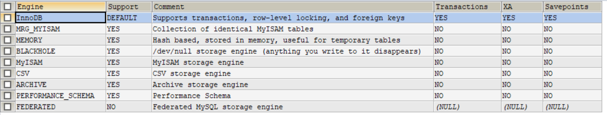
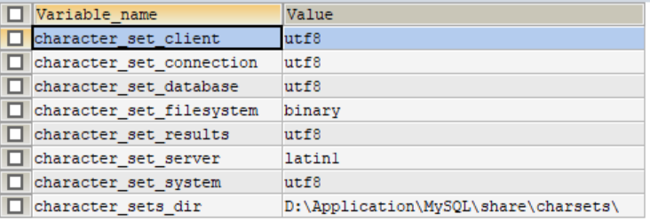

# Java基础

## 集合

### Map和Set

1. HashMap的底层结构，1.8之前是数组+链表，1.8之后为数组+链表/红黑树；数组是主体，链表是为了解决hash冲突
2. HashMap不是线程安全的，并发情况Rehash下容易造成死循环，并发情况下推荐使用ConcurrentHashMap
3. HashTable也是线程安全的，但是每次会对整个表加锁，导致效率低下，所以几乎已经不会使用了；
4. ConcurrentHashMap在1.7之前使用分段锁Segment，每次只锁一部分数据，Segment 实现了 ReentrantLock ,所以 Segment 是⼀种可重⼊锁，扮演锁的角色；1.8及之后，ConcurrentHashMap 不再是 【Segment 数组 + HashEntry 数组 + 链表】，而是 【Node 数 组 + 链表 】/【TreeNode数组 + 红黑树】，采⽤ CAS 和 synchronized 来保证并发安全，只锁定当前链表或红黑二叉树的首节点
5. HashSet、LinkedHashSet、TreeSet都是线程不安全的。LinkedHashSet按添加顺序排序，TreeSet可以自定义排序方式。
6. Collection
   1. List
      1. ArrayList
      2. Vector
      3. LinkedList
   2. Set
      1. HashSet：底层是通过实现HashMap实现的
      2. TreeSet：底层是通过实现TreeMap实现的
      3. LinkedHashSet
   3. Map
      1. HashMap
      2. LinkedHashMap：在HashMap基础上增加 了⼀条双向链表，使得上⾯的结构可以保持键值对的插⼊顺序
      3. HashTable
      4. TreeMap（红黑树）：实现是红黑树数据结构，是一棵自平衡的排序二叉树

## 反射

#### 动态语言与静态语言

动态语言是指在程序运行期间可以改变其结构的语言，比如新的属性或方法的添加、删除等结构上的变化。python, javaScript等是动态语言。

与动态语言相对应的是静态语言，c, c++是静态语言。

从反射的角度来说，java属于半动态语言，反射机制允许程序在执行期间借助Reflection API取得任何类的内部信息，并能直接操作任意对象的任意内部属性以及方法。

#### 反射机制

在java中，这种动态获取类和对象的信息，以及动态调用对象的方法的功能称为java语言的反射机制。

#### 反射的优点和缺点

1. 优点

   可以实现动态创建对象和编译，体现出很大的灵活性

2. 缺点

   对性能有影响。使用反射基本上是一种解释操作，我们告诉JVM我们希望做什么并且它满足我们的需求，这类操作总是慢于直接执行相同的操作。

#### 反射的步骤

1. 获取想要操作的类的Class对象；
   1. 调用某个对象的getClass()
   2. 调用某个类的class属性
   3. 调用Class类中的forName("fullClasspath")（性能最好，最安全，推荐使用）
2. 调用Class对象所对应的类中定义的方法；
3. 使用反射API来获取并调用类的属性和方法等信息。

#### 为什么框架需要反射

动态代理——AOP

注解——IoC

## 注解

#### Java注解是什么

在java中，注解就是给程序设置一些信息的接口，用@字符开头，这些信息用于修饰它后面紧挨着的其他代码元素，比如类、接口、字段、方法中的参数、构造方法等。注解可以被编译器、程序运行时和其他工具使用，用于增强或修改程序行为。可以通过反射的方式获取类或者方法的注解信息。

注解是一种声明式编程风格，通过简单的声明，就可以达到某种效果。


#### Java的内置注解

@Override，@deprecated, @SuppressWarning

日常开发中，我们一般使用自定义注解，或者框架和库定义的注解。


#### 自定义注解

通过设置元注解中的元数据，可以自定义注解。可以为注解定义一些参数，定义的方式是在注解内定义一些方法，返回值类型表示需要的参数类型，也可以为参数指定默认值。

```java
@Target(ElementType.METHOD)
@Retention(RetentionPolicy.RUNTIME)
public @interface MyAnnotation {
    String value() defaut "ok";
    Long score();
}
```


#### 注解的应用

1. 定制序列化

   自定义了两个注解@Lable和@Format

   ```java
   public class SimpleFormat {
       public static String format(Object obj) {
           try {
               Class<?> cls = obj.getClass();
               StringBuilder sb = new StringBuilder();
               for(Field f : cls.getDeclaredFields()) {
                   if(!f.isAccessible()) {
                       f.setAccessible(true);
                   }
                   Label label = f.getAnnotation(Label.class);
                   String name = label != null ? label.value() : f.getName();
                   Object value = f.get(obj);
                   if(value != null && f.getType() == Date.class) {
                       value = formatDate(f, value);
                   }
                   sb.append(name + ":" + value + "\n");
               }
               return sb.toString();
           } catch (IllegalAccessException e) {
               throw new RuntimeException(e);
           }
       }
   
       private static Object formatDate(Field f, Object value) {
           Format format = f.getAnnotation(Format.class);
           if(format != null) {
               SimpleDateFormat sdf = new SimpleDateFormat(format.pattern());
               sdf.setTimeZone(TimeZone.getTimeZone(format.timezone()));
               return sdf.format(value);
           }
           return value;
       }
   }
   ```

   Student

   ```java
   public class Student {
       @Label("姓名")
       private String name;
   
       @Label("出生年月")
       @Format(pattern = "yyyy/MM/dd")
       private Date bir;
   
       public Student(String name, Date bir) {
           this.name = name;
           this.bir = bir;
       }
   ```

   测试：

   ```java
   public class Demo {
       public static void main(String[] args) throws ParseException {
           SimpleDateFormat sdf = new SimpleDateFormat("yyyy-MM-dd");
           Student student = new Student("zhangsan", sdf.parse("1998-12-12"));
           System.out.println(SimpleFormat.format(student));
       }
   }
   ================================================================================
   姓名:zhangsan
   出生年月:1998/12/12
   ```

   在SimpleFormat中通过反射的方式获取Student类属性上的注解，如果是@Label注解，就输入其中的value，和属性值，如果是Format，就用使用自定义的日期格式。

   

2. 依赖注入容器

   依赖注入容器也称为DI容器，利用这个容器管理对象的生命周期及其依赖关系，这是一种控制反转（IoC）的思想，Spring框架就是基于IoC思想的框架。使用只有的框架，程序员不通过new创建对象，而是由容器管理对象的创建，对于依赖的服务，也不需要自己管理，而是使用**注解**表达依赖关系。在Web开发中，比如主流的SpringMVC框架，可以使用注解配置哪个方法处理哪个URL的请求。

   ```java
   // 在SpringBoot中, @Autowired表达这个类依赖于Userservice实例
   @Autowired
   private Userservice userservice;
   ```

#### Java注解到底有什么用

注解提升了Java语言的表达能力，有效地实现了应用功能和底层功能的分离，框架/库的程序员可以专注于底层实现，借助反射实现通用功能，提供注解给应用程序员使用，应用程序员可以专注于应用功能，通过简单的声明式注解与框架/库进行协作。


## 动态代理

动态代理是一种强大的功能，它可以在运行时动态创建一个类，实现一个或多个接口，可以在**不修改原有类的基础上动态为通过该类获取的对象添加方法、修改行为，这么描述比较抽象**。这些特性使得它广泛应用于各种系统程序、框架和库中，比如Spring、MyBatis等。和注解类似，在大部分的应用编程中，我们不需要自己实现动态代理，而只需要按照框架和库的文档说明进行使用就可以了。

动态代理是实现面向切面的编程AOP(Aspect Oriented Programming)的基础。切面的例子有日志、性能监控、权限检查、数据库事务等，它们在程序的很多地方都会用到，代码都差不多，但与某个具体的业务逻辑关系也不太密切，如果在每个用到的地方都写，代码会很冗余，也难以维护，AOP将这些切面与主体逻辑相分离，代码简单优雅得多。

#### 静态代理和动态代理

静态代理：代理和实际对象一般有相同的接口，代理对象内部有一个实际对象的成员变量，在构造方法中被初始化，对于业务方法的调用，代理对象会转发给实际对象，但可以在调用前后增加一些跟踪调试信息。这种在程序中创建一个代理类，代理类的代码在写程序之后是固定的，这种方式称为静态代理。

动态代理：代理类不是直接定义在代码中的，而是动态生成的。在java程序语言中有有两种方式实现动态代理，Java SDK和第三方库cglib。

#### Java SDK

```java
public class SimpleJDKDynamicProxyDemo {
    static interface IService{
        public void sayHello();
    }

    static class RealService implements IService{
        @Override
        public void sayHello() {
            System.out.println("hello");
        }
    }

    static class SimpleInvocationHandler implements InvocationHandler{
        private Object realObj;
        public SimpleInvocationHandler(Object realObj){
            this.realObj = realObj;
        }

        @Override
        public Object invoke(Object proxy, Method method, Object[] args) throws Throwable {
            System.out.println("entering ---" + method.getName());
            Object result = method.invoke(realObj, args);
            System.out.println("leaving ---" + method.getName());
            return result;
        }
    }

    public static void main(String[] args) {
        IService realService = new RealService();
        // 创建代理对象
        IService proxyService = (IService) Proxy.newProxyInstance(
                IService.class.getClassLoader(), new Class<?>[]{IService.class}, new SimpleInvocationHandler((realService))
        );
        proxyService.sayHello();  // class MyProxy.$Proxy0 Proxy类的子类
    }
}
```

代理对象procyService由java.lang.reflect包中的Procy类的静态方法newProcyInstance来创建。

```java
/**
Params:
loader – 定义代理对象的类加载器
interfaces – 代理类要实现的接口列表，是一个数组（类型元素只能是接口）
h – InvocationHandler，它只定义一个方法invoke，对代理接口的所有方法调用都会转交给该方法
Returns:
Object - 一个具有指定的调用处理程序的代理实例，该代理类是由指定的类加载器定义的，并且实现了interfaces中的某个接口，我们可以将其强转为interfaces中的某个接口。
**/
public static Object newProxyInstance(ClassLoader loader,
                                      Class<?>[] interfaces,
                                      InvocationHandler h) {
……
}
```

SimpleInvocationHandler实现了InvocationHandler接口，构造器接受一个参数表示被代理的真实对象realObj

```java
/**
Params:
proxy – 代理对象本身
method – 正在被调用的方法
args – 方法的参数
**/
public Object invoke(Object proxy, Method method, Object[] args);
// 在上面的例子中，我们调用了method的invoke方法，传递了实际对象realObj作为参数，达到了调用实际对象对应方法的目的。
```

上面动态生成代理对象的代码可以替换为：

```java
// 通过Proxy.getProxyClass创建代理对象的类定义，类名以$Proxy开头，后跟一个数字
Class<?> proxyCls = Proxy.getProxyClass(IService.class.getClassLoader(), 
                                        new Class<?>[] { IService.class });
// 通过反射获取代理对象的构造器方法，构造方法需要一个InvocationHandler类型的参数
Constructor<?> ctor = proxyCls.getConstructor(new Class<?>[] { InvocationHandler.class });
// 创建InvocationHandler对象，创建代理类对象
InvocationHandler handler = new SimpleInvocationHandler(realService);
IService proxyService = (IService) ctor.newInstance(handler)
```

总结：Proxy类定义本身与被代理的对象没有关系，与InvocationHandler的具体实现也没有关系，而主要与接口数组有关，给定这个接口数组，它动态创建每个接口的实现代码，实现就是转发给InvocationHandler，与被代理对象的关系以及对它的调用由InvocationHandler的实现管理。

动态代理的优点：

使用动态代理，可以编写通用的代码逻辑，用于各种类型的被代理对象，而不需要为每个被代理的类型都创建一个静态代理类。

```java
static <T> T getProxy(Class<T> intf, T realObj){
    return (T) Proxy.newProxyInstance(
            intf.getClassLoader(), new Class<?>[]{intf}, new SimpleInvocationHandler((realObj))
    );
}

public static void main(String[] args) {
    // 创建XService的代理对象
    XService realXService = new RealXService();
    XService Xproxy = getProxy(XService.class, realXService);
    System.out.println(Xproxy.getClass());
    Xproxy.sayHello();
	// 创建YService的代理对象
    YService realYService = new realYService();
    YService Yproxy = getProxy(YService.class, realYService);
    System.out.println(Yproxy.getClass());
    Yproxy.sayBye();
}
```

#### cglib动态代理

Java SDK动态代理的局限在于只能为接口创建代理，返回的代理对象也只能转换到某个接口类型。

如果一个类没有接口，或者希望代理给接口中的方法，就没有办法，这个时候可以选择第三方类库cglib为普通的类创建代理对象。

```java
public class SimpleCGLibDemo {
    static class realService{
        public void sayHello(){
            System.out.println("hello");
        }
    }

    static class SimpleInterceptor implements MethodInterceptor{
        @Override
        public Object intercept(Object o, Method method, Object[] objects, MethodProxy methodProxy) throws Throwable {
            System.out.println("entering..." + method.getName());
            Object result = methodProxy.invokeSuper(o, objects);
            System.out.println("leaving..." + method.getName());
            return result;
        }
    }
	// 获取一个类的代理对象
    static <T> T getProxy(Class<T> cls){
        Enhancer enhancer = new Enhancer();
        enhancer.setSuperclass(cls); // 设置被代理的类
        enhancer.setCallback(new SimpleInterceptor()); // 设置被代理类的public非final方法被调用时的处理类
        return (T) enhancer.create();
    }

    public static void main(String[] args) {
        // 不用创建被代理类的对象，直接创建代理对象
        realService proxy = getProxy(realService.class);
        proxy.sayHello();
    }
}
```

cglib与java SDK不同，它是通过继承实现的动态代理，它动态创建一个类，但这个类的父类是被代理的类，代理类重写了父类的public非final方法，改为调用Callback中的相关方法。

#### java SDK与cglib的区别

1. Java SDK代理面向的是一组接口，代理对象procyService由java.lang.reflect包中的Procy类的静态方法newProcyInstance来创建，并为接口动态创建实现类，接口的具体实现逻辑由自定义的InvocationHandler实现；cglib面向的是一个具体的类，动态创建该类的子类，重写其方法；
2. Java SDK代理的是对象，cglib代理的是类；
3. 如果要为一个类的方法增强功能，Java SDK要求该类必须实现接口，且只能处理接口中的方法，cglib没有这样的限制。

#### 动态代理的应用—AOP

定义一个注解@Aspect，参数value指定要增强的类。

```java
@Retention(RUNTIME)
@Target(TYPE)
public @interface Aspect {
 Class<?>[] value();
}
```

定义切面，使用注解@Aspect，比如定义ServiceLogAspect表示为类A和类B增加日志功能，切面类中定义一些方法，比如before()，在主体类方法执行前执行。

```java
@Aspect({ServiceA.class,ServiceB.class})
public class ServiceLogAspect
```

AOP要借助容器实现，在容器中获取ServiceA和ServiceB，并改变他们的行为。这是怎么做到的呢？CGLibContainer在初始化的时候，会分析带有@Aspect注解的类，分析出每个类的方法在调用前/调用后/出现异常时应该调用哪些方法，在创建该类的对象时，如果有需要被调用的增强方法，则创建一个动态代理对象。

#### 反射是框架的灵魂

综上所述：IoC基于注解实现，AOP基于动态代理，动态代理基于注解和反射，注解也需要反射才能发挥出作用，所以反射是框架的灵魂。

# 数据库

## MySQL

1. 关系型数据库，企业开发中常用，开源免费，可以修改定制

2. 存储引擎

   ```mysql
   # 数据库版本:5.7
   SHOW ENGINES  # 查看mysql提供的存储引擎
   SHOW VARIABLES LIKE '%storage_engine' # 查看mysql当前默认的存储引擎
   SHOW TABLE STATUS LIKE "student" # 查看表的存储引擎
   ```

   

3. MyISAM和InnoDB的区别

   | 搜索引擎 | InnoDB                 | MyISAM  |
   | -------- | ---------------------- | ------- |
   | 版本     | 5.5之后的默认搜索引擎  | 5.5之前 |
   | 外键     | 支持                   | 不支持  |
   | 事务     | 支持                   | 不支持  |
   | 安全恢复 | 支持                   | 不支持  |
   | 锁       | 表级锁，行级锁（默认） | 表级锁  |
   | MVCC     | 支持                   | 不支持  |

4. 字符集

   字符的集合，每个字符集采用的编码方式不同。

   常见字符集：ASCII字符集，GBK字符集，UTF8字符集

   查看MySQL字符集编码设置：SHOW VARIABLES LIKE '%character%'

   

​	创建库、表、列时使用的字符集（MySQL以一种类似继承的方式指定字符集的默认值）：

​		①建库时，若未明确指定字符集，则采用character_set_server指定的字符集。

　　②建表时，若未明确指定字符集，则采用当前库所采用的字符集。

　　③新增时，修改表字段时，若未明确指定字符集，则采用当前表所采用的字符集。

​	常见命令：

```mysql
 set character set # 查看数据库支持的所有字符集(charset)：
 alter database database_name character set xxx; # 修改数据库字符集
 alter table table_name character set xxx; # 修改表字符集，不会改变已经存储的列的字符集
 alter table table_name convert to character set xxx; # 同时修改表字符集和已有列字符集，并将已有数据进行字符集编码转换。
```

​	校对规则：是在字符集内用于字符比较和排序的一套规则，比如有的规则区分大小写，有的则无视。

5. MySQL索引使用的数据结构主要有**BTree索引**和**哈希索引**。
   - **哈希索引**：只适合单条记录查询
   - **BTree**：大部分场景下适合
   
6. varchar和char

   |                      | verchar                                      | char                                                         |
   | -------------------- | -------------------------------------------- | ------------------------------------------------------------ |
   | 是否定长             | 可变长字符串                                 | 定长字符串                                                   |
   | 是否需要额外记录长度 | 需要额外1/2个字节记录字符串长度（以255为界） | 不需要额外记录长度                                           |
   | 使用场景             | 字符串列最大长度远大于平均长度；列的更新少   | 存储短字符串，或者所有值长度接近；经常变更的数据，不易产生碎片；非常短的列（不需要额外记录长度） |
   |                      |                                              |                                                              |

   

## 事务

### 并发事务带来哪些问题

#### 写的问题：

1. 第一类丢失更新：某个事务的回滚，导致另一个事务已更新的数据丢失
2. 第二类丢失更新：某一个事务的提交，导致另一个事务已更新的数据丢失

#### 读的问题：

1. 脏读：某个事务读取了另一个事务未提交的数据

   ```
   T1：                    T2
   read      N=10
   write     N=11 
   				   read:N=11
   rollback  N=10
   ```

2. 不可重复读：某个事务对同一数据前后读取的结果不一样

   ```
   T1：                    T2
   read      N=10
   				  read:N=10
   write     N=11       
   commit    N=11
   				  read:N=10
   ```

3. 幻读：某一个事务对同一个表前后查询到的行不一致

```
T1：                    T2
                select：id < 10 (1, 2, 3)
insert:id=4 
commit
			   select：id < 10 (1, 2, 3, 4)
```

### 事务的隔离级别和传播行为

#### 隔离级别

可读未提交、可读提交、可重复度、串行化

MySQl的默认隔离级别是可重复读

#### 传播行为

业务方法调用时，事务在方法之间如何使用，被调用的业务方法如何对待外部事务

常用的有: required, requires_new, nested

#### 实现机制

悲观锁（数据库）

乐观锁（自定义）

#### Spring事务管理

声明式事务，对整个方法添加事务

1. XML配置，适合大型项目，使业务方法与事务配置分离
2. 注解配置

编程式事务：可以对方法中某一部分业务代码添加事务

1. 通过TransactionTemplate管理事务


# Java 8 新特性

## Stream()聚合操作

聚合操作是Java 8针对集合类，使编程更为便利的方式，可以与Lambda表达式一起使用，达到更加简洁的目的。对聚合操作的使用可以归结为3个部分：

    创建Stream: 通过stream()方法，取得集合对象的数据集。
    Intermediate: 通过一系列中间（Intermediate）方法，对数据集进行过滤、检索等数据集的再次处理。例如使用filter()方法来对数据集进行过滤。
    Terminal: 通过最终（terminal）方法完成对数据集中元素的处理。例如使用forEach()完成对过滤后元素的打印。

在一次聚合操作中，可以有多个Intermediate，但是有且只有一个Terminal。可以这么认为，Stream 里有个操作函数的集合，每次转换操作就是把转换函数放入这个集合中，在 Terminal 操作的时候循环 Stream 对应的集合，然后对每个元素执行所有的函数。

Stream的操作分类：

    Intermediate：map (mapToInt, flatMap 等)、 filter、 distinct、 sorted、 peek、 skip、 parallel、 sequential、 unordered
    
    Terminal：forEach、 forEachOrdered、 toArray、 reduce、 collect、 min、 max、 count、iterator
    
    Short-circuiting：
    anyMatch、 allMatch、 noneMatch、 findFirst、 findAny、 limit
- fliter：对原Stream按照指定条件过滤，在新建的Stream中，只包含满足条件的元素，将不满足条件的元素过滤掉。
- map：对于Stream中包含的元素使用给定的转换函数进行转换操作，新生成的Stream只包含转换生成的元素。
- collect：collect也就是收集器，是Stream一种通用的、从流生成复杂值的结构。
- findFirst：用于获取含有Stream中的第一个元素的Optional