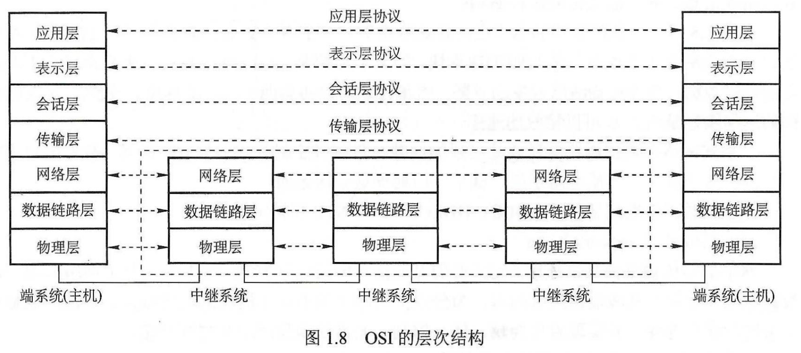
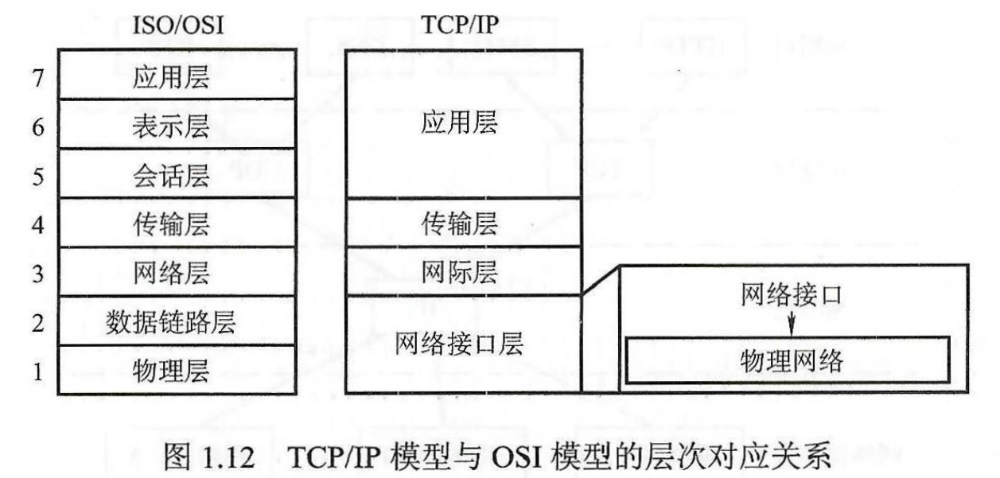
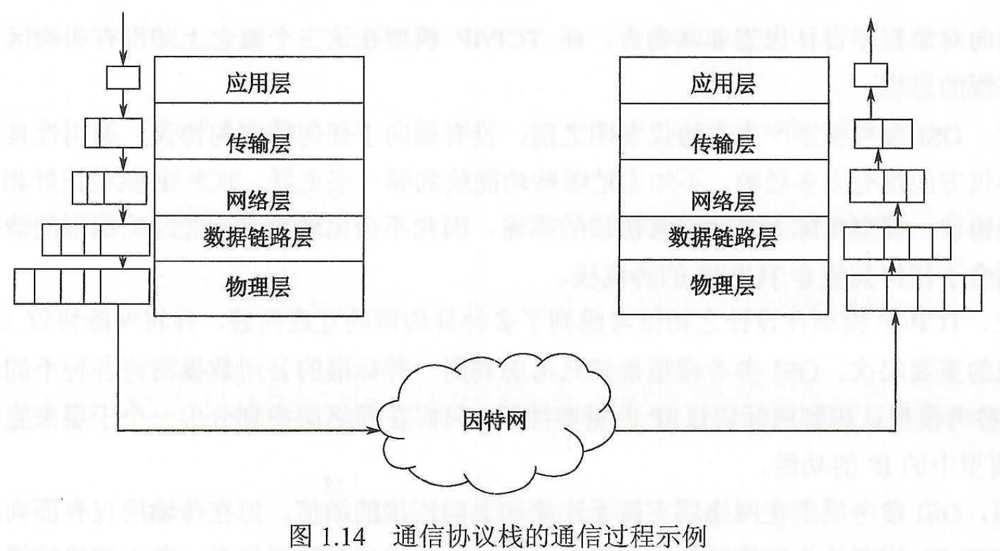
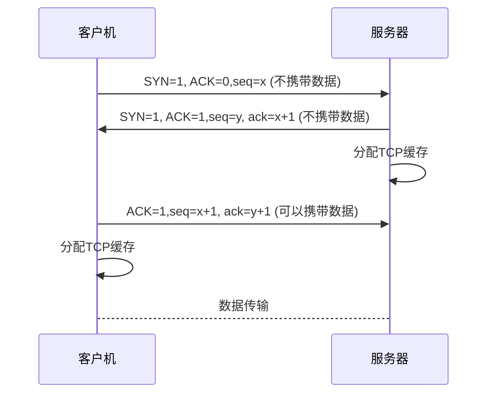
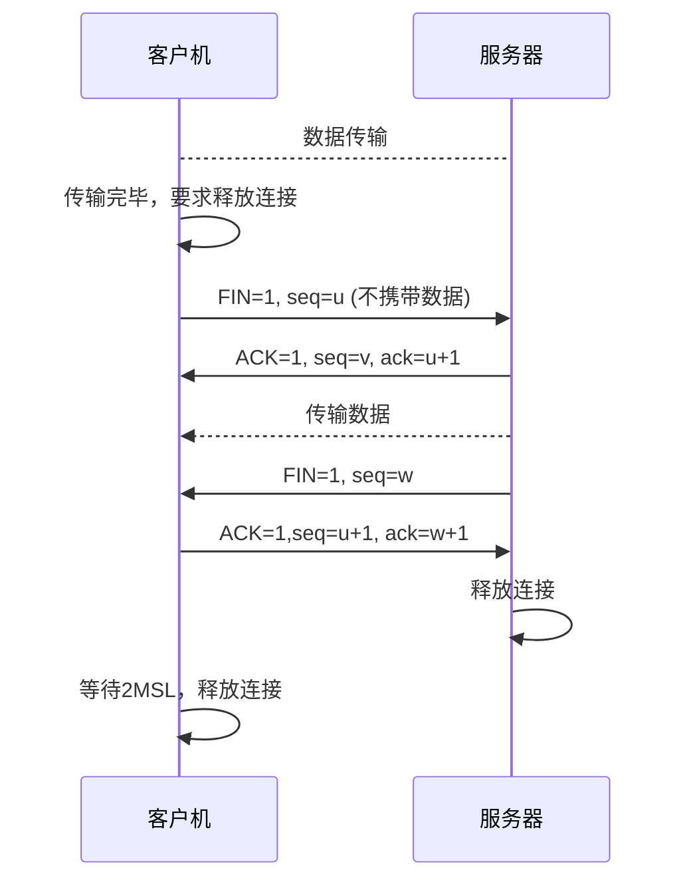

# 计算机网络和因特网

## 计算机网络的组成

#### 从组成部分上看

一个完整的计算机网络主要由硬件、软件、协议三大部分组成。

- 硬件：由主机、通信链路、交换设备和通信处理机等组成。
- 软件：实现资源共享的软件和方便用户使用的各种工具软件（网络操作系统、邮件收啊程序等）
- 协议：计算机网络的核心，规定了网络传输数据时所遵循的规范

#### 从工作方式上看

计算机网络可以分为边缘部分和核心部分。

- 边缘部分：由与因特网相连的计算机和其他设备，即端系统/主机组成，用于通信和资源共享
- 核心部分：由大量的网络和连接这些网络的路由器组成，为边缘部分提供连通性和交换服务

#### 从功能组成上看

计算机网络由通信子网和资源子网组成。

通信子网：由各种传输介质、通信设备和相应的网络协议组成，实现联网计算机之间的通信

资源子网：实现资源共享功能的设备及其软件的集合

## 计算机网络的功能

1. 数据通信
2. 资源共享
3. 分布式处理
4. 提高可靠性
5. 负载均衡

## 计算机网络的分类

#### 按分布范围

1. 广域网
2. 城域网
3. 局域网（LAN）
4. 个人区域网

#### 按传输技术

1. 广播式网络
2. 点对点网络

#### 按拓扑结构

拓扑结构是指网中节点与通信链路的几何关系

1. 总线形
2. 星形
3. 环形
4. 网状形

#### 按使用者

1. 公用网：运营商提供的网
2. 专用网：满足单位特殊业务专门建造的网，例如军队、铁路的专用网

#### 按交换技术

1. 电路交换网络
2. 报文交换网络（存储-转发网络）
3. 分组交换网络

## 计算机网络的性能指标

1. 宽带：计算机网络中表示数字信道能传送的“最高数据率”，bit/s
2. 时延：数据从网络的一端传送到另一端所需的时间
3. 时延宽带积
4. 吞吐量：单位时间内通过某个网络的数据量
5. 信道利用率：某一时间内，有效数据通信的时间占总时间的比值

## 计算机网络分层结构

计算机网络的各层及其协议的集合称为网络的体系结构。计算机网络的体系结构就是这个计算机网络及其所完成的功能的精确定义，它是计算机网络中的层次、各层的协议及层间接口的集合。

分层要保证一下基本原则：

1. 每一层相互独立
2. 各层之间界面自然清晰，相互交流尽可能少
3. 各层的定义独立与具体的实现方法
4. 保持下层对上层的独立性，上层单向使用下层提供的服务
5. 整个分层结构能促进标准化工作

计算机网络的分层，既要保证层次划分清晰，也要保证运行效率。

n层使用n-1层提供的服务实现本层的功能，还要为n + 1层提供服务（前面n层服务的总和），注意只为上层提供接受服务的接口。最低层只提供服务，最高层向用户提供服务。

每一层的数据单元：PDU = SDU + PCI

- SDU：服务数据单元
- PCI：协议控制信息
- PDU：协议数据单元

在隔层间传输数据时，把从n+1层的PDU作为本层的SDU，加上n层的PCI，组成本层的PDU

 

## 计算机网络协议、接口、服务

协议：规则的集合

为进行网络间的数据交换而建立的规则、标准和约定称为网络协议。

接口：同一结点内相邻两层间交换信息的连接点，每层只能为紧邻的层定义接口，不能跨层定义接口。

服务：下层为紧邻的上层提供的功能调用。


## OSI参考模型

OSI系统是ISO提出的网络体系结构模型。

OSI参考模型：开放系统互联参考模型

ISO：国际标准化组织



低三层称为通信子网，为了联网而附加的通信设备，完成数据的传输功能

高三层称为资源子网，相当于计算机系统，完成数据的处理等功能

传输层承上启下。

上面四层是端到端通信，下面三层是点对点通信。

## TCP/IP模型



学习的计算机网络时，通常选择一个折中，学习网络的五层协议体系结构模型。



#### 应用层

应用层(application-layer）的任务是通过应用进程间的交互来完成特定网络应用。应用层协议定义的是应用进程（进程：主机中正在运行的程序）间的通信和交互的规则。对于不同的网络应用需要不同的应用层协议。比如电子邮件（SMTP协议），文件传输（FTP协议），万维网（HTTP）

* 会话层, 表示层和应用层的数据传输基本单位是报文;
* 包含的主要协议:
  * FTP协议(文件传输协议);
  * Telnet(远程登陆协议);
  * DNS协议(域名解析协议);
  * SMTP协议(邮件传输协议);
  * POP3协议(邮局协议);
  * HTTP协议(Hyper Text Transfer Protocol, 超文本传输协议)


#### 传输层

负责主机中两个进程之间的通信，即端到端的通信，传输单位是报文段或者用户数据报。功能是为端到端提供可靠的传输服务，为端到端连接提供流量控制、差错控制、服务质量、数据传输管理等服务。

- 功能：

  1. 可靠传输、不可靠传输
  1. 差错控制
  1. 流量控制
  1. 复用分用

- 基本数据单元是段/数据包;
- 包含的**主要协议**:
  * TCP协议(Transmission Control Protocol, 传输控制协议)
  * UDP协议(User Datagram Protocol, 用户数据报协议)
- 重要设备: **网关**


#### 网络层

因特网是一个很大的互联网，它由大量的异构网络通过路由器相互连接起来。因特网的主要网络层协议是无连接的网际协议（Internet Protocol, IP）和许多路由选择协议，因此因特网的网络层也称为IP层或者网际层。

网络层的任务之一就是实现网络互联，在TCP/IP体系中，实现网络互联采用的做法就是在网络层使用标准化协议（IP协议），网络层选择合适的网间路由和交换结点， 确保数据及时传送，为分组交换网上的不同主机提供通信服务。网络层传输单位是IP数据报。

- 功能：

  1. 路由选择
  1. 流量控制
  1. 差错控制
  1. 拥塞控制
  1. 网际互联


- 基本数据单元是**IP数据包**；

- 包含的**主要协议**有：

  - IP协议（Internet Protocol，因特网互联协议）；

  - ICMP协议（Internet Conrtrol Message Protocol，因特网控制报文协议）；

  - ARP协议（Address Resolution Protocol，地址解析协议）；

  - RARP协议（Reverse Address Resolution Protocol，逆地址解析协议）。

- 设备：路由器


#### 数据链路层

主要任务就是把网络层传下来的IP数据报组装成帧。

- 功能：

  1. 成帧
  1. 差错控制
  1. 流量控制
  1. 访问控制

- 基本数据单元为帧
- 主要的协议：以太网协议
- 两个重要设备名称：网桥和交换机。


数据链路层提供的是点到点的通信，传输层提供的是端到端的通信，如何理解？

- 点到点是指主机到主机之间的通信，一个点是指一个硬件地址或者IP地址，网络中参与通信的主机是通过硬件地址或者IP地址标识的
- 有物理层、数据链路层和网络层组成的通信子网为网络环境提供点到点的服务，传输层提供端到端的通信
- 点到点的通信是直连的，不保证数据传输的可靠性
- 端到端的通信是建立在点到点通信的基础之上的，由一段一段的点到点通信信道构成
- 端到端的通信是指运行在不同主机内的两个进程之间的通信，一个进程有一个端口号来标识


#### 物理层

在物理媒体上实现比特流的透明传输，物理层单位是比特。

透明传输：不管所传的数据是什么样的比特组合，都应当能够在链路上传输。

功能：

1. 定义接口特性
2. 定义传输模式（单工、半双工、双工）
3. 定义传输速率
4. 比特同步
5. 比特编码


# 物理层

物理层考虑的是如何在连接到个台计算机的传输媒体上传输数据比特流，而不是具体的传输介质（双绞线、光纤等）。物理层尽可能屏蔽各种物理设备的差异，使数据链路层只需考虑本层的协议和服务。

- 物理层的主要任务是：确定与传输媒体的接口有关的一些特性。

  - 机械特性

  - 电气特性

  - 功能特性

  - 规程特性

- 两个重要的设备：中继器（Repeater，也叫放大器）和集线器


## 通信基础——传输方式

### 电路交换

运用于电话网。

1. 三个阶段

   连接建立、数据传输和连接释放

   进行数据传输前，两个结点之间必须建立一条专用的物理通道，这个路径在数据传输过程中一直被占用，直到通信结束后才被释放。

2. 优点
   1. 通信时延小，直连方式
   2. 有序传输
   3. 没有冲突，不同通信双方拥有不同的信道
   4. 适用范围广
   5. 控制简单
3. 缺点
   1. 建立连接时间长
   2. 线路独占
   3. 灵活性差
   4. 难以规范化

### 报文交换

运用在早期的电报通信网。

数据交换的单位是报文，报文携带目标地址、源地址等信息。报文交换在交换结点采用的是**存储转发**的传输方式。

1. 优点
   1. 无需建立连接
   2. 动态分配路线
   3. 提高线路可靠性
   4. 提高线路利用率
   5. 提供多目标服务
2. 缺点
   1. 数据进入交换节点后要经历存储、转发过程，所以会引起转发时延
   2. 报文交换对报文的大小没有限制，要求网络结点需要较大的缓存空间。

### 分组交换

采用存储转发方式，但是分组交换限制了每次传送的数据块大小的上限。 把报文分割成小的数据块，加上必要的控制信息构成分组。

1. 无连接的数据报方式：网络层的IP数据报
2. 面向链接虚电路方式


## 传输介质（媒体）

传输介质并不是物理层，传输介质就是真正传输信号的媒体，但传输介质不知道自己传输的信号代表什么含义，是物理层规定了电气特性，所以能够识别所传送的比特流。

1. 无线传输介质

   无线电波、微波、红外线和激光

2. 有线传输介质

   双绞线、同轴电缆、光纤


## 物理层的设备

中继器

主要功能是将信号整形并放大再转发出去，以消除信号经过一长段电缆后产生的失真和衰减，使信号恢复到所需的要求，主要用于在局域网内扩大网络规模。

> 中继器是放大数字信号的，放大器是放大模拟信号的。二者功能类似


集线器

集线器（Hub）实质上是一个多端口的中继器。Hub主要使用双绞线组建共享网络，是从服务器连接到桌面的最经济的方案。


# 数据链路层

## 功能

加强物理层传输原始比特流的功能，将物理层提供的可能出错的物理连接改造成逻辑上无差错的数据链路，使之对网络层表现为一条无差错的链路。

1. 为网络层提供服务：将源机器中来自网络层的数据传输到目标机器的网络层
2. 链路管理：数据链路层链接的建立、维持和释放的过程
3. 帧定界、帧同步与透明传输（组帧）：将网络层的分组封装成帧
4. 流量控制：控制相邻两结点之间数据链路上的流量，限制发送方的数据流量，使其发送速率不超过接受方的接受能力
5. 差错控制：使发送方确定接受方是否已经正确收到其发送的数据的方法。包括位错和帧错
   - 位错：帧中某些位出现了差错。通常采用循环冗余校验方式发现位错，通过自动重传请求方式来重传出错的帧。
   - 帧错：帧的丢失、重复、失序等。在数据链路层引入定时器和编号机制保证每一帧都能有且仅有一次正确地交付给目的结点。


## 组帧

**为什么要组帧？**

数据链路层数据传输的单位是帧，出错只用重发出错的帧，提高传输效率。


组帧就是把网络层递交的分组封装成帧，主要解决**帧定界、帧同步、透明传输**等问题。

> 组帧时急需要添加尾部也需要添加首部，否则接受端无法从一串比特流中区分数据帧从哪开始从哪结束。

通常有四种组帧的方式：

1. 字符计数法：每一帧的头部使用一个计数字段标明帧内字符数，目的结点的数据链路层根据计数确定帧的结束位置
   - 缺点：计数字段出错就失去了帧边界划分的依据
2. 字符填充的首尾定界符法：用特殊字符（DLE STX）和（DLE ETX）标识帧头和帧尾
3. 零比特填充的首尾标志法：用一个特定的比特模式（比如01111110）标志帧的开始和结束
4. 违规编码法：比如0-低高，1-高低，而低低和高高属于违规编码，可以用来作为定界帧的起始和终止，只适用于冗余编码环境

目前较为常用的组帧方式是**零比特填充**的首尾标志法和**违规编码法**。


## 差错控制

数据链路层中的数据传输是比特流，比特在传输的过程中可能会出现差错，数据链路层可以对这种差错进行检查和纠正，通常利用编码技术进行差错控制。

1. 检错编码：

   采用冗余编码技术，冗余位包含了对数据的信息，接受端根据冗余位检查数据是否出现了差错。常见的检错编码有奇偶校验码和循环冗余码。

2. 纠错编码

   在每个要传输的数据上附加足够的冗余信息，使接受方可以推导出发送方实际上发送的是什么信息。常见的纠错编码方式有汉明码。


## 流量控制和可靠传输机制

在数据链路层，流量控制机制和可靠传输机制是交织在一起的。

### 流量控制

流量控制是对链路上的帧的发送速率的控制，以使接收方有足够的缓存空间来接受每个帧。流量控制的基本方法是由接收方控制发送方数据的速率，常见的方式有**停止-等待协议**和**滑动窗口协议**。

#### 停止-等待协议

- 发送方每发送一帧，都要等待接收方的应答信号，之后才能发送下一帧
- 每次只能发送以帧，传输效率低


#### 滑动窗口协议

- 每一时刻，发送方都维护一段连续的允许发送的帧的序号，称为发送窗口；
- 接收方都维护一段连续的允许接受的帧的序号，称为接收窗口，在接收方，只有序号落入接收窗口的帧才被允许接收，落在接收窗口之外的帧一律丢弃；
- 发送端每收到一个确认信号，发送窗口就向前滑动一个帧的位置，发送窗口内没有可以发送的帧时，就会停止1发送，开始等待；
- 接收方收到数据帧后，将窗口向前移一个位置，并发回确认帧。


**注意：**

1. 停止-等待协议等价于发送窗口与接收窗口大小都为1的滑动窗口协议
2. 接收窗口大小为1时，可以保证帧的顺序接收
3. 数据链路层的滑动窗口协议中，窗口大小在传输过程中是固定的


### 可靠传输机制

数据链路层通常使用 【确认】和【超时重传】两种机制来保证可靠传输

确认：接收方在接收到内容之后发送一个无数据的【确认帧】给发送方，让发送方知道哪些内容被正确接受了。

超时重传：发送方在发送一个数据帧之后就开启计时器，如果一点时间内没有收到这个帧的确认帧，发送放就会重新发送该数据帧，直到成功。

#### 自动重传请求（ARQ）

接受方请求发送方重传出错的数据帧来恢复出错的帧，分为三种：

- 停止-等待ARQ

  发送方只有正确接收到接收方发来的ACK之后，才能发送下一个帧。

- 后退N帧ARQ

  接收方只允许按顺序接受帧，当检测到失序的信息帧之后，要求发送方重发最后正确接收的信息帧之后的所有未被确认接收的帧。

- 选择性重传ARQ

  只重传出现差错的数据帧或者计时器超时的数据帧。


## 介质访问控制

介质访问层是数据链路层的一个子层。让用同一广播信道的不同结点之间的访问不会发生干扰，主要是用于信道划分。


## 局域网和广域网

**局域网**

在一个较小的地理范围内，将各种计算机、外部设备和数据库系统等通过双绞线、同轴电缆等连接介质相互连接起来，组成资源和信息共享的计算机互联网络。

**广域网**

覆盖范围很广的长距离网络。广域网是因特网的核心部分，其任务是长距离运送主机所发送的数据，链接广域网节点交换机的链路都是高速链路，光缆线路或者卫星链路。

广域网不同于互联网，互联网可以连接不同类型的网络（既可以连接局域网也可以连接广域网），一般用路由器连接。下图描述了局域网通过路由器与广域网相连而成一个覆盖范围很大的互联网。


广域网由结点交换机和连接这些交换机的链路组成，结点之间都是点到点的连接，为了提高网络的可靠性，一个结点交换机往往与多个结点交换机相连。

## 数据链路层设备

**网桥**

网桥工作在数据链路层的MAC子层，是连接以太网（局域网）的设备。

**局域网交换机**

多端口的网桥，检测从以太端口来的数据帧的源和目的地的MAC地址，然后与系统内部的动态查找表进行比较，若数据帧的MAC地址不在表中，则将其加入查找表，并将数据帧发送给目的端。


# 网络层（IP层）

异构网络：是一种类型的网络，其是由不同制造商生产的计算机，网络设备和系统组成的，大部分情况下运行在不同的协议上支持不同的功能或应用。

TCP/IP体系在网络互联上采用的做法是在网络层采用标准化协议，但相互连接的网络可以是异构的。**通过使用相同的网际协议（IP协议）将异构网络互联起来，这些异构的网络在网络层看起来就像是一个统一的网络**。

互联后的网络就是一个虚拟IP网络，计算机通过虚拟IP网络进行通信时，就像在同一个网络上通信一样，而看不到互联的具体的网络异构细节。


## 网络层的功能

1. 异构网络互联

   两个及以上的计算机网络，通过一定的方法，用一种或多种【中继系统】相互连接起来，构成更大的网络系统。

   中继系统在不同层是不同的设备：

   - 物理层：中继器、集线器

   - 数据链路层：交换机、网桥

   - 网络层：路由器

   - 更高层：网关

   > 物理层和数据链路层的中继系统只是把一个网络扩大，而不是不同网络的互联

   

2. 路由与转发（路由器的功能）

   1. 路由选择
   2. 分组转发

3. 拥塞控制

   如果随着网络负载的增加，网络的吞吐量开始下降，网络就可能已经开始拥塞了。

   拥塞控制的作用是确保子网能够承载所达到的流量，这是一个全局性过程，涉及到主机、路由器、以及路由器内部的转发处理过程等。

   > 拥塞控制和流量控制的区别
   >
   > - 流量控制是指发送端与接收端之间的点对点通信量的控制，主要是要控制发送端的发送速率；
   > - 拥塞控制是一个全局性问题，涉及到主机、路由器、以及导致网络传输能力下降的所有因素。


## 路由算法

路由器转发分组是根据路由表转发的，而路由表需要通过路由算法得到。

#### 静态路由算法

由管理员手动配置的路由信息，当网络拓扑结构或者链路状态发生改变时需要手动修改。适用于军事网络和小型商业网络。


#### 动态路由算法

RIP协议: 底层是贝尔曼福特算法,一种动态路由选择协议,基于距离矢量算法,使用**“跳数”**(即metric)来衡量到达目标地址的路由距离。这种协议的路由器只关心自己周围的世界，只与自己相邻的路由器交换信息，范围限制在**15跳**(15度)之内，再远，它就不关心了.

OSPF(开放式最短路由优先/链路状态路由)协议: 底层是迪杰斯特拉算法.


## IPv4

IPv4是IP（网络协议）版本4，IP定义数据传送的基本单位是IP分组。


### IP分组


网络层的路由器执行的分组转发算法如下：

1. 从数据报的首部提取目的主机的IP地址D，得出网络地址N
2. 若网络N与此路由器直接相连，则把数据报直接交付给目的主机D，这称为路由器的直接交付，否则是间接交付
3. 若路由器表中有目的地址D的特定主机路由，则把数据报传送给路由表中指明的下一跳路由器，否则，转4
4. 若路由器表中没有到达网络N的路由，则把数据报传送给路由表指明的下一跳路由器，否则转5
5. 若路由器表有一个默认路由，则把数据报传送给路由表指明的默认路由，否则转6
6. 报告转发分组出错。


### IP地址

连接到因特网上的每台主机（路由器）都有一个32比特的全球唯一标识符，也就是IP地址。

IP地址由网络号和主机号组成，网络号在整个因特网中唯一，表示主机连到的网络；主机号标识该主机，在IP地址所指向的网络范围内唯一。

1. A,B,C,D,E类地址(不同规模的网络)

   * A类:以0开头，第一个字节作为网络号，地址范围为：0.0.0.0~127.255.255.255；

   * B类:以10开头，前两个字节作为网络号，地址范围是：128.0.0.0~191.255.255.255;

   * C类:以110开头，前三个字节作为网络号，地址范围是：192.0.0.0~223.255.255.255;

   * D类:以1110开头，地址范围是224.0.0.0~239.255.255.255，D类地址作为组播地址（一对多的通信）；

   * E类地址:E类地址以1111开头，地址范围是240.0.0.0~255.255.255.255，E类地址为保留地址，供以后使用。

   * 注意:D类和E类地址不区分网络号和主机号.

     

2. 网络地址:IP地址由网络号和主机号组成,网络地址的主机号全为0.

3. 广播地址:广播地址与网络地址的主机号正好相反，广播地址中，主机号为全1。

4. 组播地址:D类地址

5. 255.255.255.255:受限的广播地址,只能用于本地网络

6. 0.0.0.0:常用于寻址自己的IP地址

7. 回环地址:127.0.0.0/8被用作回环地址，回环地址表示本机的地址，常用于对本机的测试，用的最多的是127.0.0.1。

8. A,B,C类私有地址:私有地址(private address)也叫专用地址，它们不会在全球使用，只具有本地意义。

   * A类私有地址：10.0.0.0/8，范围是：10.0.0.0~10.255.255.255
   * B类私有地址：172.16.0.0/12，范围是：172.16.0.0~172.31.255.255
   * C类私有地址：192.168.0.0/16，范围是：192.168.0.0~192.168.255.255

### 子网掩码与网络划分

子网掩码:是标志两个IP地址是否同属于一个子网的，也是32位二进制地址，其每一个为1代表该位是网络位,0代表主机位.

* A类的子网掩码:255.0.0.0
* B类的子网掩码:255.255.0.0
* C类的子网掩码:255.255.255.0

子网划分:目前IP地址的位数肯定不够全世界分的，那么需要将一个IP地址划分为多个IP地址，而网络号部分是唯一的不能动，所以可以将主机号部分借位给网络号部分进行子网划分处理，以提高IP地址的数量。

```
例题1:
假定某单位申请的B类地址为179.143.xxx.xxx，如果希望把它划分为14个子网，需要借用几个主机位?子网掩码？
解:14个子网:14-->1110,N = 4,将主机部分的前4位划分为子网的子网掩码
B类地址的子网掩码是255.255.0.0,子网的子网掩码是255.255.240.0
答:需要借助4个主机位,子网的子网掩码是255.255.240.0
```

```Chinese
例题2:
将B类IP地址168.195.0.0划分成若干子网，每个子网内有主机700台，子网掩码多少？
解:700-->10 1011 1100,N = 10,所以需要10位作为主机号,剩下的6位用于子网划分
将255.255.255.255的最低10位置为0得到子网的子网掩码为255.255.252.0
```

```
例题3:
一个子网有10台主机，那么对于这个子网需要的IP地址是：
10＋1＋1＋1＝13
注意：加的第一个1是指这个网络连接时所需的网关地址，接着的两个1分别是指网络地址和广播地址。
因为13小于16（16等于2的4次方），所以主机位为4位。而256－16＝240，所以该子网掩码为255.255.255.240。
```


## ARP/RARP协议

### **IP地址与硬件地址**

IP地址是网络层及网络层之上使用的地址，物理地址是数据链路层使用的地址（如MAC地址）。IP地址放在IP数据报的前面，MAC地址放在MAC帧的首部，在数据链路层成帧之后，就看不见IP数据报中的IP地址了。

ARP（地址解析协议）可以完成IP地址到MAC地址的映射。


### ARP协议

**ARP协议指地址解析协议, 是根据IP地址获取物理(MAC)地址的一个TCP/IP协议.**当主机A要与主机B通信时，地址解析协议可以将主机B的IP地址（192.168.1.2）解析成主机B的MAC地址，以下为工作流程：ARP的工作流程如下:

1. 根据主机A上的路由表内容，IP确定用于访问主机B的转发IP地址是192.168.1.2。然后A主机在自己的本地ARP缓存中检查主机B的匹配MAC地址。
2. 如果主机A在ARP缓存中没有找到映射，它将询问192.168.1.2的硬件地址，从而将ARP请求帧广播到本地网络上的所有主机。源主机A的IP地址和MAC地址都包括在ARP请求中。本地网络上的每台主机都接收到ARP请求并且检查是否与自己的IP地址匹配。如果主机发现请求的IP地址与自己的IP地址不匹配，它将丢弃ARP请求。
3. 主机B确定ARP请求中的IP地址与自己的IP地址匹配，则将主机A的IP地址和MAC地址映射添加到本地ARP缓存中。
4. 主机B将包含其MAC地址的ARP回复消息直接发送回主机A。
5. 当主机A收到从主机B发来的ARP回复消息时，会用主机B的IP和MAC地址映射更新ARP缓存。本机缓存是有生存期的，生存期结束后，将再次重复上面的过程。主机B的MAC地址一旦确定，主机A就能向主机B发送IP通信了。

**RARP协议,** 将局域网中的某个主机的物理地址转换成IP地址.


## ICMP

ICMP（网际控制报文协议）让主机或路由器报告差错和异常情况，提高网络层IP数据报成功交付的机会。


## IP组播

在发送者和每一个接收这之间实现点对多点网络连接，应用UDP协议，使用D类IP地址。

发送主机只发送一份数据报，在传输路径出现分叉的时候由路由器复制多份，需要使用组播路由器。


# 传输层

传输层位于网络层之上，它为运行在不同主机上的进程之间提供逻辑通信，而网络层提供主机之间的逻辑通信。尽管网络层协议不可靠，但是传输层同样可以为应用进程提供可靠的服务。

应用进程之间的通信是端到端的，因通信子网只有下三层，所以传输层的通信看起来好像是沿着水平方向传输数据。

## 传输层提供的服务


#### 服务

- 提供应用进程之间的逻辑通信
- 复用和分用
- 对收到的报文进行差错检测（首部和数据部分）
- 提供两种不同的传输协议


#### 寻址和端口

- 端口是传输层服务访问点（TSAP），标识主机中的应用进程。类似于网络层的IP地址、数据链路层的MAC地址。
- 端口号为16bit，端口号只具有本地意义，就是表示本地计算机应用层中的个进程
- 套接字=（主机IP地址，端口号）唯一地标识网络中的一台主机上的一个应用进程。


#### 无连接和面向连接服务

TCP/IP协议族在IP层之上使用了两个传输协议：

- 面向连接的传输控制协议（TCP）
  - 全双工可靠逻辑信道
  - 适用于可靠性更重要的场景，比如文件传输协议、超文本传输协议等
- 无连接的用户数据报协议（UDP）
  - 不可靠的逻辑信道
  - 速度快、实时性好
  - 适用小文件传送协议、DNS、实时传输协议等


## UDP协议

UDP协议只在IP数据报服务之上增加了两个最基本的服务：复用和分用以及差错检测

- UDP的优点：

  - UDP无需建立连接，时延小；

  - 无连接状态，支持更多活动客户机；

  - 分组首部开销小；

  - 应用层能更好地控制要发送的数据和发送时间。

- UDP适用于多媒体应用：IP电话、实时视频会议、流媒体等

- UDP提供尽最大努力的交付，不保证可靠交付，所有维护传输可靠性的工作需要用户在应用层来完成
- UDP是面向报文的，发送方UDP对应用层交下来的报文，添加首部后就向下交付给IP层，既不合并也不拆分
- UDP首部，8B，四个字段，每个字段2B
  - 源端口
  - 目的端口
  - 长度（UDP数据报的总长度，包括首部和数据）
  - 校验和：检测UDP数据报在传输中是否有错，有错就丢弃
- UDP校验
  - 计算校验和时，需要再UDP数据报之前增加12B的伪首部（不会传送，只用于计算校验和），得到一个临时UDP数据报，并根据这个计算校验和。


## TCP协议

TCP是在不可靠的IP层之上实现的可靠的数据传输协议，解决传输的可靠、有序、无丢失和不重复问题。


### 特点

1. 面向连接的传输协议
2. 每条TCP连接只能有两个端点，每条TCP连接只能是一对一的
3. TCP提供可靠的交付服务，保证传输数据无差错、不丢失、不重复和有序
4. 提供可靠的全双工通信，通信双方的应用进程在任何时候都能发送数据
5. TCP是面向字节流的。


### TCP报文段

```
TCP报文段 = （TCP首部 + TCP数据）
TCP首部最短为20B，长度为4B整数倍
```

作用：运载数据、建立连接、释放连接和应答

TCP首部中重要的字段：

1. 源端口和目的端口字段

2. 序号字段：TCP报文的每个字节都有序号，序号字段是<font color='red'>本报文段所发送的第一个字节的序号</font>

3. 确认号字段：<font color='red'>期望收到对方的下一个报文的数据的第一个字节的序号</font>

4. 确认位ACK：只有当ACK=1使，确认号字段才有效

5. 同步为SYN：同步位SYN=1表示这是一个连接请求或者连接接收报文

   ```
   SYN = 1， ACK = 0 表明是连接请求报文
   SYN = 1， ACK = 1 表明是同意建立连接的响应报文
   ```

6. 终止位FIN：用来释放连接，FIN=1表明此报文段的发送方已经发送完毕，要求释放连接。

7. 窗口字段：接收方让发送方设置其发送窗口的大小

8. 校验和


### TCP连接管理

TCP连接要解决三个问题：

1. 要是每一方都知道对方的存在；
2. 要允许双方协商一些参数；
3. 能够对运输实体进行分配。

一些概念：

- TCP链接的端口叫做<font color='blue'>套接字</font>（socket）
- 主动发起连接建立的应用进程称为<font color='blue'>客户机</font>
- 被动等待连接建立的应用进程称为<font color='blue'>服务器</font>


#### TCP连接建立——三次握手




#### TCP连接释放——四次挥手




### TCP可靠传输

TCP可靠传输靠校验、序号、确认、重传四个机制来确保。

**校验**

通过首部的校验和字段加上12字节的伪首部校验计算校验和。

**序号**

TCP报文首部的序号字段指本报文段所发送的第一个字节的序号，保证数据有序提交给应用层。

**确认**

TCP报文首部的确认字段值表示期望收到对方的下一个报文段的数据的第一个字节的序号。TCP缓存区会继续存储已发送但是未收到确认的报文段，必要的时候进行重传。TCP采用累计确认，也就是值确认数据流中至第一个丢失字节为止的字节。

```
例如，B接受到了A发送的包含0-2，6-7字节的报文段，那么B发送给A的报文段中确认号ack=3，表示希望收到对方的下一个报文段的数据的第一个字节的序号为3.
```

**重传**

当发生【超时】和收到【冗余ACK】时，TCP会对报文段进行重传。

<font color='red'>超时</font>：TCP每发送一个报文段都会设置一次计时器，计时器设置的重传时间到期还没有收到确认时，就要重传这一报文段。

<font color='red'>冗余ACK</font>：超时重传可能的问题是超时周期太长，超时时间到期之前，发送可以通过记录收到的冗余的ACK来检测是否发生了丢包。TCP规定每当比期望序号大的失序报文段到达时，就发送一次冗余ACK，指明下一个期望字节的序号。发送方收到3个冗余ACK之后，快速重传期望的报文段 (快重传，也用于网络拥塞的检测)。

```
比如A发送了序号为1、2、3、4、5、6的报文段，但是2号报文段在链路中丢失，3、4、5号报文段对B来说是失序报文段。这是B会发送3个对1号报文段的冗余ACK，表明自己期望接收到2号报文段。
```


### TCP流量控制

TCP提供一种基于滑动窗口流量控制协议，消除接收方缓存区溢出的可能性。通信过程中，接收方根据自己接收缓存（rwnd）的大小，动态地调整发送方的发送窗口的大小。

```
有效数据从A-->B，B向A发送确认报文，通过确认报文中首部的窗口字段值将rwnd通知给A，rwnd表示接收方的最大接收能力。
```


### TCP拥塞控制

拥塞控制是指防止过多的数据注入网络，保证网络中的路由器或链路不过载。

传输层的拥塞控制有四种算法：**慢开始、拥塞避免、快重传、快恢复**。

发送方在确认发送报文段的速率时，要根据接收方的的接收能力，又要从全局考虑不要使网络发生拥塞，因此TCP协议要求发送方维护两个窗口：

1. 接收窗口rwnd：接收方的最大接收能力
2. 拥塞窗口cwnd：发送方自己预估的不会使网络发生拥塞而设置的窗口值
3. `发送窗口的上限值=min[rwnd, cwnd]`

实际上，**慢开始、拥塞避免、快重传、快恢复**几种算法是同事应用在拥塞控制机制中的，当发送方检测到超时的时候，就采用慢开始和拥塞避免，当发送方接收到冗余ACK，就采用快重传、快恢复。


# 应用层

## 网络应用模型

- 客户/服务器模型
  - 客户是服务请求放，服务器是服务提供方，客户机不需要特殊和复杂的操作系统，服务器则是性能要求更高的，不断运行随时为客户机提供服务
  - 常见的客户/服务器模型的应用包括Web、文件传输协议、远程登陆和电子邮件等
- P2P模型
  - 整个网络中的每台计算机都是对等的，可以提供服务，也可以访问其他结点的资源


## 域名系统（DNS）

域名系统是因特网使用的命名系统，把便于人记忆的具有特定含义的主机名（域名，比如www.baidu.com）与真实提供服务的服务器的IP地址对应起来。

DNS采用客户/服务器模型，协议运行在UDP之上，使用53号端口。


## 文件传输协议（FTP）

FTP屏蔽了各种计算机系统的细节，因而适合异构网络中的任意计算机之间传送文件。

FTP采用客户/服务器模型，协议使用TCP。

功能：

- 提供不同种类的主机系统之间的文件传输能力
- 以用户权限管理的方式提供用户对远程FTP服务器上的文件管理能力
- 以匿名FTP的方式提供公用文件共享的能力。


## 电子邮件

邮件发送协议：SMTP

邮件接收协议：POP3

SMTP和POP3用的都是TCP连接。


## 万维网

万维网 (World Wide Web，WWW)是存储在Internet计算机中、数量巨大的文档的集合。这些文档称为页面，它是一种超文本(Hypertext)信息，可以用于描述超媒体。文本、图形、视频、音频等多媒体，也称为超媒体。

万维网是无数个网站结点和网页的集合，他们一起构成了因特网最重要的部分。

- 万维网以**C/S方式**，即客户/服务器的方式工作；
- 万维网使用了**统一资源定位符URL**来标记万维网上的各种文档，并且使每一个文档在整个Internet的范围内具有唯一标识符的URL;
- **超文本传输协议HTTP**使得万维网客户端和万维网服务器能够正常的进行请求和响应，HTTP是一个应用层协议，它使用TCP连接进行可靠传输；
- 万维网使用**超文本标记语言HTML**，使得万维网页面的制作者可以方便的用超链接从本页面的某处链接到Internet的任何一个万维万页面，并且页面能在任意浏览器的窗口中显示。
